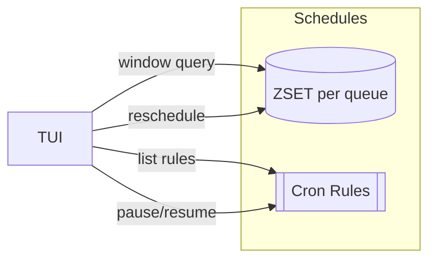

# Calendar View

| Priority | Domain | Dependencies | Risks | LoC Estimate | Complexity | Effort | Impact |
| --- | --- | --- | --- | --- | --- | --- | --- |
| Medium | TUI Scheduling | Scheduler/ZSETs, Admin API | Time zones, UX density | ~300–500 | Medium | 3 (Fib) | Medium‑High |

## Executive Summary
A calendar UI to visualize scheduled and recurring jobs by day/week/month. Users can navigate time ranges, inspect details, reschedule, or pause rules—without leaving the TUI.

> [!note]- **🗣️ CLAUDE'S THOUGHTS 💭**
> Calendar view in a terminal! Use Unicode box characters for the grid, color intensity for job density (heatmap style). The timezone handling is CRITICAL - nothing worse than jobs firing at wrong times. The month view could be gorgeous with gradient colors showing load intensity. Consider adding a "forecast" mode that shows predicted future load based on recurring rules. Also, drag-and-drop rescheduling with mouse would be slick!

## Motivation
- Make time a first‑class dimension: see spikes, gaps, and overlaps at a glance.
- Reduce mistakes when backfilling or coordinating large scheduled runs.
- Provide confidence that cron rules align with business windows.

## Tech Plan
- Data model:
  - Scheduled jobs: Redis ZSET per queue (score = epoch seconds) or existing schedule store; list endpoints per time window.
  - Recurring rules: store cron spec + metadata (timezone, jitter, max in‑flight).
- Admin API:
  - List scheduled window: `/schedules?from&till&queue` returns items and counts.
  - CRUD recurring rules: create, pause/resume, delete.
  - Reschedule: move item to a new timestamp (idempotent re‑enqueue at time T).
- TUI:
  - Views: Month (heatmap), Week (grid by day), Day (timeline).
  - Navigation: `h/j/k/l` or arrow keys, `[`/`]` to shift range, `g/G` to jump today/end.
  - Actions: enter to inspect, `r` to reschedule, `p` to pause rule, `/` filter by queue/tag.
  - Rendering: compact cells with count badges; tooltip/overlay for dense cells using `bubblezone` hitboxes.
- Safety: timezone explicit in header; confirmation on reschedules; audit entries for changes.
- Observability: counts per bucket, peak hour visualization; errors surfaced inline.

## User Stories + Acceptance Criteria
- As an operator, I can see scheduled volume per day and drill into a day to inspect items.
- As a developer, I can reschedule an item and confirm the exact new time and queue.
- As an SRE, I can pause/resume a recurring rule and see status reflected immediately.
- Acceptance:
  - [ ] Month/Week/Day views with keyboard navigation and counts.
  - [ ] Reschedule flow updates ZSET timestamp and reflects in view.
  - [ ] CRUD for recurring rules with pause/resume.

## Definition of Done
Calendar views ship with list/reschedule/CRUD for recurring rules, plus docs and keybindings, and basic load tests against dense days.

## Test Plan
- Unit: cron parser normalization (TZ), ZSET window queries, reschedule logic.
- Integration: end‑to‑end reschedule and rule pause/resume in a test cluster.
- UX: manual runs for dense days and cramped terminals.

## Task List
- [ ] Admin API: schedules window + rules CRUD
- [ ] TUI: month/week/day views + navigation
- [ ] Reschedule flow + confirmations
- [ ] Pause/resume rules + indicators
- [ ] Docs + screenshots

---

## Claude's Verdict ⚖️

Visual scheduling in a terminal is unexplored territory. The heatmap visualization could be stunning.

### Vibe Check

Google Calendar meets htop. Nobody expects a calendar in their terminal queue. That's exactly why it's brilliant.

### Score Card

**Traditional Score:**
- User Value: 7/10 (visual scheduling prevents conflicts)
- Dev Efficiency: 7/10 (3 Fib, mostly UI work)
- Risk Profile: 7/10 (timezone complexity)
- Strategic Fit: 7/10 (scheduling differentiator)
- Market Timing: 6/10 (nice to have)
- **OFS: 6.9** → BUILD SOON

**X-Factor Score:**
- Holy Shit Factor: 7/10 ("A calendar in my terminal?!")
- Meme Potential: 6/10 (screenshot beautiful heatmaps)
- Flex Appeal: 6/10 ("Our queue has a calendar view")
- FOMO Generator: 4/10 (unique but niche)
- Addiction Score: 5/10 (checked during planning)
- Shareability: 6/10 (demo gold)
- **X-Factor: 5.0** → Solid viral potential

### Conclusion

[📅]

This is visual poetry in a terminal. The heatmap month view alone is worth building. Ship it and watch people screenshot their beautiful job calendars.

