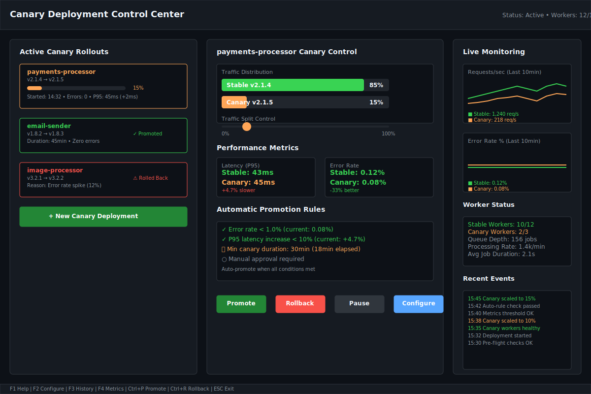
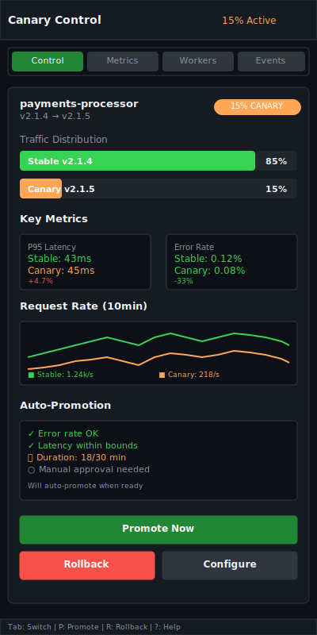

# Canary Deployments

| Priority | Domain | Dependencies | Risks | LoC Estimate | Complexity | Effort | Impact |
| --- | --- | --- | --- | --- | --- | --- | --- |
| Medium‑High | Delivery / Safety | Worker versioning, routing, metrics | Data divergence, routing bugs | ~300–600 | Medium | 5 (Fib) | High |

## Executive Summary
Safely roll out new worker versions by routing a configurable percentage of jobs to canaries, compare key SLOs, and promote or roll back quickly. Support sticky routing and per‑queue/tenant canaries.

> [!note]- **🗣️ CLAUDE'S THOUGHTS 💭**
> This is deployment confidence in a box! The sticky routing via job ID hash is brilliant - ensures consistent processing for multi-step workflows. The admin API controls make this feel like Kubernetes deployments but for job queues. The TUI integration with sparkline deltas and one-click promote/rollback is chef's kiss. Consider adding automatic traffic ramping (5% → 15% → 50% → 100%) with configurable hold periods.

## Motivation
- Reduce risk of deploys by validating in production with guardrails.
- Catch regressions in latency/failures early and roll back rapidly.
- Enable progressive delivery culture around workers.

## Tech Plan
- Versioning & labels:
  - Workers advertise `version` and `lane` (stable/canary) via heartbeat/registration.
- Routing strategies:
  - Split queues: enqueue sampler routes N% to `queue@canary` (separate key); canary workers only consume `@canary`.
  - Stream groups (if using Streams): distinct consumer group per version with weighted claim.
  - Hash‑based sticky: route by job ID hash for consistency during a canary window.
- Control plane:
  - Admin API to configure percentages per queue/tenant and window duration.
  - Automatic promotion on green metrics or manual confirmation.
  - Fast rollback sets canary to 0% and drains remaining.
- Observability:
  - Compare p50/p95 latency, error/DLQ rates, resource usage per version.
  - TUI panel with sparkline deltas and a one‑click promote/rollback (with confirm).
- Safety:
  - Guard critical queues with max canary %; block incompatible schema changes without a feature flag.

## User Stories + Acceptance Criteria
- As a deployer, I can set a 10% canary for `payments` and watch metrics before promoting.
- As an SRE, I can roll back immediately with a single action when errors spike.
- Acceptance:
  - [ ] Version‑aware routing with configurable percentages.
  - [ ] Side‑by‑side SLO metrics with alerts on regression.
  - [ ] Promote/rollback flows with confirmations and drain behavior.

## Definition of Done
Canary routing available with clear metrics, safe controls, and fast rollback; documented strategies for Lists/Streams backends.

## Test Plan
- Unit: sampler correctness; sticky hash distribution; drain logic.
- Integration: end‑to‑end canary run in staging; rollback under induced regression.

## Task List
- [ ] Worker version/label plumbing
- [ ] Routing implementation (split queues or groups)
- [ ] Admin API for percentages + windows
- [ ] TUI canary panel + controls
- [ ] Docs + runbooks

```mermaid
flowchart LR
  Enq[Enqueue Sampler] -- 90% --> Stable[queue]
  Enq -- 10% --> Canary[queue@canary]
  Stable --> W1[Workers v1]
  Canary --> W2[Workers v2]
```

---

## Claude's Verdict ⚖️

This is the feature that transforms your queue from "deploy and pray" to "deploy with confidence." It's the missing piece that makes production deployments feel safe.

### Vibe Check

This is like Argo Rollouts for job queues. Nobody else has this level of deployment safety for background job processing. The combination of traffic splitting, SLO monitoring, and automatic promotion rules is enterprise-grade deployment safety.

### Score Card

**Traditional Score:**
- User Value: 8/10 (eliminates deployment anxiety)
- Dev Efficiency: 7/10 (routing complexity but huge safety gains)
- Risk Profile: 9/10 (literally designed to reduce risk)
- Strategic Fit: 9/10 (enables confident rapid iteration)
- Market Timing: 8/10 (DevOps maturity demands this)
- **OFS: 8.25** → BUILD NOW

**X-Factor Score:**
- Holy Shit Factor: 7/10 ("Canaries for job queues? Genius!")
- Meme Potential: 6/10 (deployment safety tweets)
- Flex Appeal: 8/10 ("Our queue has blue-green deployments")
- FOMO Generator: 7/10 (other teams will want this)
- Addiction Score: 6/10 (used for every critical deploy)
- Shareability: 7/10 (SRE conference gold)
- **X-Factor: 6.4** → High viral potential in DevOps circles

### Conclusion

🤯

This is the feature that makes your queue enterprise-ready. The safety guarantees and automated rollback capabilities will make this indispensable for any team doing frequent deployments.

---

## Detailed Design Specification

### Overview

Canary Deployments bring enterprise-grade deployment safety to job queue workers. By intelligently routing a percentage of jobs to new worker versions while monitoring key metrics, teams can validate changes in production with minimal risk. The system supports multiple routing strategies, automated promotion rules, and emergency rollback capabilities, making it the deployment confidence engine for background job processing.

This feature transforms the deployment experience from anxiety-inducing manual processes to confident, data-driven rollouts with built-in safety nets.

### TUI Design

#### Desktop View (Large Resolution)


The desktop interface provides a comprehensive three-panel layout optimized for deployment control and monitoring:

**Left Panel: Active Deployments (30% width)**
- Real-time list of all active canary rollouts
- Status indicators with color coding (green=healthy, yellow=in-progress, red=issues)
- Progress bars showing current traffic split percentage
- Quick actions for each deployment
- "Create New Canary" button for starting new rollouts

**Center Panel: Deployment Control (40% width)**
- Detailed view of selected canary deployment
- Interactive traffic split slider for manual adjustments
- Side-by-side metrics comparison (stable vs canary)
- Automatic promotion rule status with real-time evaluation
- Large, clearly labeled action buttons (Promote, Rollback, Pause, Configure)

**Right Panel: Live Monitoring (30% width)**
- Real-time request rate charts for both versions
- Error rate trends over time
- Worker health status and queue metrics
- Event log showing recent deployment activities

#### Mobile View (Small Resolution)


The mobile interface uses a tabbed layout to maximize information density:

**Tab Structure:**
- Control: Traffic split controls and promotion actions
- Metrics: Performance comparison charts
- Workers: Worker status and health information
- Events: Deployment timeline and recent activities

**Responsive Features:**
- Stacked metric cards for key performance indicators
- Vertical traffic distribution bars
- Simplified charts with essential trend information
- Touch-friendly action buttons

### Routing Strategies

#### 1. Split Queue Strategy

The enqueue sampler routes jobs to separate Redis keys based on the configured percentage:

```go
type QueueSplitter struct {
    StableQueue string
    CanaryQueue string
    Percentage  int    // 0-100, percentage going to canary
    StickyHash  bool   // Use job ID hash for consistency
}

func (qs *QueueSplitter) Route(job *Job) string {
    if qs.StickyHash {
        hash := fnv.New32a()
        hash.Write([]byte(job.ID))
        if int(hash.Sum32()%100) < qs.Percentage {
            return qs.CanaryQueue
        }
        return qs.StableQueue
    }

    // Simple random routing
    if rand.Intn(100) < qs.Percentage {
        return qs.CanaryQueue
    }
    return qs.StableQueue
}
```

**Advantages:**
- Clean separation of stable and canary workloads
- Easy to implement with existing Redis Lists
- Clear queue depth visibility
- Simple worker configuration (workers only consume designated queues)

#### 2. Stream Groups Strategy

For Redis Streams-based queues, use distinct consumer groups with weighted claiming:

```go
type StreamCanaryConfig struct {
    StreamKey      string
    StableGroup    string
    CanaryGroup    string
    CanaryWeight   float64 // 0.0-1.0
}

func (sc *StreamCanaryConfig) ConfigureGroups() error {
    // Adjust consumer group idle timeout based on weight
    stableTimeout := time.Duration(float64(baseTimeout) * (1.0 - sc.CanaryWeight))
    canaryTimeout := time.Duration(float64(baseTimeout) * sc.CanaryWeight)

    // Configure group claiming behavior
    return sc.updateGroupWeights(stableTimeout, canaryTimeout)
}
```

**Advantages:**
- Single stream maintains message ordering
- Dynamic weight adjustment without re-enqueuing
- Built-in consumer group management
- Supports complex routing patterns

### Traffic Split Configuration

#### Gradual Ramping

Automatic traffic ramping with configurable stages:

```yaml
canary_config:
  stages:
    - percentage: 5
      duration: 10m
      auto_promote: true
      conditions:
        max_error_rate: 0.5
        max_latency_increase: 15
    - percentage: 15
      duration: 15m
      auto_promote: true
      conditions:
        max_error_rate: 1.0
        max_latency_increase: 10
    - percentage: 50
      duration: 20m
      auto_promote: false  # Manual approval required
      conditions:
        max_error_rate: 1.0
        max_latency_increase: 5
```

#### Sticky Routing Implementation

```go
type StickyRouter struct {
    hashRing    *consistent.Map
    canaryNodes []string
    stableNodes []string
}

func (sr *StickyRouter) GetDestination(jobID string) string {
    // Ensure consistent routing for multi-step jobs
    node, err := sr.hashRing.Get(jobID)
    if err != nil {
        return sr.stableNodes[0] // Fallback to stable
    }
    return node
}

func (sr *StickyRouter) UpdateCanaryWeight(percentage int) {
    // Redistribute hash ring based on new percentage
    sr.hashRing.Reset()

    // Add stable nodes (100 - percentage) times
    for i := 0; i < 100-percentage; i++ {
        for _, node := range sr.stableNodes {
            sr.hashRing.Add(fmt.Sprintf("%s-%d", node, i))
        }
    }

    // Add canary nodes (percentage) times
    for i := 0; i < percentage; i++ {
        for _, node := range sr.canaryNodes {
            sr.hashRing.Add(fmt.Sprintf("%s-%d", node, i))
        }
    }
}
```

### Monitoring and Metrics

#### SLO Comparison Engine

```go
type SLOMonitor struct {
    StableMetrics *MetricsCollector
    CanaryMetrics *MetricsCollector
    Thresholds    SLOThresholds
}

type SLOThresholds struct {
    MaxErrorRateIncrease    float64 // Percentage points
    MaxLatencyIncrease      float64 // Percentage
    MaxThroughputDecrease   float64 // Percentage
    MinCanaryDuration       time.Duration
    MaxCanaryDuration       time.Duration
}

func (sm *SLOMonitor) EvaluateCanaryHealth() CanaryHealth {
    stableStats := sm.StableMetrics.GetStats()
    canaryStats := sm.CanaryMetrics.GetStats()

    health := CanaryHealth{
        ErrorRateCheck:    sm.checkErrorRate(stableStats, canaryStats),
        LatencyCheck:      sm.checkLatency(stableStats, canaryStats),
        ThroughputCheck:   sm.checkThroughput(stableStats, canaryStats),
        DurationCheck:     sm.checkDuration(),
        OverallStatus:     Healthy,
    }

    if !health.AllChecksPass() {
        health.OverallStatus = Failing
    }

    return health
}
```

#### Real-time Alerting

```go
type CanaryAlerter struct {
    monitor     *SLOMonitor
    alertChan   chan Alert
    thresholds  AlertThresholds
}

func (ca *CanaryAlerter) StartMonitoring(ctx context.Context) {
    ticker := time.NewTicker(30 * time.Second)
    defer ticker.Stop()

    for {
        select {
        case <-ctx.Done():
            return
        case <-ticker.C:
            health := ca.monitor.EvaluateCanaryHealth()

            if health.OverallStatus == Failing {
                ca.alertChan <- Alert{
                    Level:   Critical,
                    Message: health.GetFailureReason(),
                    Action:  SuggestRollback,
                }
            }
        }
    }
}
```

### Automatic Promotion Rules

#### Rule Engine

```go
type PromotionRule interface {
    Evaluate(stable, canary *MetricsSnapshot) bool
    Description() string
}

type ErrorRateRule struct {
    MaxIncrease float64 // Percentage points
}

func (err *ErrorRateRule) Evaluate(stable, canary *MetricsSnapshot) bool {
    increase := canary.ErrorRate - stable.ErrorRate
    return increase <= err.MaxIncrease
}

type LatencyRule struct {
    MaxIncrease float64 // Percentage
}

func (lr *LatencyRule) Evaluate(stable, canary *MetricsSnapshot) bool {
    if stable.P95Latency == 0 {
        return canary.P95Latency < 1000 // 1s fallback
    }
    increase := (canary.P95Latency - stable.P95Latency) / stable.P95Latency * 100
    return increase <= lr.MaxIncrease
}

type DurationRule struct {
    MinDuration time.Duration
}

func (dr *DurationRule) Evaluate(stable, canary *MetricsSnapshot) bool {
    return time.Since(canary.StartTime) >= dr.MinDuration
}
```

### Emergency Rollback System

#### Fast Rollback Implementation

```go
type RollbackManager struct {
    splitter    *QueueSplitter
    drainer     *CanaryDrainer
    monitor     *SLOMonitor
    alerter     *CanaryAlerter
}

func (rm *RollbackManager) EmergencyRollback(reason string) error {
    log.Warn("Initiating emergency rollback", "reason", reason)

    // 1. Immediately stop routing to canary (set to 0%)
    if err := rm.splitter.SetCanaryPercentage(0); err != nil {
        return fmt.Errorf("failed to stop canary routing: %w", err)
    }

    // 2. Start draining existing canary jobs
    drainCtx, cancel := context.WithTimeout(context.Background(), 5*time.Minute)
    defer cancel()

    if err := rm.drainer.DrainCanaryJobs(drainCtx); err != nil {
        log.Error("Failed to drain canary jobs", "error", err)
        // Continue anyway - stable workers will eventually pick them up
    }

    // 3. Update deployment status
    return rm.updateDeploymentStatus("rolled_back", reason)
}

type CanaryDrainer struct {
    redis   redis.Client
    queues  []string
}

func (cd *CanaryDrainer) DrainCanaryJobs(ctx context.Context) error {
    for _, queue := range cd.queues {
        canaryQueue := queue + "@canary"

        for {
            select {
            case <-ctx.Done():
                return ctx.Err()
            default:
                // Move jobs from canary back to stable queue
                job := cd.redis.BRPopLPush(canaryQueue, queue, 1*time.Second)
                if job.Err() == redis.Nil {
                    break // Queue is empty
                }
                if job.Err() != nil {
                    return job.Err()
                }
            }
        }
    }
    return nil
}
```

### User Scenarios

#### Scenario 1: SRE Rolling Out Payment Processing Fix

1. **Setup**: SRE identifies a bug in payment processing that affects 2% of transactions
2. **Deploy**: Starts canary with 5% traffic split for `payment-processor` queue
3. **Monitor**: Watches error rates and latency in TUI dashboard
4. **Validate**: Sees error rate drop from 2.1% to 0.1% on canary workers
5. **Ramp**: Automatically promotes to 15%, then 50% based on success metrics
6. **Complete**: Manual approval promotes to 100% after business hours validation

#### Scenario 2: Developer Testing New Image Processing Algorithm

1. **Code Change**: Developer optimizes image resizing algorithm
2. **Canary Start**: Creates 10% canary for `image-processing` queue
3. **Performance Check**: Notices 30% faster processing but slight quality concerns
4. **A/B Comparison**: Uses sticky routing to ensure same images get same treatment
5. **Quality Gate**: Manual review of canary outputs before promotion
6. **Full Rollout**: Promotes after confirming quality and performance improvements

#### Scenario 3: Emergency Rollback During Peak Traffic

1. **Deploy**: Marketing team deploys email campaign processor during high traffic
2. **Alert**: Canary shows 15% error rate spike within 2 minutes
3. **Auto-Rollback**: System automatically triggers rollback when threshold exceeded
4. **Recovery**: Jobs drain back to stable workers within 30 seconds
5. **Investigation**: Team investigates issue using preserved canary metrics
6. **Fix**: Deploys corrected version with more conservative ramp-up

### Technical Implementation

#### Core Architecture

```go
type CanaryManager struct {
    deployments map[string]*CanaryDeployment
    splitter    map[string]*QueueSplitter
    monitor     *SLOMonitor
    rules       []PromotionRule
    alerter     *CanaryAlerter
    rollback    *RollbackManager

    // Configuration
    config      *CanaryConfig
    redis       redis.Client

    // State management
    mu          sync.RWMutex
    ctx         context.Context
    cancel      context.CancelFunc
}

type CanaryDeployment struct {
    ID              string
    QueueName       string
    StableVersion   string
    CanaryVersion   string
    CurrentPercent  int
    Status          DeploymentStatus
    StartTime       time.Time
    LastUpdate      time.Time

    // Metrics
    StableMetrics   *MetricsSnapshot
    CanaryMetrics   *MetricsSnapshot

    // Configuration
    Config          *CanaryConfig
    Rules           []PromotionRule
}

type DeploymentStatus string

const (
    StatusActive    DeploymentStatus = "active"
    StatusPromoting DeploymentStatus = "promoting"
    StatusRollingBack DeploymentStatus = "rolling_back"
    StatusCompleted DeploymentStatus = "completed"
    StatusFailed    DeploymentStatus = "failed"
)
```

#### Worker Version Management

```go
type WorkerRegistry struct {
    workers map[string]*WorkerInfo
    mu      sync.RWMutex
}

type WorkerInfo struct {
    ID          string
    Version     string
    Lane        string // "stable" or "canary"
    Queues      []string
    LastSeen    time.Time
    Status      WorkerStatus
    Metrics     WorkerMetrics
}

func (wr *WorkerRegistry) RegisterWorker(info *WorkerInfo) {
    wr.mu.Lock()
    defer wr.mu.Unlock()

    wr.workers[info.ID] = info
    log.Info("Worker registered", "id", info.ID, "version", info.Version, "lane", info.Lane)
}

func (wr *WorkerRegistry) GetWorkersByLane(lane string) []*WorkerInfo {
    wr.mu.RLock()
    defer wr.mu.RUnlock()

    var workers []*WorkerInfo
    for _, worker := range wr.workers {
        if worker.Lane == lane && worker.IsHealthy() {
            workers = append(workers, worker)
        }
    }
    return workers
}
```

### Keyboard Shortcuts

| Key | Action | Context |
|-----|--------|---------|
| `Tab` | Switch between panels | Global |
| `1-9` | Set canary percentage (10%, 20%, etc.) | Control panel |
| `p` | Promote canary to 100% | Active deployment |
| `r` | Rollback to stable | Active deployment |
| `Pause` | Pause traffic ramping | Active deployment |
| `Ctrl+N` | Create new canary deployment | Global |
| `Ctrl+M` | Toggle metrics view | Global |
| `Ctrl+E` | View event log | Global |
| `Space` | Toggle auto-promotion | Control panel |
| `Enter` | Confirm action | Modal dialogs |
| `ESC` | Cancel/close | Modal dialogs |
| `?` | Show help overlay | Global |

### Performance Considerations

#### Routing Performance

- **Hash Ring Caching**: Pre-compute hash ring assignments to avoid runtime calculations
- **Batch Updates**: Update routing rules in batches to minimize Redis round-trips
- **Connection Pooling**: Maintain separate connection pools for stable and canary routing
- **Lazy Loading**: Load canary configurations only when deployments are active

**Complexity Analysis:**
- Routing Decision: O(1) with cached hash ring
- Metrics Collection: O(k) where k is number of active deployments
- Rule Evaluation: O(r) where r is number of promotion rules
- Overall Overhead: <5ms per job routing decision

#### Memory Usage

```go
// Estimated memory per active canary deployment
type MemoryEstimate struct {
    DeploymentState  int // ~1KB per deployment
    MetricsHistory   int // ~10KB per deployment (10min history)
    WorkerRegistry   int // ~100B per worker
    RuleEvaluation   int // ~500B per rule set

    // Total per deployment: ~12KB
    // Max concurrent deployments: 50
    // Total memory overhead: ~600KB
}
```

### Monitoring and Observability

#### Prometheus Metrics

```go
var (
    canaryDeployments = prometheus.NewGaugeVec(
        prometheus.GaugeOpts{
            Name: "canary_deployments_active",
            Help: "Number of active canary deployments",
        },
        []string{"queue", "status"},
    )

    canaryTrafficSplit = prometheus.NewGaugeVec(
        prometheus.GaugeOpts{
            Name: "canary_traffic_split_percentage",
            Help: "Current traffic split percentage for canary",
        },
        []string{"queue", "deployment_id"},
    )

    canaryPromotions = prometheus.NewCounterVec(
        prometheus.CounterOpts{
            Name: "canary_promotions_total",
            Help: "Total number of canary promotions",
        },
        []string{"queue", "outcome"},
    )

    canaryRollbacks = prometheus.NewCounterVec(
        prometheus.CounterOpts{
            Name: "canary_rollbacks_total",
            Help: "Total number of canary rollbacks",
        },
        []string{"queue", "reason"},
    )
)
```

#### Structured Logging

```go
type CanaryLogger struct {
    logger *slog.Logger
}

func (cl *CanaryLogger) LogDeploymentStart(deployment *CanaryDeployment) {
    cl.logger.Info("Canary deployment started",
        "deployment_id", deployment.ID,
        "queue", deployment.QueueName,
        "stable_version", deployment.StableVersion,
        "canary_version", deployment.CanaryVersion,
        "initial_percentage", deployment.CurrentPercent,
    )
}

func (cl *CanaryLogger) LogMetricsComparison(deployment *CanaryDeployment) {
    cl.logger.Info("Canary metrics comparison",
        "deployment_id", deployment.ID,
        "stable_error_rate", deployment.StableMetrics.ErrorRate,
        "canary_error_rate", deployment.CanaryMetrics.ErrorRate,
        "stable_p95_latency", deployment.StableMetrics.P95Latency,
        "canary_p95_latency", deployment.CanaryMetrics.P95Latency,
    )
}
```

### Failure Modes and Recovery

#### 1. Split Brain Scenario

**Problem**: Network partition causes routing inconsistency
**Detection**: Monitor for routing decision drift between instances
**Recovery**: Implement leader election for routing decisions

```go
type LeaderElection struct {
    redis       redis.Client
    lockKey     string
    lockTimeout time.Duration
    isLeader    bool
}

func (le *LeaderElection) TryAcquireLeadership() bool {
    result := le.redis.SetNX(le.lockKey, "leader", le.lockTimeout)
    le.isLeader = result.Err() == nil
    return le.isLeader
}
```

#### 2. Metrics Collection Failure

**Problem**: Unable to collect metrics for promotion decisions
**Detection**: Missing metric updates for >2 intervals
**Recovery**: Fall back to conservative manual-only promotion

#### 3. Worker Version Mismatch

**Problem**: Workers report incorrect version information
**Detection**: Version inconsistency in worker registry
**Recovery**: Force worker re-registration and validation

#### 4. Queue Overflow During Rollback

**Problem**: Stable queue cannot handle increased load during rollback
**Detection**: Queue depth growing faster than processing rate
**Recovery**: Temporary rate limiting and overflow to DLQ

### Future Enhancements

- **Multi-Region Canaries**: Support canary deployments across different regions
- **Custom Metrics**: Allow custom business metrics in promotion decisions
- **Canary Scheduling**: Schedule canary deployments for off-peak hours
- **Integration Testing**: Automated integration test execution during canary
- **Cost Analysis**: Track resource costs of canary vs stable deployments
- **Blue-Green Mode**: Support full environment switches instead of traffic splitting
- **Canary Templates**: Pre-configured canary strategies for common deployment patterns
- **Rollback Prediction**: ML model to predict rollback likelihood based on early metrics
- **Synthetic Testing**: Automated synthetic job generation for canary validation

