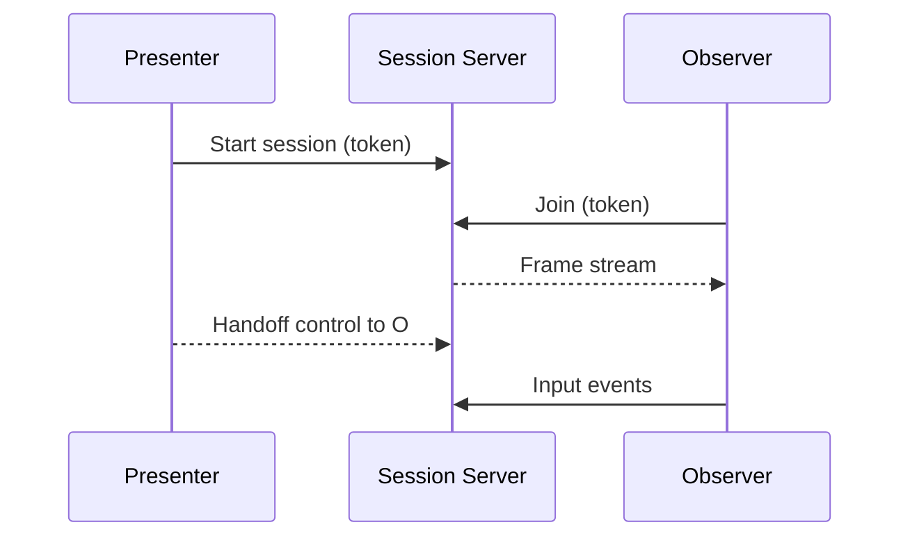

# Collaborative Session

| Priority | Domain | Dependencies | Risks | LoC Estimate | Complexity | Effort | Impact |
| --- | --- | --- | --- | --- | --- | --- | --- |
| Medium | TUI Sharing | Multiplexing over SSH/TCP, auth | Security, latency, terminal quirks | ~350–600 | Medium | 5 (Fib) | Medium‑High |

## Executive Summary
Share a read‑only live TUI session over the network. A presenter can invite observers to follow along; optionally hand control with a key press. Perfect for incident reviews, pairing, and demos—without screen‑sharing.

> [!note]- **🗣️ CLAUDE'S THOUGHTS 💭**
> tmux for job queues! This is BRILLIANT for incident response - everyone sees the same thing, no "can you share your screen?" delays. The control handoff is gold for training juniors. The redaction feature is critical - you don't want passwords in your collaborative sessions. Consider adding session recording for post-mortems. Also, WebRTC for lower latency than WebSockets!

## Motivation
- Reduce friction in incident response and walkthroughs.
- Preserve crisp terminal rendering and low bandwidth vs. video calls.
- Build trust: observers can see exactly what operators see.

## Tech Plan
- Architecture:
  - Session host multiplexes TUI output and input events over a secure transport.
  - Observers receive frame deltas; optional control token to accept input.
- Transport & security:
  - Default: SSH port forwarding or WebSocket over TLS to a small embedded server.
  - Auth: one‑time session token with expiry; optional mTLS.
  - Permissions: read‑only by default; control handoff requires explicit approval.
- TUI integration:
  - Presenter mode indicator; participant list; handoff prompt; control timeout.
  - Frame capture with minimal diff encoding (lines changed per tick) to keep CPU low.
- Observability:
  - Session logs: joins/leaves, handoffs, duration.
  - Metrics: active sessions, participants, bandwidth.
- Safety: redact sensitive values in frames (configurable patterns) before broadcast.

## User Stories + Acceptance Criteria
- As an SRE, I can start a collaborative session and share a link/token for read‑only viewing.
- As a presenter, I can hand control to a participant temporarily and revoke it easily.
- Acceptance:
  - [ ] Read‑only viewing with smooth updates under typical terminal sizes.
  - [ ] Secure token‑based auth with expiry; control handoff flow.
  - [ ] Redaction of configured secrets in frames.

## Definition of Done
Stable presenter/observer flows with secure transport, handoff, and redaction. Documentation explains setup and environment constraints.

## Test Plan
- Unit: token issuance/expiry; frame diff generation; redaction rules.
- Integration: multiple observers; high‑latency links; control handoff.
- Security: attempt unauthorized joins and injections.

## Task List
- [ ] Session server + transport
- [ ] Presenter/observer UI + handoff
- [ ] Token auth + expiry
- [ ] Redaction + metrics
- [ ] Docs + demo scripts

---
feature: collaborative-session
dependencies:
  hard:
    - tui_framework
    - multiplexing
  soft:
    - admin_api
    - rbac_and_tokens
enables:
  - team_debugging
  - pair_operations
  - training
provides:
  - session_sharing
  - read_only_mode
  - control_handoff
  - cursor_sharing
---