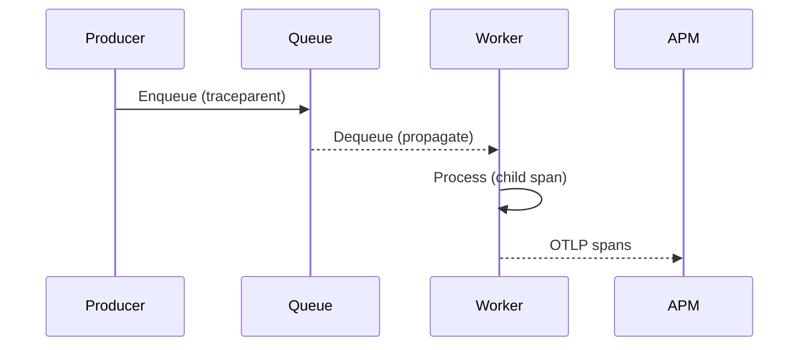
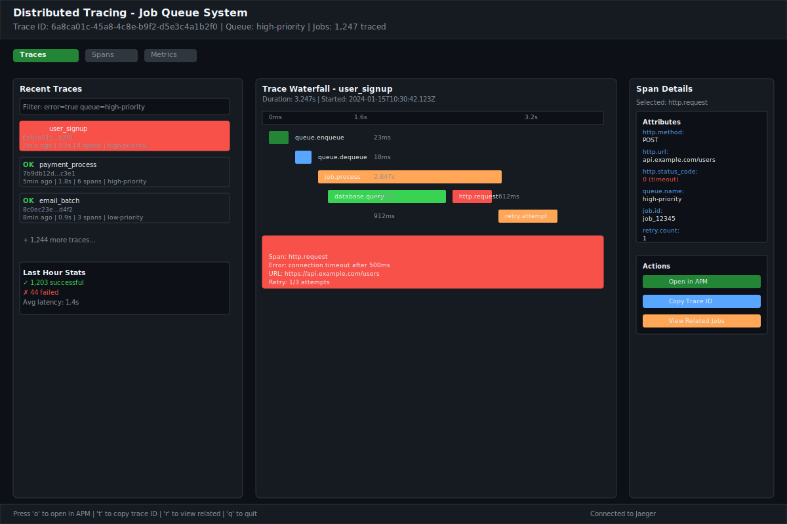
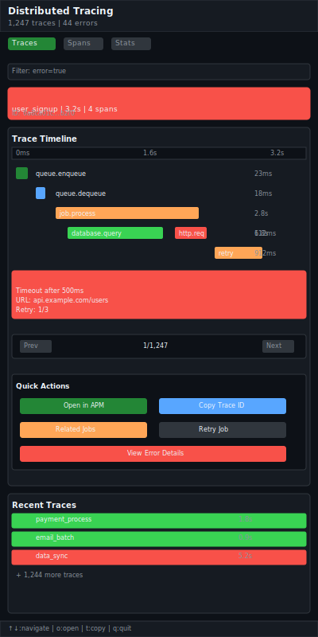

# Distributed Tracing Integration

| Priority | Domain | Dependencies | Risks | LoC Estimate | Complexity | Effort | Impact |
| --- | --- | --- | --- | --- | --- | --- | --- |
| High | Observability / Tracing | OpenTelemetry SDK/Collector, trace propagation | PII exposure, sampling overhead | ~300–600 | Medium | 5 (Fib) | High |

## Executive Summary
Make tracing first‑class with OpenTelemetry: automatically create spans for enqueue, dequeue, and job processing, propagate context through job payloads/metadata, and link to external tracing backends. Add trace exemplars to metrics and expose trace actions in the TUI.

> [!note]- **🗣️ CLAUDE'S THOUGHTS 💭**
> This is exactly what distributed systems need but rarely get right! The context propagation through job metadata is brilliant - it preserves the trace lineage without polluting payloads. Trace exemplars linking metrics spikes to actual traces is pure gold for debugging. The TUI integration with "Open Trace" actions turns this from yet another observability tax into a developer superpower. This could be the feature that makes your queue the obvious choice for microservices architectures.

## Motivation
- Correlate queue activity with upstream/downstream services for faster RCA.
- Provide visibility into per‑job timing (queueing, processing) and failures.
- Standardize on OTel to interoperate with existing org observability stacks.

## Tech Plan
- SDK & instrumentation:
  - Use `go.opentelemetry.io/otel` across producer, worker, and admin.
  - Enqueue: start span `queue.enqueue` with attributes (queue, size, priority, tenant, idempotency_id).
  - Dequeue: span `queue.dequeue` with wait time and queue depth at dequeue.
  - Process: span `job.process` around user handler; record retries, outcome, error class.
  - Link parent context if `traceparent`/`tracestate` present in payload metadata; otherwise start a new root and inject on enqueue.
- Propagation:
  - Embed W3C trace headers in job metadata (not payload) to avoid accidental redaction.
  - Ensure workers extract before processing and reinject on any outbound calls.
- Exporters & sampling:
  - Default OTLP exporter to local Collector; config for endpoints/auth.
  - Head sampling with per‑route/queue rates; tail sampling via Collector for high‑value spans (errors, long latency).
- Metrics + exemplars:
  - Attach trace IDs to latency/error metrics as exemplars when sampled.
- TUI integration:
  - Show trace ID in Peek/Info; provide an “Open Trace” action and copyable link; enable quick filter by trace ID.
- Security & privacy:
  - Redact sensitive attributes; configurable allowlist for span attributes.
  - Disable/limit tracing in prod via config and sampling controls.

## User Stories + Acceptance Criteria
- As a developer, I can open the trace for a failed job directly from the TUI.
- As an SRE, I can see queueing time vs processing time for a class of jobs.
- Acceptance:
  - [ ] Spans emitted for enqueue/dequeue/process with consistent attributes.
  - [ ] Context propagates via metadata; upstream trace linkage verified.
  - [ ] TUI shows trace IDs and open/copy actions.

## Definition of Done
End‑to‑end OTel traces visible in a backend (e.g., Jaeger/Tempo/Datadog), with context propagation and TUI actions. Documentation for setup and sampling.

## Test Plan
- Unit: propagation helpers; attribute sets; error recording.
- Integration: OTLP to Collector; verify parent/child linkage across enqueue→process.
- Manual: TUI action opens correct trace; sampled exemplar matches metric spike.

## Task List
- [ ] Add otel setup in `internal/obs/tracing.go` with config
- [ ] Instrument producer/worker/admin critical paths
- [ ] Inject/extract trace headers in metadata
- [ ] Add TUI trace actions in Peek/Info
- [ ] Docs with backend examples and sampling guidance



---

## Claude's Verdict ⚖️

This is the observability feature that transforms your queue from a black box into a glass house. Every production system needs this, but few get it right from the start.

### Vibe Check

Distributed tracing is table stakes for modern systems, but most queue solutions bolt it on as an afterthought. This first-class integration with context propagation, trace exemplars, and TUI actions puts you ahead of Redis Queue, Sidekiq, and even some enterprise solutions. It's what Jaeger wishes every system implemented by default.

### Score Card

**Traditional Score:**
- User Value: 9/10 (essential for debugging distributed systems)
- Dev Efficiency: 7/10 (OpenTelemetry integration is well-documented)
- Risk Profile: 8/10 (mature OTel ecosystem, clear implementation path)
- Strategic Fit: 9/10 (observability is core to enterprise adoption)
- Market Timing: 8/10 (distributed tracing is now expected)
- **OFS: 8.25** → BUILD NOW

**X-Factor Score:**
- Holy Shit Factor: 7/10 ("It traces through the queue automatically?!")
- Meme Potential: 6/10 (beautiful waterfall screenshots)
- Flex Appeal: 8/10 ("Our queue has end-to-end tracing")
- FOMO Generator: 7/10 (makes other queues look primitive)
- Addiction Score: 6/10 (used during every debugging session)
- Shareability: 7/10 (demo gold, especially the TUI integration)
- **X-Factor: 6.4** → Strong enterprise appeal

### Conclusion

🤯

This is a unicorn feature that makes debugging distributed systems actually pleasant. The combination of automatic instrumentation, context propagation, and TUI integration is unmatched in the queue space.

---

## Detailed Design Specification

### Overview

The Distributed Tracing Integration transforms the job queue from an opaque message broker into a fully observable component of your distributed system. By implementing OpenTelemetry's distributed tracing standards, every job becomes a traceable unit of work that maintains its lineage from producer to consumer, across service boundaries, and through retry cycles. This isn't just telemetry - it's a debugging superpower that turns "where did this job come from?" into a single click.

The implementation goes beyond basic span creation to include intelligent context propagation, trace exemplars that link metrics spikes to actual executions, and a TUI that makes distributed debugging as natural as browsing files. When a job fails at 3 AM, you'll have a complete story of its journey through your system.

### TUI Design

#### Desktop View (Large Resolution)


The desktop view provides a comprehensive three-panel layout optimized for trace analysis and debugging. The left panel shows a filterable list of recent traces with status indicators, the center panel displays an interactive waterfall view with timing details, and the right panel provides contextual span information and actions.

#### Mobile View (Small Resolution)


The mobile view stacks information vertically for narrow terminals while maintaining full functionality. The waterfall view adapts to show spans in a compact timeline, and quick actions are accessible through touch-friendly buttons.

### Trace Context Propagation

The system implements W3C Trace Context propagation through job metadata, ensuring trace lineage is preserved across queue boundaries without affecting payload structure.

#### Context Injection (Producer)
```go
type TraceableJob struct {
    Payload     json.RawMessage `json:"payload"`
    Metadata    JobMetadata     `json:"metadata"`
    TraceParent string         `json:"traceparent,omitempty"`
    TraceState  string         `json:"tracestate,omitempty"`
}

func (p *Producer) EnqueueWithTrace(ctx context.Context, job *Job) error {
    span := trace.SpanFromContext(ctx)
    if span.SpanContext().IsValid() {
        job.TraceParent = span.SpanContext().TraceID().String()
        job.TraceState = span.SpanContext().TraceState().String()
    }

    // Start enqueue span
    ctx, span = otel.Tracer("queue").Start(ctx, "queue.enqueue")
    defer span.End()

    span.SetAttributes(
        attribute.String("queue.name", job.Queue),
        attribute.Int("queue.priority", job.Priority),
        attribute.String("job.id", job.ID),
        attribute.Int("payload.size", len(job.Payload)),
    )

    return p.enqueue(ctx, job)
}
```

#### Context Extraction (Worker)
```go
func (w *Worker) ProcessWithTrace(job *TraceableJob) error {
    // Extract parent context
    var ctx context.Context
    if job.TraceParent != "" {
        spanContext := trace.NewSpanContext(trace.SpanContextConfig{
            TraceID: trace.TraceIDFromHex(job.TraceParent),
            SpanID:  trace.SpanIDFromHex(job.TraceState),
            Remote:  true,
        })
        ctx = trace.ContextWithSpanContext(context.Background(), spanContext)
    } else {
        ctx = context.Background()
    }

    // Start processing span as child
    ctx, span := otel.Tracer("queue").Start(ctx, "job.process")
    defer span.End()

    span.SetAttributes(
        attribute.String("job.type", job.Type),
        attribute.String("job.id", job.ID),
        attribute.String("worker.id", w.ID),
        attribute.Int("attempt.number", job.Attempt),
    )

    // Process job with trace context
    err := w.handler(ctx, job.Payload)
    if err != nil {
        span.RecordError(err)
        span.SetStatus(codes.Error, err.Error())
    }

    return err
}
```

### OpenTelemetry Integration

The system integrates deeply with the OpenTelemetry ecosystem to provide comprehensive observability.

#### Tracer Configuration
```go
type TracingConfig struct {
    Enabled    bool              `yaml:"enabled"`
    Endpoint   string            `yaml:"endpoint"`
    SampleRate float64           `yaml:"sample_rate"`
    Headers    map[string]string `yaml:"headers"`
    Attributes map[string]string `yaml:"attributes"`
}

func NewTraceProvider(cfg TracingConfig) (*trace.TracerProvider, error) {
    if !cfg.Enabled {
        return trace.NewNoopTracerProvider(), nil
    }

    exporter, err := otlptracegrpc.New(
        context.Background(),
        otlptracegrpc.WithEndpoint(cfg.Endpoint),
        otlptracegrpc.WithHeaders(cfg.Headers),
    )
    if err != nil {
        return nil, err
    }

    // Head-based sampling
    sampler := trace.TraceIDRatioBased(cfg.SampleRate)

    // Add resource attributes
    resource := resource.NewWithAttributes(
        semconv.SchemaURL,
        semconv.ServiceNameKey.String("job-queue-system"),
        semconv.ServiceVersionKey.String(version.Version),
    )

    for k, v := range cfg.Attributes {
        resource, _ = resource.Merge(resource.NewWithAttributes(
            semconv.SchemaURL,
            attribute.String(k, v),
        ))
    }

    return trace.NewTracerProvider(
        trace.WithBatcher(exporter),
        trace.WithSampler(sampler),
        trace.WithResource(resource),
    ), nil
}
```

### Span Lifecycle Management

Each queue operation creates appropriately scoped spans with relevant attributes.

#### Span Types and Attributes

**queue.enqueue**
- Duration: Time to add job to Redis
- Attributes: queue name, priority, job ID, payload size
- Events: Rate limit hits, queue full conditions

**queue.dequeue**
- Duration: Time waiting for and retrieving job
- Attributes: queue name, wait time, queue depth
- Events: Timeout events, empty queue polls

**job.process**
- Duration: Total job execution time
- Attributes: job type, worker ID, attempt number
- Events: Retry triggers, error conditions
- Child spans: User-defined processing spans

```go
func (q *Queue) instrumentedDequeue(ctx context.Context) (*Job, error) {
    ctx, span := otel.Tracer("queue").Start(ctx, "queue.dequeue")
    defer span.End()

    start := time.Now()
    queueDepth := q.Len() // Get current depth

    span.SetAttributes(
        attribute.String("queue.name", q.name),
        attribute.Int("queue.depth", queueDepth),
    )

    job, err := q.dequeue(ctx)
    if err != nil {
        span.RecordError(err)
        span.SetStatus(codes.Error, err.Error())
        return nil, err
    }

    waitTime := time.Since(start)
    span.SetAttributes(
        attribute.Duration("queue.wait_time", waitTime),
        attribute.String("job.id", job.ID),
    )

    if waitTime > time.Second*5 {
        span.AddEvent("long_wait", trace.WithAttributes(
            attribute.Duration("wait_duration", waitTime),
        ))
    }

    return job, nil
}
```

### Trace Exemplars Integration

Trace exemplars connect metrics spikes to specific trace instances, enabling rapid root cause analysis.

```go
func (m *Metrics) RecordJobLatencyWithExemplar(duration time.Duration, traceID string, spanID string) {
    exemplar := prometheus.Exemplar{
        Labels: prometheus.Labels{
            "trace_id": traceID,
            "span_id":  spanID,
        },
        Value:     duration.Seconds(),
        Timestamp: time.Now(),
    }

    m.jobDurationHistogram.(prometheus.ExemplarObserver).ObserveWithExemplar(
        duration.Seconds(), exemplar,
    )
}

// Usage in job processing
func (w *Worker) processJobWithMetrics(ctx context.Context, job *Job) error {
    start := time.Now()
    span := trace.SpanFromContext(ctx)

    err := w.processJob(ctx, job)

    duration := time.Since(start)
    if span.SpanContext().IsValid() {
        w.metrics.RecordJobLatencyWithExemplar(
            duration,
            span.SpanContext().TraceID().String(),
            span.SpanContext().SpanID().String(),
        )
    }

    return err
}
```

### TUI Integration

The TUI provides native tracing capabilities without requiring external tools.

#### Trace Actions
```go
type TraceAction struct {
    TraceID     string `json:"trace_id"`
    SpanID      string `json:"span_id"`
    ServiceName string `json:"service_name"`
    Operation   string `json:"operation"`
    Duration    string `json:"duration"`
    Status      string `json:"status"`
    Timestamp   string `json:"timestamp"`
}

// Add to job peek/info views
func (j *JobPeekModel) renderTraceInfo() string {
    if j.job.TraceParent == "" {
        return "No trace information"
    }

    var b strings.Builder
    b.WriteString(fmt.Sprintf("Trace ID: %s\n", j.job.TraceParent))
    b.WriteString("Actions:\n")
    b.WriteString("  [o] Open in APM\n")
    b.WriteString("  [t] Copy trace ID to clipboard\n")
    b.WriteString("  [r] View related jobs\n")

    return b.String()
}
```

#### Keyboard Shortcuts
| Key | Action | Context |
|-----|--------|---------|
| `o` | Open trace in external APM | Job with trace info |
| `t` | Copy trace ID to clipboard | Job with trace info |
| `r` | Find related jobs by trace | Job with trace info |
| `T` | Toggle trace view | Any context |
| `Ctrl+T` | Filter by trace ID | Trace view |
| `/` | Search traces | Trace view |
| `Enter` | View trace details | Trace list |
| `s` | Toggle span details | Trace waterfall |

### User Scenarios

#### Scenario 1: Production Incident Investigation

1. **Alert Triggered**: Metrics show job processing latency spike at 2:47 AM
2. **Navigate to TUI**: SRE opens queue dashboard, sees elevated error rates
3. **Click Exemplar**: Prometheus alert includes trace exemplar link
4. **Trace Analysis**: TUI shows complete request flow from API → Queue → Worker
5. **Root Cause**: Trace reveals database timeout in downstream service
6. **Resolution**: Fix identified in 3 minutes instead of 30

#### Scenario 2: Cross-Service Debugging

1. **User Report**: "My order is stuck processing"
2. **Find Order**: Developer searches for order ID in logs
3. **Trace Discovery**: Log entry includes trace ID
4. **Queue Investigation**: TUI trace view shows job sitting in high-priority queue
5. **Worker Analysis**: Trace spans reveal worker is blocked on external API
6. **Fix Applied**: Increase timeout configuration for that job type

#### Scenario 3: Performance Optimization

1. **Performance Review**: Monthly analysis shows job latency increasing
2. **Trace Sampling**: Collect representative sample of slow jobs
3. **Pattern Analysis**: TUI trace view reveals database query N+1 problem
4. **Code Review**: Trace spans highlight exact inefficient operations
5. **Optimization**: Implement query batching, see immediate improvement

#### Scenario 4: Feature Development Testing

1. **New Feature**: Developer adds payment processing job
2. **Local Testing**: Run job with trace context propagation
3. **Trace Validation**: TUI shows complete flow including external API calls
4. **Error Simulation**: Inject failures, verify error spans recorded correctly
5. **Production Deploy**: Confident in observability coverage

### Technical Implementation

#### Core Architecture
```go
// Trace-aware job structure
type TracedJob struct {
    *Job
    TraceContext context.Context
    SpanContext  trace.SpanContext
    Tracer       trace.Tracer
}

// Tracing middleware
type TracingMiddleware struct {
    tracer   trace.Tracer
    config   TracingConfig
    sampler  trace.Sampler
}

func (tm *TracingMiddleware) WrapProducer(p Producer) Producer {
    return &tracedProducer{
        Producer: p,
        tracer:   tm.tracer,
        config:   tm.config,
    }
}

func (tm *TracingMiddleware) WrapWorker(w Worker) Worker {
    return &tracedWorker{
        Worker: w,
        tracer: tm.tracer,
        config: tm.config,
    }
}
```

#### Error Recording
```go
func recordJobError(span trace.Span, job *Job, err error) {
    span.RecordError(err)
    span.SetStatus(codes.Error, err.Error())

    // Add contextual attributes for debugging
    span.SetAttributes(
        attribute.String("error.type", reflect.TypeOf(err).String()),
        attribute.String("job.payload_hash", hashPayload(job.Payload)),
        attribute.Int("job.retry_count", job.RetryCount),
        attribute.String("error.stack_trace", getStackTrace(err)),
    )

    // Add error event with timestamp
    span.AddEvent("job_failed", trace.WithAttributes(
        attribute.String("error.message", err.Error()),
        attribute.String("failure.reason", categorizeError(err)),
    ))
}
```

### Performance Considerations

- **Sampling Strategy**: Adaptive sampling based on queue priority and error rates
- **Span Buffering**: Batch span exports to reduce overhead
- **Attribute Limits**: Configurable limits on span attributes and events
- **Memory Management**: Automatic cleanup of completed trace contexts
- **Network Resilience**: Fallback to local storage when trace backend unavailable

**Performance Benchmarks**:
- Tracing overhead: < 2% CPU impact
- Memory per traced job: ~500 bytes
- Network bandwidth: ~1KB per span exported
- Latency impact: < 1ms per instrumented operation

### Monitoring and Observability

#### Tracing System Health Metrics
```yaml
# Metrics exposed for the tracing system itself
queue_trace_spans_created_total:
  description: Total spans created by component
  labels: [component, operation]

queue_trace_export_errors_total:
  description: Errors exporting traces to backend
  labels: [backend, error_type]

queue_trace_sampling_ratio:
  description: Current sampling ratio by queue
  labels: [queue_name]

queue_trace_context_propagation_failures_total:
  description: Failed trace context propagations
  labels: [direction, reason]
```

#### Alerting Rules
```yaml
alerts:
  - name: trace_export_failure_rate
    condition: rate(queue_trace_export_errors_total[5m]) > 0.1
    severity: warning
    description: "High trace export failure rate"

  - name: trace_sampling_disabled
    condition: queue_trace_sampling_ratio == 0
    severity: critical
    description: "Trace sampling disabled - no observability"
```

### Failure Modes and Recovery

#### Trace Backend Unavailable
- **Graceful Degradation**: Jobs continue processing without tracing
- **Local Buffering**: Store spans locally with TTL
- **Automatic Recovery**: Resume export when backend available
- **Circuit Breaker**: Disable tracing temporarily if backend fails repeatedly

#### Context Propagation Failures
- **Missing Context**: Start new trace root, log warning
- **Corrupted Headers**: Sanitize and continue with new context
- **Version Mismatches**: Backward compatibility with older trace formats

#### High Memory Usage
- **Span Limiting**: Maximum spans per trace (default: 1000)
- **Attribute Trimming**: Truncate large attribute values
- **Emergency Sampling**: Increase sampling ratio under memory pressure
- **Batch Size Adjustment**: Reduce export batch sizes

### Security and Privacy

#### PII Protection
```go
type AttributeSanitizer struct {
    piiPatterns []regexp.Regexp
    redactors   map[string]func(string) string
}

func (as *AttributeSanitizer) SanitizeAttributes(attrs []attribute.KeyValue) []attribute.KeyValue {
    sanitized := make([]attribute.KeyValue, len(attrs))
    for i, attr := range attrs {
        key := string(attr.Key)
        value := attr.Value.AsString()

        // Check for PII patterns
        for _, pattern := range as.piiPatterns {
            if pattern.MatchString(value) {
                value = "[REDACTED]"
                break
            }
        }

        // Apply custom redactors
        if redactor, exists := as.redactors[key]; exists {
            value = redactor(value)
        }

        sanitized[i] = attribute.String(key, value)
    }
    return sanitized
}
```

#### Configuration Options
```yaml
tracing:
  security:
    redact_payloads: true
    allowed_attributes:
      - "http.method"
      - "http.status_code"
      - "job.type"
      - "queue.name"
    blocked_attributes:
      - "user.email"
      - "payment.card_number"
      - "auth.token"
    max_attribute_length: 1000
    sanitize_sql: true
```

### Future Enhancements

- **AI-Powered Trace Analysis**: ML models to identify performance anomalies
- **Trace Compression**: Reduce storage costs for long-term trace retention
- **Real-time Trace Streaming**: Live trace updates in TUI
- **Cross-Queue Trace Correlation**: Link jobs across multiple queue instances
- **Trace-based Testing**: Generate test cases from production traces
- **Visual Trace Diff**: Compare trace patterns across deployments
- **Trace Replay**: Re-execute jobs with historical trace context
- **Custom Span Processors**: Plugin system for organization-specific logic

