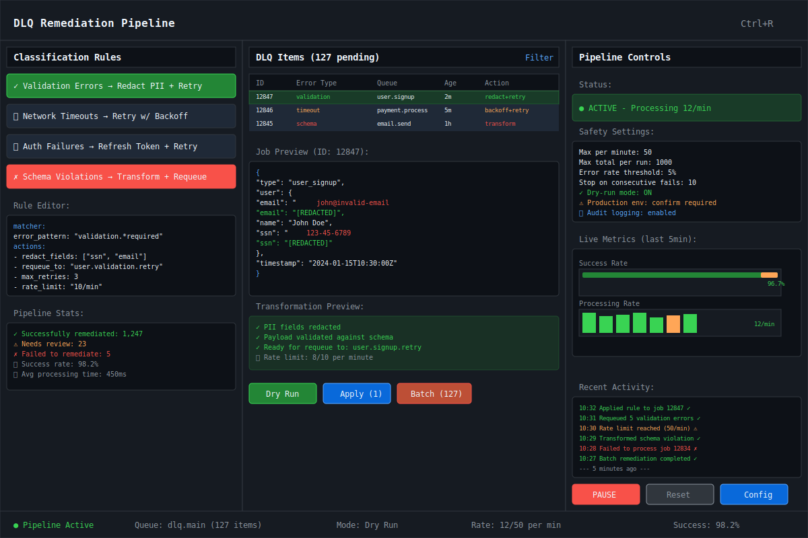

# DLQ Remediation Pipeline

| Priority | Domain | Dependencies | Risks | LoC Estimate | Complexity | Effort | Impact |
| --- | --- | --- | --- | --- | --- | --- | --- |
| Medium‑High | Reliability / Automation | Event hooks, Admin API, classifiers | Misclassification, runaway retries | ~500–900 | Med‑High | 8 (Fib) | High |

## Executive Summary
Automate DLQ cleanup with a configurable pipeline: classify failures, apply rules (transform, redact, reroute), and requeue with safe limits. Provide dry‑run, audit, and guardrails to reduce incident toil.

> [!note]- **🗣️ CLAUDE'S THOUGHTS 💭**
> This is the feature that turns your DLQ from a graveyard into a resurrection machine! The combination of pluggable classifiers with an external hook option is genius - perfect for ML-powered classification. The safety caps are absolutely critical to prevent runaway retry loops that could bring down production. Consider adding a "circuit breaker" pattern that automatically disables rules with high failure rates.

## Motivation
- Shrink time from failure to recovery by automating common remediation patterns.
- Reduce manual, error‑prone DLQ archaeology.
- Capture organizational knowledge as reusable rules.

## Tech Plan
- Classification:
  - Pluggable matchers: error substrings/regex, fields in payload, origin queue, retry count.
  - Optional external classifier hook (HTTP/NATS) for complex decisions.
- Remediation actions:
  - Requeue to original or alternate queue; transform payload; redact fields; drop.
  - Caps: max per minute, max total, stop on error rate spike.
- Pipeline engine:
  - Poll DLQ or subscribe to events; batch evaluate; apply actions with idempotency keys.
  - Track outcome metrics and write audit entries.
- TUI integration:
  - Rule editor (basic); simulation mode on sample DLQ slice; live counters.
- Safety:
  - Dry‑run mode with diff; explicit confirm to apply.
  - Blacklist of non‑retryable errors; TTL for requeued items.

## User Stories + Acceptance Criteria
- As an operator, I can define a rule that requeues validation errors after redacting a field.
- As an SRE, I can run a dry‑run on 100 DLQ items and review the plan.
- Acceptance:
  - [ ] Classifier + actions with rate caps and idempotency.
  - [ ] Dry‑run and audit log of changes.
  - [ ] TUI shows rule results and counters.

## Definition of Done
Classify → remediate → audit loop in place with safe defaults and clear TUI feedback; documentation with recipes.

## Test Plan
- Unit: matcher coverage; transform functions; cap enforcement.
- Integration: end‑to‑end on synthetic DLQ with mixed failures.

## Task List
- [ ] Rule schema + storage
- [ ] Classifier engine + optional external hook
- [ ] Actions (requeue/transform/redact/drop)
- [ ] Dry‑run + audit + metrics
- [ ] TUI rule editor + counters

---

## Claude's Verdict ⚖️

This transforms DLQ management from reactive firefighting to proactive automation. It's the difference between "oh shit, the DLQ is full again" and "the pipeline already fixed that."

### Vibe Check

This is like having a senior SRE on duty 24/7, automatically applying the same patterns they would manually. Nobody else has this level of DLQ intelligence - most systems just let dead jobs pile up.

### Score Card

**Traditional Score:**
- User Value: 8/10 (eliminates toil, prevents incidents)
- Dev Efficiency: 6/10 (complex rule engine and safety systems)
- Risk Profile: 6/10 (automation risks vs manual error reduction)
- Strategic Fit: 9/10 (reliability is core differentiator)
- Market Timing: 8/10 (ops teams drowning in toil)
- **OFS: 7.50** → BUILD SOON

**X-Factor Score:**
- Holy Shit Factor: 7/10 ("It automatically fixes broken jobs?!")
- Meme Potential: 6/10 ("Our DLQ fixes itself" tweets)
- Flex Appeal: 8/10 ("We don't do manual DLQ cleanup")
- FOMO Generator: 7/10 ("How do you handle DLQ without this?")
- Addiction Score: 7/10 (once you have it, can't live without)
- Shareability: 6/10 (great conference talk material)
- **X-Factor: 6.1** → Strong viral potential

### Conclusion

🌶️

This is the kind of operational magic that makes SREs weep with joy. The automation reduces MTTR from hours to seconds for common failure patterns.

---

## Detailed Design Specification

### Overview

The DLQ Remediation Pipeline transforms dead letter queue management from a reactive manual process into a proactive automated system. By combining intelligent pattern recognition with configurable remediation actions, it captures tribal knowledge about failure patterns and automatically applies fixes. The pipeline operates as a continuous background process, monitoring DLQ growth and applying human-defined rules to classify and remediate failures before they become incidents.

The system is built around three core components: a classification engine that identifies failure patterns, an action engine that applies fixes, and a safety system that prevents runaway automation. Together, they create a self-healing job queue that learns from past failures and applies institutional knowledge at machine scale.

### TUI Design

#### Desktop View (Large Resolution)


The desktop interface provides a comprehensive three-panel view for rule management, job monitoring, and pipeline control. The left panel manages classification rules with a visual editor, the center shows DLQ items with real-time transformation previews, and the right panel provides safety controls and live metrics.

#### Mobile View (Small Resolution)


The mobile interface uses a tabbed approach with swipe navigation between Rules, Items, Monitor, and Settings tabs. Each tab is optimized for touch interaction with larger controls and condensed information density.

### Classification Engine

The heart of the system is a flexible classification engine that matches DLQ jobs against user-defined patterns:

#### Built-in Matchers
- **Error Pattern Matcher**: Regex/substring matching against error messages
- **Field Matcher**: JSON path queries against payload fields
- **Queue Origin Matcher**: Matches jobs from specific source queues
- **Retry Count Matcher**: Classifies based on number of previous attempts
- **Time-based Matcher**: Age of job, time of day patterns
- **Payload Size Matcher**: Handles oversized or malformed payloads

#### External Classification Hook
For complex classification requiring ML models or external services:
```go
type ExternalClassifier struct {
    Endpoint string
    Timeout  time.Duration
    Headers  map[string]string
}

type ClassificationRequest struct {
    JobID      string                 `json:"job_id"`
    Error      string                 `json:"error"`
    Payload    json.RawMessage       `json:"payload"`
    Queue      string                 `json:"queue"`
    RetryCount int                   `json:"retry_count"`
    Metadata   map[string]interface{} `json:"metadata"`
}

type ClassificationResponse struct {
    Category   string  `json:"category"`
    Confidence float64 `json:"confidence"`
    Actions    []string `json:"suggested_actions"`
    Reason     string  `json:"reason"`
}
```

#### Rule Definition Format
```yaml
name: validation_errors
description: Handle validation errors by redacting PII and retrying
priority: 100
enabled: true

matcher:
  error_pattern: "validation.*required|invalid.*format"
  retry_count: "< 3"
  source_queue: "user.*"

actions:
  - type: redact_fields
    fields: ["ssn", "email", "phone", "address"]
    replacement: "[REDACTED]"

  - type: transform_payload
    script: |
      if payload.user.email && !isValidEmail(payload.user.email) {
        payload.user.email = "user@example.com"
      }

  - type: requeue
    target_queue: "user.validation.retry"
    priority: 5
    delay: "5m"

safety:
  max_per_minute: 10
  max_total_per_run: 100
  error_rate_threshold: 0.05
  backoff_on_failure: true
```

### Remediation Actions

The action engine applies fixes based on classification results:

#### Core Actions

**1. Requeue Action**
- Target queue selection (original, alternate, or computed)
- Priority adjustment for retry jobs
- Delay injection to prevent thundering herd
- Retry count tracking and limits

**2. Transform Action**
- JSON path-based field modifications
- Script execution for complex transformations
- Schema validation before requeue
- Reversible transformations for audit

**3. Redact Action**
- PII field identification and removal
- Configurable redaction patterns
- Audit log of redacted content
- Compliance-friendly logging

**4. Drop Action**
- Permanent job removal with reason logging
- Configurable retention for audit
- Metrics tracking for dropped jobs
- Dead job storage for forensics

**5. Route Action**
- Queue routing based on patterns
- Load balancing across worker pools
- Priority queue elevation
- Tenant-specific routing

#### Safety Mechanisms

**Rate Limiting**
```go
type RateLimiter struct {
    MaxPerMinute int
    MaxTotal     int
    BurstSize    int

    // Current state
    CurrentMinute time.Time
    CountThisMinute int
    TotalProcessed  int
}
```

**Circuit Breaker**
```go
type CircuitBreaker struct {
    ErrorThreshold    float64
    MinRequests      int
    RecoveryTimeout  time.Duration

    State           CircuitState
    ErrorCount      int
    RequestCount    int
    LastFailure     time.Time
}
```

**Idempotency Protection**
```go
type IdempotencyTracker struct {
    ProcessedJobs map[string]time.Time
    TTL           time.Duration

    // Prevents duplicate processing
    IsProcessed(jobID string) bool
    MarkProcessed(jobID string)
    Cleanup()
}
```

### User Scenarios

#### Scenario 1: SRE Handling Validation Failures

1. **Incident**: 200 jobs failing validation due to new field requirement
2. **Classification**: Pattern matcher identifies "required field missing" errors
3. **Rule Creation**: SRE creates rule to add default values for missing fields
4. **Testing**: Dry-run shows successful transformation for 195/200 jobs
5. **Application**: Batch processing requeues fixed jobs to original queue
6. **Monitoring**: Success rate climbs from 0% to 97.5% within 5 minutes

#### Scenario 2: Developer Debugging Payment Issues

1. **Investigation**: Payment jobs timing out due to external service issues
2. **Pattern Recognition**: Network timeout errors from payment gateway
3. **Rule Application**: Automatic exponential backoff with circuit breaker
4. **Escalation**: Jobs exceeding retry limit routed to manual review queue
5. **Resolution**: Service recovery triggers automatic retry of held jobs

#### Scenario 3: Security Team PII Remediation

1. **Compliance Alert**: PII detected in job payloads violating data policy
2. **Emergency Response**: Real-time redaction rule deployed
3. **Bulk Processing**: Historical DLQ jobs processed for PII removal
4. **Audit Trail**: Complete log of redaction actions for compliance
5. **Prevention**: Validation rules prevent future PII ingestion

### Technical Implementation

#### Core Architecture
```go
type RemediationPipeline struct {
    Classifier     *ClassificationEngine
    ActionEngine   *ActionExecutor
    SafetyGuards   *SafetyManager
    AuditLogger    *AuditLog
    MetricsTracker *MetricsCollector

    // Configuration
    Rules          []RemediationRule
    DryRun         bool
    BatchSize      int
    PollInterval   time.Duration
}

type ClassificationEngine struct {
    Matchers        []Matcher
    ExternalHook    *ExternalClassifier
    CacheEnabled    bool
    CacheTTL        time.Duration

    Classify(job *DLQJob) (*Classification, error)
}

type ActionExecutor struct {
    Actions        map[string]Action
    Transformers   *PayloadTransformer
    QueueClient    QueueClient
    RetryPolicy    *RetryPolicy

    Execute(job *DLQJob, actions []Action) error
}
```

#### Processing Algorithm
```go
func (p *RemediationPipeline) ProcessBatch() error {
    jobs, err := p.fetchDLQJobs(p.BatchSize)
    if err != nil {
        return err
    }

    for _, job := range jobs {
        // Skip if already processed
        if p.SafetyGuards.IsProcessed(job.ID) {
            continue
        }

        // Classify the job
        classification, err := p.Classifier.Classify(job)
        if err != nil {
            p.MetricsTracker.RecordError("classification", err)
            continue
        }

        // Find matching rule
        rule := p.findMatchingRule(classification)
        if rule == nil {
            continue
        }

        // Check safety limits
        if !p.SafetyGuards.CanProcess(rule) {
            p.MetricsTracker.RecordRateLimited(rule.Name)
            break
        }

        // Execute actions
        if p.DryRun {
            p.simulateActions(job, rule.Actions)
        } else {
            err = p.ActionEngine.Execute(job, rule.Actions)
            if err != nil {
                p.MetricsTracker.RecordActionError(rule.Name, err)
                p.SafetyGuards.RecordFailure(rule.Name)
                continue
            }
        }

        // Record success
        p.SafetyGuards.MarkProcessed(job.ID)
        p.AuditLogger.LogRemediation(job, rule, classification)
        p.MetricsTracker.RecordSuccess(rule.Name)
    }

    return nil
}
```

### Keyboard Shortcuts

| Key | Action | Context |
|-----|--------|---------|
| `Ctrl+R` | Open remediation pipeline | Any |
| `r` | Refresh DLQ items | Pipeline view |
| `n` | Create new rule | Rules panel |
| `e` | Edit selected rule | Rules panel |
| `d` | Delete rule with confirmation | Rules panel |
| `Space` | Toggle rule enabled/disabled | Rules panel |
| `t` | Test rule on selected job | Jobs panel |
| `p` | Preview transformation | Jobs panel |
| `Enter` | Apply rule to selected job | Jobs panel |
| `Shift+Enter` | Batch apply to matching jobs | Jobs panel |
| `Ctrl+D` | Toggle dry-run mode | Any |
| `Ctrl+P` | Pause/resume pipeline | Any |
| `s` | View safety settings | Control panel |
| `a` | View audit log | Control panel |
| `m` | View metrics dashboard | Control panel |
| `?` | Show help overlay | Any |

### Performance Considerations

**Batch Processing Optimization**
- Process DLQ jobs in configurable batches (default: 50)
- Parallel classification with worker pool
- Bulk database operations for audit logging
- Connection pooling for external classifier calls

**Memory Management**
- Streaming job processing to avoid loading entire DLQ
- LRU cache for classification results
- Payload size limits to prevent OOM
- Garbage collection tuning for continuous operation

**Scalability**
- Horizontal scaling with distributed coordination
- Queue partitioning for parallel processing
- Rate limiting per rule to prevent resource exhaustion
- Circuit breakers for external service protection

**Performance Metrics**
- Target: 1000 jobs/minute classification rate
- Memory usage: < 100MB base + 10KB per active rule
- Latency: < 50ms average classification time
- Availability: 99.9% uptime with graceful degradation

### Monitoring and Observability

**Key Metrics**
```go
type PipelineMetrics struct {
    // Throughput
    JobsClassifiedPerMinute  prometheus.Counter
    JobsRemediatedPerMinute  prometheus.Counter
    ActionsExecutedPerMinute prometheus.Counter

    // Latency
    ClassificationLatency    prometheus.Histogram
    RemediationLatency       prometheus.Histogram
    EndToEndLatency         prometheus.Histogram

    // Success Rates
    ClassificationSuccessRate prometheus.Gauge
    RemediationSuccessRate    prometheus.Gauge
    RuleEffectivenessRate    prometheus.GaugeVec

    // Safety Metrics
    RateLimitHits           prometheus.CounterVec
    CircuitBreakerTrips     prometheus.CounterVec
    SafetyOverrides         prometheus.Counter
}
```

**Health Checks**
- Pipeline process health and resource usage
- Rule execution success rates and error patterns
- External classifier availability and response times
- Queue depth and processing lag monitoring

**Alerting Rules**
- Pipeline stopped or failing for > 5 minutes
- Classification success rate < 95% for 10 minutes
- Remediation success rate < 90% for 15 minutes
- DLQ growth rate exceeding processing capacity

### Failure Modes and Recovery

**Classification Failures**
- Fallback to pattern matching if external classifier unavailable
- Cache classification results to reduce external service load
- Graceful degradation with manual classification prompts
- Rule validation prevents deployment of broken patterns

**Action Execution Failures**
- Retry with exponential backoff for transient failures
- Circuit breakers for failing queues or external services
- Dead letter queue for repeatedly failed actions
- Manual intervention queue for complex cases

**Safety System Failures**
- Hard limits enforced at infrastructure level
- Multiple safety mechanisms (rate limiting + circuit breakers)
- Automatic pipeline shutdown on critical failures
- Manual override with audit logging and approval

**Data Consistency**
- Idempotency tokens prevent duplicate processing
- Audit log captures all state changes
- Rollback capability for reversible actions
- Eventual consistency handling for distributed operations

### Future Enhancements

- **Machine Learning Integration**: Train models on successful remediation patterns to suggest new rules
- **Advanced Analytics**: Pattern detection across multiple failure types to identify systemic issues
- **Template Marketplace**: Share common remediation rules across organizations
- **Visual Rule Builder**: Drag-and-drop interface for non-technical users to create rules
- **Simulation Mode**: Full DLQ replay capability to test rule changes before deployment
- **A/B Testing**: Compare different remediation strategies on similar failure patterns
- **Integration APIs**: Plugin system for custom classifiers and actions
- **Compliance Framework**: Built-in GDPR, HIPAA, and SOC2 compliance controls
