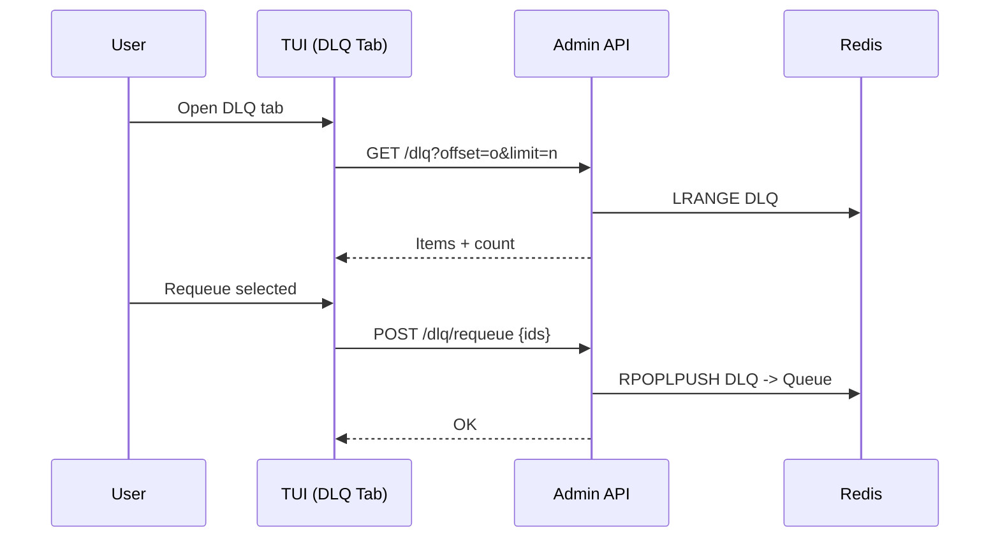

# DLQ Remediation UI

| Priority | Domain | Dependencies | Risks | LoC Estimate | Complexity | Effort | Impact |
| --- | --- | --- | --- | --- | --- | --- | --- |
| High | Ops UX / TUI | Admin API (list/peek/requeue/purge) | Large DLQ perf, destructive ops | ~420–700 (TUI+API) | Medium (page O(p), total O(N)) | 5 (Fib) | High |

## Executive Summary
A focused DLQ tab to list, search, peek, requeue, and purge items safely with confirmations.

## Motivation
Reduce incident toil; provide a fast remediation loop within the TUI.

## Tech Plan
- API: add DLQ list with pagination, peek by index/ID, requeue selected, purge endpoints.
- TUI: DLQ tab with pager, filter, selection; action bar; confirmations.
- Performance: server-side pagination; cap payload sizes; streaming where feasible.

## User Stories + Acceptance Criteria
- As an operator, I can list and filter DLQ items and peek payloads.
- As an operator, I can requeue or purge selected items with confirmation.
- Acceptance:
  - [ ] DLQ list is paginated with total count and filter.
  - [ ] Peek shows pretty JSON and metadata.
  - [ ] Requeue/Purge actions exist for selected items; purge all gated by confirm.
  - [ ] Handles large DLQs without freezing the UI.

## Definition of Done
Usable DLQ tab with list/peek/requeue/purge; README and keybindings updated; basic load test run.

## Test Plan
- API: pagination correctness; requeue idempotency; purge limits.
- TUI: interaction tests (manual + scripted); large list navigation.

## Task List
- [ ] API: list + count with filters
- [ ] API: peek item by ID/index
- [ ] API: requeue selected
- [ ] API: purge selected/all
- [ ] TUI: DLQ tab UI + pager + actions
- [ ] Docs + screenshots

