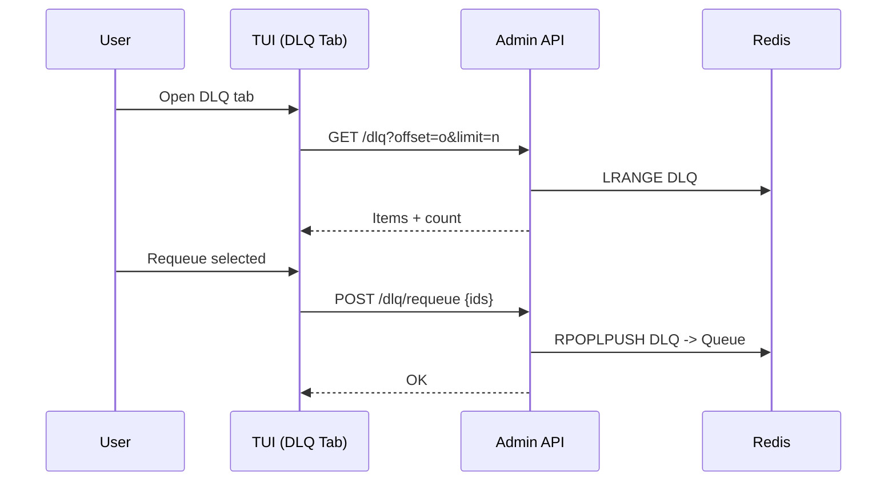
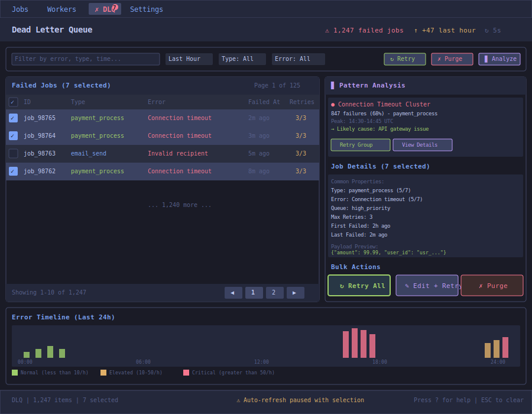
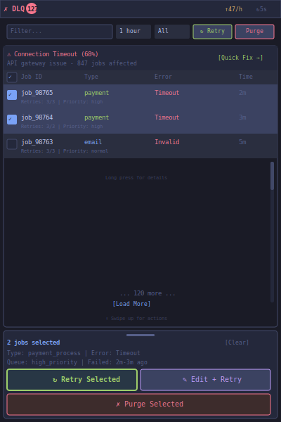

# DLQ Remediation UI

| Priority | Domain | Dependencies | Risks | LoC Estimate | Complexity | Effort | Impact |
| --- | --- | --- | --- | --- | --- | --- | --- |
| High | Ops UX / TUI | Admin API (list/peek/requeue/purge) | Large DLQ perf, destructive ops | ~420–700 (TUI+API) | Medium (page O(p), total O(N)) | 5 (Fib) | High |

## Executive Summary
A focused DLQ tab to list, search, peek, requeue, and purge items safely with confirmations.

> [!note]- **🗣️ CLAUDE'S THOUGHTS 💭**
> THIS is what separates toy queues from production queues. Every on-call engineer has cursed at a DLQ they can't easily inspect. The fact you're putting this in the TUI instead of a separate tool is chef's kiss. Pagination is critical - I've seen DLQs with millions of items. Consider adding bulk operations (requeue all matching filter) and export-to-CSV for post-mortems.

## Motivation
Reduce incident toil; provide a fast remediation loop within the TUI.

## Tech Plan
- API: add DLQ list with pagination, peek by index/ID, requeue selected, purge endpoints.
- TUI: DLQ tab with pager, filter, selection; action bar; confirmations.
- Performance: server-side pagination; cap payload sizes; streaming where feasible.

## User Stories + Acceptance Criteria
- As an operator, I can list and filter DLQ items and peek payloads.
- As an operator, I can requeue or purge selected items with confirmation.
- Acceptance:
  - [ ] DLQ list is paginated with total count and filter.
  - [ ] Peek shows pretty JSON and metadata.
  - [ ] Requeue/Purge actions exist for selected items; purge all gated by confirm.
  - [ ] Handles large DLQs without freezing the UI.

## Definition of Done
Usable DLQ tab with list/peek/requeue/purge; README and keybindings updated; basic load test run.

## Test Plan
- API: pagination correctness; requeue idempotency; purge limits.
- TUI: interaction tests (manual + scripted); large list navigation.

## Task List
- [ ] API: list + count with filters
- [ ] API: peek item by ID/index
- [ ] API: requeue selected
- [ ] API: purge selected/all
- [ ] TUI: DLQ tab UI + pager + actions
- [ ] Docs + screenshots



---

## Claude's Verdict ⚖️

This feature alone could justify adopting your queue. The number of hours lost to DLQ archaeology across the industry is staggering. Building this right saves real pain.

### Vibe Check

Sidekiq Pro has this. BullMQ's Arena has it. RabbitMQ Management has it. But yours is in the terminal where ops engineers actually live. That's differentiation.

### Score Card

**Traditional Score:**
- User Value: 9/10 (solves critical pain for ops)
- Dev Efficiency: 6/10 (1 month with pagination)
- Risk Profile: 7/10 (destructive ops, but mitigated)
- Strategic Fit: 8/10 (production readiness signal)
- Market Timing: 7/10 (everyone needs this yesterday)
- **OFS: 7.65** → BUILD SOON

**X-Factor Score:**
- Holy Shit Factor: 6/10 ("Finally, DLQ that doesn't suck")
- Meme Potential: 4/10 (ops will screenshot horror DLQs)
- Flex Appeal: 7/10 ("Our DLQ UI is actually good")
- FOMO Generator: 5/10 (makes competitors look bad)
- Addiction Score: 6/10 (used during every incident)
- Shareability: 5/10 (ops will mention in retrospectives)
- **X-Factor: 4.2** → Moderate viral potential

### Conclusion

[🌶️]

This is spicy infrastructure - boring concept, exciting execution. The TUI context makes it special. Ship this and watch ops engineers fall in love.

---

## Detailed Design Specification

### Overview

The DLQ Remediation UI transforms dead letter queue management from a nightmare into a superpower. This comprehensive interface provides intelligent pattern analysis, bulk operations, and surgical precision for fixing failed jobs. It's designed for the reality of production incidents where every second counts and every action must be reversible.

### TUI Design



**Mobile-Optimized Version (V2):**



#### Layout Components

The UI uses an information-dense layout optimized for rapid triage and remediation:

**1. Tab Indicator with Badge**
- Red badge shows current DLQ count
- Pulsing animation when count increases
- Click count to jump to most recent failures

**2. Control Bar**
- **Search/Filter**: Full-text search across job IDs, types, errors, and payloads
- **Quick Filters**:
  - Time ranges: Last Hour, Today, This Week, Custom
  - Job types: Dropdown populated from actual DLQ contents
  - Error types: Auto-categorized error patterns
- **Bulk Actions**: Act on selected items with confirmation
  - Retry: Re-enqueue with same or modified payload
  - Purge: Permanently delete (requires double confirmation)
  - Analyze: Deep pattern analysis mode

**3. Main Content Area (Two-Column Split)**

**Left Panel: Failed Jobs List (60% width)**
- **Sortable Columns**:
  - Checkbox for multi-select
  - Job ID (clickable for details)
  - Type (color-coded by category)
  - Error message (truncated with tooltip)
  - Failed timestamp (relative and absolute)
  - Retry count with max indicator
- **Row States**:
  - Normal: Dark background
  - Selected: Blue highlight
  - Hover: Subtle glow effect
  - Similar errors: Grouped with visual indent
- **Smart Grouping**: Automatically groups similar failures
- **Pagination**: Server-side with configurable page size
  - Keyboard navigation: `[` / `]` for prev/next
  - Jump to page: `g` then page number

**Right Panel: Intelligence & Actions (40% width)**
- **Pattern Analysis Section**:
  - Automatic clustering of similar failures
  - Root cause suggestions based on patterns
  - Timeline correlation with deployments/incidents
  - Suggested bulk actions
- **Job Details Section**:
  - Common properties across selection
  - Divergent properties highlighted
  - Full payload preview with JSON syntax highlighting
  - Error stack trace with line highlighting
- **Action Buttons**:
  - Context-aware based on selection
  - Visual weight indicates recommended action
  - Keyboard shortcuts displayed

**4. Bottom Panel: Error Timeline**
- **24-Hour Histogram**:
  - Hourly buckets with error counts
  - Color intensity shows severity
  - Hover for exact counts and types
  - Click to filter to that time range
- **Anomaly Detection**:
  - Automatic spike detection
  - Correlation with known events
  - Predictive alerts for building issues

### Keyboard Navigation

| Key | Action | Context |
|-----|--------|---------|
| `j/k` | Navigate rows | List |
| `Space` | Toggle selection | List |
| `a` | Select all visible | List |
| `A` | Select all (entire DLQ) | List |
| `d` | Deselect all | List |
| `Enter` | View details | List |
| `p` | Peek at payload | List |
| `r` | Retry selected | Any |
| `R` | Retry with edit | Any |
| `e` | Edit payload | Details |
| `D` | Purge selected | Any |
| `ctrl+d` | Purge all (danger!) | Any |
| `/` | Search/filter | Any |
| `f` | Quick filter menu | Any |
| `s` | Sort menu | List |
| `g` | Go to page | List |
| `[/]` | Previous/Next page | List |
| `Tab` | Switch panels | Any |
| `?` | Context help | Any |
| `ESC` | Clear selection/filter | Any |

### Advanced Features

#### 1. Intelligent Pattern Analysis

The system automatically identifies failure patterns using multiple strategies:

**Clustering Algorithms**:
- **Error Message Similarity**: Groups by Levenshtein distance
- **Temporal Clustering**: Identifies time-based patterns
- **Payload Similarity**: Detects common data issues
- **Worker Correlation**: Links failures to specific workers

**Pattern Recognition**:
```yaml
Patterns Detected:
  - name: "Database Connection Timeout"
    count: 847
    percentage: 68%
    first_seen: "2024-01-15T14:30:00Z"
    last_seen: "2024-01-15T14:45:00Z"
    affected_types: ["payment_process", "order_update"]
    suggested_action: "retry_with_backoff"
    confidence: 0.95
    root_cause: "RDS max_connections reached"
```

**Actionable Insights**:
- Suggested fixes based on historical resolutions
- Links to relevant runbooks and documentation
- One-click application of proven fixes
- Success rate of previous similar remediations

#### 2. Bulk Operations with Safety

All bulk operations include comprehensive safety checks:

**Pre-flight Checks**:
- Estimate time to complete operation
- Calculate system impact (queue depth, worker load)
- Check for rate limits and quotas
- Verify permissions and audit requirements

**Confirmation Dialog**:
```
┌─────────────────────────────────────────┐
│         ⚠️ BULK RETRY CONFIRMATION       │
├─────────────────────────────────────────┤
│ You are about to retry 847 jobs:        │
│                                          │
│ Types affected:                          │
│   • payment_process (612)                │
│   • order_update (235)                   │
│                                          │
│ Estimated completion: 3-5 minutes        │
│ Queue impact: +847 jobs                  │
│ Rate limit: 100 jobs/second              │
│                                          │
│ Options:                                 │
│ [✓] Add exponential backoff              │
│ [✓] Reset retry counter                  │
│ [ ] Override priority                    │
│                                          │
│ Type "RETRY" to confirm: _               │
└─────────────────────────────────────────┘
```

**Progress Tracking**:
- Real-time progress bar
- Ability to pause/cancel operation
- Detailed log of actions taken
- Automatic rollback on failure

#### 3. Smart Filtering System

Multi-dimensional filtering with live preview:

**Filter Types**:
- **Time-based**: Relative and absolute time ranges
- **Pattern-based**: Regex on any field
- **Statistical**: Outliers, percentiles, anomalies
- **Relationship**: Related to specific job/worker/queue

**Filter Builder UI**:
```
┌─────────────────────────────────────────┐
│           ADVANCED FILTER                │
├─────────────────────────────────────────┤
│ ▼ Time Range                            │
│   (•) Last 1 hour                       │
│   ( ) Last 24 hours                     │
│   ( ) Custom: [____] to [____]          │
│                                          │
│ ▼ Error Message                         │
│   [✓] Connection timeout                 │
│   [✓] Connection refused                 │
│   [ ] Invalid payload                    │
│   [+] Add custom...                      │
│                                          │
│ ▼ Job Properties                        │
│   Type contains: [payment____]          │
│   Retry count: [≥3]                     │
│   Queue: [high_priority▼]               │
│                                          │
│ Matching: 847 jobs                      │
│ [Apply] [Save as Preset] [Cancel]       │
└─────────────────────────────────────────┘
```

**Saved Filters**:
- Name and save complex filters
- Share across team
- Auto-apply on incidents
- Schedule filter-based reports

#### 4. Payload Surgery Mode

Advanced payload editing with safety rails:

**Visual Editor**:
- Side-by-side diff view
- JSON schema validation
- Syntax highlighting and auto-completion
- Template variables for bulk edits

**Transformation Templates**:
```json
{
  "transform": "fix_timeout",
  "description": "Add retry configuration for timeout errors",
  "match": {
    "error": "connection timeout"
  },
  "apply": {
    "set": {
      "retry_config.max_attempts": 5,
      "retry_config.backoff": "exponential"
    },
    "remove": ["debug_flag"],
    "add_if_missing": {
      "timeout": 30000
    }
  }
}
```

**Testing Mode**:
- Dry run shows what would change
- Test on single job before bulk apply
- Automatic backup before modification
- Rollback capability within 24 hours

#### 5. Historical Analysis

Learn from past incidents:

**Incident Timeline**:
- Overlay deployments, config changes
- Correlate with external events (AWS outages)
- Show previous remediation actions
- Success/failure rates of past fixes

**Pattern Library**:
- Build library of known issues
- Automatic pattern matching
- Suggested resolutions
- Link to post-mortems

**Metrics Dashboard**:
```
DLQ Health Metrics (Last 30 Days)
━━━━━━━━━━━━━━━━━━━━━━━━━━━━━━━━━
MTTR: 12m ↓40%      | Total: 45,231
P50: 3m             | Resolved: 44,102
P95: 47m            | Purged: 1,129
━━━━━━━━━━━━━━━━━━━━━━━━━━━━━━━━━
Top Errors:
1. Timeout (31%)    ↓ Decreasing
2. Bad Gateway (28%) → Stable
3. Rate Limit (18%) ↑ Increasing
```

### Integration Points

#### With Other TUI Features

1. **JSON Payload Studio**:
   - "Edit in Studio" opens payload for modification
   - Apply studio templates to fix common issues
   - Validate against schemas before retry

2. **Time Travel Debugger**:
   - "Debug this failure" loads execution history
   - Compare with successful runs
   - Identify exact failure point

3. **Queue Dashboard**:
   - Click to trace job from enqueue to DLQ
   - Show impact on queue metrics
   - Estimate retry impact on queue depth

4. **Worker Tab**:
   - Identify problematic workers
   - Correlate failures with worker health
   - Target retries to healthy workers

#### With External Systems

1. **Alerting Integration**:
   - PagerDuty/Slack webhooks for DLQ growth
   - Auto-escalation based on patterns
   - Rich notifications with action links

2. **Observability Platforms**:
   - Export to Datadog/New Relic
   - Correlation with APM traces
   - Custom metrics and dashboards

3. **Incident Management**:
   - Auto-create incidents for anomalies
   - Link to runbooks
   - Post-incident report generation

### User Scenarios

#### Scenario 1: Payment Provider Outage

1. On-call engineer gets paged: "DLQ spike - 500 payment failures"
2. Opens DLQ tab, sees pattern analysis: "Payment API timeout cluster"
3. Reviews timeline, correlates with provider's status page
4. Selects all payment_process jobs from last hour
5. Configures retry with 30-minute delay and increased timeout
6. Monitors retry progress, 95% succeed
7. Purges remaining 5% after manual investigation

#### Scenario 2: Bad Deployment

1. DLQ starts growing after deployment
2. Pattern analysis shows "New error: undefined method"
3. Engineer filters to affected job type
4. Uses payload surgery to add missing field
5. Tests fix on single job - succeeds
6. Applies transformation to all 200 affected jobs
7. Creates filter preset for monitoring

#### Scenario 3: Data Quality Issue

1. Slow DLQ growth over several days
2. Analyze patterns, finds email validation failures
3. Groups by email domain, finds typo pattern
4. Creates transformation to fix common typos
5. Dry run shows 80% would be fixed
6. Applies transformation, monitors success
7. Exports remaining for manual review

### Technical Implementation

#### Architecture

```go
type DLQManager struct {
    Storage     DLQStorage
    Analyzer    *PatternAnalyzer
    Remediation *RemediationEngine
    History     *IncidentHistory
    Filters     *FilterEngine
}

type PatternAnalyzer struct {
    Clusterer   *ErrorClusterer
    Detector    *AnomalyDetector
    Correlator  *EventCorrelator
    Suggester   *ActionSuggester
}

type RemediationEngine struct {
    Validator   *PayloadValidator
    Transformer *PayloadTransformer
    Retrier     *BulkRetrier
    Monitor     *ProgressMonitor
}

type DLQEntry struct {
    ID          string
    JobID       string
    Type        string
    Payload     json.RawMessage
    Error       ErrorDetails
    Metadata    JobMetadata
    Attempts    []AttemptRecord
    CreatedAt   time.Time
}
```

#### Performance Optimization

**For Large DLQs (>100k items)**:
- Server-side pagination with cursor
- Lazy loading of payload details
- Approximate counts for real-time feel
- Background analysis with progressive updates
- Sampling for pattern detection

**Caching Strategy**:
- Cache pattern analysis for 5 minutes
- Pre-compute common aggregations
- Index by error message, type, time
- Bloom filters for quick existence checks

**Bulk Operation Optimization**:
- Batch API calls (chunks of 100)
- Parallel processing with worker pool
- Progress updates via WebSocket/SSE
- Automatic rate limiting
- Circuit breaker for downstream services

### Safety & Compliance

#### Audit Trail

Every action is logged:
```json
{
  "timestamp": "2024-01-15T14:35:22Z",
  "user": "alice@example.com",
  "action": "bulk_retry",
  "affected_jobs": 847,
  "filter": "error:timeout AND type:payment*",
  "options": {
    "reset_retry_count": true,
    "add_backoff": "exponential"
  },
  "result": "success",
  "duration_ms": 3420
}
```

#### Permission Model

Granular permissions for different roles:
- **Read**: View DLQ contents
- **Retry**: Re-enqueue jobs
- **Modify**: Edit payloads
- **Purge**: Delete jobs permanently
- **Bulk**: Perform bulk operations
- **Export**: Download DLQ data

#### Data Protection

- PII masking in UI (configurable fields)
- Encryption at rest for sensitive payloads
- Automatic purge of old DLQ items
- GDPR compliance mode (right to deletion)

### Metrics and Success Criteria

**Operational Metrics**:
- Mean Time to Remediation (MTTR)
- DLQ growth rate
- Successful retry percentage
- Pattern detection accuracy

**User Experience Metrics**:
- Time to identify root cause
- Number of clicks to remediate
- Bulk operation success rate
- User satisfaction (NPS)

**Success Criteria**:
- 50% reduction in MTTR
- 80% of failures auto-categorized
- 90% bulk retry success rate
- Zero data loss from operations

### Future Enhancements

- **AI-Powered Root Cause Analysis**: ML model trained on historical incidents
- **Automated Remediation**: Self-healing for known patterns
- **Predictive Alerts**: Warn before DLQ explosion
- **Cross-Region DLQ Federation**: Manage global DLQs from one UI
- **Playbook Automation**: Codify remediation workflows
- **Time-based Auto-Retry**: Schedule retries for optimal times
- **Cost Analysis**: Show financial impact of failures

