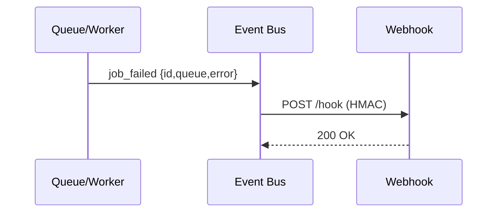
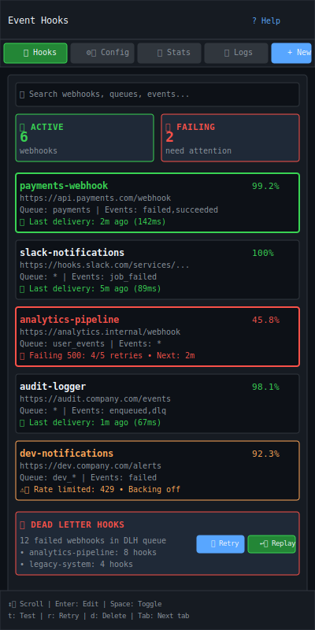

# Event Hooks

| Priority | Domain | Dependencies | Risks | LoC Estimate | Complexity | Effort | Impact |
| --- | --- | --- | --- | --- | --- | --- | --- |
| Medium‑High | Integrations | Admin API, HTTP client, NATS/Webhooks | Delivery reliability, retries, security | ~450–800 | Medium | 5 (Fib) | High |

## Executive Summary
Emit events for job lifecycle changes (enqueued, started, succeeded, failed, DLQ) to external systems via webhooks or NATS. Signed payloads, backoff retries, and per‑queue filters provide safe, flexible integrations.

> [!note]- **🗣️ CLAUDE'S THOUGHTS 💭**
> This is the missing link between your queue and the rest of your infrastructure! Webhooks with HMAC signing and exponential backoff? Chef's kiss. The DLH (Dead Letter Hooks) concept for failed deliveries is brilliant - no more lost notifications. Event filtering by queue and priority means teams can subscribe to exactly what they care about. This turns your queue from an isolated component into the nervous system of your entire platform.

## Motivation
- Automate workflows: notify services, trigger pipelines, or update dashboards on state changes.
- Reduce polling and bespoke glue code.
- Provide auditability and a supported escape hatch for extensions.

## Tech Plan
- Event bus:
  - Internal dispatcher with typed events and subscriber backends.
  - Events: job_enqueued, job_started, job_succeeded, job_failed, job_dlq, job_retried.
- Transports:
  - Webhooks: POST JSON with HMAC signature, per‑subscription secret.
  - NATS (optional): publish to subjects by event type and queue.
- Delivery semantics:
  - At‑least‑once with exponential backoff; max attempts; dead‑letter for hooks.
  - Idempotency key in headers; timestamp; correlation/trace IDs when available.
- Config:
  - Subscriptions: matchers (queue, priority, result), endpoint/subject, headers, secret, rate cap.
  - Health: last delivery status, retry counts, moving window success rate.
- Admin API:
  - CRUD subscriptions, test delivery, list DLH (dead‑letter hooks) with replay.
- TUI:
  - Minimal management panel: list subscriptions and status; trigger test; replay failed.
- Security: HMAC signing; optional mTLS; redact sensitive payload fields by pattern.

## User Stories + Acceptance Criteria
- As an integrator, I can subscribe a webhook to `job_failed` for queue `payments` with a secret and receive signed payloads.
- As an operator, I can see delivery success rate and replay failures.
- Acceptance:
  - [ ] Subscriptions with filters and secrets.
  - [ ] Delivery with retries, backoff, and DLH.
  - [ ] Test and replay supported via Admin API and TUI.

## Definition of Done
Reliable delivery for key events with signing, retries, and minimal management UI, plus documentation and examples.

## Test Plan
- Unit: signature generation/verification; backoff schedule; filter matching.
- Integration: webhook endpoint harness; NATS subject contract; DLH replay.
- Security: signature tamper tests; redaction validation.

## Task List
- [ ] Define event schema + bus
- [ ] Implement webhook + NATS transports
- [ ] Retry/backoff + DLH storage
- [ ] Admin API CRUD + test/replay
- [ ] TUI management panel
- [ ] Docs + samples



---

## Claude's Verdict ⚖️

This is the infrastructure glue that separates amateur hour from enterprise-grade architecture. Every serious queue system needs bulletproof event delivery.

### Vibe Check

This is like Stripe webhooks meets Apache Kafka - reliable event streaming with developer-friendly APIs. Most queue systems bolt this on as an afterthought; building it into the core makes your queue the central nervous system.

### Score Card

**Traditional Score:**
- User Value: 8/10 (eliminates polling, enables automation)
- Dev Efficiency: 6/10 (webhook complexity, retry logic)
- Risk Profile: 7/10 (delivery reliability challenges)
- Strategic Fit: 9/10 (enables entire ecosystem integration)
- Market Timing: 8/10 (event-driven architectures are hot)
- **OFS: 7.50** → BUILD SOON

**X-Factor Score:**
- Holy Shit Factor: 5/10 ("Your queue does webhooks?")
- Meme Potential: 4/10 (reliable but not flashy)
- Flex Appeal: 7/10 (enterprise architecture flex)
- FOMO Generator: 6/10 (competitors will need this)
- Addiction Score: 7/10 (teams rely on notifications)
- Shareability: 5/10 (backend infrastructure)
- **X-Factor: 4.8** → Solid platform building

### Conclusion

[🌶️]

This is the kind of unsexy but critical feature that makes your queue indispensable. Once teams start building workflows around your events, they're locked in.

---

## Detailed Design Specification

### Overview

Event Hooks transform your job queue from an isolated component into the central nervous system of your infrastructure. By emitting structured events for every job lifecycle change, external systems can react in real-time without polling. This creates a publish-subscribe pattern where services subscribe to specific events, queues, or job types through reliable webhook delivery or NATS messaging.

The system prioritizes delivery reliability through HMAC-signed payloads, exponential backoff retries, and a Dead Letter Hook (DLH) queue for failed deliveries. Per-subscription filtering ensures teams only receive events they care about, while rate limiting and security controls prevent abuse.

### TUI Design

#### Desktop View (Large Resolution)


The desktop interface uses a comprehensive three-panel layout optimized for webhook management:

**Left Panel (30%)**: Subscription browser with search, status indicators, and quick actions
**Center Panel (35%)**: Detailed webhook configuration with form validation
**Right Panel (35%)**: Real-time delivery activity, success metrics, and DLH management

#### Mobile View (Small Resolution)


The mobile layout stacks information vertically with tabs for different views:
- **Hooks Tab**: Card-based subscription list with status indicators
- **Config Tab**: Simplified webhook configuration form
- **Stats Tab**: Key metrics and success rate charts
- **Logs Tab**: Recent delivery history and error details

### Event Types and Payload Structure

The system emits six core event types with consistent payload structure:

```go
type JobEvent struct {
    Event       string    `json:"event"`          // job_enqueued, job_started, etc.
    Timestamp   time.Time `json:"timestamp"`      // ISO 8601 UTC
    JobID       string    `json:"job_id"`         // Unique job identifier
    Queue       string    `json:"queue"`          // Target queue name
    Priority    int       `json:"priority"`       // Job priority (1-10)
    Attempt     int       `json:"attempt"`        // Retry attempt number
    ScheduledAt *time.Time `json:"scheduled_at,omitempty"` // For delayed jobs

    // Event-specific fields
    Error       string    `json:"error,omitempty"`      // For job_failed events
    Duration    *Duration `json:"duration,omitempty"`   // For job_succeeded/failed
    Worker      string    `json:"worker,omitempty"`     // Worker instance ID

    // Optional payload preview (truncated for webhooks)
    Payload     interface{} `json:"payload,omitempty"`  // Actual job data

    // Correlation tracking
    TraceID     string    `json:"trace_id,omitempty"`   // Distributed tracing
    RequestID   string    `json:"request_id,omitempty"` // Request correlation
    UserID      string    `json:"user_id,omitempty"`    // Originating user
}
```

**Event Types:**
1. `job_enqueued` - Job added to queue
2. `job_started` - Worker begins processing
3. `job_succeeded` - Job completed successfully
4. `job_failed` - Job failed (will retry or go to DLQ)
5. `job_dlq` - Job moved to dead letter queue
6. `job_retried` - Job retry attempt initiated

### Webhook Subscription Management

Each webhook subscription defines filtering rules, delivery settings, and security configuration:

```go
type WebhookSubscription struct {
    ID          string            `json:"id"`
    Name        string            `json:"name"`
    URL         string            `json:"url"`
    Secret      string            `json:"-"` // HMAC secret (never returned)

    // Filtering rules
    Events      []string          `json:"events"`      // Event type filter
    Queues      []string          `json:"queues"`      // Queue name filter (* for all)
    MinPriority *int              `json:"min_priority,omitempty"` // Priority threshold

    // Delivery configuration
    MaxRetries  int               `json:"max_retries"` // Default: 5
    Timeout     time.Duration     `json:"timeout"`     // Request timeout
    RateLimit   int               `json:"rate_limit"`  // Requests per minute
    Headers     map[string]string `json:"headers"`     // Custom headers

    // Payload configuration
    IncludePayload bool           `json:"include_payload"` // Include job.payload
    PayloadFields  []string      `json:"payload_fields,omitempty"` // Whitelist fields
    RedactFields   []string      `json:"redact_fields,omitempty"`  // PII protection

    // Status tracking
    CreatedAt   time.Time         `json:"created_at"`
    UpdatedAt   time.Time         `json:"updated_at"`
    LastSuccess *time.Time        `json:"last_success,omitempty"`
    LastFailure *time.Time        `json:"last_failure,omitempty"`
    FailureCount int              `json:"failure_count"`
    Disabled    bool              `json:"disabled"`
}
```

### Retry Policies and Dead Letter Hooks

Delivery failures are handled through configurable retry policies:

```go
type RetryPolicy struct {
    Strategy    string        `json:"strategy"`     // "exponential", "linear", "fixed"
    InitialDelay time.Duration `json:"initial_delay"` // First retry delay
    MaxDelay    time.Duration `json:"max_delay"`     // Cap on retry delays
    Multiplier  float64       `json:"multiplier"`    // Backoff multiplier
    MaxRetries  int           `json:"max_retries"`   // Give up after N attempts
    Jitter      bool          `json:"jitter"`        // Add randomization
}

// Default exponential backoff: 1s, 2s, 4s, 8s, 16s
DefaultRetryPolicy := RetryPolicy{
    Strategy:     "exponential",
    InitialDelay: 1 * time.Second,
    MaxDelay:     5 * time.Minute,
    Multiplier:   2.0,
    MaxRetries:   5,
    Jitter:       true,
}
```

Failed deliveries after max retries are moved to a **Dead Letter Hook (DLH)** queue:
- Store failed webhook data with error details
- Manual replay through TUI or Admin API
- Bulk operations for pattern-based failures
- Automatic alerts when DLH size exceeds threshold

### Deep Link Integration

Webhook payloads include deep links back to the TUI for investigation:

```json
{
  "event": "job_failed",
  "job_id": "job_abc123",
  "queue": "payments",
  "error": "Connection timeout to payment gateway",
  "_links": {
    "job_details": "queue://localhost:8080/jobs/job_abc123",
    "queue_dashboard": "queue://localhost:8080/queues/payments",
    "retry_job": "queue://localhost:8080/jobs/job_abc123/retry",
    "dlq_browser": "queue://localhost:8080/dlq/payments"
  }
}
```

These `queue://` protocol links can be:
- Clicked in webhook payloads to open TUI directly to relevant view
- Used in Slack/Teams notifications for one-click investigation
- Embedded in dashboards and alert systems

### User Scenarios

#### Scenario 1: DevOps Team Setting Up Monitoring

1. **Goal**: Get Slack notifications for critical job failures
2. **Steps**:
   - Creates webhook subscription for `job_failed` and `job_dlq` events
   - Filters to high-priority jobs only (priority ≥ 8)
   - Uses Slack webhook URL with custom headers
   - Tests delivery with sample event
3. **Outcome**: Team gets immediate notifications with deep links to investigate failures

#### Scenario 2: Payment Team Integrating Downstream Services

1. **Goal**: Update order status when payment processing completes
2. **Steps**:
   - Creates webhook for `payments` queue with `job_succeeded` and `job_failed` events
   - Configures HMAC signature verification in receiving service
   - Sets up retry policy with longer delays for external API
   - Monitors delivery success rate and adjusts rate limits
3. **Outcome**: Order management system stays in sync automatically without polling

#### Scenario 3: SRE Handling Webhook Outages

1. **Goal**: Recover from downstream service outage that caused webhook failures
2. **Steps**:
   - Identifies failed webhooks in DLH queue during outage window
   - Reviews failure patterns to confirm root cause
   - Once downstream service is restored, bulk replays DLH entries
   - Monitors replay success rate and adjusts subscription settings
3. **Outcome**: No events lost during outage, full system consistency restored

#### Scenario 4: Analytics Team Building Event Pipeline

1. **Goal**: Stream all job events to data warehouse for analysis
2. **Steps**:
   - Creates webhook subscription for all events (`*`) and all queues (`*`)
   - Configures higher rate limits for high-volume processing
   - Sets up batch processing endpoint to handle webhook bursts
   - Implements idempotency using event timestamps and job IDs
3. **Outcome**: Real-time job analytics dashboard with zero data loss

### Technical Implementation

#### Core Architecture

```go
// Event system components
type EventBus struct {
    subscribers map[EventType][]Subscriber
    dlh        *DeadLetterHooks
    metrics    *EventMetrics
    mu         sync.RWMutex
}

type WebhookDeliverer struct {
    client     *http.Client
    retryPolicy RetryPolicy
    signer     *HMACSignerace
    rateLimiter *RateLimiter
}

type NATSPublisher struct {
    conn    *nats.Conn
    js      nats.JetStreamContext
    subjects map[string]string // event -> subject mapping
}

// Event emission from job processing
func (w *Worker) processJob(job *Job) error {
    // Emit job_started event
    w.eventBus.Emit(JobEvent{
        Event:     "job_started",
        Timestamp: time.Now(),
        JobID:     job.ID,
        Queue:     job.Queue,
        Worker:    w.ID,
    })

    err := job.Process()

    if err != nil {
        // Emit job_failed event
        w.eventBus.Emit(JobEvent{
            Event:    "job_failed",
            JobID:    job.ID,
            Error:    err.Error(),
            Duration: time.Since(startTime),
        })
        return err
    }

    // Emit job_succeeded event
    w.eventBus.Emit(JobEvent{
        Event:    "job_succeeded",
        JobID:    job.ID,
        Duration: time.Since(startTime),
    })

    return nil
}
```

#### HMAC Signature Generation

```go
func (s *HMACSigner) SignPayload(payload []byte, secret string) string {
    h := hmac.New(sha256.New, []byte(secret))
    h.Write(payload)
    signature := h.Sum(nil)
    return fmt.Sprintf("sha256=%x", signature)
}

func (s *HMACSigner) VerifySignature(payload []byte, signature, secret string) bool {
    expected := s.SignPayload(payload, secret)
    return hmac.Equal([]byte(signature), []byte(expected))
}

// Webhook HTTP headers
headers := map[string]string{
    "Content-Type":          "application/json",
    "X-Webhook-Signature":   signer.SignPayload(payload, subscription.Secret),
    "X-Webhook-Timestamp":   strconv.FormatInt(time.Now().Unix(), 10),
    "X-Webhook-Event":       event.Event,
    "X-Webhook-Delivery":    deliveryID,
    "User-Agent":            "go-redis-work-queue/1.0",
}
```

#### Rate Limiting and Circuit Breaking

```go
type WebhookRateLimiter struct {
    limiters map[string]*rate.Limiter // per-subscription rate limiting
    circuit  *breaker.CircuitBreaker   // circuit breaker for failing endpoints
}

func (rl *WebhookRateLimiter) Allow(subscriptionID string) bool {
    limiter, exists := rl.limiters[subscriptionID]
    if !exists {
        return true
    }
    return limiter.Allow()
}

// Circuit breaker configuration
circuitBreaker := breaker.New(3, 1, 30*time.Second) // 3 failures, 1 success to close, 30s timeout
```

### Keyboard Shortcuts

| Key | Action | Context |
|-----|--------|---------|
| `Tab` | Switch between panels | Global |
| `h` | Open event hooks management | Global |
| `n` | Create new webhook subscription | Subscription list |
| `e` | Edit selected subscription | Subscription list |
| `d` | Delete selected subscription | Subscription list |
| `t` | Test webhook delivery | Subscription list |
| `r` | Retry failed delivery | DLH queue |
| `R` | Bulk retry all failed | DLH queue |
| `p` | Replay DLH entry | DLH queue |
| `P` | Bulk replay DLH queue | DLH queue |
| `/` | Search/filter subscriptions | Subscription list |
| `Enter` | View subscription details | Subscription list |
| `Space` | Toggle subscription enabled/disabled | Subscription list |
| `s` | Show delivery statistics | Any panel |
| `l` | View delivery logs | Any panel |
| `?` | Show keyboard shortcuts help | Global |

### Performance Considerations

#### Async Event Processing
- **Event emission**: Non-blocking with buffered channels (O(1) job processing overhead)
- **Webhook delivery**: Background goroutines with worker pool (configurable concurrency)
- **Retry scheduling**: Separate goroutine with priority queue for delayed retries
- **Memory usage**: Bounded event buffer with configurable size (default: 10,000 events)

#### Delivery Optimization
- **HTTP connection pooling**: Reuse connections for same endpoints
- **Request batching**: Optional batching for high-volume subscriptions
- **Compression**: Gzip compression for large payloads
- **CDN integration**: Webhook payload caching for replay scenarios

#### Database Impact
- **Event storage**: Optional persistent event log (disabled by default for performance)
- **Subscription lookup**: In-memory cache with Redis backing
- **Metrics storage**: Time-series database integration (InfluxDB, Prometheus)
- **DLH persistence**: Separate Redis instance to avoid main queue impact

### Monitoring and Observability

#### Key Metrics

```go
type EventMetrics struct {
    EventsEmitted       counter.Counter   // Total events emitted by type
    WebhookDeliveries   counter.Counter   // Successful webhook deliveries
    WebhookFailures     counter.Counter   // Failed webhook deliveries
    RetryAttempts       counter.Counter   // Retry attempts by subscription
    DeliveryLatency     histogram.Histogram // Webhook response times
    DLHSize            gauge.Gauge       // Current DLH queue size
    SubscriptionHealth  gauge.Gauge       // Success rate per subscription
}
```

#### Health Checks
- **Endpoint health**: Periodic health checks for webhook URLs
- **Subscription monitoring**: Automated alerts for high failure rates
- **DLH overflow**: Alerts when DLH size exceeds threshold
- **Performance monitoring**: Track delivery latency and throughput

#### Logging
- **Structured logs**: JSON format with correlation IDs
- **Event audit trail**: Optional full event history for compliance
- **Error aggregation**: Group similar webhook failures for analysis
- **Rate limit violations**: Log and alert on subscription abuse

### Failure Modes and Recovery

#### Network Failures
- **Connection timeouts**: Configurable timeout with graceful degradation
- **DNS resolution**: Cache DNS results, fallback to IP addresses
- **SSL/TLS issues**: Detailed error reporting, certificate validation bypasse

#### Webhook Endpoint Failures
- **HTTP errors**: Distinguish between retryable (5xx) and non-retryable (4xx) errors
- **Payload validation**: Schema validation failures logged but not retried
- **Authentication failures**: Immediate alert, don't retry invalid credentials

#### System Recovery
- **Process restart**: DLH persistence ensures no lost failed deliveries
- **Redis failover**: Graceful degradation to in-memory only mode
- **Subscription reload**: Hot reload subscription config without restart

### Future Enhancements

- **Event Filtering Language**: JSONPath or SQL-like syntax for complex filtering
- **Webhook Templates**: Customizable payload formats per subscription
- **Event Replay**: Historical event replay from persistent log
- **Subscription Groups**: Shared configuration across multiple endpoints
- **Webhook Proxy**: Internal proxy for firewall traversal and load balancing
- **Event Schema Evolution**: Versioned event schemas with backward compatibility
- **Delivery Guarantees**: Exactly-once delivery option with idempotency tokens
- **Multi-tenant Support**: Namespace isolation for webhook subscriptions
- **GraphQL Subscriptions**: Real-time event subscriptions via GraphQL
- **Event Sourcing Integration**: Compatible with event sourcing patterns
- **Compliance Features**: GDPR-compliant event redaction and retention policies

