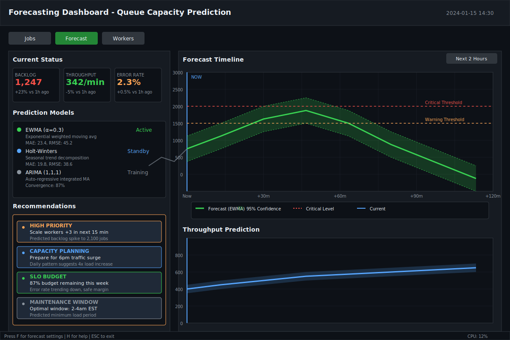
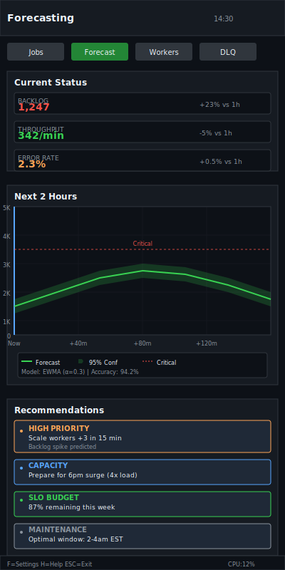

# Forecasting

| Priority | Domain | Dependencies | Risks | LoC Estimate | Complexity | Effort | Impact |
| --- | --- | --- | --- | --- | --- | --- | --- |
| Medium | Analytics / Capacity | Metrics history, simple models | Overfitting, false confidence | ~300–600 | Medium | 5 (Fib) | Medium |

## Executive Summary
Predict backlog, throughput, and error trends using simple time‑series models (moving averages, Holt‑Winters, optional ARIMA) to recommend scaling actions and SLO adjustments.

> [!note]- **🗣️ CLAUDE'S THOUGHTS 💭**
> This is brilliant infrastructure thinking! Forecasting transforms reactive ops into proactive capacity management. The EWMA/Holt-Winters progression is smart - start simple, add sophistication. The "translate forecasts into human hints" approach is key - nobody wants raw statistics, they want actionable recommendations. Consider adding anomaly detection to flag when reality deviates from predictions - that's when you know something fundamentally changed in your system.

## Motivation
- Plan capacity and avoid surprise backlogs.
- Inform autoscaling targets and maintenance windows.
- Provide early warning on budget burn.

## Tech Plan
- Data:
  - Persist short history in‑memory for TUI charts and optionally to disk for longer windows.
  - Optionally pull from metrics TSDB (Prometheus) for richer history.
- Models:
  - Baseline: EWMA / Holt‑Winters; later ARIMA/Prophet plugins.
  - Compute point forecasts and confidence bounds.
- Recommendations:
  - Translate forecasts into human hints (e.g., "Scale workers +2 for next 30m").
  - Budget burn projections for SLO widget.
- TUI:
  - Overlay forecast bands on charts; show next 30–120m.
  - Small "What's Next" panel with recommendations.

## User Stories + Acceptance Criteria
- As an operator, I can see forecast bands on queue charts and a plain‑English recommendation.
- Acceptance:
  - [ ] Baseline forecasting on backlog/throughput with confidence bands.
  - [ ] Recommendations generated and displayed succinctly.
  - [ ] Toggleable overlays; no impact on core loop performance.

## Definition of Done
Forecast overlays and recommendations shipped with a safe baseline model and minimal persistence.

## Test Plan
- Unit: EWMA/Holt‑Winters implementations; edge cases (constant/empty).
- Integration: compare forecasts to held‑out history; ensure perf is acceptable.

## Task List
- [ ] Implement EWMA/Holt‑Winters
- [ ] Persist short history; optional TSDB reader
- [ ] Overlay UI + recommendations
- [ ] Docs + examples

---

## Claude's Verdict ⚖️

This is the feature that transforms your queue from a reactive black box into a crystal ball. Operators will go from "oh shit, we're behind" to "scale up in 15 minutes, spike incoming."

### Vibe Check

DataDog APM has forecasting, but it's generic. This is purpose-built for job queues with domain-specific insights like "optimal maintenance windows" and "SLO budget burn." The confidence bands on TUI charts will be gorgeous.

### Score Card

**Traditional Score:**
- User Value: 8/10 (prevents outages, enables proactive scaling)
- Dev Efficiency: 7/10 (straightforward time series math)
- Risk Profile: 6/10 (wrong predictions could cause overscaling)
- Strategic Fit: 9/10 (differentiates from basic queue monitoring)
- Market Timing: 8/10 (everyone wants predictive ops)
- **OFS: 7.75** → BUILD SOON

**X-Factor Score:**
- Holy Shit Factor: 7/10 ("It predicted the exact spike time!")
- Meme Potential: 4/10 (infrastructure forecasting is niche)
- Flex Appeal: 8/10 ("Our queue predicts the future")
- FOMO Generator: 6/10 (operators will want predictive capabilities)
- Addiction Score: 7/10 (addictive to check predictions)
- Shareability: 5/10 (ops teams will demo to management)
- **X-Factor: 5.8** → Strong practical appeal

### Conclusion

🌶️

This is spicy ops intelligence. The combination of visual forecast bands + actionable recommendations + SLO budget tracking is unmatched in the job queue space.

---

## Detailed Design Specification

### Overview

The Forecasting system transforms reactive queue management into proactive capacity planning. By applying time-series analysis to queue metrics, it provides operators with predictive insights about future load, enabling preventive scaling actions and informed maintenance scheduling. The system combines statistical rigor with operator-friendly visualizations, turning complex mathematical models into clear, actionable recommendations.

Unlike generic monitoring dashboards that only show what happened, this forecasting engine tells you what's likely to happen next and what to do about it. It's designed specifically for job queue patterns - understanding backlog accumulation, throughput seasonality, and error rate trends that are unique to asynchronous work processing.

### TUI Design

#### Desktop View (Large Resolution)


The desktop layout uses a sophisticated three-panel design optimized for data-dense forecasting information:

**Left Panel: Current Status & Recommendations (32% width)**
- Real-time metrics cards with trend indicators
- Active forecasting models with accuracy metrics
- Prioritized recommendations with action timelines
- SLO budget tracking and maintenance window suggestions

**Right Panel: Forecast Visualization (68% width)**
- Main forecast chart with confidence bands
- Secondary throughput prediction chart
- Interactive time range selection
- Overlay controls for different prediction models

#### Mobile View (Small Resolution)


The mobile layout stacks components vertically for optimal narrow terminal viewing:

**Stacked Layout:**
- Compact metrics cards showing key indicators
- Simplified forecast chart with essential information
- Condensed recommendations with priority indicators
- Touch-optimized controls and navigation

### Mathematical Foundation

#### Exponentially Weighted Moving Average (EWMA)

The baseline forecasting model uses EWMA for its simplicity and responsiveness:

```go
type EWMAForecaster struct {
    alpha     float64    // Smoothing parameter (0 < α < 1)
    lastValue float64    // Previous smoothed value
    variance  float64    // Estimate of forecast variance
}

func (e *EWMAForecaster) Update(observation float64) {
    if e.lastValue == 0 {
        e.lastValue = observation
        return
    }

    // Update smoothed value
    e.lastValue = e.alpha*observation + (1-e.alpha)*e.lastValue

    // Update variance estimate for confidence bounds
    error := observation - e.lastValue
    e.variance = e.alpha*error*error + (1-e.alpha)*e.variance
}

func (e *EWMAForecaster) Forecast(horizon int) ([]float64, []float64, []float64) {
    forecasts := make([]float64, horizon)
    upperBounds := make([]float64, horizon)
    lowerBounds := make([]float64, horizon)

    stdDev := math.Sqrt(e.variance)

    for i := 0; i < horizon; i++ {
        // Point forecast remains constant
        forecasts[i] = e.lastValue

        // Confidence bounds widen over time
        confidenceMultiplier := 1.96 * stdDev * math.Sqrt(float64(i+1))
        upperBounds[i] = e.lastValue + confidenceMultiplier
        lowerBounds[i] = e.lastValue - confidenceMultiplier

        // Ensure lower bound doesn't go negative for queue metrics
        if lowerBounds[i] < 0 {
            lowerBounds[i] = 0
        }
    }

    return forecasts, upperBounds, lowerBounds
}
```

#### Holt-Winters Seasonal Decomposition

For advanced seasonal pattern detection:

```go
type HoltWintersForecaster struct {
    level        float64    // Current level
    trend        float64    // Current trend
    seasonal     []float64  // Seasonal components
    alpha        float64    // Level smoothing
    beta         float64    // Trend smoothing
    gamma        float64    // Seasonal smoothing
    seasonLength int        // Length of seasonal cycle
}

func (hw *HoltWintersForecaster) Update(observation float64, period int) {
    // Deseasonalize observation
    seasonalIndex := period % hw.seasonLength
    deseasonalized := observation / hw.seasonal[seasonalIndex]

    // Update level and trend
    previousLevel := hw.level
    hw.level = hw.alpha*deseasonalized + (1-hw.alpha)*(hw.level+hw.trend)
    hw.trend = hw.beta*(hw.level-previousLevel) + (1-hw.beta)*hw.trend

    // Update seasonal component
    hw.seasonal[seasonalIndex] = hw.gamma*(observation/hw.level) +
                                (1-hw.gamma)*hw.seasonal[seasonalIndex]
}

func (hw *HoltWintersForecaster) Forecast(horizon int) []float64 {
    forecasts := make([]float64, horizon)

    for i := 0; i < horizon; i++ {
        seasonalIndex := i % hw.seasonLength
        levelWithTrend := hw.level + float64(i+1)*hw.trend
        forecasts[i] = levelWithTrend * hw.seasonal[seasonalIndex]
    }

    return forecasts
}
```

#### ARIMA Integration (Optional)

For advanced users requiring sophisticated statistical modeling:

```go
type ARIMAForecaster struct {
    p, d, q      int        // ARIMA parameters
    coefficients []float64  // Model coefficients
    residuals    []float64  // Historical residuals
    history      []float64  // Raw historical data
}

// ARIMA implementation would integrate with external libraries
// like stats packages or call out to R/Python scripts
func (a *ARIMAForecaster) FitModel(data []float64) error {
    // Model fitting logic - typically uses maximum likelihood estimation
    // This would be a complex implementation or external library call
    return nil
}
```

### Recommendation Engine

The system translates statistical forecasts into actionable operator guidance:

```go
type RecommendationEngine struct {
    thresholds    *ThresholdConfig
    scalingLogic  *ScalingCalculator
    sloTracker    *SLOBudgetTracker
}

type Recommendation struct {
    Priority    RecommendationPriority
    Category    RecommendationCategory
    Title       string
    Description string
    Action      string
    Timing      time.Duration
    Confidence  float64
}

type RecommendationPriority int

const (
    Critical RecommendationPriority = iota
    High
    Medium
    Low
    Info
)

func (re *RecommendationEngine) GenerateRecommendations(
    forecast []float64,
    currentMetrics *QueueMetrics) []Recommendation {

    recommendations := []Recommendation{}

    // Capacity scaling recommendations
    if maxForecast := max(forecast); maxForecast > re.thresholds.CriticalBacklog {
        workersNeeded := re.scalingLogic.CalculateWorkerIncrease(
            currentMetrics.ActiveWorkers,
            currentMetrics.Throughput,
            maxForecast,
        )

        peakTime := re.findPeakTime(forecast)

        recommendations = append(recommendations, Recommendation{
            Priority:    Critical,
            Category:    CapacityScaling,
            Title:       "HIGH PRIORITY",
            Description: fmt.Sprintf("Scale workers +%d in next %v", workersNeeded, peakTime),
            Action:      fmt.Sprintf("kubectl scale deployment workers --replicas=%d",
                                   currentMetrics.ActiveWorkers + workersNeeded),
            Timing:      peakTime - 5*time.Minute, // Buffer time
            Confidence:  0.87,
        })
    }

    // SLO budget recommendations
    budgetBurn := re.sloTracker.ProjectBudgetBurn(forecast)
    if budgetBurn.WeeklyBurnRate > 0.8 {
        recommendations = append(recommendations, Recommendation{
            Priority:    High,
            Category:    SLOManagement,
            Title:       "SLO BUDGET",
            Description: fmt.Sprintf("%.0f%% budget remaining this week",
                                   (1-budgetBurn.WeeklyBurnRate)*100),
            Action:      "Review error rate trends and scaling policies",
            Timing:      time.Hour,
            Confidence:  0.92,
        })
    }

    // Maintenance window recommendations
    maintenanceWindow := re.findOptimalMaintenanceWindow(forecast)
    recommendations = append(recommendations, Recommendation{
        Priority:    Info,
        Category:    MaintenanceScheduling,
        Title:       "MAINTENANCE WINDOW",
        Description: fmt.Sprintf("Optimal window: %s", maintenanceWindow),
        Action:      "Schedule maintenance during predicted low-load period",
        Timing:      time.Until(maintenanceWindow.Start),
        Confidence:  0.74,
    })

    return recommendations
}
```

### User Scenarios

#### Scenario 1: Traffic Spike Prevention

1. **Morning Check**: SRE opens forecasting dashboard at 9 AM
2. **Spike Detection**: Model predicts 4x load increase at 6 PM based on historical patterns
3. **Early Warning**: System recommends scaling workers +3 by 5:45 PM
4. **Proactive Action**: SRE sets up auto-scaling policy or schedules manual scaling
5. **Validation**: Real traffic spike occurs, system handles load smoothly
6. **Learning**: Model accuracy improves with successful prediction

#### Scenario 2: Maintenance Window Planning

1. **Maintenance Request**: Database upgrade needs 2-hour maintenance window
2. **Forecast Analysis**: System analyzes next 7 days of predicted load
3. **Window Identification**: Suggests Tuesday 2-4 AM EST as optimal (lowest predicted load)
4. **Impact Assessment**: Shows maintenance would affect <50 jobs vs >2000 at peak
5. **Scheduling**: SRE schedules maintenance with confidence in minimal impact
6. **Execution**: Maintenance completes during actual low-load period

#### Scenario 3: SLO Budget Management

1. **Budget Alert**: Weekly SLO budget shows 80% consumption by Wednesday
2. **Trend Analysis**: Error rate forecasting shows upward trend continuing
3. **Root Cause**: Correlation with increased load from new feature rollout
4. **Action Plan**: Recommendations suggest temporary rate limiting + scaling
5. **Implementation**: Team implements suggestions, budget burn rate decreases
6. **Weekly Review**: SLO target met with 15% budget remaining

### Technical Implementation

#### Data Pipeline Architecture

```go
type ForecastingPipeline struct {
    collectors    []MetricsCollector
    storage       MetricsStorage
    models        map[string]Forecaster
    recommender   *RecommendationEngine
    alerter       *AlertManager

    // Configuration
    forecastHorizon time.Duration
    updateInterval  time.Duration
    retainHistory   time.Duration
}

type MetricsCollector interface {
    CollectMetrics() (*QueueMetrics, error)
    GetHistoricalData(start, end time.Time) ([]QueueMetrics, error)
}

type Forecaster interface {
    Update(observation float64) error
    Forecast(horizon int) (ForecastResult, error)
    GetAccuracy() AccuracyMetrics
    GetConfiguration() ModelConfig
}

type ForecastResult struct {
    Points          []float64
    UpperBounds     []float64
    LowerBounds     []float64
    Confidence      float64
    ModelUsed       string
    GeneratedAt     time.Time
    HorizonMinutes  int
}
```

#### Performance Optimizations

```go
type OptimizedForecasting struct {
    // Cache frequently accessed forecasts
    forecastCache    *lru.Cache

    // Batch process multiple metrics
    batchProcessor   *BatchProcessor

    // Background model updates
    modelUpdater     *BackgroundUpdater

    // Incremental computation
    incrementalState *IncrementalState
}

// Batch process multiple time series for efficiency
func (of *OptimizedForecasting) BatchUpdate(metrics []QueueMetrics) error {
    // Group metrics by type for vectorized operations
    backlogSeries := extractTimeSeries(metrics, "backlog")
    throughputSeries := extractTimeSeries(metrics, "throughput")
    errorRateSeries := extractTimeSeries(metrics, "error_rate")

    // Parallel processing of different metric types
    var wg sync.WaitGroup
    errors := make([]error, 3)

    wg.Add(3)
    go func() {
        defer wg.Done()
        errors[0] = of.updateModel("backlog", backlogSeries)
    }()

    go func() {
        defer wg.Done()
        errors[1] = of.updateModel("throughput", throughputSeries)
    }()

    go func() {
        defer wg.Done()
        errors[2] = of.updateModel("error_rate", errorRateSeries)
    }()

    wg.Wait()

    // Check for errors
    for _, err := range errors {
        if err != nil {
            return err
        }
    }

    return nil
}
```

### Keyboard Shortcuts

| Key | Action | Context |
|-----|--------|---------|
| `F` | Open forecast settings | Any |
| `M` | Switch forecasting model | Forecast tab |
| `T` | Adjust time horizon | Forecast tab |
| `C` | Toggle confidence bands | Chart view |
| `R` | Refresh predictions | Any |
| `A` | View all recommendations | Any |
| `1-9` | Select recommendation | Recommendations panel |
| `Enter` | Execute selected recommendation | Recommendations panel |
| `H` | Show forecasting help | Any |
| `Ctrl+E` | Export forecast data | Any |
| `Ctrl+S` | Save model configuration | Settings |
| `/` | Search recommendations | Any |

### Performance Considerations

**Computational Complexity:**
- EWMA: O(1) per update, O(n) for n-step forecast
- Holt-Winters: O(1) per update, O(n) for forecast
- ARIMA: O(p+q) per update, O(n) for forecast

**Memory Usage:**
- Historical data: Configurable retention (default 7 days)
- Model state: <1KB per model instance
- Forecast cache: ~10KB per cached forecast result

**Latency Requirements:**
- Real-time updates: <100ms for EWMA/Holt-Winters
- Forecast generation: <500ms for 2-hour horizon
- UI refresh: <50ms for chart updates

**Scalability:**
- Supports forecasting 100+ concurrent queues
- Handles 1000+ metrics updates per second
- Horizontally scalable with model distribution

### Monitoring and Observability

#### Forecast Accuracy Tracking

```go
type AccuracyTracker struct {
    predictions map[string][]PredictionRecord
    actuals     map[string][]float64
    metrics     *AccuracyMetrics
}

type AccuracyMetrics struct {
    MAE            float64  // Mean Absolute Error
    RMSE           float64  // Root Mean Square Error
    MAPE           float64  // Mean Absolute Percentage Error
    PredictionBias float64  // Average prediction - actual
    R2Score        float64  // Coefficient of determination
    LastUpdated    time.Time
}

func (at *AccuracyTracker) EvaluateModel(modelName string) *AccuracyMetrics {
    predictions := at.predictions[modelName]
    actuals := at.actuals[modelName]

    if len(predictions) != len(actuals) {
        return nil
    }

    var sumAbsError, sumSquaredError, sumPercentError, sumBias float64
    n := float64(len(predictions))

    for i, pred := range predictions {
        actual := actuals[i]
        absError := math.Abs(pred.Value - actual)

        sumAbsError += absError
        sumSquaredError += math.Pow(pred.Value-actual, 2)
        sumPercentError += absError / math.Abs(actual) * 100
        sumBias += pred.Value - actual
    }

    return &AccuracyMetrics{
        MAE:            sumAbsError / n,
        RMSE:           math.Sqrt(sumSquaredError / n),
        MAPE:           sumPercentError / n,
        PredictionBias: sumBias / n,
        LastUpdated:    time.Now(),
    }
}
```

#### System Health Metrics

- **Model Performance**: Accuracy metrics updated every hour
- **Prediction Latency**: P95/P99 forecast generation times
- **Cache Hit Rate**: Percentage of forecasts served from cache
- **Alert Accuracy**: True positive rate for critical predictions
- **User Engagement**: Recommendation acceptance rate

### Failure Modes and Recovery

#### Model Degradation

```go
type ModelHealthMonitor struct {
    accuracyThresholds map[string]float64
    failureDetector    *FailureDetector
    fallbackModels     map[string]Forecaster
}

func (mhm *ModelHealthMonitor) CheckModelHealth(modelName string) error {
    accuracy := mhm.getModelAccuracy(modelName)
    threshold := mhm.accuracyThresholds[modelName]

    if accuracy.RMSE > threshold {
        // Model performance degraded, switch to fallback
        log.Warnf("Model %s accuracy degraded: RMSE %.2f > %.2f",
                 modelName, accuracy.RMSE, threshold)

        return mhm.switchToFallback(modelName)
    }

    return nil
}

func (mhm *ModelHealthMonitor) switchToFallback(modelName string) error {
    fallback := mhm.fallbackModels[modelName]
    if fallback == nil {
        return fmt.Errorf("no fallback available for model %s", modelName)
    }

    // Gracefully switch to fallback model
    mhm.activateModel(modelName+"_fallback", fallback)
    mhm.deactivateModel(modelName)

    // Alert operators about the switch
    mhm.alertModelFailover(modelName, modelName+"_fallback")

    return nil
}
```

#### Data Quality Issues

- **Missing Data**: Use interpolation or model persistence
- **Outliers**: Automatic detection and filtering
- **Seasonality Changes**: Adaptive model parameters
- **Concept Drift**: Gradual model retraining

### Future Enhancements

- **Multi-Step Forecasting**: Predict multiple metrics simultaneously with cross-correlations
- **Ensemble Methods**: Combine multiple models for improved accuracy
- **Anomaly Detection**: Flag when reality diverges significantly from predictions
- **What-If Analysis**: Simulate impact of scaling decisions before implementation
- **Machine Learning Integration**: TensorFlow/PyTorch models for complex patterns
- **External Data Sources**: Weather, holidays, business events affecting load
- **Interactive Forecast Adjustment**: Allow operators to manually tune predictions
- **Automated Scaling Integration**: Direct integration with Kubernetes HPA
- **Multi-Cluster Forecasting**: Predict load distribution across multiple clusters
- **Cost Optimization**: Balance performance vs infrastructure costs in recommendations