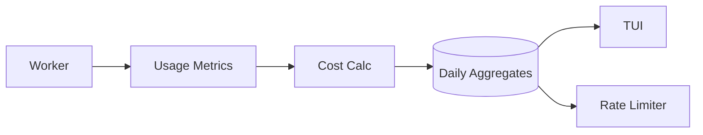
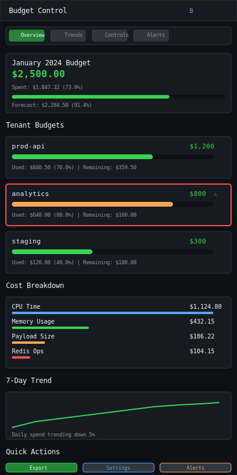

# Job Budgeting

| Priority | Domain | Dependencies | Risks | LoC Estimate | Complexity | Effort | Impact |
| --- | --- | --- | --- | --- | --- | --- | --- |
| High | Cost / Governance | Metrics export, tenant labels, RL integration | Misestimation, incentive gaming, PII | ~400–700 | Medium | 5–8 (Fib) | High |

## Executive Summary
Track and allocate cost per job/tenant using measured resource usage and a simple cost model. Define monthly budgets, show spend vs. budget, forecast burn, and apply optional enforcement (soft warnings → throttle) with clear governance.

> [!note]- **🗣️ CLAUDE'S THOUGHTS 💭**
> This is FinOps for job queues! The enforcement ladder is brilliant - warn before you throttle, throttle before you block. The cost model with CPU time, memory proxy, and payload size gives real insight into job efficiency. Imagine seeing that one tenant's ML jobs are burning through budget while another's lightweight tasks cost pennies. The integration with rate limiting turns budget into a dynamic throttling input - when you're over budget, your jobs slow down automatically!

## Motivation
- Bring financial accountability to shared queues.
- Prevent runaway costs from poorly behaving producers.
- Enable chargeback/showback and informed prioritization.

## Tech Plan
- Cost model:
  - Components: processing time (CPU), memory footprint proxy, payload size, Redis ops, egress hints.
  - Assign weights/cost rates; calibrate with benchmarks and environment multipliers.
- Data capture:
  - Worker reports per‑job timings and optional resource proxies; producer reports payload size.
  - Aggregate by tenant/queue/day; store in a compact table (ClickHouse optional).
- Budgets & policies:
  - Define budgets per tenant/queue; thresholds for warning/limit.
  - Enforcement ladder: warn producers → suggest backpressure → throttle low‑priority work; never drop without explicit policy.
- Integration:
  - Advanced Rate Limiting uses remaining budget as an input for weights.
  - Event Hooks for budget threshold notifications.
- TUI:
  - Budgets panel: current spend, forecast to month‑end, top cost drivers, and recent spikes; drill into job samples.

## User Stories + Acceptance Criteria
- As a platform owner, I can set budgets and see spend by tenant and queue.
- As a producer, I receive early warnings and suggestions if I'm overspending.
- Acceptance:
  - [ ] Cost calculation with pluggable weights; daily aggregates.
  - [ ] Budgets with warning/enforcement thresholds and notifications.
  - [ ] TUI shows spend, forecast, and top drivers.

## Definition of Done
Budget tracking and visibility across tenants with optional enforcement integrated with rate limiting and notifications.

## Test Plan
- Unit: cost calculation; aggregation correctness; forecasting.
- Integration: end‑to‑end with sample tenants; enforcement ladder behavior.
- Data quality: reconcile sampled job costs vs. totals within tolerance.

## Task List
- [ ] Define cost model + calibration suite
- [ ] Implement capture and aggregation
- [ ] Budgets + enforcement hooks
- [ ] TUI budgets panel + drilldown
- [ ] Docs + operator guidance



---

## Claude's Verdict ⚖️

This is the feature that transforms your queue from a "fire and forget" system into a financially accountable platform. It's Kubernetes resource quotas meets AWS Cost Explorer for job queues.

### Vibe Check

Nobody else is doing real-time job budgeting with enforcement. This puts financial discipline where it belongs - at the point of job creation. The forecasting and enforcement ladder prevents those horrifying month-end AWS bills.

### Score Card

**Traditional Score:**
- User Value: 8/10 (prevents cost disasters, enables chargeback)
- Dev Efficiency: 6/10 (moderate complexity with metrics integration)
- Risk Profile: 7/10 (cost miscalculation could throttle legitimate work)
- Strategic Fit: 9/10 (enables enterprise adoption, clear business value)
- Market Timing: 8/10 (cost optimization is critical post-ZIRP)
- **OFS: 7.75** → BUILD SOON

**X-Factor Score:**
- Holy Shit Factor: 7/10 ("It automatically throttles expensive jobs?")
- Meme Potential: 6/10 (screenshots of cost savings)
- Flex Appeal: 8/10 ("Our queue has built-in FinOps")
- FOMO Generator: 7/10 (cost control anxiety)
- Addiction Score: 6/10 (monthly budget reviews)
- Shareability: 7/10 (CFOs love cost visibility)
- **X-Factor: 6.3** → Strong business viral potential

### Conclusion

🌶️

This feature makes queue adoption a no-brainer for enterprise teams. The combination of real-time cost tracking, forecasting, and gentle enforcement creates unprecedented visibility into job economics. Ship this and watch teams optimize their job patterns naturally.

---

## Detailed Design Specification

### Overview

Job Budgeting transforms queue management from resource guesswork into precise financial planning. This system provides real-time cost tracking, intelligent forecasting, and graduated enforcement that prevents budget overruns while maintaining service quality. By integrating cost models with actual job execution metrics, teams gain unprecedented visibility into the true economics of their workloads.

The system operates on a simple principle: every job has a measurable cost based on CPU time, memory usage, payload size, and infrastructure overhead. These costs aggregate into tenant budgets that can warn, throttle, or block overspending through a graduated enforcement ladder that maintains system stability.

### TUI Design

#### Desktop View (Large Resolution)


The desktop interface provides comprehensive budget oversight through a three-panel layout optimized for financial analysis and control.

#### Mobile View (Small Resolution)


The mobile interface condenses budget information into tabbed cards optimized for quick status checks and emergency interventions.

### Cost Model Architecture

The cost calculation engine uses a weighted formula that captures the true resource consumption of each job:

```go
type CostModel struct {
    CPUTimeWeight    float64 `json:"cpu_time_weight"`     // $/second
    MemoryWeight     float64 `json:"memory_weight"`       // $/MB·second
    PayloadWeight    float64 `json:"payload_weight"`      // $/KB
    RedisOpsWeight   float64 `json:"redis_ops_weight"`    // $/operation
    NetworkWeight    float64 `json:"network_weight"`      // $/MB transferred
    BaseJobWeight    float64 `json:"base_job_weight"`     // Fixed cost per job
    EnvironmentMultiplier float64 `json:"env_multiplier"`  // Production vs staging
}

type JobCost struct {
    JobID          string    `json:"job_id"`
    TenantID       string    `json:"tenant_id"`
    QueueName      string    `json:"queue_name"`
    CPUTime        float64   `json:"cpu_time_seconds"`
    MemorySeconds  float64   `json:"memory_mb_seconds"`
    PayloadSize    int       `json:"payload_bytes"`
    RedisOps       int       `json:"redis_operations"`
    NetworkBytes   int       `json:"network_bytes"`
    TotalCost      float64   `json:"total_cost"`
    Timestamp      time.Time `json:"timestamp"`
}

func (c *CostModel) CalculateJobCost(metrics JobMetrics) JobCost {
    cost := c.BaseJobWeight +
            (metrics.CPUTime * c.CPUTimeWeight) +
            (metrics.MemoryMBSeconds * c.MemoryWeight) +
            (float64(metrics.PayloadBytes) / 1024 * c.PayloadWeight) +
            (float64(metrics.RedisOps) * c.RedisOpsWeight) +
            (float64(metrics.NetworkBytes) / 1024 / 1024 * c.NetworkWeight)

    return JobCost{
        JobID:         metrics.JobID,
        TenantID:      metrics.TenantID,
        QueueName:     metrics.QueueName,
        CPUTime:       metrics.CPUTime,
        MemorySeconds: metrics.MemoryMBSeconds,
        PayloadSize:   metrics.PayloadBytes,
        RedisOps:      metrics.RedisOps,
        NetworkBytes:  metrics.NetworkBytes,
        TotalCost:     cost * c.EnvironmentMultiplier,
        Timestamp:     time.Now(),
    }
}
```

### Budget Management System

Budgets operate on a hierarchical model supporting both tenant-level and queue-level allocations:

```go
type Budget struct {
    ID                string                 `json:"id"`
    TenantID          string                 `json:"tenant_id"`
    QueueName         string                 `json:"queue_name,omitempty"` // Empty = tenant budget
    Period            BudgetPeriod           `json:"period"`
    Amount            float64                `json:"amount"`
    WarningThreshold  float64                `json:"warning_threshold"`   // 0.75 = 75%
    ThrottleThreshold float64                `json:"throttle_threshold"`  // 0.90 = 90%
    BlockThreshold    float64                `json:"block_threshold"`     // 1.00 = 100%
    EnforcementPolicy EnforcementPolicy      `json:"enforcement_policy"`
    Notifications     []NotificationChannel  `json:"notifications"`
    CreatedAt         time.Time              `json:"created_at"`
    UpdatedAt         time.Time              `json:"updated_at"`
}

type BudgetPeriod struct {
    Type      string    `json:"type"`       // "monthly", "weekly", "daily"
    StartDate time.Time `json:"start_date"`
    EndDate   time.Time `json:"end_date"`
}

type EnforcementPolicy struct {
    WarnOnly        bool   `json:"warn_only"`
    ThrottleFactor  float64 `json:"throttle_factor"`  // 0.5 = 50% slower
    BlockNewJobs    bool   `json:"block_new_jobs"`
    AllowEmergency  bool   `json:"allow_emergency"`   // High priority bypass
}
```

### Enforcement Ladder Implementation

The enforcement system provides graduated responses that maintain system stability while controlling costs:

```go
type BudgetEnforcer struct {
    budgets     *BudgetManager
    rateLimiter *RateLimiter
    notifier    *NotificationService
    metrics     *MetricsCollector
}

func (e *BudgetEnforcer) CheckBudgetCompliance(tenantID string, queueName string) EnforcementAction {
    budget := e.budgets.GetBudget(tenantID, queueName)
    if budget == nil {
        return EnforcementAction{Type: "allow"}
    }

    currentSpend := e.budgets.GetCurrentSpend(tenantID, queueName)
    utilization := currentSpend / budget.Amount

    switch {
    case utilization >= budget.BlockThreshold && budget.EnforcementPolicy.BlockNewJobs:
        e.notifier.SendAlert(tenantID, "budget_exceeded", currentSpend, budget.Amount)
        return EnforcementAction{
            Type: "block",
            Message: fmt.Sprintf("Budget exceeded: $%.2f/$%.2f", currentSpend, budget.Amount),
        }

    case utilization >= budget.ThrottleThreshold:
        throttleFactor := budget.EnforcementPolicy.ThrottleFactor
        e.rateLimiter.ApplyBudgetThrottle(tenantID, queueName, throttleFactor)
        e.notifier.SendAlert(tenantID, "budget_throttle", currentSpend, budget.Amount)
        return EnforcementAction{
            Type: "throttle",
            Factor: throttleFactor,
            Message: fmt.Sprintf("Budget throttling: $%.2f/$%.2f (%.1f%% capacity)",
                   currentSpend, budget.Amount, throttleFactor*100),
        }

    case utilization >= budget.WarningThreshold:
        e.notifier.SendAlert(tenantID, "budget_warning", currentSpend, budget.Amount)
        return EnforcementAction{
            Type: "warn",
            Message: fmt.Sprintf("Budget warning: $%.2f/$%.2f (%.1f%%)",
                   currentSpend, budget.Amount, utilization*100),
        }

    default:
        return EnforcementAction{Type: "allow"}
    }
}
```

### Forecasting Engine

The forecasting system uses linear regression with seasonal adjustments to predict month-end spending:

```go
type BudgetForecaster struct {
    history     *CostHistoryDB
    seasonal    *SeasonalAdjustment
    trends      *TrendAnalyzer
}

type Forecast struct {
    TenantID           string    `json:"tenant_id"`
    PeriodEnd          time.Time `json:"period_end"`
    PredictedSpend     float64   `json:"predicted_spend"`
    ConfidenceInterval float64   `json:"confidence_interval"`
    BudgetUtilization  float64   `json:"budget_utilization"`
    DaysUntilOverrun   *int      `json:"days_until_overrun,omitempty"`
    Recommendation     string    `json:"recommendation"`
}

func (f *BudgetForecaster) GenerateForecast(tenantID string, budget *Budget) Forecast {
    // Get 30-day historical data
    history := f.history.GetDailySpend(tenantID, time.Now().AddDate(0, 0, -30), time.Now())

    // Calculate linear trend
    trend := f.trends.CalculateLinearTrend(history)

    // Apply seasonal adjustments (weekend dips, month-end spikes)
    seasonalFactor := f.seasonal.GetSeasonalFactor(time.Now())

    // Project to period end
    daysRemaining := int(budget.Period.EndDate.Sub(time.Now()).Hours() / 24)
    projectedSpend := trend.DailyRate * float64(daysRemaining) * seasonalFactor

    // Calculate confidence interval based on historical variance
    variance := f.calculateVariance(history)
    confidenceInterval := 1.96 * math.Sqrt(variance/float64(len(history))) // 95% CI

    forecast := Forecast{
        TenantID:           tenantID,
        PeriodEnd:          budget.Period.EndDate,
        PredictedSpend:     projectedSpend,
        ConfidenceInterval: confidenceInterval,
        BudgetUtilization:  projectedSpend / budget.Amount,
    }

    // Calculate overrun timeline
    if projectedSpend > budget.Amount {
        daysUntilOverrun := int((budget.Amount - f.getCurrentSpend(tenantID)) / trend.DailyRate)
        forecast.DaysUntilOverrun = &daysUntilOverrun
        forecast.Recommendation = f.generateRecommendation(forecast, budget)
    }

    return forecast
}
```

### Data Storage and Aggregation

Cost data is stored in a time-series optimized structure with efficient aggregation:

```sql
-- Daily cost aggregates table
CREATE TABLE daily_costs (
    tenant_id VARCHAR(50),
    queue_name VARCHAR(100),
    date DATE,
    total_jobs INTEGER,
    total_cost DECIMAL(10,4),
    cpu_cost DECIMAL(10,4),
    memory_cost DECIMAL(10,4),
    payload_cost DECIMAL(10,4),
    redis_cost DECIMAL(10,4),
    network_cost DECIMAL(10,4),
    avg_job_cost DECIMAL(10,4),
    max_job_cost DECIMAL(10,4),
    PRIMARY KEY (tenant_id, queue_name, date)
);

-- Budget definitions table
CREATE TABLE budgets (
    id UUID PRIMARY KEY,
    tenant_id VARCHAR(50),
    queue_name VARCHAR(100),
    period_type VARCHAR(20),
    period_start DATE,
    period_end DATE,
    amount DECIMAL(10,2),
    warning_threshold DECIMAL(3,2),
    throttle_threshold DECIMAL(3,2),
    block_threshold DECIMAL(3,2),
    enforcement_policy JSONB,
    created_at TIMESTAMP,
    updated_at TIMESTAMP
);

-- Indexes for fast lookups
CREATE INDEX idx_daily_costs_tenant_date ON daily_costs (tenant_id, date DESC);
CREATE INDEX idx_budgets_tenant_period ON budgets (tenant_id, period_start, period_end);
```

### Integration with Rate Limiting

Budget information feeds directly into the rate limiting system to provide dynamic throttling:

```go
type BudgetAwareRateLimiter struct {
    baseLimiter    *RateLimiter
    budgetEnforcer *BudgetEnforcer
    weights        map[string]float64 // tenant -> weight multiplier
}

func (b *BudgetAwareRateLimiter) GetRateLimit(tenantID string, queueName string) RateLimit {
    baseLimit := b.baseLimiter.GetRateLimit(tenantID, queueName)

    // Check budget compliance
    enforcement := b.budgetEnforcer.CheckBudgetCompliance(tenantID, queueName)

    switch enforcement.Type {
    case "block":
        return RateLimit{
            TokensPerSecond: 0,
            BurstSize:       0,
            BlockReason:     enforcement.Message,
        }

    case "throttle":
        return RateLimit{
            TokensPerSecond: baseLimit.TokensPerSecond * enforcement.Factor,
            BurstSize:       int(float64(baseLimit.BurstSize) * enforcement.Factor),
            ThrottleReason:  enforcement.Message,
        }

    default:
        return baseLimit
    }
}
```

### User Scenarios

#### Scenario 1: Platform Owner Setting Up Budgets

Sarah, a platform engineer, needs to establish cost controls for her team's job queue:

1. Opens Budget panel in TUI with `B` key
2. Navigates to Controls tab
3. Sets monthly budget for `prod-api` tenant: $1200
4. Configures enforcement ladder: warn at 75%, throttle at 90%, block at 100%
5. Adds email notifications for budget events
6. Reviews forecast showing current burn rate will exceed budget in 10 days
7. Adjusts budget or plans optimization work accordingly

#### Scenario 2: Developer Receiving Budget Warnings

Mike, a backend developer, receives automated warnings about approaching budget limits:

1. Gets Slack notification: "analytics tenant at 80% of monthly budget"
2. Opens TUI budget panel to investigate
3. Sees that ML training jobs are consuming 60% of total budget
4. Drills down into top cost drivers to identify specific expensive jobs
5. Reviews job patterns and optimizes algorithm to reduce CPU time
6. Monitors daily cost trend to confirm optimization effectiveness

#### Scenario 3: SRE Managing Budget Overrun

Jessica, an SRE, needs to handle an emergency budget overrun:

1. Receives alert that `staging` tenant exceeded budget threshold
2. Opens budget panel, sees throttling is active (50% capacity)
3. Reviews recent job history to identify cost spike cause
4. Temporarily increases budget to restore full capacity
5. Implements emergency job filtering to block expensive job types
6. Schedules post-mortem to prevent future overruns

### Technical Implementation

#### Core Architecture

```go
// Main budget service
type BudgetService struct {
    db          *sql.DB
    costEngine  *CostCalculationEngine
    enforcer    *BudgetEnforcer
    forecaster  *BudgetForecaster
    notifier    *NotificationService
    rateLimiter *BudgetAwareRateLimiter
}

// Cost calculation pipeline
type CostCalculationEngine struct {
    model       *CostModel
    aggregator  *CostAggregator
    calibrator  *ModelCalibrator
}

// Real-time budget tracking
type BudgetTracker struct {
    currentSpend map[string]float64  // tenant -> current spend
    budgets      map[string]*Budget  // tenant -> budget
    forecasts    map[string]*Forecast // tenant -> forecast
    mutex        sync.RWMutex
}
```

### Keyboard Shortcuts

| Key | Action | Context |
|-----|--------|---------|
| `B` | Open Budget panel | Global |
| `Tab` | Switch between Overview/Trends/Controls/Alerts | Budget panel |
| `E` | Toggle enforcement for selected tenant | Budget panel |
| `F` | Show detailed forecast | Budget panel |
| `R` | Generate cost report | Budget panel |
| `+/-` | Increase/decrease budget amount | Controls tab |
| `Enter` | Edit selected budget | Controls tab |
| `D` | Drill down into cost drivers | Overview tab |
| `A` | View all alerts | Alerts tab |
| `S` | Save budget changes | Controls tab |
| `?` | Show help overlay | Budget panel |

### Performance Considerations

- **Aggregation Efficiency**: O(1) lookups for current spend using in-memory cache with periodic DB sync
- **Forecasting Complexity**: O(n log n) for trend analysis where n is historical data points (typically 30-90 days)
- **Enforcement Latency**: < 1ms budget checks using pre-calculated thresholds and cached values
- **Storage Growth**: ~100MB per million jobs with daily aggregation and 1-year retention
- **Real-time Updates**: WebSocket-based updates for budget panels with 1-second refresh rate

### Monitoring and Observability

Key metrics to track system health and adoption:

```go
type BudgetMetrics struct {
    // Usage metrics
    ActiveBudgets        int64   `metric:"active_budgets_total"`
    BudgetChecksPerSec   float64 `metric:"budget_checks_per_second"`
    CostCalculationTime  float64 `metric:"cost_calculation_duration_ms"`

    // Budget compliance
    BudgetWarnings       int64   `metric:"budget_warnings_total"`
    BudgetThrottles      int64   `metric:"budget_throttles_total"`
    BudgetBlocks         int64   `metric:"budget_blocks_total"`

    // Accuracy metrics
    ForecastAccuracy     float64 `metric:"forecast_accuracy_percent"`
    CostModelDrift       float64 `metric:"cost_model_drift_percent"`

    // Financial impact
    TotalSpendTracked    float64 `metric:"total_spend_tracked_dollars"`
    CostSavingsFromThrottling float64 `metric:"cost_savings_dollars"`
}
```

### Failure Modes and Recovery

The system is designed to fail safely without blocking job processing:

1. **Budget Service Unavailable**: Falls back to allowing all jobs with warning logs
2. **Cost Calculation Errors**: Uses fallback flat-rate pricing model
3. **Database Connection Loss**: Continues with in-memory cache until reconnection
4. **Forecasting Failures**: Shows static warnings based on current utilization
5. **Notification Failures**: Logs alerts locally and retries with exponential backoff

### Future Enhancements

- **Multi-cloud Cost Integration**: Pull actual AWS/GCP costs to calibrate model
- **Predictive Auto-scaling**: Use budget forecasts to predict capacity needs
- **Cost Optimization Suggestions**: ML-powered recommendations for job efficiency
- **Chargeback Integration**: Export to accounting systems for interdepartmental billing
- **Budget Templates**: Pre-configured budgets for common tenant patterns
- **Cost Anomaly Detection**: Alert on unusual spending patterns beyond budget thresholds
- **Granular Queue Budgets**: Sub-queue budget allocation for fine-grained control
- **Historical Cost Analysis**: Detailed reports showing cost trends over quarters/years
---
feature: job-budgeting
dependencies:
  hard:
    - metrics_system
    - tenant_labels
  soft:
    - admin_api
    - multi_tenant_isolation
    - advanced_rate_limiting
enables:
  - cost_control
  - resource_governance
  - chargeback
provides:
  - cost_tracking
  - budget_enforcement
  - spending_alerts
  - usage_reports
---