# Job Genealogy Navigator

| Priority | Domain | Dependencies | Risks | LoC Estimate | Complexity | Effort | Impact |
| --- | --- | --- | --- | --- | --- | --- | --- |
| Medium-High | Visualization / Debugging | Graph storage, relationship tracking, TUI rendering | Graph complexity, performance at scale | ~600–900 | Medium-High | 5 (Fib) | High |

## Executive Summary
Interactive visualization of job family trees showing parent-child relationships, retry chains, spawned subjobs, and failure cascades. Navigate complex job genealogies in the TUI to understand causality and impact.

> [!note]- **🗣️ CLAUDE'S THOUGHTS 💭**
> This is brilliant debugging visualization! Job genealogies are exactly what's missing from most queue systems. The ASCII art tree with collapsible nodes is genius - imagine expanding a retry chain to see the exact failure progression. The "blame mode" and "impact mode" are killer features for root cause analysis. Consider adding edge weighting to show job size or processing time. Also, the time-lapse animation could reveal bottlenecks that aren't obvious in static views.

## Motivation
- Understand cascade effects when parent jobs fail
- Trace root causes through retry and respawn chains
- Visualize workflow dependencies without external tools
- Debug complex multi-job transactions

## Tech Plan
- Relationship Tracking:
  - Capture parent_id, spawn_reason, relationship_type in job metadata
  - Relationship types: retry, spawn, fork, callback, compensation
  - Bidirectional indexes: parent→children, child→ancestors
  - Store in Redis sorted sets for efficient traversal
- Graph Operations:
  - Build family tree from any job (ancestors + descendants)
  - Find common ancestors between failed jobs
  - Calculate impact radius (all affected descendants)
  - Detect cycles and anomalies
- TUI Visualization:
  - ASCII art tree with box-drawing characters
  - Collapsible/expandable nodes
  - Color coding: green (success), red (failed), yellow (processing), gray (pending)
  - Navigation: arrow keys to traverse, enter to inspect, 'f' to focus subtree
  - Multiple layout algorithms: top-down tree, left-right timeline, radial
- Analysis Features:
  - "Blame" mode: trace failure to root cause
  - "Impact" mode: show all affected descendants
  - Pattern detection: identify recurring failure genealogies
  - Time-lapse: animate tree growth over time
- Integration:
  - Auto-capture relationships during enqueue/retry/spawn
  - Link with Time Travel Debugger for replay
  - Export as DOT/Mermaid for external visualization

## User Stories + Acceptance Criteria
- As a developer, I can see the complete family tree of any job
- As an SRE, I can trace cascading failures to their root cause
- As an analyst, I can identify patterns in job relationships over time
- Acceptance:
  - [ ] Complete genealogy captured automatically
  - [ ] Tree renders smoothly for 100+ node families
  - [ ] Navigation responsive with <50ms updates
  - [ ] Relationship data automatically pruned after TTL

## Definition of Done
Job genealogy fully tracked and visualized in TUI with tree navigation, multiple layout modes, and analysis tools. Performance validated with large family trees.

## Test Plan
- Unit: Graph algorithms, cycle detection, tree layout
- Integration: Multi-generation job families with various relationships
- Performance: Render and navigate 1000+ node trees
- UX: Validate navigation patterns with user testing

## Task List
- [ ] Design relationship schema
- [ ] Implement relationship capture
- [ ] Build graph traversal algorithms
- [ ] Create ASCII tree renderer
- [ ] Add navigation controls
- [ ] Implement analysis modes
- [ ] Performance optimization

```mermaid
graph TD
  A[Job A: Original] -->|retry| B[Job A: Retry 1]
  B -->|retry| C[Job A: Retry 2]
  C -->|success| D[✓]

  A -->|spawn| E[Job B: Child 1]
  A -->|spawn| F[Job C: Child 2]

  E -->|spawn| G[Job D: Grandchild]
  F -->|fail| H[✗]
  F -->|compensate| I[Job E: Cleanup]

  style A fill:#88f
  style C fill:#8f8
  style H fill:#f88
  style I fill:#ff8
```



---

## Claude's Verdict ⚖️

Job genealogy visualization is the missing piece that transforms queue debugging from archaeology to science. This isn't just another dashboard - it's the family tree that reveals why your system behaves the way it does.

### Vibe Check

This is like git's commit graph but for job relationships. Nobody else has this level of causality visualization in a queue system. The tree navigation with "blame mode" puts this in a league of its own for debugging complex workflows.

### Score Card

**Traditional Score:**
- User Value: 8/10 (critical for debugging complex job relationships)
- Dev Efficiency: 5/10 (complex graph algorithms and ASCII rendering)
- Risk Profile: 7/10 (mainly UI complexity, data model is straightforward)
- Strategic Fit: 9/10 (perfect fit for debugging and observability strategy)
- Market Timing: 6/10 (debugging tools always valuable, not urgent)
- **OFS: 7.25** → BUILD SOON

**X-Factor Score:**
- Holy Shit Factor: 7/10 ("My jobs have a family tree?!")
- Meme Potential: 6/10 (screenshot-worthy genealogy fails)
- Flex Appeal: 8/10 ("Our queue shows job DNA")
- FOMO Generator: 5/10 (other queues look primitive after this)
- Addiction Score: 7/10 (addictive for debugging sessions)
- Shareability: 7/10 (demo gold, especially failure cascades)
- **X-Factor: 6.1** → Strong viral potential among devs

### Conclusion

[🌶️]

This feature transforms debugging from guesswork to genealogy science. The ASCII art family trees will become iconic screenshots in the queue monitoring space.

---

## Detailed Design Specification

### Overview

The Job Genealogy Navigator transforms complex job relationships from abstract data into intuitive visual family trees. This feature becomes the primary tool for understanding causality in distributed job processing systems, making it trivial to trace failures to their root causes and understand the full impact of job cascades. By combining graph theory with elegant ASCII art visualization, it provides the missing link between individual job monitoring and system-wide workflow understanding.

The navigator serves three primary use cases: debugging failures through ancestral analysis, predicting impact through descendant visualization, and identifying patterns in job relationship structures over time. Unlike traditional monitoring that treats jobs as isolated events, this tool reveals the hidden DNA of your job processing system.

### TUI Design

#### Desktop View (Large Resolution)


The desktop layout uses a three-panel design optimized for complex genealogy exploration.

#### Mobile View (Small Resolution)


Mobile layout stacks panels vertically with collapsible sections for efficient navigation on narrow terminals.

### Tree Visualization Architecture

#### ASCII Art Tree Rendering

The core visualization uses Unicode box-drawing characters to create clean, readable family trees:

```
┌─ Job-001: user_signup [SUCCESS]
├─┬─ Job-002: send_welcome [RETRY-1]
│ └─── Job-003: send_welcome [SUCCESS]
├─── Job-004: update_analytics [SUCCESS]
└─┬─ Job-005: provision_account [FAILED]
  ├─── Job-006: rollback_user [SUCCESS]
  └─── Job-007: alert_support [PROCESSING]
```

**Visual Encoding:**
- `┌─` Root node indicator
- `├─` Sibling branch
- `└─` Last child
- `┬─` Parent with children
- `│` Continuation line
- Color coding: Green (SUCCESS), Red (FAILED), Yellow (PROCESSING), Gray (QUEUED)

#### Interactive Navigation

**Tree Expansion/Collapse:**
- `+` Collapsed subtree with child count
- `-` Expanded subtree showing all children
- `Enter` Toggle expansion state
- `*` Expand all descendants
- `/` Collapse all descendants

**Focus Modes:**
- **Full Tree**: Show complete genealogy
- **Ancestors Only**: Trace backwards to root causes
- **Descendants Only**: Show forward impact
- **Blame Path**: Highlight path from failure to root cause
- **Impact Zone**: Highlight all affected descendants

#### Layout Algorithms

**1. Top-Down Tree (Default)**
- Root jobs at top, children below
- Optimal for understanding failure cascades
- Natural left-to-right time progression

**2. Left-Right Timeline**
- Jobs arranged chronologically left to right
- Parent-child relationships shown with connecting lines
- Best for temporal analysis

**3. Radial Layout**
- Root job at center, relationships radiating outward
- Compact for large families with many generations
- Good for pattern recognition

**4. Compact View**
- Minimized vertical spacing for large genealogies
- Single-line job representations
- Quick overview mode

### Relationship Tracking System

#### Data Model

```go
type JobRelationship struct {
    ParentID       string    `json:"parent_id"`
    ChildID        string    `json:"child_id"`
    RelationType   string    `json:"relationship_type"`
    SpawnReason    string    `json:"spawn_reason"`
    Timestamp      time.Time `json:"timestamp"`
    Metadata       map[string]interface{} `json:"metadata"`
}

type JobGenealogy struct {
    RootID         string               `json:"root_id"`
    Ancestors      []string             `json:"ancestors"`
    Descendants    []string             `json:"descendants"`
    Relationships  []JobRelationship    `json:"relationships"`
    GenerationMap  map[int][]string     `json:"generation_map"`
    MaxDepth       int                  `json:"max_depth"`
}
```

#### Relationship Types

**Primary Relationships:**
- `retry` - Job is retry of parent (same payload, incremented attempt)
- `spawn` - Child job created by parent during processing
- `fork` - Parallel processing split (same payload, different partition)
- `callback` - Callback job triggered by parent completion
- `compensation` - Cleanup/rollback job triggered by parent failure
- `continuation` - Sequential processing step in workflow
- `batch_member` - Part of same batch operation

**Metadata Capture:**
- Spawn reason (timeout, failure, business logic)
- Processing context (attempt number, priority inheritance)
- Timing information (spawn delay, processing duration)
- Payload similarity score (for detecting patterns)

#### Graph Operations

**Tree Construction:**
```go
func BuildFamilyTree(rootJobID string) (*JobGenealogy, error) {
    ancestors := traverseAncestors(rootJobID)
    descendants := traverseDescendants(rootJobID)
    relationships := gatherRelationships(ancestors, descendants)

    return &JobGenealogy{
        RootID: findTrueRoot(ancestors),
        Ancestors: ancestors,
        Descendants: descendants,
        Relationships: relationships,
        GenerationMap: buildGenerationMap(relationships),
        MaxDepth: calculateMaxDepth(relationships),
    }, nil
}
```

**Pattern Detection:**
- Identify recurring failure genealogies
- Detect unusual relationship patterns
- Find jobs that frequently spawn failures
- Calculate family size distributions

**Impact Analysis:**
```go
func CalculateImpactRadius(failedJobID string) ImpactAnalysis {
    descendants := getAllDescendants(failedJobID)
    return ImpactAnalysis{
        DirectChildren: countDirectChildren(failedJobID),
        TotalDescendants: len(descendants),
        FailedDescendants: countFailedJobs(descendants),
        ProcessingCost: calculateTotalCost(descendants),
        TimeSpan: calculateTimeSpan(descendants),
    }
}
```

### User Workflows

#### Workflow 1: Debugging Cascade Failure

1. **Entry Point**: Notice unusual DLQ spike in dashboard
2. **Investigation**: Navigate to Genealogy tab, search failed jobs
3. **Tree View**: Select failed job, see full family tree
4. **Pattern Analysis**: Notice multiple children failing with same error
5. **Root Cause**: Use "blame mode" to trace to original parent
6. **Impact Assessment**: Switch to "impact mode" to see full damage
7. **Resolution**: Fix root cause, potentially retry affected descendants

#### Workflow 2: Workflow Design Review

1. **Planning**: Before deploying new job type that spawns children
2. **Simulation**: Use genealogy to understand expected family structure
3. **Monitoring**: After deployment, verify actual genealogies match expectations
4. **Optimization**: Identify bottlenecks in spawn patterns
5. **Scaling**: Predict resource needs based on family growth patterns

#### Workflow 3: SRE Incident Response

1. **Alert**: Monitoring detects job processing slowdown
2. **Quick Assessment**: Check genealogy for unusual family sizes
3. **Impact Scope**: Use tree view to understand affected workflows
4. **Mitigation**: Identify and pause problematic root jobs
5. **Recovery**: Plan cleanup strategy based on relationship graph

### Technical Implementation

#### Core Components

```go
type GenealogyNavigator struct {
    TreeRenderer    *ASCIITreeRenderer
    GraphStorage    GraphStore
    RelationTracker *RelationshipTracker
    ViewState       *NavigationState
    LayoutEngine    *TreeLayoutEngine
}

type ASCIITreeRenderer struct {
    theme          *Theme
    boxChars       BoxDrawingChars
    colorScheme    ColorScheme
    viewport       *Viewport
    scrollState    *ScrollState
}

type NavigationState struct {
    CurrentJob     string
    ViewMode       ViewMode  // Full, Ancestors, Descendants, Blame, Impact
    LayoutMode     LayoutMode // TopDown, Timeline, Radial, Compact
    ExpandedNodes  map[string]bool
    FocusPath      []string
    FilterState    *FilterState
}
```

#### Performance Optimizations

**Lazy Loading:**
- Load relationship data on-demand as nodes expand
- Cache frequently accessed genealogies
- Background prefetch for likely navigation paths

**Efficient Graph Traversal:**
- Use Redis sorted sets for O(log n) parent/child lookups
- Implement bidirectional indexes for fast ancestry queries
- Cache computed genealogies with TTL

**Rendering Performance:**
- Virtual scrolling for large trees (1000+ nodes)
- Incremental rendering - only redraw changed regions
- Background layout computation for complex trees

**Memory Management:**
```go
type GenealogyCache struct {
    trees       *lru.Cache  // Recently accessed trees
    relationships *lru.Cache  // Relationship data
    layouts     *lru.Cache  // Computed layouts
    maxSize     int
}
```

#### Storage Schema

**Redis Data Structures:**

```redis
# Parent -> Children index
queue:genealogy:children:{parent_id} -> ZSET {child_id: timestamp}

# Child -> Parents index (for retry chains)
queue:genealogy:parents:{child_id} -> ZSET {parent_id: timestamp}

# Relationship metadata
queue:genealogy:relations:{parent_id}:{child_id} -> HASH {
  type: "retry",
  reason: "timeout",
  metadata: "{...}"
}

# Genealogy cache
queue:genealogy:trees:{root_id} -> STRING (JSON serialized tree)
```

### Keyboard Shortcuts

| Key | Action | Context |
|-----|--------|---------|
| `j/k` | Navigate up/down tree | Tree view |
| `h/l` | Collapse/expand node | Node selected |
| `H/L` | Collapse/expand all children | Node selected |
| `Enter` | Focus on selected job | Tree view |
| `Tab` | Cycle through view modes | Any |
| `1-4` | Switch layout mode | Any |
| `f` | Filter by job status | Any |
| `r` | Refresh genealogy | Any |
| `b` | Blame mode (trace to root) | Failed job |
| `i` | Impact mode (show descendants) | Any |
| `t` | Time-lapse animation | Any |
| `/` | Search jobs in tree | Any |
| `g/G` | Go to top/bottom | Tree view |
| `?` | Show help overlay | Any |

### Performance Considerations

**Time Complexity:**
- Tree construction: O(V + E) where V = jobs, E = relationships
- Node expansion: O(log n) with Redis sorted sets
- Pattern detection: O(V²) for similarity analysis
- Layout computation: O(V log V) for optimal positioning

**Memory Usage:**
- Base tree structure: ~100 bytes per job
- Relationship metadata: ~50 bytes per edge
- Layout cache: ~20 bytes per positioned node
- Total for 1000-node tree: ~170KB

**Scalability Limits:**
- Interactive performance: Up to 10,000 nodes
- Layout computation: Up to 5,000 nodes real-time
- Background analysis: Unlimited with pagination

### Monitoring and Observability

**Metrics to Track:**
- Average genealogy depth per root job
- Family size distribution (histogram)
- Relationship type frequencies
- Tree layout computation times
- Cache hit rates for genealogy queries

**Logs and Traces:**
- Relationship creation events
- Genealogy query patterns
- Performance bottlenecks in tree rendering
- User navigation patterns in complex trees

### Failure Modes and Recovery

**Data Consistency:**
- Handle orphaned relationships from job cleanup
- Detect and repair circular relationships
- Graceful degradation when genealogy data incomplete

**UI Resilience:**
- Fallback to simple list view if tree rendering fails
- Progressive disclosure for oversized genealogies
- Error boundaries around genealogy computations

**Performance Degradation:**
- Automatic layout simplification for large trees
- Background rendering with progress indicators
- Pagination for genealogies exceeding memory limits

### Future Enhancements

- **Machine Learning Integration**: Predict job spawn patterns and failure cascades
- **Export Capabilities**: Generate graphviz/mermaid for external tools
- **Collaborative Annotations**: Team members can comment on genealogies
- **Time-Based Filtering**: Show genealogy evolution over time windows
- **Cross-Queue Relationships**: Track jobs that span multiple queue systems
- **Performance Correlation**: Overlay execution times on genealogy structure
- **Integration Testing**: Generate test suites based on successful genealogies
---
feature: job-genealogy-navigator
dependencies:
  hard:
    - graph_storage
    - relationship_tracking
    - tui_framework
  soft:
    - admin_api
    - distributed_tracing
enables:
  - debugging_workflows
  - impact_analysis
  - root_cause_analysis
provides:
  - tree_visualization
  - relationship_graph
  - blame_mode
  - ancestry_tracking
---