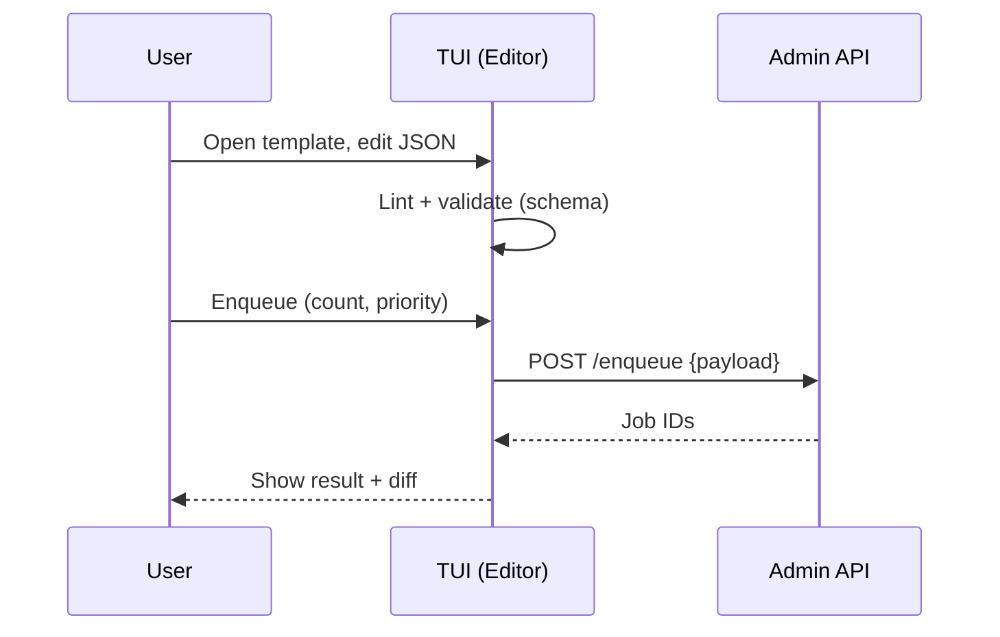
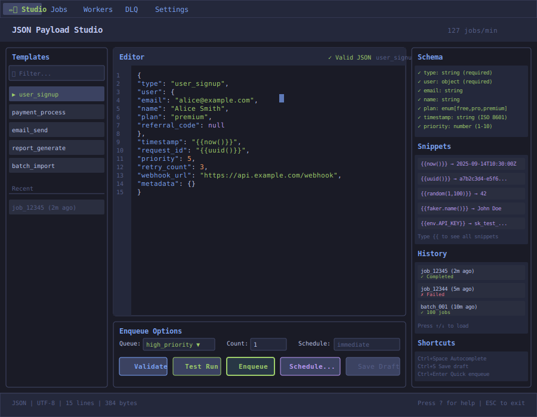
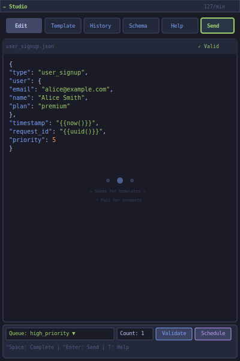

# JSON Payload Studio

| Priority | Domain | Dependencies | Risks | LoC Estimate | Complexity | Effort | Impact |
| --- | --- | --- | --- | --- | --- | --- | --- |
| High | TUI UX / Producer | Admin API enqueue, templates, schema validation | PII leakage, bad payloads, UX complexity | ~300–500 | Medium | 5 (Fib) | High |

## Executive Summary
An in‑TUI JSON editor to author, validate, and enqueue job payloads. Includes templates, snippets, schema validation, scheduling (run‑at/cron), and pretty diff/peek integration for rapid iteration.

> [!note]- **🗣️ CLAUDE'S THOUGHTS 💭**
> YES! This is Postman for job queues. The template system with snippets is brilliant - imagine `{{now()}}`, `{{uuid()}}`, `{{faker.name()}}`. Schema validation prevents those 3am "wrong payload format" incidents. The cron scheduling is killer for recurring jobs. Consider adding a "test run" mode that enqueues to a sandbox queue. Also, payload history would be clutch - "use payload from 3 runs ago".

## Motivation
- Speed up development and debugging by removing context switches to external editors and scripts.
- Promote consistent payloads with reusable templates and schema hints.
- Enable safe scheduled submissions for backfills and recurring work.

## Tech Plan
- Editor: textinput/viewport hybrid with syntax highlight (lightweight), bracket matching, and JSON linting.
- Templates: load from `config/templates/*.json` or inline; snippet expansion (e.g., `now()`, `uuid()`).
- Validation: optional JSON Schema (draft 7) validation per queue/template; show errors inline.
- Enqueue: `e` submits to selected queue; `E` opens count + schedule options (run‑at ISO8601, optional cron spec).
- Safety: size/field caps; strip secrets from UI logs; confirm in non‑test envs.
- Integration: peek last enqueued sample; diff between current editor buffer and last run.

## User Stories + Acceptance Criteria
- As a developer, I can open a template, edit, validate, and enqueue with one keystroke.
- As an SRE, I can schedule a safe backfill at off‑peak with guardrails.
- As a reviewer, I can see a redacted preview and confirm before enqueuing to prod.
- Acceptance:
  - [ ] JSON lint and schema errors highlighted with line/col.
  - [ ] Template list with fuzzy search and quick preview.
  - [ ] Enqueue supports count, priority, delay/run‑at, and optional cron.
  - [ ] Diff/peek integration shows exactly what was sent.

## Definition of Done
Editor with templates, validation, and enqueue/schedule flow; docs with examples and safeguards; updated help overlay.

## Test Plan
- Unit: schema validation adapter, snippet expansion, schedule parser.
- Integration: enqueue to test queue with varying sizes; error handling.
- UX: manual runs to verify keybindings and guardrails.

## Task List
- [ ] Implement editor widget + linting
- [ ] Template loader + snippets
- [ ] Schema validation + error UI
- [ ] Enqueue + schedule flow
- [ ] Diff/peek integration
- [ ] Docs + screenshots



---

## Claude's Verdict ⚖️

This is the feature that makes developers actually WANT to use your queue. It's the difference between "ugh, I have to test this job" and "let me quickly try this payload."

### Vibe Check

Postman revolutionized API testing. This could do the same for job queues. Nobody else has this level of payload ergonomics in a terminal.

### Score Card

**Traditional Score:**
- User Value: 9/10 (daily developer joy)
- Dev Efficiency: 6/10 (editor complexity)
- Risk Profile: 7/10 (validation prevents disasters)
- Strategic Fit: 8/10 (developer experience differentiator)
- Market Timing: 7/10 (devs expect good tooling)
- **OFS: 7.65** → BUILD SOON

**X-Factor Score:**
- Holy Shit Factor: 6/10 ("A JSON studio in my terminal?")
- Meme Potential: 5/10 (screenshot beautiful payloads)
- Flex Appeal: 7/10 ("Our queue has Postman built in")
- FOMO Generator: 5/10 (makes other queues look primitive)
- Addiction Score: 8/10 (used every dev session)
- Shareability: 6/10 (demo gold)
- **X-Factor: 5.2** → Strong viral potential

### Conclusion

[🌶️]

This is spicy DX. The combination of templates + validation + scheduling in a TUI is unmatched. Ship this and watch developer productivity soar.

---

## Detailed Design Specification

### Overview

The JSON Payload Studio transforms job creation from a chore into a delightful experience. This in-TUI JSON editor combines the power of a modern IDE with the ergonomics of Postman, all within your terminal. With intelligent templates, real-time validation, dynamic snippets, and visual scheduling, it becomes the primary interface for developers to interact with your queue.

### TUI Design



**Mobile-Optimized Version (V2):**



#### Layout Components

The studio uses a three-column layout optimized for rapid payload creation and testing:

**1. Left Panel: Template Browser (20% width)**
- **Search/Filter Bar**: Fuzzy search across template names and descriptions
- **Template List**:
  - Pre-built templates from `config/templates/*.json`
  - User-created templates stored locally
  - Favorites marked with star icon
  - Visual indicators for template categories (user, payment, email, batch)
- **Recent Jobs Section**:
  - Last 10 enqueued payloads with timestamps
  - Success/failure status indicators
  - One-click reload into editor

**2. Center Panel: JSON Editor (55% width)**
- **Editor Header**:
  - Current file/template name
  - Real-time validation status (✓ Valid / ⚠ Errors)
  - Save indicator and keyboard mode display
- **Line Numbers**: Classic editor style with error indicators
- **Syntax-Highlighted Editor**:
  - Full JSON syntax highlighting (strings green, keys blue, numbers orange)
  - Bracket matching and auto-indentation
  - Snippet expansion with `{{` trigger
  - Real-time linting with squiggly underlines
  - Multi-cursor support for batch edits
- **Enqueue Options Panel**:
  - Queue selector with dropdown
  - Count field for batch operations
  - Schedule selector (immediate/delayed/cron)
  - Action buttons: Validate, Test Run, Enqueue, Schedule, Save Draft

**3. Right Panel: Helpers (25% width)**
- **Schema Validator**:
  - Live schema validation against queue-specific schemas
  - Check marks for valid fields
  - Detailed error messages for violations
  - Type hints and enum values
- **Snippet Library**:
  - Dynamic snippets with live preview
  - Common functions: `{{now()}}`, `{{uuid()}}`, `{{random()}}`
  - Faker integration: `{{faker.name()}}`, `{{faker.email()}}`
  - Environment variables: `{{env.API_KEY}}`
  - Custom user snippets
- **History Browser**:
  - Recently enqueued jobs with status
  - One-click reload previous payloads
  - Diff view against current editor
- **Keyboard Shortcuts**: Context-aware help

### Keyboard Navigation

| Key | Action | Context |
|-----|--------|---------|
| `Tab` | Switch between panels | Global |
| `Ctrl+T` | Open template browser | Any |
| `Ctrl+N` | New blank payload | Any |
| `Ctrl+O` | Open from history | Any |
| `Ctrl+S` | Save as template | Editor |
| `Ctrl+Space` | Trigger autocomplete | Editor |
| `{{` | Open snippet menu | Editor |
| `Ctrl+/` | Toggle comment | Editor |
| `Ctrl+D` | Duplicate line | Editor |
| `Alt+↑/↓` | Move line up/down | Editor |
| `Ctrl+]` | Indent selection | Editor |
| `Ctrl+[` | Outdent selection | Editor |
| `Ctrl+F` | Find in editor | Editor |
| `Ctrl+H` | Find and replace | Editor |
| `F2` | Rename key globally | Editor |
| `Ctrl+Enter` | Quick enqueue | Any |
| `Ctrl+Shift+Enter` | Enqueue with options | Any |
| `Ctrl+V` | Validate payload | Any |
| `Ctrl+R` | Test run (dry mode) | Any |
| `j/k` | Navigate templates | Template browser |
| `Enter` | Load template | Template browser |
| `/` | Search templates | Template browser |
| `ESC` | Exit studio | Any |

### Advanced Features

#### 1. Smart Templates

Templates are more than static JSON files - they're intelligent starting points:

```json
{
  "name": "user_signup",
  "description": "New user registration template",
  "category": "user",
  "schema": "schemas/user_signup.json",
  "defaults": {
    "priority": 5,
    "retry_count": 3
  },
  "payload": {
    "type": "user_signup",
    "user": {
      "email": "{{input:email}}",
      "name": "{{input:name}}",
      "plan": "{{select:free,pro,premium}}"
    },
    "timestamp": "{{now()}}",
    "request_id": "{{uuid()}}"
  },
  "variables": {
    "email": {
      "type": "string",
      "format": "email",
      "description": "User's email address"
    }
  }
}
```

Features:
- **Input prompts**: `{{input:field}}` triggers a modal for user input
- **Select lists**: `{{select:opt1,opt2}}` shows a dropdown
- **Conditional fields**: Show/hide based on other values
- **Validation rules**: Per-field validation beyond schema
- **Default values**: Smart defaults based on context

#### 2. Schema-Driven Intelligence

The editor becomes context-aware through JSON Schema integration:

- **Autocomplete**: Suggests valid keys and values based on schema
- **Type coercion**: Automatically quotes strings, validates numbers
- **Enum hints**: Shows allowed values for enum fields
- **Required fields**: Highlights missing required properties
- **Format validation**: Checks emails, URLs, dates, UUIDs
- **Custom validators**: Regex patterns, min/max constraints

#### 3. Snippet System

Dynamic snippets that execute at enqueue time:

**Built-in Functions**:
- `{{now()}}` - Current ISO 8601 timestamp
- `{{now(+1h)}}` - Timestamp with offset
- `{{uuid()}}` - Generate UUID v4
- `{{random(min, max)}}` - Random number
- `{{sequence()}}` - Auto-incrementing counter
- `{{env.VAR_NAME}}` - Environment variable

**Faker Integration**:
- `{{faker.name()}}` - Random full name
- `{{faker.email()}}` - Valid email address
- `{{faker.phone()}}` - Phone number
- `{{faker.company()}}` - Company name
- `{{faker.address()}}` - Street address
- `{{faker.lorem(20)}}` - Lorem ipsum text

**Custom Snippets**:
Users can define custom snippets in `~/.queue-studio/snippets.json`:
```json
{
  "customer_id": "cust_{{random(10000, 99999)}}",
  "api_version": "2024-01-01",
  "region": "{{env.AWS_REGION:-us-east-1}}"
}
```

#### 4. Visual Scheduling

The scheduling interface makes complex schedules intuitive:

**Immediate Mode**: Default, enqueues right away

**Delayed Mode**: Visual time picker
- Relative: "in 5 minutes", "in 2 hours"
- Absolute: Calendar and time picker
- Natural language: "tomorrow at 3pm"

**Cron Mode**: Visual cron builder
- Preset patterns: hourly, daily, weekly, monthly
- Visual builder with dropdowns
- Cron expression preview
- Next 5 run times displayed

**Batch Mode**: Multiple jobs with variations
- Count: Number of jobs to create
- Delay between: Stagger job creation
- Variable injection: Increment counters, vary data

#### 5. Test Mode

Safe testing without affecting production:

- **Dry Run**: Validates without enqueueing
- **Sandbox Queue**: Enqueue to test queue
- **Simulation**: Shows what would happen
- **Diff Preview**: Compare against last successful run
- **Metrics Preview**: Estimated impact on queue

#### 6. Safety Features

Protecting against common mistakes:

- **PII Detection**: Warns about potential sensitive data
- **Size Limits**: Prevents payloads over threshold
- **Rate Limiting**: Prevents accidental job bombs
- **Environment Warnings**: Red borders in production
- **Undo/Redo**: Full edit history with Ctrl+Z/Y
- **Confirmation Dialogs**: For large batches or production

### Integration Points

#### With Other TUI Features

1. **Queue Dashboard**:
   - Quick action "New Job" opens studio
   - Right-click queue to open with pre-selected target

2. **DLQ Tab**:
   - "Edit & Retry" opens failed payload in studio
   - Pattern detection suggests fixes

3. **Time Travel Debugger**:
   - "Replay with modifications" loads historical payload

4. **Worker Tab**:
   - Test specific worker with targeted payload

#### With External Systems

1. **Schema Registry**:
   - Pull schemas from central registry
   - Version-aware validation

2. **Template Repository**:
   - Shared team templates via Git
   - Template marketplace

3. **CI/CD Integration**:
   - Export as test fixtures
   - Generate from OpenAPI specs

### User Scenarios

#### Scenario 1: Developer Testing New Feature

1. Developer opens studio with `Ctrl+N`
2. Searches templates with `/user`
3. Loads `user_signup` template
4. Modifies email field to test edge case
5. Validates with `Ctrl+V` - sees schema errors
6. Fixes errors with autocomplete help
7. Test runs with `Ctrl+R` to sandbox queue
8. Monitors job in Queue Dashboard
9. Saves successful payload as new template

#### Scenario 2: SRE Handling Failed Jobs

1. SRE navigates to DLQ tab
2. Identifies pattern in failures
3. Opens failed job in studio
4. Fixes malformed field using schema hints
5. Tests fix with single job
6. Batch retries 100 similar jobs with fix
7. Schedules remaining for off-peak hours

#### Scenario 3: QA Engineer Load Testing

1. QA opens studio, loads stress test template
2. Sets batch count to 1000
3. Configures 100ms delay between jobs
4. Adds variable data with `{{random()}}`
5. Reviews impact preview
6. Schedules for 2am with cron expression
7. Exports configuration for CI pipeline

### Technical Implementation

#### Architecture

```go
type Studio struct {
    Editor      *JSONEditor
    Templates   *TemplateManager
    Validator   *SchemaValidator
    Snippets    *SnippetEngine
    History     *JobHistory
    Scheduler   *JobScheduler
}

type JSONEditor struct {
    Buffer      *TextBuffer
    Syntax      *SyntaxHighlighter
    Linter      *JSONLinter
    Completion  *AutoCompleter
    Cursor      CursorPosition
    Selection   *Selection
}

type Template struct {
    Name        string
    Category    string
    Schema      *jsonschema.Schema
    Payload     json.RawMessage
    Variables   map[string]Variable
    Defaults    map[string]interface{}
}
```

#### Performance Considerations

- **Lazy Loading**: Templates and schemas loaded on demand
- **Incremental Validation**: Only revalidate changed portions
- **Debounced Linting**: 200ms delay after typing stops
- **Virtual Scrolling**: Handle large JSON files efficiently
- **Snippet Caching**: Pre-compute common snippet values
- **Background Saving**: Auto-save drafts without blocking

#### Storage

```yaml
# ~/.queue-studio/config.yaml
templates_dir: ~/.queue-studio/templates/
history_limit: 100
auto_save: true
auto_save_interval: 30s
theme: tokyo-night

# ~/.queue-studio/templates/
user_signup.json
payment_process.json
email_batch.json
custom/
  my_template.json

# ~/.queue-studio/history/
2024-01-15T10:30:00Z_job_12345.json
2024-01-15T10:28:00Z_job_12344.json

# ~/.queue-studio/drafts/
draft_1.json
draft_2.json
```

### Migration Path

For teams adopting the JSON Payload Studio:

1. **Phase 1**: Import existing job examples as templates
2. **Phase 2**: Generate schemas from successful jobs
3. **Phase 3**: Add validation to catch common errors
4. **Phase 4**: Build snippet library from patterns
5. **Phase 5**: Share templates across team

### Metrics and Success Criteria

Track adoption and impact:

- **Usage Metrics**:
  - Daily active users in studio
  - Templates created/used
  - Jobs enqueued via studio
  - Validation errors caught

- **Quality Metrics**:
  - Reduction in malformed payloads
  - Decrease in DLQ entries
  - Time saved per job creation

- **Success Criteria**:
  - 80% of manual jobs created via studio
  - 50% reduction in payload-related failures
  - 90% developer satisfaction score

### Future Enhancements

- **AI-Powered Suggestions**: ML model suggests payload corrections
- **Collaborative Editing**: Multiple users edit same template
- **Version Control**: Git integration for templates
- **Visual Payload Builder**: Drag-drop for complex objects
- **Import/Export**: OpenAPI, GraphQL, Protobuf support
- **Payload Debugger**: Step through payload processing
- **A/B Testing**: Test payload variations

