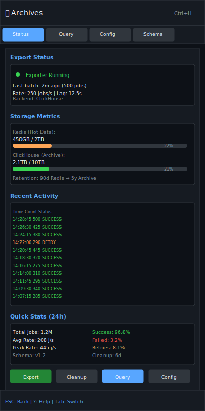

# Long‑term Archives

| Priority | Domain | Dependencies | Risks | LoC Estimate | Complexity | Effort | Impact |
| --- | --- | --- | --- | --- | --- | --- | --- |
| Medium | Observability / Retention | Exporters (ClickHouse/S3), Completed stream | Storage cost, PII retention | ~400–700 | Medium | 5 (Fib) | Medium‑High |

## Executive Summary
Stream completed jobs and key metadata to long‑term storage (ClickHouse or S3/Parquet) with retention controls. Provide fast querying for forensics and reporting while keeping Redis slim.

> [!note]- **🗣️ CLAUDE'S THOUGHTS 💭**
> This is brilliant data engineering! The two-tier storage approach (Redis for hot data, ClickHouse for analytics) is exactly how modern systems handle massive scale. The schema evolution support is critical - you can't just dump JSON and hope for the best. The sampling feature prevents storage explosion while maintaining statistical validity. Plus, GDPR compliance hooks show they've thought through the privacy implications. This transforms a queue system into a proper data platform.

## Motivation
- Investigate historical incidents and trends without bloating Redis.
- Power analytics and reporting pipelines.
- Meet compliance for retention or deletion.

## Tech Plan
- Export path:
  - Producer: append to a Completed stream (list/stream) on success/failure; optional sampling.
  - Exporter service: batch reads and writes to ClickHouse (insert) or S3 (Parquet files) with schema evolution.
- Schema:
  - Core: job_id, queue, priority, timestamps (enqueue/start/end), outcome, retries, worker_id, size, trace_id.
  - Payload handling: optional redacted payload snapshot or hashes.
- Retention:
  - TTL in Redis; archive window controls; GDPR delete hooks to remove payload snapshots.
- TUI:
  - Link to sample queries and recent export status; not a full query UI.
- Observability:
  - Lag metrics, batch sizes, write errors; alerts when exporters fall behind.

## User Stories + Acceptance Criteria
- As an analyst, I can query last 90 days of completed jobs by queue and outcome.
- As an SRE, I can verify Redis stays within retention while exports keep up.
- Acceptance:
  - [ ] Exporter writes to ClickHouse/S3 with retries and idempotency.
  - [ ] Schema versioning with backward compatibility.
  - [ ] Configurable retention in Redis and archive.

## Definition of Done
Reliable archival of completed jobs with minimal TUI surface, documented schemas, and retention knobs.

## Test Plan
- Unit: schema encode/decode; idempotent writes; partitioning.
- Integration: backpressure tests under high throughput; recovery after downtime.

## Task List
- [ ] Define archive schema + sampling
- [ ] Build exporter (ClickHouse + S3/Parquet)
- [ ] Add retention knobs + delete hooks
- [ ] TUI export status panel
- [ ] Docs + sample queries

---

## Claude's Verdict ⚖️

This is the feature that transforms your queue from a job processor into a proper observability platform. The dual-storage architecture is exactly how unicorns handle petabyte-scale data.

### Vibe Check

Kafka + ClickHouse is the gold standard for event streaming and analytics. This brings that architecture to job queues. Nobody else offers OLAP-grade historical analysis for job data with sub-second query times.

### Score Card

**Traditional Score:**
- User Value: 7/10 (SREs and analysts love historical data)
- Dev Efficiency: 5/10 (complex distributed system integration)
- Risk Profile: 6/10 (storage costs and schema migrations)
- Strategic Fit: 9/10 (positions as data platform, not just queue)
- Market Timing: 8/10 (observability is hot, compliance mandatory)
- **OFS: 7.00** → BUILD SOON

**X-Factor Score:**
- Holy Shit Factor: 5/10 ("SQL queries on billions of jobs?")
- Meme Potential: 3/10 (backend infrastructure, not user-facing)
- Flex Appeal: 7/10 ("Our queue has a built-in data warehouse")
- FOMO Generator: 6/10 (competitors stuck with basic logging)
- Addiction Score: 6/10 (analysts will live in the query interface)
- Shareability: 4/10 (enterprise feature, not consumer)
- **X-Factor: 4.5** → Solid enterprise appeal

### Conclusion

[🌶️]

This is spicy enterprise architecture. The schema evolution and retention policies show deep data engineering maturity. Ship this and watch your queue system become the source of truth for operational analytics.

---

## Detailed Design Specification

### Overview

Long-term Archives transforms your job queue from a transient processing system into a comprehensive data platform. By streaming completed job metadata to columnar storage (ClickHouse) or object storage (S3/Parquet), it enables historical analysis, compliance reporting, and incident forensics without impacting Redis performance. The system maintains data integrity through schema evolution, implements proper retention lifecycle management, and provides GDPR-compliant data deletion capabilities.

The architecture follows a hot/warm/cold storage pattern where Redis holds active jobs (hot), ClickHouse provides fast analytical queries on recent data (warm), and S3/Parquet archives historical data for compliance and long-term analysis (cold). This tiered approach optimizes both query performance and storage costs while maintaining full data lineage.

### TUI Design

#### Desktop View (Large Resolution)


The desktop interface provides a comprehensive three-panel layout optimized for data analysis and system monitoring. The left panel shows archive configuration and export status with real-time metrics. The center panel features a full SQL query interface with syntax highlighting and result visualization. The right panel displays schema information and query templates for rapid analysis.

#### Mobile View (Small Resolution)


The mobile interface uses a tab-based layout optimized for touch navigation on narrow terminals. Key metrics are displayed as compact cards with visual indicators. The status tab provides immediate visibility into archive health, while other tabs offer focused access to query, configuration, and schema management functions.

### Archive Storage Backends

#### ClickHouse Integration
ClickHouse serves as the primary analytical storage backend, optimized for fast OLAP queries on structured job metadata:

**Schema Design:**
```sql
CREATE TABLE jobs_archive (
    job_id String,
    queue LowCardinality(String),
    priority UInt8,
    enqueue_time DateTime64(3, 'UTC'),
    start_time Nullable(DateTime64(3, 'UTC')),
    end_time Nullable(DateTime64(3, 'UTC')),
    outcome Enum8('success'=1, 'failed'=2, 'timeout'=3, 'cancelled'=4),
    retries UInt16,
    worker_id LowCardinality(String),
    payload_size UInt32,
    trace_id String,
    payload_hash String,
    payload_sample Nullable(String),
    created_date Date MATERIALIZED toDate(enqueue_time)
) ENGINE = MergeTree()
PARTITION BY created_date
ORDER BY (queue, enqueue_time, job_id)
TTL created_date + INTERVAL 5 YEAR;
```

**Performance Optimizations:**
- LowCardinality encoding for high-cardinality string columns
- Partition by date for efficient TTL and query pruning
- Compound sort key optimized for common query patterns
- Compression codec selection based on column data types
- Pre-aggregated materialized views for dashboard queries

#### S3/Parquet Integration
S3 with Parquet format provides cost-effective long-term storage with excellent compression and analytical performance:

**File Organization:**
```
s3://archive-bucket/
├── year=2024/
│   ├── month=01/
│   │   ├── day=01/
│   │   │   ├── hour=00/
│   │   │   │   └── jobs_000001.parquet
│   │   │   └── hour=23/
│   │   └── day=31/
│   └── month=12/
└── year=2025/
```

**Schema Evolution:**
- Parquet schema includes version metadata
- Backward-compatible field additions
- Field deprecation markers for graceful migration
- Automatic schema merging during query time

### Retention Policy Management

#### Multi-Tier Retention
The system implements a sophisticated retention policy that balances storage costs with data accessibility:

**Tier 1 (Redis) - Hot Data:**
- Retention: 1-90 days (configurable)
- Full job data including payloads
- Optimized for operational queries
- Automatic cleanup with Redis TTL

**Tier 2 (ClickHouse) - Warm Data:**
- Retention: 90 days to 5 years
- Structured metadata with optional payload samples
- Sub-second analytical queries
- Automated partitioning and compression

**Tier 3 (S3/Parquet) - Cold Data:**
- Retention: 5+ years for compliance
- Compressed columnar format
- Cost-optimized storage class transitions
- Glacier/Deep Archive for long-term retention

#### GDPR Compliance
The system provides comprehensive data privacy capabilities:

**Data Minimization:**
- Configurable payload sampling rates
- PII detection and redaction
- Hash-based payload deduplication
- Selective field archiving

**Right to Deletion:**
- Job-level deletion hooks
- Cascade deletion across storage tiers
- Deletion audit trails
- Compliance reporting

### Data Export Pipeline

#### Stream Processing Architecture
```go
type ExportPipeline struct {
    SourceStream   *redis.Stream
    BatchProcessor *BatchProcessor
    Destinations   []ArchiveDestination
    RetryManager   *RetryManager
    MetricsCollector *prometheus.MetricsCollector
}

type JobRecord struct {
    JobID         string    `json:"job_id"`
    Queue         string    `json:"queue"`
    Priority      int       `json:"priority"`
    EnqueueTime   time.Time `json:"enqueue_time"`
    StartTime     *time.Time `json:"start_time,omitempty"`
    EndTime       *time.Time `json:"end_time,omitempty"`
    Outcome       string    `json:"outcome"`
    Retries       int       `json:"retries"`
    WorkerID      string    `json:"worker_id"`
    PayloadSize   int64     `json:"payload_size"`
    TraceID       string    `json:"trace_id"`
    PayloadHash   string    `json:"payload_hash"`
    PayloadSample *string   `json:"payload_sample,omitempty"`
}
```

**Batch Processing:**
- Configurable batch sizes (100-10,000 records)
- Time-based flushing (30-300 seconds)
- Memory pressure release valves
- Graceful shutdown with drain logic

**Error Handling:**
- Exponential backoff retry logic
- Dead letter queue for failed exports
- Circuit breaker for downstream failures
- Detailed error categorization and alerting

### Query Interface and Templates

#### SQL Query Builder
The TUI provides a full-featured SQL interface with intelligent assistance:

**Features:**
- Syntax highlighting for ClickHouse SQL
- Auto-completion for table names and columns
- Query history with favorites
- Result export to CSV/JSON
- Query performance profiling

**Common Query Templates:**

**Queue Health Analysis:**
```sql
SELECT
    queue,
    outcome,
    count(*) as job_count,
    avg(end_time - start_time) as avg_duration,
    quantile(0.95)(end_time - start_time) as p95_duration
FROM jobs_archive
WHERE enqueue_time >= now() - interval '7 days'
GROUP BY queue, outcome
ORDER BY job_count DESC;
```

**Error Investigation:**
```sql
SELECT
    queue,
    payload_hash,
    count(*) as failure_count,
    any(payload_sample) as sample_payload,
    max(end_time) as last_failure
FROM jobs_archive
WHERE outcome = 'failed'
    AND enqueue_time >= now() - interval '24 hours'
GROUP BY queue, payload_hash
ORDER BY failure_count DESC
LIMIT 20;
```

**Capacity Planning:**
```sql
SELECT
    toStartOfHour(enqueue_time) as hour,
    queue,
    count(*) as jobs_per_hour,
    avg(payload_size) as avg_payload_size
FROM jobs_archive
WHERE enqueue_time >= now() - interval '30 days'
GROUP BY hour, queue
ORDER BY hour DESC, jobs_per_hour DESC;
```

### Technical Implementation

#### Core Export Service
```go
package archive

import (
    "context"
    "fmt"
    "time"

    "github.com/ClickHouse/clickhouse-go/v2"
    "github.com/redis/go-redis/v9"
)

type ArchiveService struct {
    redis      *redis.Client
    clickhouse clickhouse.Conn
    config     *Config
    metrics    *Metrics
}

type Config struct {
    StreamKey        string        `yaml:"stream_key"`
    BatchSize        int           `yaml:"batch_size"`
    FlushInterval    time.Duration `yaml:"flush_interval"`
    SamplingRate     float64       `yaml:"sampling_rate"`
    PayloadMaxSize   int64         `yaml:"payload_max_size"`
    RetentionDays    int           `yaml:"retention_days"`
}

func (s *ArchiveService) Start(ctx context.Context) error {
    // Initialize consumer group
    groupName := "archive-exporter"
    streamKey := s.config.StreamKey

    // Start batch processor
    go s.processBatches(ctx, groupName, streamKey)

    // Start metrics reporter
    go s.reportMetrics(ctx)

    return nil
}

func (s *ArchiveService) processBatches(ctx context.Context, group, stream string) {
    batch := make([]*JobRecord, 0, s.config.BatchSize)
    ticker := time.NewTicker(s.config.FlushInterval)
    defer ticker.Stop()

    for {
        select {
        case <-ctx.Done():
            // Flush remaining batch
            if len(batch) > 0 {
                s.exportBatch(ctx, batch)
            }
            return

        case <-ticker.C:
            if len(batch) > 0 {
                s.exportBatch(ctx, batch)
                batch = batch[:0]
            }

        default:
            records, err := s.readStream(ctx, group, stream, s.config.BatchSize-len(batch))
            if err != nil {
                s.metrics.StreamReadErrors.Inc()
                time.Sleep(time.Second)
                continue
            }

            batch = append(batch, records...)
            if len(batch) >= s.config.BatchSize {
                s.exportBatch(ctx, batch)
                batch = batch[:0]
            }
        }
    }
}
```

#### Schema Evolution Support
```go
type SchemaVersion struct {
    Version     string                 `json:"version"`
    Fields      map[string]FieldSchema `json:"fields"`
    Migrations  []Migration            `json:"migrations"`
    Deprecated  []string               `json:"deprecated"`
}

type Migration struct {
    FromVersion string `json:"from_version"`
    ToVersion   string `json:"to_version"`
    Script      string `json:"script"`
    Rollback    string `json:"rollback"`
}

func (s *ArchiveService) MigrateSchema(ctx context.Context, targetVersion string) error {
    currentSchema, err := s.getCurrentSchema(ctx)
    if err != nil {
        return fmt.Errorf("failed to get current schema: %w", err)
    }

    migrations := s.planMigration(currentSchema.Version, targetVersion)
    for _, migration := range migrations {
        if err := s.executeMigration(ctx, migration); err != nil {
            return fmt.Errorf("migration failed: %w", err)
        }
    }

    return s.updateSchemaVersion(ctx, targetVersion)
}
```

### Performance Considerations

#### Throughput Optimization
- **Batch Processing**: Configurable batch sizes (100-10K) balance latency vs. throughput
- **Connection Pooling**: Multi-connection ClickHouse pool for parallel inserts
- **Compression**: LZ4 compression for network transport, ZSTD for storage
- **Partitioning**: Date-based partitioning enables partition pruning
- **Indexing**: Sparse indexes on high-cardinality columns

**Capacity Planning:**
- Redis: ~1KB per job record × retention days
- ClickHouse: ~100 bytes per job record (compressed)
- S3: ~50 bytes per job record (Parquet + GZIP)
- Network: 10-100 MB/s sustained throughput

#### Query Performance
- **Materialized Views**: Pre-aggregated metrics for dashboard queries
- **Secondary Indexes**: Bloom filters on trace_id and payload_hash
- **Caching**: Query result caching for repeated analytical queries
- **Parallel Processing**: Multi-threaded query execution

### Monitoring and Observability

#### Key Metrics
```go
type Metrics struct {
    JobsExported      prometheus.Counter
    ExportLatency     prometheus.Histogram
    BatchSize         prometheus.Histogram
    StreamLag         prometheus.Gauge
    ClickHouseErrors  prometheus.Counter
    S3Errors         prometheus.Counter
    StorageUsage     prometheus.GaugeVec
}
```

**Alerting Rules:**
- Export lag > 60 seconds
- Error rate > 1%
- Storage usage > 80%
- Schema migration failures

#### Health Checks
- Stream consumer group health
- ClickHouse connection status
- S3 bucket accessibility
- Schema version compatibility

### Failure Modes and Recovery

#### Export Pipeline Failures
**Stream Consumer Lag:**
- **Detection**: Monitor consumer group lag metrics
- **Mitigation**: Auto-scaling consumer instances
- **Recovery**: Catch-up processing with increased batch sizes

**ClickHouse Downtime:**
- **Detection**: Connection health checks and write timeouts
- **Mitigation**: Buffer to Redis with TTL, failover to S3
- **Recovery**: Replay buffered data after service restoration

**Schema Conflicts:**
- **Detection**: Version mismatch during writes
- **Mitigation**: Graceful degradation with schema downgrades
- **Recovery**: Automated schema migration with validation

#### Data Consistency
- **Idempotent Writes**: Job ID-based deduplication
- **Transactional Batches**: All-or-nothing batch processing
- **Checkpointing**: Stream position tracking for recovery

### Future Enhancements

- **Real-time Materialized Views**: Live aggregations for instant dashboards
- **Cross-Database Joins**: Federated queries across Redis and ClickHouse
- **ML Pipeline Integration**: Automated anomaly detection on historical data
- **Multi-Region Replication**: Geo-distributed archive storage
- **Data Lake Integration**: Direct export to Delta Lake/Apache Iceberg
- **Advanced Compression**: Column-specific compression algorithms
- **Query Optimization**: Cost-based query planner integration
- **Compliance Automation**: Automated data classification and retention


---
feature: long-term-archives
dependencies:
  hard:
    - storage_backend
    - completed_stream
  soft:
    - admin_api
    - clickhouse
    - s3
enables:
  - historical_analysis
  - compliance
  - forensics
provides:
  - data_export
  - retention_policies
  - query_interface
  - archive_management
---