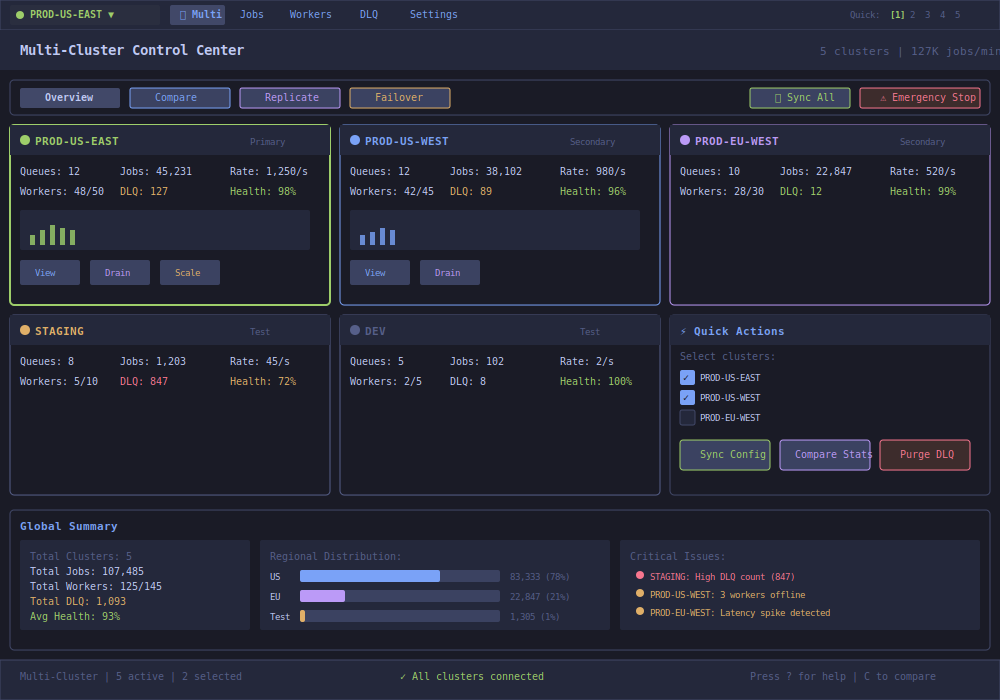
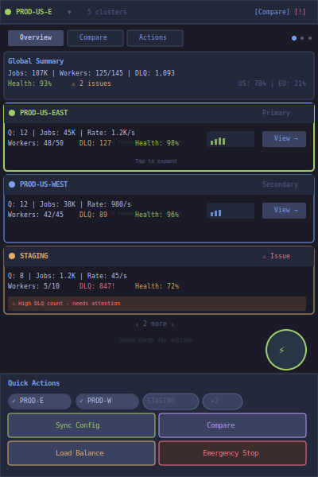

# Multi‑Cluster Control

| Priority | Domain | Dependencies | Risks | LoC Estimate | Complexity | Effort | Impact |
| --- | --- | --- | --- | --- | --- | --- | --- |
| Medium‑High | TUI + Admin | Multi-endpoint config, Admin API | Cross-cluster ops safety, latency | ~400–700 | Medium | 5 (Fib) | High |

## Executive Summary
Manage multiple Redis clusters from a single TUI: quick switch tabs, side‑by‑side compare, and optionally propagate admin actions across clusters with confirmations.

> [!note]- **🗣️ CLAUDE'S THOUGHTS 💭**
> This is kubectl for job queues! The side-by-side compare is gold for catching prod/staging drift. The multi-apply is terrifying and powerful - imagine purging DLQs across 5 regions with one command. Color-code clusters (green=staging, red=prod) for safety. Consider adding a "sync" mode that shows real-time divergence between clusters. Maybe even a "promote" action that copies jobs from staging to prod?

## Motivation
- Reduce context switching between environments.
- Detect configuration or behavior drift quickly.
- Execute coordinated admin operations (e.g., purge DLQ in both staging regions after a fix).

## Tech Plan
- Config: accept multiple Redis endpoints with labels; hot‑switch via `1..9` or mouse tabs.
- Compare view: render side‑by‑side key stats; highlight deltas and anomalies.
- Propagate actions: opt‑in multi‑select clusters for actions (PurgeDLQ, Bench) with explicit confirm.
- Caching: per‑cluster polling with jitter; summarized health in tab bar.
- Observability: cluster‑qualified metrics and logs.

## User Stories + Acceptance Criteria
- As an operator, I can switch clusters instantly and keep filters/focus.
- As an SRE, I can compare queue health across clusters.
- As an admin, I can run an action on selected clusters with clear confirmation.
- Acceptance:
  - [ ] Multiple clusters configured with labels and colors.
  - [ ] Side‑by‑side compare mode exists for Jobs and Workers.
  - [ ] Multi‑apply actions require explicit selection and confirmation listing targets.

## Definition of Done
Multi‑endpoint support with switch/compare and opt‑in multi‑apply. Docs and screenshots.

## Test Plan
- Unit: config parsing; selection logic; confirmation prompts.
- Manual: latency impact; consistency of polling; safe multi‑apply.

## Task List
- [ ] Multi‑endpoint config + tabs
- [ ] Side‑by‑side compare views
- [ ] Multi‑apply action flow + confirmations
- [ ] Docs

---

## Claude's Verdict ⚖️

This transforms your queue from single-instance tool to enterprise control plane. The side-by-side compare alone justifies the build.

### Vibe Check

Lens does this for Kubernetes. Nobody does this for job queues. First-mover advantage in the terminal multi-cluster space.

### Score Card

**Traditional Score:**
- User Value: 8/10 (critical for multi-env teams)
- Dev Efficiency: 6/10 (connection management complexity)
- Risk Profile: 6/10 (cross-cluster ops are scary)
- Strategic Fit: 8/10 (enterprise readiness signal)
- Market Timing: 6/10 (more teams going multi-region)
- **OFS: 7.0** → BUILD SOON

**X-Factor Score:**
- Holy Shit Factor: 6/10 ("Control all clusters from one terminal!")
- Meme Potential: 4/10 (screenshot cluster chaos)
- Flex Appeal: 7/10 ("We manage 10 clusters from one TUI")
- FOMO Generator: 6/10 (makes single-cluster tools look weak)
- Addiction Score: 7/10 (becomes the default view)
- Shareability: 5/10 (ops will evangelize)
- **X-Factor: 4.9** → Solid viral potential

### Conclusion

[🎛️]

This is mission control for job queues. The complexity is manageable if you nail the UX. Ship this and become the default tool for multi-environment teams.

---

## Detailed Design Specification

### Overview

Multi-Cluster Control transforms your TUI from a single-cluster tool into a unified command center for global queue infrastructure. This feature enables operators to monitor, compare, and coordinate operations across multiple Redis clusters from a single interface. It's designed for organizations running distributed queue systems across regions, environments, and failure domains.

### TUI Design



**Mobile-Optimized Version (V2):**



#### Layout Components

**1. Enhanced Tab Bar with Cluster Context**
- **Active Cluster Indicator**:
  - Color-coded status dot (green=healthy, yellow=degraded, red=critical)
  - Dropdown for quick cluster switching
  - Shows cluster name and environment tag
- **Quick Switch Numbers**: Press 1-9 to instantly switch clusters
- **Multi-Cluster Tab**: Dedicated tab for cross-cluster operations

**2. Mode Selector Bar**
- **Overview Mode**: Grid view of all clusters with key metrics
- **Compare Mode**: Side-by-side comparison of selected clusters
- **Replicate Mode**: Copy configurations/jobs between clusters
- **Failover Mode**: Emergency traffic redirection controls

**3. Main Content Area: Three View Modes**

#### Overview Mode (Default)

**Cluster Cards Grid**:
- **Card Layout**: Responsive grid (2x3 on wide screens, stacks on narrow)
- **Card Components**:
  - Color-coded border indicating health status
  - Cluster name with environment badge
  - Role indicator (Primary/Secondary/Test)
  - Key metrics: Queues, Jobs, Rate, Workers, DLQ, Health%
  - Mini sparkline chart showing 5-minute trend
  - Quick actions: View, Drain, Scale
- **Visual Hierarchy**: Primary cluster has bolder border, larger font

**Global Actions Panel**:
- **Multi-Select**: Checkbox list of clusters for bulk operations
- **Bulk Actions**:
  - Sync Config: Propagate configuration changes
  - Compare Stats: Open comparison view
  - Purge DLQ: Coordinated DLQ cleanup
  - Rolling Restart: Orchestrated worker restarts
  - Emergency Stop: Kill all workers (requires confirmation)

**Global Summary Dashboard**:
- **Aggregate Metrics**: Total jobs, workers, DLQ items across all clusters
- **Regional Distribution**: Visual bars showing job distribution
- **Critical Issues List**: Prioritized list of problems needing attention
- **Network Latency Matrix**: Inter-cluster ping times

#### Compare Mode

Split-screen detailed comparison:

```
┌─────────────────────────────────┬─────────────────────────────────┐
│       PROD-US-EAST              │       PROD-US-WEST              │
├─────────────────────────────────┼─────────────────────────────────┤
│ Queues: 12                      │ Queues: 12 (same)               │
│ Jobs: 45,231                    │ Jobs: 38,102 (-16%)             │
│ Rate: 1,250/s                   │ Rate: 980/s (-22%)              │
│ Workers: 48/50                  │ Workers: 42/45 (93% vs 96%)     │
│ DLQ: 127                        │ DLQ: 89 (-30%)                  │
│ Health: 98%                     │ Health: 96% (-2%)               │
├─────────────────────────────────┼─────────────────────────────────┤
│ Queue Distribution:             │ Queue Distribution:             │
│   high_priority: 15,420         │   high_priority: 12,100 ⚠      │
│   normal: 28,102                │   normal: 24,502                │
│   low: 1,709                    │   low: 1,500                    │
├─────────────────────────────────┼─────────────────────────────────┤
│ Config Drift:                   │ Config Drift:                   │
│   ✓ Same Redis version          │   ⚠ Different max_memory        │
│   ✓ Same timeout settings       │   ⚠ Different retry policy      │
└─────────────────────────────────┴─────────────────────────────────┘
```

#### Replicate Mode

Configuration and job replication interface:

```
┌──────────────────────────────────────────────────────────────────┐
│                    REPLICATION WIZARD                            │
├──────────────────────────────────────────────────────────────────┤
│ Source: [PROD-US-EAST ▼]     Target: [STAGING ▼]                │
│                                                                   │
│ What to replicate:                                               │
│ [✓] Configuration                                                │
│ [✓] Queue definitions                                            │
│ [ ] Active jobs                                                  │
│ [ ] DLQ contents                                                 │
│ [✓] Worker settings                                              │
│                                                                   │
│ Options:                                                         │
│ [✓] Dry run first                                               │
│ [✓] Create backup                                               │
│ [ ] Pause target during sync                                    │
│                                                                   │
│ Impact Analysis:                                                 │
│ • 5 config values will change                                    │
│ • 2 new queues will be created                                  │
│ • 48 worker configs will update                                 │
│                                                                   │
│ [Preview Changes] [Cancel] [Execute]                            │
└──────────────────────────────────────────────────────────────────┘
```

### Keyboard Navigation

| Key | Action | Context |
|-----|--------|---------|
| `1-9` | Quick switch to cluster N | Global |
| `Tab` | Cycle through clusters | Overview |
| `Space` | Toggle cluster selection | Overview |
| `Enter` | Drill into cluster | Overview |
| `c` | Compare mode | Any |
| `r` | Replicate mode | Any |
| `o` | Overview mode | Any |
| `f` | Failover mode | Any |
| `s` | Sync selected clusters | Multi-select |
| `a` | Select all clusters | Overview |
| `d` | Deselect all | Overview |
| `↑/↓` | Navigate cluster list | Any |
| `←/→` | Switch comparison targets | Compare |
| `/` | Search across clusters | Any |
| `?` | Context help | Any |
| `ESC` | Exit mode/clear selection | Any |

### Advanced Features

#### 1. Intelligent Cluster Discovery

Automatic detection and registration of clusters:

**Discovery Methods**:
- **DNS-based**: SRV records for cluster endpoints
- **Kubernetes**: Service discovery via labels
- **Consul/etcd**: Service registry integration
- **Manual**: Configuration file with endpoints

**Auto-Registration**:
```yaml
discovery:
  method: kubernetes
  namespace: job-system
  label_selector: "app=redis-queue"
  auto_register: true
  health_check_interval: 30s

clusters:
  - name: PROD-US-EAST
    endpoint: redis://prod-us-east.example.com:6379
    role: primary
    region: us-east-1
    color: green

  - name: PROD-US-WEST
    endpoint: redis://prod-us-west.example.com:6379
    role: secondary
    region: us-west-2
    color: blue
```

#### 2. Cross-Cluster Synchronization

Keep clusters in sync with intelligent replication:

**Sync Strategies**:
- **Configuration Sync**: Replicate Redis configs, queue definitions
- **State Sync**: Copy active jobs between clusters
- **Partial Sync**: Selective replication with filters
- **Continuous Sync**: Real-time replication for DR

**Conflict Resolution**:
```
┌──────────────────────────────────────────────────────────────────┐
│                 CONFIGURATION CONFLICT DETECTED                   │
├──────────────────────────────────────────────────────────────────┤
│ Setting: max_retry_count                                         │
│                                                                   │
│ PROD-US-EAST (Source): 3                                        │
│ PROD-US-WEST (Target): 5                                        │
│                                                                   │
│ Resolution Strategy:                                             │
│ (•) Use source value (3)                                        │
│ ( ) Keep target value (5)                                       │
│ ( ) Use higher value (5)                                        │
│ ( ) Use lower value (3)                                         │
│ ( ) Manual: [___]                                               │
│                                                                   │
│ [Apply to All Similar] [Skip] [Apply]                          │
└──────────────────────────────────────────────────────────────────┘
```

#### 3. Coordinated Operations

Execute operations across multiple clusters with orchestration:

**Operation Types**:
- **Rolling Updates**: Sequential updates with health checks
- **Parallel Execution**: Simultaneous operations on all clusters
- **Canary Deployments**: Test on one cluster before rolling out
- **Blue-Green Switches**: Atomic traffic switching

**Orchestration Example**:
```go
type MultiClusterOperation struct {
    Type        OperationType
    Targets     []Cluster
    Strategy    ExecutionStrategy
    Validation  ValidationRules
    Rollback    RollbackPolicy
}

type ExecutionStrategy struct {
    Mode        string // "parallel", "rolling", "canary"
    MaxParallel int
    DelayBetween time.Duration
    HealthCheck HealthChecker
}
```

#### 4. Failover Management

Handle cluster failures with automated or manual failover:

**Failover Modes**:
```
┌──────────────────────────────────────────────────────────────────┐
│                        FAILOVER CONTROL                          │
├──────────────────────────────────────────────────────────────────┤
│ Failed Cluster: PROD-US-EAST                                     │
│ Status: Connection Lost (2m 34s ago)                             │
│                                                                   │
│ Failover Options:                                                │
│                                                                   │
│ 1. Automatic Failover                                            │
│    Target: PROD-US-WEST (ready)                                 │
│    • Redirect traffic: Yes                                       │
│    • Preserve job order: Best effort                            │
│    • Notify on-call: Yes                                        │
│    [Execute Auto-Failover]                                      │
│                                                                   │
│ 2. Manual Failover                                              │
│    Select target: [PROD-US-WEST ▼]                              │
│    • Queue mapping: [Configure...]                              │
│    • Worker scaling: [Auto ▼]                                   │
│    [Plan Failover]                                              │
│                                                                   │
│ 3. Partial Failover                                             │
│    • Move critical queues only                                  │
│    • Keep non-critical on primary                              │
│    [Configure Partial]                                          │
└──────────────────────────────────────────────────────────────────┘
```

**Health Monitoring**:
- Continuous health checks every 5 seconds
- Automatic degradation detection
- Predictive failure warnings
- Circuit breaker pattern for flapping clusters

#### 5. Global Analytics

Unified analytics across all clusters:

**Metrics Aggregation**:
- Combined throughput graphs
- Global error rates
- Cross-cluster job flow visualization
- Worker efficiency comparison

**Anomaly Detection**:
- Identify clusters behaving differently
- Detect configuration drift
- Alert on asymmetric load distribution
- Predict capacity issues

**Report Generation**:
```
Multi-Cluster Report - 2024-01-15
━━━━━━━━━━━━━━━━━━━━━━━━━━━━━━━━━
Global Stats (Last 24h):
• Total Jobs: 12.4M
• Success Rate: 99.2%
• Avg Latency: 234ms
• Peak Load: 4,250 jobs/s

Per-Cluster Performance:
┌────────────────┬──────────┬────────┬─────────┐
│ Cluster        │ Jobs     │ Success│ P95 Lat │
├────────────────┼──────────┼────────┼─────────┤
│ PROD-US-EAST   │ 8.2M     │ 99.4%  │ 198ms   │
│ PROD-US-WEST   │ 3.8M     │ 99.0%  │ 287ms   │
│ PROD-EU-WEST   │ 0.4M     │ 98.9%  │ 342ms   │
└────────────────┴──────────┴────────┴─────────┘

Issues & Recommendations:
• PROD-US-WEST showing 45ms higher latency
  → Investigate network path
• Uneven load distribution (68% on US-EAST)
  → Consider rebalancing
```

### Integration Points

#### With Other TUI Features

1. **Queue Dashboard**:
   - Unified queue view across clusters
   - Cross-cluster job migration
   - Global queue statistics

2. **Workers Tab**:
   - Combined worker fleet view
   - Cross-cluster worker balancing
   - Global worker health metrics

3. **DLQ Tab**:
   - Aggregate DLQ statistics
   - Cross-cluster failure patterns
   - Coordinated DLQ remediation

4. **JSON Payload Studio**:
   - Test payloads on multiple clusters
   - Compare processing across environments
   - A/B testing support

#### With External Systems

1. **Service Mesh Integration**:
   - Istio/Linkerd traffic management
   - Automatic endpoint discovery
   - Load balancing policies

2. **Orchestration Platforms**:
   - Kubernetes operator mode
   - Terraform provider
   - Ansible playbooks

3. **Monitoring Systems**:
   - Prometheus federation
   - Grafana dashboards
   - DataDog multi-region views

### User Scenarios

#### Scenario 1: Global Traffic Surge

1. Black Friday traffic spike detected
2. Operator opens Multi-Cluster Control
3. Sees PROD-US-EAST at 95% capacity (red border)
4. Selects PROD-US-EAST and PROD-US-WEST
5. Clicks "Load Balance" action
6. Reviews rebalancing plan: move 30% traffic west
7. Executes with monitoring
8. Watches real-time rebalancing on overview grid

#### Scenario 2: Rolling Configuration Update

1. New retry policy needs global deployment
2. Operator enters Replicate Mode
3. Configures update on DEV cluster first
4. Tests and validates behavior
5. Creates replication plan: DEV → STAGING → PROD
6. Executes rolling update with 5-minute intervals
7. Monitors each cluster's health after update
8. Auto-rollback triggers on PROD-EU due to errors

#### Scenario 3: Regional Outage Response

1. AWS us-east-1 outage affects PROD-US-EAST
2. Automatic failover initiates to PROD-US-WEST
3. Operator receives alert, opens Multi-Cluster Control
4. Sees failover in progress with live status
5. Monitors job redistribution progress
6. Scales up workers in US-WEST via UI
7. Acknowledges successful failover
8. Plans recovery once us-east-1 recovers

### Technical Implementation

#### Architecture

```go
type MultiClusterManager struct {
    Clusters     map[string]*ClusterConnection
    Discovery    *ClusterDiscovery
    Orchestrator *OperationOrchestrator
    Synchronizer *ClusterSynchronizer
    Analytics    *GlobalAnalytics
    Failover     *FailoverController
}

type ClusterConnection struct {
    Name        string
    Endpoint    string
    Redis       *redis.Client
    Health      *HealthMonitor
    Metrics     *MetricsCollector
    Config      ClusterConfig
    Status      ClusterStatus
}

type OperationOrchestrator struct {
    Operations  chan MultiClusterOp
    Executor    *ParallelExecutor
    Validator   *PreFlightChecker
    Rollback    *RollbackManager
}

type ClusterStatus struct {
    State       string // "healthy", "degraded", "failed"
    LastCheck   time.Time
    Latency     time.Duration
    ErrorRate   float64
    Capacity    float64
}
```

#### Connection Management

**Connection Pooling**:
- Persistent connections with keep-alive
- Automatic reconnection with exponential backoff
- Circuit breaker for failed clusters
- Connection multiplexing for efficiency

**Security**:
- Per-cluster authentication
- TLS/SSL encryption
- Role-based access control
- Audit logging for all operations

#### Performance Optimization

**For Many Clusters (>10)**:
- Parallel metric collection
- Aggregation at source
- Compressed data transfer
- Smart caching with TTL
- Progressive rendering

**Monitoring Overhead**:
- Sampling for high-volume clusters
- Adaptive polling frequency
- Delta transmission for updates
- Client-side aggregation

### Safety & Compliance

#### Operation Safety

**Pre-flight Checks**:
- Capacity validation
- Configuration compatibility
- Network connectivity
- Permission verification

**Confirmation Dialogs**:
```
┌──────────────────────────────────────────────────────────────────┐
│              ⚠️  MULTI-CLUSTER OPERATION WARNING                  │
├──────────────────────────────────────────────────────────────────┤
│ You are about to purge DLQ on 3 production clusters:            │
│                                                                   │
│ • PROD-US-EAST: 127 jobs                                        │
│ • PROD-US-WEST: 89 jobs                                         │
│ • PROD-EU-WEST: 12 jobs                                         │
│                                                                   │
│ Total: 228 jobs will be permanently deleted                     │
│                                                                   │
│ This operation CANNOT be undone.                                │
│                                                                   │
│ Type cluster names to confirm:                                  │
│ [_________________________________]                              │
│                                                                   │
│ [Cancel] [Proceed with Caution]                                 │
└──────────────────────────────────────────────────────────────────┘
```

#### Audit Trail

Comprehensive logging of multi-cluster operations:

```json
{
  "timestamp": "2024-01-15T14:35:22Z",
  "operator": "alice@example.com",
  "operation": "multi_cluster_sync",
  "source": "PROD-US-EAST",
  "targets": ["PROD-US-WEST", "PROD-EU-WEST"],
  "changes": {
    "config": 5,
    "queues": 2,
    "workers": 48
  },
  "duration_ms": 4230,
  "result": "success"
}
```

### Metrics and Success Criteria

**Operational Metrics**:
- Cross-cluster operation success rate
- Failover Mean Time to Recovery (MTTR)
- Configuration drift incidents
- Global system availability

**User Experience Metrics**:
- Time to execute multi-cluster operation
- Context switches between clusters
- Error rate in bulk operations
- User satisfaction score

**Success Criteria**:
- 99.9% multi-cluster operation success
- <30s failover completion time
- Zero data loss during migrations
- 50% reduction in cross-cluster operation time

### Future Enhancements

- **AI-Powered Load Balancing**: ML-based traffic distribution
- **Predictive Scaling**: Anticipate load and pre-scale clusters
- **Chaos Engineering Mode**: Controlled multi-cluster failures
- **Global Job Router**: Intelligent job placement across regions
- **Federation Support**: Connect separate queue deployments
- **Multi-Cloud Management**: AWS + GCP + Azure in one view
- **Disaster Recovery Automation**: One-click DR activation
- **Cost Optimization**: Show and optimize multi-cluster costs


---
feature: multi-cluster-control
dependencies:
  hard:
    - admin_api
    - redis
    - tui_framework
    - config_management
  soft:
    - dlq_remediation_ui
    - capacity_planning
    - monitoring_system
enables:
  - global_operations
  - disaster_recovery
  - federation
  - cross_region_sync
  - chaos_engineering
provides:
  - cluster_switching
  - compare_view
  - multi_apply_actions
---