# Plugin Panel System

| Priority | Domain | Dependencies | Risks | LoC Estimate | Complexity | Effort | Impact |
| --- | --- | --- | --- | --- | --- | --- | --- |
| Medium‑High | TUI Platform / Extensibility | Plugin runtime (WASM/Lua), Admin API | Sandbox/security, crashes, API drift | ~600–1000 | High | 8 (Fib) | High |

## Executive Summary
A terminal‑native plugin framework that lets teams drop in custom panels for org‑specific metrics, transforms, and actions. Plugins render inside the TUI, receive typed events (stats, selection, timers), and can call a scoped Admin API with explicit capabilities.

> [!note]- **🗣️ CLAUDE'S THOUGHTS 💭**
> This is how you build an ecosystem! WASM is the right choice - safe, portable, and trendy. The capability model is crucial - nobody wants a rogue plugin purging prod. Start with read-only plugins to build trust. The hot-reload is chef's kiss for developer experience. Look at Zellij's WASM plugins for inspiration. Consider a plugin marketplace/registry early - that's how VSCode won.

## Motivation
- Organizations need bespoke dashboards and actions (tenant stats, SLA widgets, proprietary transforms).
- Avoid hard‑coding one‑off features into core; encourage contributions without risking stability.
- Create a marketplace of panels that showcase the TUI.

## Tech Plan
- Runtime: start with WASM (TinyGo) or Starlark/Lua for safety and portability; avoid Go `plugin` due to portability issues.
- API Surface (capability‑gated):
  - Read‑only: subscribe to stats, keys, selection, timers.
  - Actions: enqueue, peek, requeue, purge (require explicit user grant per plugin).
  - UI: render text blocks with styles; receive keyboard/mouse events in plugin’s zone.
- Packaging: plugin bundle = `manifest.yaml` (name, version, permissions, entry), bytecode/script, optional assets.
- Lifecycle: discover under `plugins/`, validate manifest + permissions, load sandbox, render panel region; hot‑reload on file change.
- Sandboxing: CPU/memory/time limits; deny filesystem/network by default; only brokered API calls allowed.
- Versioning: semantic version the host/plugin API; shims for minor changes; e2e contract tests.
- Samples: “Tenant SLA” read‑only panel; “Bulk Requeue Helper” action panel (cap‑gated).

## User Stories + Acceptance Criteria
- As a user, I can enable a plugin and see its panel render without crashing the TUI.
- As a security reviewer, I can inspect requested permissions and approve/deny.
- As a developer, I can build a plugin with typed events, test locally, and hot‑reload.
- Acceptance:
  - [ ] Host loads/isolates plugins with manifest validation and resource limits.
  - [ ] Capability prompts on first run; persisted decisions per plugin version.
  - [ ] Stable v1 API documented with examples in WASM and Lua/Starlark.
  - [ ] Two sample plugins shipped and tested.

## Definition of Done
Plugin host with sandbox + permissions, documented API, hot‑reload, and two samples. Crashes contained, no memory leaks in soak.

## Test Plan
- Unit: manifest parsing, permission gating, event dispatch serialization.
- Integration: crashy plugin isolation, resource limit enforcement, hot‑reload.
- Security: attempt forbidden calls; verify host refuses and logs.

## Task List
- [ ] Define host API + capability model
- [ ] Choose runtime (WASM + Starlark) and embed
- [ ] Implement loader, sandbox, event bus
- [ ] Implement renderer adapter (panel zone)
- [ ] Add permission UI + persistence
- [ ] Build sample plugins + docs

```mermaid
flowchart LR
  subgraph Host[TUI Host]
    Evt[Event Bus]
    API[Cap‑gated Admin API]
  end
  P1((Plugin A)):::p -->|subscribe| Evt
  P1 -->|render| Host
  P1 -.->|actions| API
  P2((Plugin B)):::p --> Evt
  classDef p fill:#222,stroke:#888,color:#eee
```

---

## Claude's Verdict ⚖️

This is how you build a platform, not just a tool. The plugin ecosystem is what made VSCode, Neovim, and Obsidian unstoppable.

### Vibe Check

Nobody expects plugins in a terminal job queue. That's exactly why it's brilliant. This is your moat - custom enterprise plugins that lock in organizations.

### Score Card

**Traditional Score:**
- User Value: 8/10 (unlocks infinite customization)
- Dev Efficiency: 4/10 (complex sandbox, API design)
- Risk Profile: 5/10 (security, stability concerns)
- Strategic Fit: 9/10 (platform play, ecosystem builder)
- Market Timing: 6/10 (WASM is hot, plugins expected)
- **OFS: 6.65** → BUILD SOON

**X-Factor Score:**
- Holy Shit Factor: 8/10 ("Plugins in a TUI queue?!")
- Meme Potential: 6/10 (cool plugin demos)
- Flex Appeal: 9/10 ("Our queue has a plugin ecosystem")
- FOMO Generator: 7/10 (exclusive plugins create lock-in)
- Addiction Score: 6/10 (plugin discovery is addictive)
- Shareability: 8/10 (devs love sharing plugins)
- **X-Factor: 6.4** → High viral potential

### Conclusion

[🦄]

This is your path to unicorn status. Start small with read-only plugins, nail the security model, then watch the community build amazing things. This transforms you from tool to platform.

