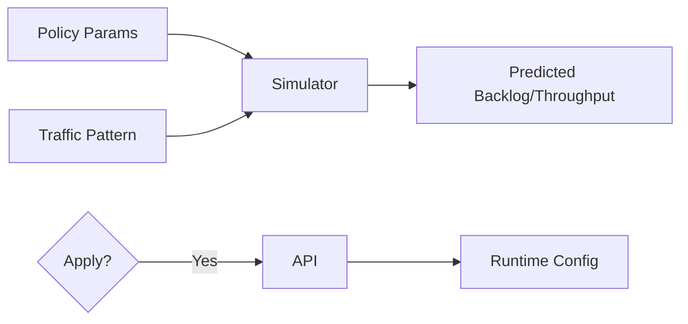

# Interactive Policy Tuning + Simulator

| Priority | Domain | Dependencies | Risks | LoC Estimate | Complexity | Effort | Impact |
| --- | --- | --- | --- | --- | --- | --- | --- |
| Medium | Control Plane / TUI | Admin API config endpoints | False precision, misuse | ~500–800 | High (Sim O(T·M)) | 13 (Fib) | High |

## Executive Summary
A "what‑if" simulator to preview the impact of policy changes (retry/backoff, rate limits, concurrency) before applying.

> [!note]- **🗣️ CLAUDE'S THOUGHTS 💭**
> Ambitious! This is chaos engineering meets capacity planning. The queueing theory math is non-trivial (Little's Law, M/M/c models). High risk of "garbage in, garbage out" if the model oversimplifies. But if you nail this, it's a killer feature. Consider starting with simple scenarios (constant load) before tackling burst/seasonal patterns. Maybe integrate with your existing bench tool for real validation?

## Motivation
Prevent outages and tune SLOs by testing changes safely.

## Tech Plan
- Build a first‑order queueing model; configurable traffic patterns; show predicted backlog/throughput/latency.
- Integrate apply/rollback via Admin API; include audit trail.

## User Stories + Acceptance Criteria
- As an operator, I can simulate and apply policy changes with confidence.
- Acceptance:
  - [ ] UI sliders/inputs for core policies; charts update with predictions.
  - [ ] Clear assumptions and limitations documented inline.
  - [ ] Apply/rollback via Admin API with audit log.

## Definition of Done
Simulator usable for core policies; documented; apply/rollback tested end‑to‑end.

## Test Plan
- Unit: math/model validation; boundary cases.
- Integration: dry‑run vs live; rollback correctness.

## Task List
- [ ] Implement core sim model
- [ ] UI: controls + charts
- [ ] Admin API: apply/rollback endpoints
- [ ] Docs + inline assumptions

---

## Claude's Verdict ⚖️

High risk, high reward. This is either your crown jewel or a maintenance nightmare. The idea is brilliant - the execution will determine if it's useful or just impressive.

### Vibe Check

Nobody else has this. AWS SQS? Nope. RabbitMQ? Nope. This is approaching Kubernetes HPA territory - predictive autoscaling for queues. If it works, it's a game-changer.

### Score Card

**Traditional Score:**
- User Value: 7/10 (prevents outages, but complex)
- Dev Efficiency: 3/10 (4-6 months, needs expertise)
- Risk Profile: 4/10 (model accuracy, user confusion)
- Strategic Fit: 8/10 (huge differentiator)
- Market Timing: 5/10 (nice to have, not critical)
- **OFS: 5.4** → CONSIDER

**X-Factor Score:**
- Holy Shit Factor: 8/10 ("It predicts the future?!")
- Meme Potential: 6/10 (screenshot worthy predictions)
- Flex Appeal: 9/10 ("Our queue has AI capacity planning")
- FOMO Generator: 7/10 (nobody else has this)
- Addiction Score: 5/10 (used during planning)
- Shareability: 7/10 (conference keynote material)
- **X-Factor: 5.8** → Strong viral potential

### Conclusion

[🦄]

This is unicorn territory - magical if it works. Start with a simple MVP (constant load, basic Little's Law) and iterate. The risk is building something too complex to trust. The reward is being the only queue with predictive capacity planning.

---
feature: policy-simulator
dependencies:
  hard:
    - admin_api
    - policy_engine
  soft:
    - forecasting
    - automatic_capacity_planning
enables:
  - policy_testing
  - what_if_analysis
  - safe_changes
provides:
  - simulation_engine
  - impact_preview
  - policy_validation
  - dry_run
---