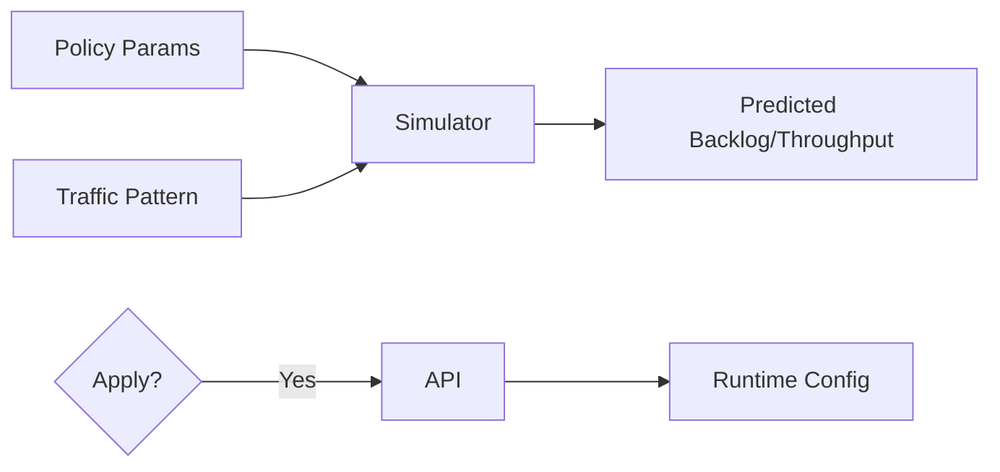

# Interactive Policy Tuning + Simulator

| Priority | Domain | Dependencies | Risks | LoC Estimate | Complexity | Effort | Impact |
| --- | --- | --- | --- | --- | --- | --- | --- |
| Medium | Control Plane / TUI | Admin API config endpoints | False precision, misuse | ~500–800 | High (Sim O(T·M)) | 13 (Fib) | High |

## Executive Summary
A “what‑if” simulator to preview the impact of policy changes (retry/backoff, rate limits, concurrency) before applying.

## Motivation
Prevent outages and tune SLOs by testing changes safely.

## Tech Plan
- Build a first‑order queueing model; configurable traffic patterns; show predicted backlog/throughput/latency.
- Integrate apply/rollback via Admin API; include audit trail.

## User Stories + Acceptance Criteria
- As an operator, I can simulate and apply policy changes with confidence.
- Acceptance:
  - [ ] UI sliders/inputs for core policies; charts update with predictions.
  - [ ] Clear assumptions and limitations documented inline.
  - [ ] Apply/rollback via Admin API with audit log.

## Definition of Done
Simulator usable for core policies; documented; apply/rollback tested end‑to‑end.

## Test Plan
- Unit: math/model validation; boundary cases.
- Integration: dry‑run vs live; rollback correctness.

## Task List
- [ ] Implement core sim model
- [ ] UI: controls + charts
- [ ] Admin API: apply/rollback endpoints
- [ ] Docs + inline assumptions

