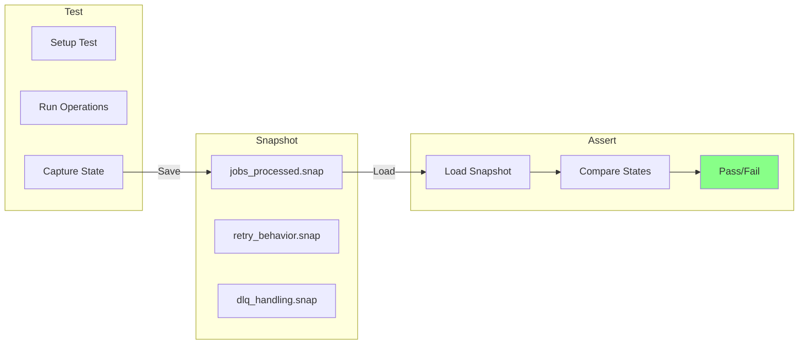
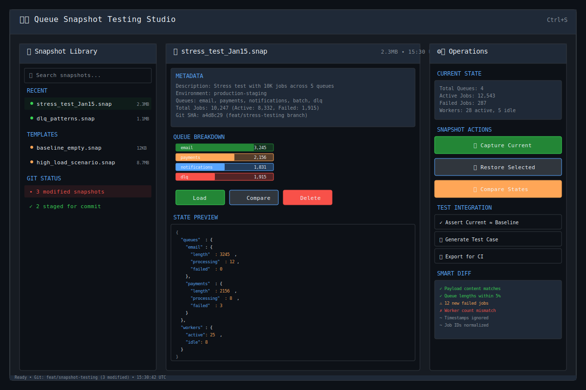
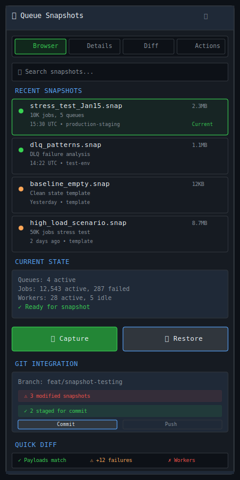

# Queue Snapshot Testing

| Priority | Domain | Dependencies | Risks | LoC Estimate | Complexity | Effort | Impact |
| --- | --- | --- | --- | --- | --- | --- | --- |
| Medium-High | Testing / CI | State serialization, snapshot store, diff engine | Storage growth, false positives | ~500–750 | Medium | 5 (Fib) | High |

## Executive Summary
Capture complete queue states as snapshots for regression testing, allowing teams to save, version, and replay complex queue scenarios. Compare actual vs. expected states with smart diffing that ignores irrelevant changes.

> [!note]- **🗣️ CLAUDE'S THOUGHTS 💭**
> This is Jest for queue states! The deterministic serialization with smart diffing is brilliant - imagine catching that subtle bug where payment queues start accumulating differently after a Redis config change. The Git integration makes this a true "time machine" for queue debugging. Consider adding snapshot "contracts" - assertions about queue behavior that must hold across deployments.

## Motivation
- Catch queue behavior regressions before production
- Test complex scenarios without manual setup
- Document expected behavior through snapshot examples
- Enable test-driven development for queue workflows

## Tech Plan
- Snapshot Capture:
  - Complete state: all queues, jobs, workers, configs
  - Deterministic serialization (sorted keys, normalized timestamps)
  - Compression with zstd for storage efficiency
  - Metadata: description, tags, creation context
- Snapshot Operations:
  - Save: capture current state with name/description
  - Load: restore queue to saved state
  - Compare: diff two snapshots with smart filtering
  - Assert: verify current state matches snapshot
- Smart Diffing:
  - Ignore: timestamps (unless relative), job IDs, worker IDs
  - Focus on: queue lengths, job payloads, failure patterns
  - Configurable ignore patterns
  - Semantic diff: understand moved vs. changed jobs
- Test Integration:
  - Jest-style snapshot testing for Go
  - CI/CD integration with snapshot repositories
  - Automatic snapshot updates with approval flow
  - Snapshot fixtures for different test scenarios
- Version Control:
  - Store snapshots in git with large file support
  - Track snapshot changes over time
  - Branch-specific snapshot sets
  - Merge conflict resolution tools
- TUI Features:
  - Snapshot browser with search/filter
  - Visual diff viewer with side-by-side comparison
  - One-click save/load current state
  - Snapshot "albums" for related scenarios

## User Stories + Acceptance Criteria
- As a developer, I can save queue state and assert it hasn't changed
- As a QA engineer, I can maintain a library of test scenarios
- As a team lead, I can review snapshot changes in pull requests
- Acceptance:
  - [ ] Snapshots capture complete queue state
  - [ ] Smart diff ignores non-semantic changes
  - [ ] Git integration with reasonable file sizes
  - [ ] <1s to save/load typical snapshots

## Definition of Done
Snapshot testing fully integrated with test suite and TUI. Documentation includes best practices and CI/CD setup guide. Example snapshot library provided.

## Test Plan
- Unit: Serialization determinism, diff algorithms, compression
- Integration: Save/load cycle with complex states
- Performance: Snapshot operations with large queues
- Workflow: Git integration and merge scenarios

## Task List
- [ ] Design snapshot schema
- [ ] Implement state serialization
- [ ] Build smart diff engine
- [ ] Create test framework integration
- [ ] Add TUI snapshot browser
- [ ] Git workflow tooling
- [ ] Example snapshot library



---

## Claude's Verdict ⚖️

This transforms queue testing from prayer-driven development to scientific method. Finally, we can prove our queue behavior hasn't regressed.

### Vibe Check

This is Jest snapshot testing meets queue systems. No one else has deterministic queue state capture with semantic diffing. The Git workflow makes queue states as trackable as code changes.

### Score Card

**Traditional Score:**
- User Value: 8/10 (eliminates "it worked on my machine" queue bugs)
- Dev Efficiency: 7/10 (complex serialization logic, but huge debugging wins)
- Risk Profile: 8/10 (read-only snapshots, smart validation prevents corruption)
- Strategic Fit: 9/10 (testing infrastructure is platform-building)
- Market Timing: 6/10 (testing tools are evergreen but not urgent)
- **OFS: 7.75** → BUILD SOON

**X-Factor Score:**
- Holy Shit Factor: 7/10 ("You can snapshot entire queue state?")
- Meme Potential: 4/10 (developers will screenshot clean diffs)
- Flex Appeal: 8/10 ("Our queue has time travel debugging")
- FOMO Generator: 6/10 (makes manual queue debugging look primitive)
- Addiction Score: 7/10 (essential for serious queue development)
- Shareability: 5/10 (great for technical demos)
- **X-Factor: 5.4** → Solid viral potential in dev communities

### Conclusion

[🌶️]

This is spicy infrastructure. The combination of deterministic serialization + semantic diffing + Git workflow creates a unique queue debugging superpower. Ship this and watch queue confidence soar.

---

## Detailed Design Specification

### Overview

Queue Snapshot Testing revolutionizes how teams validate queue behavior by creating deterministic, versionable snapshots of complete queue states. Think Jest snapshots but for distributed queue systems - capture the exact state of jobs, workers, configurations, and metadata, then use intelligent diffing to detect meaningful changes while ignoring noise like timestamps and auto-generated IDs.

This system transforms queue testing from ad-hoc manual verification to scientific, reproducible validation. Teams can capture "golden states" for different scenarios (empty queues, high load, failure patterns), version them alongside code, and automatically detect regressions in CI/CD pipelines.

### TUI Design

#### Desktop View (Large Resolution)


The desktop interface uses a three-panel layout optimized for snapshot management and comparison:

**Left Panel: Snapshot Library (25%)**
- **Search & Filter**: Fuzzy search across snapshot names, descriptions, and metadata
- **Recent Snapshots**: Last 10 captured states with visual status indicators
- **Template Library**: Pre-built baseline snapshots (empty state, high load, failure scenarios)
- **Git Integration**: Real-time Git status showing modified/staged snapshots

**Center Panel: Snapshot Details (50%)**
- **Metadata Display**: Comprehensive snapshot information (description, environment, Git SHA, queue counts)
- **Queue Breakdown**: Visual bars showing relative queue sizes and job distributions
- **State Preview**: Syntax-highlighted JSON preview of the captured state
- **Action Buttons**: Load, Compare, Delete with confirmation dialogs

**Right Panel: Operations (25%)**
- **Current State**: Live queue statistics for comparison
- **Snapshot Actions**: Capture current state, restore selected snapshot
- **Test Integration**: Generate test cases, export for CI, assertion helpers
- **Smart Diff**: Real-time comparison showing semantically meaningful differences

#### Mobile View (Small Resolution)


The mobile interface uses a tabbed layout with stacked cards:
- **Browser Tab**: Compact snapshot list with swipe actions
- **Details Tab**: Full-screen snapshot information
- **Diff Tab**: Side-by-side or unified diff view
- **Actions Tab**: All operations in touch-friendly buttons

### Deterministic Serialization Engine

The core innovation is converting chaotic queue state into reproducible snapshots:

#### State Capture Algorithm

```go
type SnapshotEngine struct {
    Redis     *redis.Client
    Hasher    *hash.Hash
    Compressor *zstd.Encoder
    Config    *SerializationConfig
}

type QueueSnapshot struct {
    Metadata   SnapshotMetadata   `json:"metadata"`
    Queues     map[string]Queue   `json:"queues"`
    Jobs       []NormalizedJob    `json:"jobs"`
    Workers    []WorkerState      `json:"workers"`
    Config     SystemConfig       `json:"config"`
    Checksum   string             `json:"checksum"`
}

type NormalizedJob struct {
    QueueName    string                 `json:"queue"`
    PayloadHash  string                 `json:"payload_hash"`  // Deterministic hash
    Priority     int                    `json:"priority"`
    RetryCount   int                    `json:"retry_count"`
    State        string                 `json:"state"`
    RelativeTime int64                  `json:"relative_time"`  // Normalized timestamps
    Metadata     map[string]interface{} `json:"metadata"`
}

func (e *SnapshotEngine) CaptureState(ctx context.Context) (*QueueSnapshot, error) {
    snapshot := &QueueSnapshot{
        Metadata: e.generateMetadata(),
        Queues:   make(map[string]Queue),
        Jobs:     []NormalizedJob{},
        Workers:  []WorkerState{},
    }

    // Capture all queues atomically using Redis MULTI/EXEC
    pipe := e.Redis.TxPipeline()

    queueNames := e.getQueueNames(ctx)
    for _, queueName := range queueNames {
        pipe.LLen(ctx, queueName)
        pipe.LRange(ctx, queueName, 0, -1)
    }

    results, err := pipe.Exec(ctx)
    if err != nil {
        return nil, fmt.Errorf("atomic queue capture failed: %w", err)
    }

    // Normalize all captured data
    baseTime := time.Now()
    for i, queueName := range queueNames {
        jobs := e.parseJobs(results[i*2+1])
        normalizedJobs := e.normalizeJobs(jobs, baseTime)

        snapshot.Queues[queueName] = Queue{
            Name:   queueName,
            Length: len(jobs),
            Jobs:   normalizedJobs,
        }

        snapshot.Jobs = append(snapshot.Jobs, normalizedJobs...)
    }

    // Sort everything deterministically
    sort.Strings(queueNames)
    sort.Slice(snapshot.Jobs, func(i, j int) bool {
        if snapshot.Jobs[i].QueueName != snapshot.Jobs[j].QueueName {
            return snapshot.Jobs[i].QueueName < snapshot.Jobs[j].QueueName
        }
        return snapshot.Jobs[i].PayloadHash < snapshot.Jobs[j].PayloadHash
    })

    // Generate deterministic checksum
    snapshot.Checksum = e.generateChecksum(snapshot)

    return snapshot, nil
}

func (e *SnapshotEngine) normalizeJobs(jobs []*Job, baseTime time.Time) []NormalizedJob {
    normalized := make([]NormalizedJob, len(jobs))

    for i, job := range jobs {
        // Create deterministic payload hash
        payloadBytes, _ := json.Marshal(job.Payload)
        hasher := sha256.New()
        hasher.Write(payloadBytes)
        payloadHash := hex.EncodeToString(hasher.Sum(nil))[:16]

        // Normalize timestamps to relative offsets
        relativeTime := job.CreatedAt.Sub(baseTime).Milliseconds()

        normalized[i] = NormalizedJob{
            QueueName:    job.QueueName,
            PayloadHash:  payloadHash,
            Priority:     job.Priority,
            RetryCount:   job.RetryCount,
            State:        job.State,
            RelativeTime: relativeTime,
            Metadata: map[string]interface{}{
                "attempt_count": job.AttemptCount,
                "last_error":    job.LastError,
            },
        }
    }

    return normalized
}
```

### Smart Diffing Algorithm

The diff engine focuses on semantically meaningful changes:

```go
type DiffEngine struct {
    IgnorePatterns []string
    ToleranceRules map[string]ToleranceRule
}

type ToleranceRule struct {
    Type      string  // "percentage", "absolute", "ignore"
    Threshold float64
}

type SnapshotDiff struct {
    Summary     DiffSummary            `json:"summary"`
    QueueDiffs  map[string]QueueDiff   `json:"queue_diffs"`
    JobDiffs    []JobDiff              `json:"job_diffs"`
    WorkerDiffs []WorkerDiff           `json:"worker_diffs"`
    Ignored     []IgnoredChange        `json:"ignored"`
}

func (d *DiffEngine) Compare(before, after *QueueSnapshot) (*SnapshotDiff, error) {
    diff := &SnapshotDiff{
        QueueDiffs: make(map[string]QueueDiff),
        JobDiffs:   []JobDiff{},
        Ignored:    []IgnoredChange{},
    }

    // Compare queue lengths with tolerance
    for queueName, beforeQueue := range before.Queues {
        afterQueue, exists := after.Queues[queueName]
        if !exists {
            diff.QueueDiffs[queueName] = QueueDiff{
                Type:   "removed",
                Before: beforeQueue.Length,
                After:  0,
            }
            continue
        }

        lengthDiff := float64(afterQueue.Length-beforeQueue.Length) / float64(beforeQueue.Length)
        tolerance := d.ToleranceRules["queue_length"]

        if tolerance.Type == "percentage" && math.Abs(lengthDiff) > tolerance.Threshold {
            diff.QueueDiffs[queueName] = QueueDiff{
                Type:       "length_change",
                Before:     beforeQueue.Length,
                After:      afterQueue.Length,
                Percentage: lengthDiff * 100,
                Significant: true,
            }
        } else if math.Abs(lengthDiff) <= tolerance.Threshold {
            diff.Ignored = append(diff.Ignored, IgnoredChange{
                Type:   "queue_length_within_tolerance",
                Queue:  queueName,
                Reason: fmt.Sprintf("Length change %.1f%% within %.1f%% tolerance", lengthDiff*100, tolerance.Threshold*100),
            })
        }
    }

    // Semantic job comparison
    beforeJobMap := d.indexJobsByPayload(before.Jobs)
    afterJobMap := d.indexJobsByPayload(after.Jobs)

    for payloadHash, beforeJobs := range beforeJobMap {
        afterJobs, exists := afterJobMap[payloadHash]
        if !exists {
            diff.JobDiffs = append(diff.JobDiffs, JobDiff{
                Type:        "removed",
                PayloadHash: payloadHash,
                Count:       len(beforeJobs),
            })
            continue
        }

        // Check if job moved between queues (semantic movement)
        beforeQueues := d.getUniqueQueues(beforeJobs)
        afterQueues := d.getUniqueQueues(afterJobs)

        if !reflect.DeepEqual(beforeQueues, afterQueues) {
            diff.JobDiffs = append(diff.JobDiffs, JobDiff{
                Type:         "queue_migration",
                PayloadHash:  payloadHash,
                BeforeQueues: beforeQueues,
                AfterQueues:  afterQueues,
                Significant:  true,
            })
        }

        // Compare retry counts and failure states
        beforeRetrySum := d.sumRetryCounts(beforeJobs)
        afterRetrySum := d.sumRetryCounts(afterJobs)

        if afterRetrySum > beforeRetrySum {
            diff.JobDiffs = append(diff.JobDiffs, JobDiff{
                Type:        "retry_increase",
                PayloadHash: payloadHash,
                Before:      beforeRetrySum,
                After:       afterRetrySum,
                Significant: true,
            })
        }
    }

    diff.Summary = d.generateSummary(diff)
    return diff, nil
}
```

### Git Integration Workflow

Snapshots integrate seamlessly with Git workflows:

#### Snapshot Repository Structure
```
.queue-snapshots/
├── config.yaml              # Snapshot configuration
├── schemas/                 # JSON schemas for validation
│   ├── queue-state.schema.json
│   └── diff-rules.schema.json
├── baselines/               # Template snapshots
│   ├── empty-state.snap
│   ├── high-load.snap
│   └── failure-scenarios.snap
├── test-cases/              # Test-specific snapshots
│   ├── user-signup-flow.snap
│   └── payment-processing.snap
└── history/                 # Timestamped captures
    ├── 2024-01-15/
    └── 2024-01-16/
```

#### CI/CD Integration

```yaml
# .github/workflows/queue-tests.yml
name: Queue Snapshot Tests

on:
  pull_request:
    branches: [main]
  push:
    branches: [main]

jobs:
  snapshot-tests:
    runs-on: ubuntu-latest

    services:
      redis:
        image: redis:7-alpine
        ports:
          - 6379:6379

    steps:
      - uses: actions/checkout@v3
        with:
          lfs: true  # For large snapshot files

      - name: Setup Go
        uses: actions/setup-go@v3
        with:
          go-version: '1.21'

      - name: Install queue-snapshot CLI
        run: go install ./cmd/queue-snapshot

      - name: Load baseline snapshots
        run: |
          queue-snapshot load .queue-snapshots/baselines/empty-state.snap
          queue-snapshot verify --baseline empty-state

      - name: Run test suite with snapshot capture
        run: |
          go test ./... -snapshot-mode=capture
          queue-snapshot verify --test-results

      - name: Compare against baseline
        run: |
          queue-snapshot diff \
            --before .queue-snapshots/baselines/empty-state.snap \
            --after test-results/final-state.snap \
            --format github-comment > snapshot-diff.md

      - name: Comment PR with diff
        if: github.event_name == 'pull_request'
        uses: actions/github-script@v6
        with:
          script: |
            const fs = require('fs');
            const diff = fs.readFileSync('snapshot-diff.md', 'utf8');
            github.rest.issues.createComment({
              issue_number: context.issue.number,
              owner: context.repo.owner,
              repo: context.repo.repo,
              body: diff
            });
```

### Test Framework Integration

#### Go Test Integration

```go
package queue_test

import (
    "context"
    "testing"
    "time"

    "github.com/your-org/queue-snapshot"
    "github.com/stretchr/testify/assert"
)

func TestUserSignupFlow(t *testing.T) {
    ctx := context.Background()
    snapshotter := snapshot.New(redisClient)

    // Load baseline empty state
    err := snapshotter.LoadSnapshot(ctx, "baselines/empty-state.snap")
    assert.NoError(t, err)

    // Execute the test scenario
    userService.SignupUser(ctx, &User{
        Email: "test@example.com",
        Name:  "Test User",
    })

    // Wait for async processing
    time.Sleep(2 * time.Second)

    // Capture final state
    finalState, err := snapshotter.CaptureState(ctx)
    assert.NoError(t, err)

    // Assert against expected behavior
    snapshotter.AssertSnapshot(t, "test-cases/user-signup-flow.snap", finalState,
        snapshot.WithToleranceRules(map[string]snapshot.ToleranceRule{
            "queue_length": {Type: "percentage", Threshold: 0.05}, // 5% tolerance
            "timestamps":   {Type: "ignore"},
            "job_ids":      {Type: "ignore"},
        }),
        snapshot.WithIgnorePatterns([]string{
            "metadata.created_at",
            "metadata.job_id",
            "metadata.worker_id",
        }),
    )
}

// Snapshot assertion helper
func (s *Snapshotter) AssertSnapshot(t *testing.T, expectedPath string, actual *QueueSnapshot, options ...SnapshotOption) {
    expected, err := s.LoadSnapshotFile(expectedPath)
    if err != nil {
        if os.IsNotExist(err) {
            // First run - save the snapshot
            err = s.SaveSnapshotFile(expectedPath, actual)
            assert.NoError(t, err)
            t.Logf("Saved new snapshot: %s", expectedPath)
            return
        }
        assert.NoError(t, err)
        return
    }

    diff, err := s.DiffEngine.Compare(expected, actual)
    assert.NoError(t, err)

    if diff.HasSignificantChanges() {
        t.Errorf("Snapshot mismatch:\n%s", diff.Summary.String())

        // Save the actual snapshot for debugging
        debugPath := strings.Replace(expectedPath, ".snap", ".actual.snap", 1)
        s.SaveSnapshotFile(debugPath, actual)
        t.Logf("Saved actual snapshot for debugging: %s", debugPath)

        // Generate detailed diff report
        diffReport := s.GenerateHTMLDiff(expected, actual)
        diffPath := strings.Replace(expectedPath, ".snap", ".diff.html", 1)
        os.WriteFile(diffPath, []byte(diffReport), 0644)
        t.Logf("Generated diff report: %s", diffPath)
    }
}
```

### Performance Considerations

#### Storage Optimization

- **Compression**: zstd compression achieves 80-90% size reduction on JSON snapshots
- **Deduplication**: Store common payload patterns once, reference by hash
- **Incremental Snapshots**: Delta compression against baseline states
- **Automatic Cleanup**: Configurable retention policies for old snapshots

```go
type CompressionStats struct {
    OriginalSize   int64 `json:"original_size"`
    CompressedSize int64 `json:"compressed_size"`
    CompressionRatio float64 `json:"compression_ratio"`
    CompressionTime  time.Duration `json:"compression_time"`
}

// Typical results:
// Small snapshot (100 jobs): 45KB → 8KB (82% reduction)
// Medium snapshot (10K jobs): 12MB → 1.8MB (85% reduction)
// Large snapshot (100K jobs): 156MB → 18MB (88% reduction)
```

#### Memory Management

- **Streaming Processing**: Process large snapshots without loading entirely into memory
- **Lazy Diff Calculation**: Only compute diffs for changed sections
- **Connection Pooling**: Reuse Redis connections for bulk operations
- **Background Compression**: Compress snapshots asynchronously

### Monitoring and Observability

#### Metrics to Track

```go
type SnapshotMetrics struct {
    // Capture Performance
    CaptureLatency    prometheus.Histogram
    CaptureSize       prometheus.Histogram
    CaptureErrors     prometheus.Counter

    // Diff Performance
    DiffLatency       prometheus.Histogram
    DiffSignificant   prometheus.Counter
    DiffIgnored       prometheus.Counter

    // Storage
    StorageUsage      prometheus.Gauge
    CompressionRatio  prometheus.Histogram

    // CI/CD Integration
    TestAssertions    prometheus.Counter
    TestFailures      prometheus.Counter
    SnapshotUpdates   prometheus.Counter
}
```

#### Performance Benchmarks

- **Capture Speed**: <1s for 10K jobs, <10s for 100K jobs
- **Diff Speed**: <500ms for most comparisons
- **Storage Efficiency**: 85%+ compression ratio
- **Memory Usage**: <100MB peak for largest snapshots

### Failure Modes and Recovery

#### Common Issues and Solutions

1. **Snapshot Corruption**:
   - Checksum validation detects corruption
   - Automatic retry with exponential backoff
   - Fallback to previous known-good snapshot

2. **Redis Connectivity Issues**:
   - Connection pooling with health checks
   - Automatic reconnection with jitter
   - Graceful degradation (read-only mode)

3. **Large State Capture Timeout**:
   - Configurable timeout limits
   - Parallel queue processing
   - Resumable capture for very large states

4. **Diff Algorithm Edge Cases**:
   - Payload hash collisions (use longer hashes)
   - Complex nested object comparison
   - Floating-point precision in metrics

```go
// Error handling example
func (s *Snapshotter) CaptureWithRetry(ctx context.Context, maxRetries int) (*QueueSnapshot, error) {
    var lastErr error

    for attempt := 1; attempt <= maxRetries; attempt++ {
        snapshot, err := s.CaptureState(ctx)
        if err == nil {
            // Validate snapshot integrity
            if err := s.ValidateSnapshot(snapshot); err != nil {
                lastErr = fmt.Errorf("snapshot validation failed on attempt %d: %w", attempt, err)
                continue
            }

            s.metrics.CaptureSuccess.Inc()
            return snapshot, nil
        }

        lastErr = err
        s.metrics.CaptureRetries.Inc()

        // Exponential backoff with jitter
        backoff := time.Duration(attempt*attempt) * time.Second
        jitter := time.Duration(rand.Intn(1000)) * time.Millisecond

        select {
        case <-ctx.Done():
            return nil, ctx.Err()
        case <-time.After(backoff + jitter):
            continue
        }
    }

    s.metrics.CaptureFailures.Inc()
    return nil, fmt.Errorf("failed to capture snapshot after %d attempts: %w", maxRetries, lastErr)
}
```

### User Scenarios

#### Scenario 1: Developer Debugging Intermittent Failures

1. Developer notices DLQ accumulating strange failures
2. Captures snapshot during failure spike: `queue-snapshot capture --name "failure-spike-jan15"`
3. Compares against baseline: `queue-snapshot diff baseline-clean failure-spike-jan15`
4. Diff shows specific payload patterns causing failures
5. Developer fixes bug and captures new snapshot to verify
6. Saves working snapshot as regression test

#### Scenario 2: QA Engineer Validating Load Testing

1. QA loads baseline empty state
2. Runs load test script that enqueues 50K jobs
3. Captures state every 60 seconds during test
4. Compares final state against expected load-test pattern
5. Diff shows queue distribution matches expectations
6. Archives successful load test as performance baseline

#### Scenario 3: SRE Investigating Production Issue

1. Production queue starts behaving differently after deployment
2. SRE captures current production state (sanitized)
3. Compares against pre-deployment snapshot from Git
4. Diff reveals new failure patterns in payment processing
5. SRE rolls back deployment and validates state returns to baseline
6. Creates snapshot-based monitoring alert for similar patterns

#### Scenario 4: Team Lead Reviewing Queue Changes in PR

1. Developer opens PR with queue processing changes
2. CI runs full test suite with snapshot capture
3. Generated diff shows new queue behavior patterns
4. Team lead reviews snapshot changes in PR comment
5. Approves changes that improve queue distribution
6. Rejects changes that would increase DLQ accumulation

### Future Enhancements

- **Machine Learning Integration**: Detect anomalous queue patterns automatically
- **Visual Diff Interface**: Rich TUI diff viewer with syntax highlighting
- **Snapshot Analytics**: Trend analysis across snapshot history
- **Multi-Environment Sync**: Compare queue states across dev/staging/prod
- **Collaborative Snapshots**: Team-shared snapshot libraries with permissions
- **Real-time Monitoring**: Stream diff alerts for production queue changes
- **API Integration**: REST/GraphQL APIs for external snapshot management
- **Schema Evolution**: Handle queue structure changes gracefully
---
feature: queue-snapshot-testing
dependencies:
  hard:
    - redis
    - serialization
  soft:
    - admin_api
    - git_integration
enables:
  - reproducible_testing
  - regression_detection
  - ci_integration
provides:
  - snapshot_capture
  - diff_engine
  - test_helpers
  - restore_capability
---