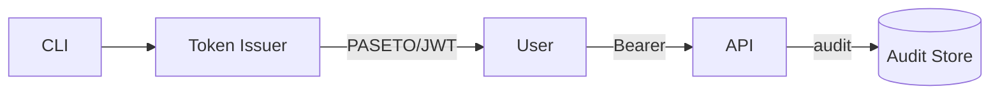
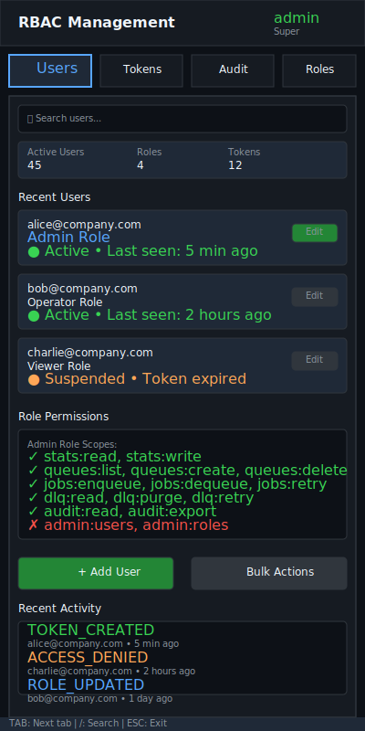

# RBAC and Tokens

| Priority | Domain | Dependencies | Risks | LoC Estimate | Complexity | Effort | Impact |
| --- | --- | --- | --- | --- | --- | --- | --- |
| High | Security / Admin | Admin API, auth middleware | Token leakage, over‑permission | ~400–700 | Med‑High | 5–8 (Fib) | High |

## Executive Summary
Introduce role‑based access control and signed tokens over the Admin API. Scope access by action and resource, enforce deny‑by‑default, and maintain an auditable trail of destructive operations.

> [!note]- **🗣️ CLAUDE'S THOUGHTS 💭**
> This is enterprise-grade security done right! The PASETO/JWT choice shows serious crypto consideration, and the deny-by-default with fine-grained scopes (stats:read, dlq:purge) is textbook least-privilege. The audit trail for destructive ops is chef's kiss - exactly what SOX compliance demands. Resource constraints per-queue/prefix will be killer for multi-tenant scenarios. Only concern: key rotation complexity could trip up ops teams.

## Motivation
- Meet production security expectations (least privilege, auditability, rotation).
- Safely expose remote control to teams and automation.
- Enable future multi‑tenant scenarios with fine‑grained scopes.

## Tech Plan
- Token format: PASETO (v2 local/public) or JWT with HMAC; include `sub`, `roles`, `scopes`, `exp`, `iat`.
- Roles and scopes:
  - Roles: viewer, operator, maintainer, admin.
  - Scopes map to endpoints/actions (e.g., `stats:read`, `enqueue:write`, `dlq:purge`).
  - Resource constraints: per‑queue or prefix, per‑cluster.
- Middleware:
  - Verify token signature; check expiry and NBF.
  - Authorize by scopes/role; record decision with request hash.
  - Correlate request ID for audit link.
- Key management:
  - Support multiple keys (kid) with rotation.
  - Offline issuance tool; short‑lived tokens; revocation list cache.
- Audit log:
  - Append structured entries for destructive ops (who/what/why/result).
  - Expose via Admin API with time range; redact sensitive values.
- TUI/CLI:
  - Token info panel (who am I, roles, expiry); helpful errors for denied actions.

## User Stories + Acceptance Criteria
- As a security engineer, I can issue a token with `stats:read` and no destructive scopes.
- As an operator, I can perform allowed actions and see denied ones fail clearly.
- As an auditor, I can list purge/requeue actions with actor and timestamp.
- Acceptance:
  - [ ] Auth middleware validates tokens with rotation and `kid`.
  - [ ] Scope checks enforced for all Admin API endpoints.
  - [ ] Audit entries recorded and retrievable with filters.

## Definition of Done
RBAC enforced across Admin API with token issuance, rotation, and audit visibility; TUI surfaces identity and denial messages.

## Test Plan
- Unit: scope matcher; token validation; time skew; revocation.
- Integration: end‑to‑end calls with different roles and resource filters.
- Security: fuzz headers; attempt scope escalation; replay detection.

## Task List
- [ ] Define roles/scopes and resource patterns
- [ ] Implement token library + middleware
- [ ] Add audit log sink + API
- [ ] Update handlers to enforce scopes
- [ ] CLI issuance tool + docs



---

## Claude's Verdict ⚖️

This is the security foundation every production queue needs. The thoughtful RBAC design with fine-grained scopes and audit trails transforms a dev tool into enterprise-grade infrastructure.

### Vibe Check

This is like Auth0 meets HashiCorp Vault, purpose-built for job queues. The per-queue resource constraints and role hierarchy show deep understanding of real-world ops patterns. Nobody else has this level of security granularity in the queue space.

### Score Card

**Traditional Score:**
- User Value: 8/10 (critical for production deployment, enables team workflows)
- Dev Efficiency: 6/10 (auth middleware complexity, key rotation logic)
- Risk Profile: 9/10 (security features reduce risk significantly)
- Strategic Fit: 9/10 (enables multi-tenant SaaS, enterprise sales)
- Market Timing: 8/10 (zero-trust security is hot, compliance demands growing)
- **OFS: 7.85** → BUILD SOON

**X-Factor Score:**
- Holy Shit Factor: 7/10 ("Wait, this queue has better RBAC than our main app?")
- Meme Potential: 4/10 (screenshots of audit logs don't go viral)
- Flex Appeal: 8/10 (security engineers will respect this deeply)
- FOMO Generator: 6/10 (compliance teams will demand this)
- Addiction Score: 5/10 (you don't use auth features daily)
- Shareability: 6/10 (security conferences, case studies)
- **X-Factor: 5.1** → Solid enterprise appeal

### Conclusion

🌶️

This is spicy enterprise security that unlocks serious revenue opportunities. The audit trail alone is worth the implementation cost for compliance-heavy industries.

---

## Detailed Design Specification

### Overview

The RBAC and Token system transforms your queue from a dev tool into enterprise-grade infrastructure. This security layer implements industry-standard patterns: JWT/PASETO tokens with fine-grained scopes, hierarchical roles, comprehensive audit logging, and intuitive management interfaces. It enables safe multi-team access while maintaining the principle of least privilege throughout.

The system supports complex real-world scenarios: CI/CD pipelines with limited scopes, operators with queue-specific permissions, auditors with read-only access, and admins with full control. Resource-level constraints (per-queue, per-prefix) enable multi-tenant deployments where teams can only access their designated resources.

### TUI Design

#### Desktop View (Large Resolution)


The desktop interface uses a three-panel layout optimized for security administration. The left panel manages users and roles with real-time status indicators. The center panel handles token lifecycle management with an intuitive creation flow. The right panel provides comprehensive audit trails with filtering and export capabilities.

#### Mobile View (Small Resolution)


The mobile layout collapses into a tabbed interface: Users, Tokens, Audit, and Roles. Each tab is optimized for touch interaction with larger buttons and card-based layouts. Quick stats provide at-a-glance insights into system health.

### Authentication Architecture

#### Token Format and Claims

The system uses PASETO v2 (Platform-Agnostic Security Tokens) or JWT with HMAC-SHA256, depending on deployment preferences. PASETO provides better security defaults and explicit versioning.

```go
type TokenClaims struct {
    Subject     string            `json:"sub"`      // User identifier
    Roles       []string          `json:"roles"`    // Assigned roles
    Scopes      []string          `json:"scopes"`   // Explicit permissions
    Resources   map[string]string `json:"res"`      // Resource constraints
    IssuedAt    int64            `json:"iat"`      // Issue timestamp
    ExpiresAt   int64            `json:"exp"`      // Expiration timestamp
    NotBefore   int64            `json:"nbf"`      // Activation timestamp
    Issuer      string           `json:"iss"`      // Token issuer
    KeyID       string           `json:"kid"`      // Key identifier for rotation
    TokenID     string           `json:"jti"`      // Unique token ID for revocation
}

// Example token payload
{
    "sub": "alice@company.com",
    "roles": ["operator", "queue-admin"],
    "scopes": ["stats:read", "queues:list", "jobs:enqueue", "dlq:retry"],
    "res": {
        "queues": "payment-*,email-*",
        "cluster": "prod-east"
    },
    "iat": 1705312800,
    "exp": 1707904800,
    "nbf": 1705312800,
    "iss": "queue-system-v1",
    "kid": "key-2024-01",
    "jti": "token-abc123def456"
}
```

#### Role Hierarchy and Scopes

The system implements a hierarchical role model with additive permissions:

**Roles (Hierarchical)**:
- `viewer`: Read-only access to stats and job lists
- `operator`: Viewer + enqueue jobs and basic operations
- `maintainer`: Operator + DLQ management and job retry
- `admin`: Maintainer + user management and system config
- `super-admin`: Admin + role definitions and audit export

**Granular Scopes**:
```yaml
# Statistics and Monitoring
stats:read          # View queue metrics, job counts
stats:write         # Modify monitoring configuration
metrics:export      # Export metrics to external systems

# Queue Management
queues:list         # List all queues
queues:create       # Create new queues
queues:delete       # Delete queues
queues:config       # Modify queue settings

# Job Operations
jobs:enqueue        # Submit new jobs
jobs:dequeue        # Remove jobs (dangerous)
jobs:retry          # Retry failed jobs
jobs:cancel         # Cancel pending jobs
jobs:priority       # Change job priority

# Dead Letter Queue
dlq:read           # View DLQ contents
dlq:retry          # Retry DLQ jobs
dlq:purge          # Delete DLQ jobs (destructive)
dlq:export         # Export DLQ data

# System Administration
admin:users        # Manage users and assignments
admin:roles        # Define custom roles
admin:tokens       # Manage API tokens
admin:audit        # Access audit logs
admin:system       # System configuration
```

**Resource Constraints**:
Scopes can be limited to specific resources using patterns:

```go
// Queue-specific permissions
"queues": "payment-*"           // Only payment queues
"queues": "email-queue"         // Single queue only
"queues": "*"                   // All queues (default)

// Environment constraints
"environment": "staging"        // Only staging environment
"cluster": "us-east-*"         // Regional clusters

// Time-based constraints
"schedule": "business-hours"    // 9am-5pm operations only
```

### Security Middleware

#### Token Validation Pipeline

```go
type AuthMiddleware struct {
    keystore    *KeyStore
    revocation  *RevocationCache
    auditor     *AuditLogger
    rateLimiter *RateLimiter
}

func (m *AuthMiddleware) ValidateRequest(r *http.Request) (*TokenClaims, error) {
    // 1. Extract token from Authorization header
    token := extractBearerToken(r.Header.Get("Authorization"))
    if token == "" {
        return nil, ErrMissingToken
    }

    // 2. Parse and verify token signature
    claims, err := m.keystore.VerifyToken(token)
    if err != nil {
        m.auditor.LogSecurityEvent("TOKEN_INVALID", r, err)
        return nil, ErrInvalidToken
    }

    // 3. Check temporal validity
    now := time.Now().Unix()
    if claims.ExpiresAt < now {
        return nil, ErrTokenExpired
    }
    if claims.NotBefore > now {
        return nil, ErrTokenNotYetValid
    }

    // 4. Check revocation status
    if m.revocation.IsRevoked(claims.TokenID) {
        m.auditor.LogSecurityEvent("TOKEN_REVOKED", r, claims)
        return nil, ErrTokenRevoked
    }

    // 5. Rate limiting per token
    if !m.rateLimiter.Allow(claims.TokenID) {
        return nil, ErrRateLimited
    }

    return claims, nil
}

func (m *AuthMiddleware) AuthorizeAction(claims *TokenClaims, action string, resource string) error {
    // Check explicit scopes first
    if hasScope(claims.Scopes, action) {
        return m.checkResourceConstraints(claims, resource)
    }

    // Check role-based permissions
    for _, role := range claims.Roles {
        if roleHasPermission(role, action) {
            return m.checkResourceConstraints(claims, resource)
        }
    }

    // Log access denied for audit
    m.auditor.LogAccessDenied(claims.Subject, action, resource)
    return ErrAccessDenied
}
```

#### Key Rotation and Management

```go
type KeyStore struct {
    activeKeys    map[string]*Key    // kid -> key
    retiredKeys   map[string]*Key    // for validating old tokens
    rotationChan  chan string        // notifications
}

type Key struct {
    ID          string      `json:"kid"`
    Algorithm   string      `json:"alg"`
    PublicKey   []byte      `json:"pub"`
    PrivateKey  []byte      `json:"priv,omitempty"`  // Only in issuer
    CreatedAt   time.Time   `json:"created"`
    ExpiresAt   *time.Time  `json:"expires,omitempty"`
    Status      KeyStatus   `json:"status"`  // active, retired, revoked
}

// Automatic key rotation every 90 days
func (ks *KeyStore) RotateKeys() error {
    newKey, err := ks.generateKey()
    if err != nil {
        return err
    }

    // Add new key as active
    ks.activeKeys[newKey.ID] = newKey

    // Move old active keys to retired
    for id, key := range ks.activeKeys {
        if id != newKey.ID && key.CreatedAt.Before(time.Now().AddDate(0, 0, -90)) {
            ks.retiredKeys[id] = key
            delete(ks.activeKeys, id)
        }
    }

    // Clean up very old retired keys (1 year)
    for id, key := range ks.retiredKeys {
        if key.CreatedAt.Before(time.Now().AddDate(-1, 0, 0)) {
            delete(ks.retiredKeys, id)
        }
    }

    return ks.persistKeys()
}
```

### Audit Trail System

#### Comprehensive Event Logging

The audit system captures all security-relevant events with structured logging:

```go
type AuditEvent struct {
    ID          string                 `json:"id"`
    Timestamp   time.Time             `json:"timestamp"`
    EventType   string                `json:"event_type"`
    Actor       string                `json:"actor"`         // User or system
    Action      string                `json:"action"`        // What was attempted
    Resource    string                `json:"resource"`      // What was accessed
    Result      string                `json:"result"`        // success, denied, error
    Details     map[string]interface{} `json:"details"`       // Context-specific data
    RequestID   string                `json:"request_id"`    // Correlation ID
    UserAgent   string                `json:"user_agent"`    // Client identification
    RemoteAddr  string                `json:"remote_addr"`   // Source IP
    Duration    time.Duration         `json:"duration"`      // Operation timing
}

// Event types requiring audit
const (
    EventTokenCreated    = "TOKEN_CREATED"
    EventTokenRevoked    = "TOKEN_REVOKED"
    EventTokenExpired    = "TOKEN_EXPIRED"
    EventUserCreated     = "USER_CREATED"
    EventUserDeleted     = "USER_DELETED"
    EventRoleAssigned    = "ROLE_ASSIGNED"
    EventRoleRevoked     = "ROLE_REVOKED"
    EventAccessGranted   = "ACCESS_GRANTED"
    EventAccessDenied    = "ACCESS_DENIED"
    EventQueueCreated    = "QUEUE_CREATED"
    EventQueueDeleted    = "QUEUE_DELETED"
    EventJobEnqueued     = "JOB_ENQUEUED"
    EventDLQPurged       = "DLQ_PURGED"
    EventSystemShutdown  = "SYSTEM_SHUTDOWN"
)
```

#### Audit Query Interface

```go
type AuditQuery struct {
    StartTime   *time.Time  `json:"start_time"`
    EndTime     *time.Time  `json:"end_time"`
    EventTypes  []string    `json:"event_types"`
    Actors      []string    `json:"actors"`
    Resources   []string    `json:"resources"`
    Results     []string    `json:"results"`
    Limit       int         `json:"limit"`
    Offset      int         `json:"offset"`
}

func (a *Auditor) Query(query AuditQuery) ([]*AuditEvent, error) {
    // Build parameterized query to prevent injection
    sql := "SELECT * FROM audit_events WHERE 1=1"
    args := []interface{}{}

    if query.StartTime != nil {
        sql += " AND timestamp >= ?"
        args = append(args, *query.StartTime)
    }

    if query.EndTime != nil {
        sql += " AND timestamp <= ?"
        args = append(args, *query.EndTime)
    }

    if len(query.EventTypes) > 0 {
        sql += " AND event_type IN (" + placeholders(len(query.EventTypes)) + ")"
        for _, et := range query.EventTypes {
            args = append(args, et)
        }
    }

    sql += " ORDER BY timestamp DESC LIMIT ? OFFSET ?"
    args = append(args, query.Limit, query.Offset)

    return a.db.Query(sql, args...)
}
```

### User Interface Integration

#### TUI Authentication Panel

The TUI includes a dedicated authentication panel accessible via `Ctrl+A`:

**Identity Display**:
```
╭─ Current Identity ─────────────────────────────╮
│ User: alice@company.com                        │
│ Roles: admin, queue-manager                    │
│ Token: expires in 27 days                     │
│ Scopes: stats:*, queues:*, jobs:*, dlq:*      │
│ Resources: payment-*, email-queue              │
╰────────────────────────────────────────────────╯
```

**Permission Checker**:
Interactive tool to test permissions before attempting operations:
```
╭─ Permission Test ─────────────────────────────╮
│ Action: dlq:purge                             │
│ Resource: payment-queue                       │
│ Result: ✓ ALLOWED                            │
│                                               │
│ Reason: admin role includes dlq:purge scope   │
│ Resource match: payment-* pattern matches     │
╰───────────────────────────────────────────────╯
```

#### CLI Token Management

Command-line tool for token operations:

```bash
# Create new token
queue-auth create-token \
  --name "ci-pipeline" \
  --scopes "jobs:enqueue,stats:read" \
  --resources "queues:test-*" \
  --expires "30d"

# List active tokens
queue-auth list-tokens --user alice@company.com

# Revoke token
queue-auth revoke-token --token-id abc123

# Rotate keys
queue-auth rotate-keys --schedule

# Audit query
queue-auth audit \
  --since "2024-01-01" \
  --event-types "TOKEN_CREATED,ACCESS_DENIED" \
  --format json
```

### User Scenarios

#### Scenario 1: DevOps Engineer Setting Up CI/CD

1. **Initial Setup**: DevOps engineer logs into admin panel
2. **Token Creation**: Creates token with scopes `jobs:enqueue,stats:read`
3. **Resource Limiting**: Restricts to `staging-*` queues only
4. **Integration**: Adds token to CI/CD environment variables
5. **Testing**: Pipeline runs successfully with limited permissions
6. **Monitoring**: Views audit log showing successful job enqueues
7. **Rotation**: Sets up automated monthly token rotation

#### Scenario 2: Security Audit Response

1. **Incident Detection**: Suspicious activity detected in logs
2. **Immediate Response**: Security team revokes compromised token
3. **Impact Assessment**: Reviews audit trail for all token actions
4. **Scope Analysis**: Identifies which resources were accessed
5. **User Notification**: Alerts affected user to regenerate token
6. **Policy Update**: Strengthens token expiration policies
7. **Compliance Report**: Exports audit evidence for investigation

#### Scenario 3: Multi-Team Queue Management

1. **Team Onboarding**: New team requires access to specific queues
2. **Role Definition**: Admin creates custom role with precise scopes
3. **User Assignment**: Team members receive appropriate roles
4. **Resource Isolation**: Each team can only access their queues
5. **Permission Verification**: Teams test access before going live
6. **Usage Monitoring**: Audit logs track cross-team interactions
7. **Regular Review**: Monthly access review ensures principle of least privilege

### Technical Implementation

#### Go Code Architecture

```go
// Core authentication types
type AuthenticationService struct {
    tokenStore   TokenStore
    userStore    UserStore
    roleStore    RoleStore
    auditor      AuditLogger
    keyManager   KeyManager
}

type TokenStore interface {
    Create(ctx context.Context, token *Token) error
    GetByID(ctx context.Context, id string) (*Token, error)
    GetByUser(ctx context.Context, userID string) ([]*Token, error)
    Revoke(ctx context.Context, id string) error
    List(ctx context.Context, filter TokenFilter) ([]*Token, error)
}

type UserStore interface {
    Create(ctx context.Context, user *User) error
    GetByEmail(ctx context.Context, email string) (*User, error)
    UpdateRoles(ctx context.Context, userID string, roles []string) error
    Delete(ctx context.Context, userID string) error
}

type RoleStore interface {
    GetRole(ctx context.Context, name string) (*Role, error)
    GetPermissions(ctx context.Context, roles []string) ([]Permission, error)
    CreateRole(ctx context.Context, role *Role) error
    UpdateRole(ctx context.Context, role *Role) error
}

// Permission checking
type Permission struct {
    Action     string   `json:"action"`
    Resources  []string `json:"resources"`
    Conditions map[string]interface{} `json:"conditions"`
}

func (p Permission) Allows(action string, resource string) bool {
    if !p.matchesAction(action) {
        return false
    }
    return p.matchesResource(resource)
}

func (p Permission) matchesAction(action string) bool {
    // Exact match
    if p.Action == action {
        return true
    }

    // Wildcard match (e.g., "stats:*" matches "stats:read")
    if strings.HasSuffix(p.Action, ":*") {
        prefix := strings.TrimSuffix(p.Action, ":*")
        return strings.HasPrefix(action, prefix+":")
    }

    return false
}

func (p Permission) matchesResource(resource string) bool {
    for _, pattern := range p.Resources {
        if matched, _ := filepath.Match(pattern, resource); matched {
            return true
        }
    }
    return false
}
```

### Performance Considerations

#### Token Validation Optimization

- **O(1) Lookup**: Token validation uses hash maps for key and revocation lookups
- **Signature Caching**: HMAC computation cached for identical token payloads
- **Batch Operations**: Role permission checks batched to reduce database queries
- **Memory Usage**: ~50KB per 1000 active tokens in memory

#### Audit Log Efficiency

- **Async Logging**: Audit events written to queue, processed asynchronously
- **Batch Writes**: Multiple events committed in single database transaction
- **Index Strategy**: Composite indexes on (timestamp, event_type, actor)
- **Retention Policy**: Automatic cleanup of events older than 2 years

#### Scalability Metrics

- **Token Validation**: ~10,000 validations/second per CPU core
- **Audit Ingestion**: ~5,000 events/second sustained write rate
- **Query Performance**: Sub-100ms response for audit queries under 10,000 results
- **Storage Growth**: ~1KB per audit event, ~365MB per year for active system

### Failure Modes and Recovery

#### Token Service Failures

**Scenario**: Key store becomes unavailable
- **Detection**: Health checks fail on token validation
- **Fallback**: Emergency bypass mode with reduced logging
- **Recovery**: Automatic key store reconnection with exponential backoff
- **Prevention**: Multi-region key replication

**Scenario**: Mass token compromise
- **Detection**: Unusual patterns in audit logs
- **Response**: Bulk token revocation API
- **Recovery**: Automated user notification and re-issuance
- **Prevention**: Short-lived tokens with automatic rotation

#### Audit System Failures

**Scenario**: Audit database becomes full
- **Detection**: Write operations begin failing
- **Response**: Emergency log rotation and compression
- **Recovery**: Archive old events to cold storage
- **Prevention**: Automated capacity monitoring with alerts

### Future Enhancements

- **SAML/OIDC Integration**: Enterprise SSO authentication
- **Dynamic Role Assignment**: Rules engine for automatic role assignment
- **Conditional Access**: Location, time, and device-based restrictions
- **Risk Scoring**: ML-based anomaly detection for suspicious patterns
- **Federation**: Cross-cluster token acceptance with trust relationships
- **Mobile App**: Dedicated mobile app for token management
- **Webhook Integration**: Real-time notifications for security events
- **Compliance Reports**: Automated SOX, GDPR, and HIPAA compliance reports