# Right‑click Context Menus

| Priority | Domain | Dependencies | Risks | LoC Estimate | Complexity | Effort | Impact |
| --- | --- | --- | --- | --- | --- | --- | --- |
| Medium | TUI UX | `bubblezone` hitboxes, action registry, overlays | Destructive misclicks, discoverability | ~250–400 | Medium | 3 (Fib) | Medium‑High |

## Executive Summary
Add contextual menus on right‑click (and `m`) across the TUI to expose actions where users are looking: peek, requeue, purge (confirmed), copy payload/key, open trace, export sample. Menus appear adjacent to the cursor with precise hitboxes and keyboard fallbacks.

> [!note]- **🗣️ CLAUDE'S THOUGHTS 💭**
> THIS is how you make terminal apps feel modern! Right-click is muscle memory for everyone. The bubblezone integration for precise hitboxes is crucial - nothing worse than clicking the wrong row. Consider adding copy-paste actions (copy job ID, copy payload JSON). Also, a "Send to..." submenu that integrates with other tools would be killer. Make sure the menus are FAST - any lag kills the magic.

## Motivation
- Speed common actions and reduce cognitive load.
- Surface advanced operations without cluttering primary views.
- Improve mouse UX to match keyboard parity.

## Tech Plan
- Hitboxes: integrate `bubblezone` to register zones for tabs, table rows, charts, and info regions.
- Menu widget: lightweight overlay with items, accelerators, and disabled states; auto‑positions within viewport.
- Action registry: map context (e.g., queue row, DLQ item) to available actions with capability checks.
- Safety: destructive items require confirm modal; show exact scope (e.g., “Purge DLQ dead_letter (123 items)”).
- Keyboard parity: `m` opens context menu for the focused item; arrow/enter to select.
- Extensibility: plug new actions via registry to avoid scattering logic.

## User Stories + Acceptance Criteria
- As a user, I can right‑click a queue row and choose Peek or Enqueue.
- As an operator, I can right‑click DLQ items and Requeue/Purge with confirmation.
- Acceptance:
  - [ ] Precise hitboxes with `bubblezone` on rows/tabs.
  - [ ] Context menu overlays with keyboard + mouse interaction.
  - [ ] Destructive actions gated with explicit confirmation.

## Definition of Done
Context menus enabled on Job Queue and DLQ tabs with essential actions and confirmations; help overlay updated with hints.

## Test Plan
- Unit: action resolution given context; confirm flows.
- Manual: mouse targeting accuracy; menu positioning at edges; keyboard fallback.

## Task List
- [ ] Integrate `bubblezone` and register zones
- [ ] Build menu overlay component
- [ ] Implement action registry + confirm hooks
- [ ] Wire menus in Queues + DLQ
- [ ] Update help/docs

```mermaid
sequenceDiagram
  participant U as User
  participant T as TUI
  U->>T: Right‑click queue row
  T->>T: Resolve available actions
  T-->>U: Show menu near cursor
  U->>T: Click Requeue
  T-->>U: Confirm modal
```

---

## Claude's Verdict ⚖️

This bridges the terminal-GUI gap beautifully. Low effort, high polish payoff.

### Vibe Check

VSCode in terminal vibes. Makes power users faster and newcomers comfortable.

### Score Card

**Traditional Score:**
- User Value: 8/10 (massive UX improvement)
- Dev Efficiency: 8/10 (3 Fib, clear scope)
- Risk Profile: 7/10 (destructive action risk)
- Strategic Fit: 7/10 (modern UX expectation)
- Market Timing: 7/10 (overdue for terminals)
- **OFS: 7.45** → BUILD SOON

**X-Factor Score:**
- Holy Shit Factor: 5/10 ("Right-click in terminal!")
- Meme Potential: 3/10 (not screenshot worthy)
- Flex Appeal: 6/10 ("Full mouse support")
- FOMO Generator: 4/10 (expected these days)
- Addiction Score: 7/10 (used constantly)
- Shareability: 4/10 (mentioned in reviews)
- **X-Factor: 4.1** → Moderate viral potential

### Conclusion

[🖱️]

Essential polish that makes everything feel premium. Ship this early - it makes every other feature better.

---
feature: right-click-context-menus
dependencies:
  hard:
    - tui_framework
    - bubblezone
  soft:
    - admin_api
enables:
  - improved_ux
  - quick_actions
  - contextual_operations
provides:
  - context_menus
  - mouse_integration
  - action_shortcuts
  - menu_system
---