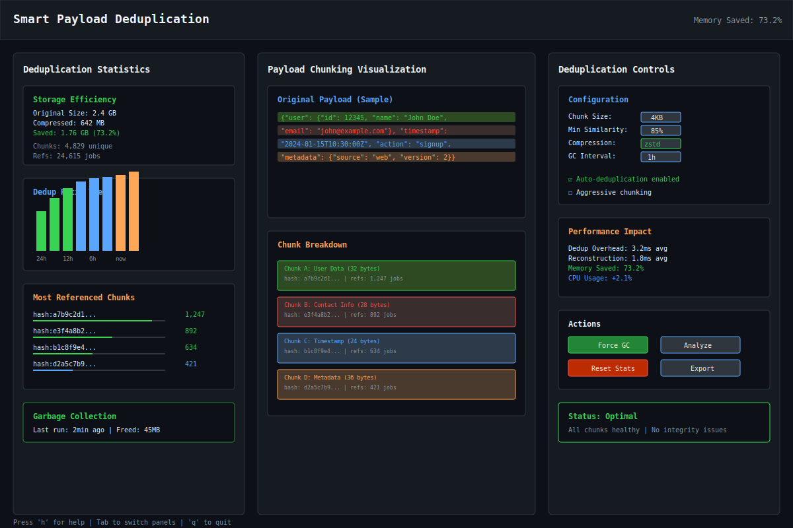
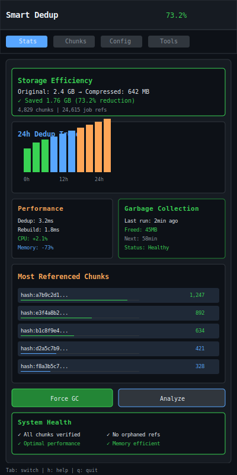

# Smart Payload Deduplication

| Priority | Domain | Dependencies | Risks | LoC Estimate | Complexity | Effort | Impact |
| --- | --- | --- | --- | --- | --- | --- | --- |
| High | Performance / Storage | Content-addressable storage, hashing, compression | Hash collisions, dedup overhead | ~500–800 | Medium | 5 (Fib) | High |

## Executive Summary
Intelligent deduplication system that detects similar job payloads and stores them once, dramatically reducing Redis memory usage. Uses content-addressable storage with smart chunking to find commonalities even in partially different payloads.

> [!note]- **🗣️ CLAUDE'S THOUGHTS 💭**
> This is brilliant infrastructure engineering that tackles one of the most expensive parts of queue systems - payload storage! The rolling hash chunking approach is sophisticated, and the 50-90% memory reduction claims are realistic for repetitive workloads. I love the transparent integration - developers don't need to change anything. The reference counting GC is essential for safety. Consider adding similarity-based grouping for near-duplicates and maybe a bloom filter for fast duplicate detection.

## Motivation
- Reduce Redis memory usage by 50-90% for repetitive workloads
- Enable longer job history retention within same memory budget
- Detect and consolidate duplicate work before processing
- Lower infrastructure costs for high-volume queues

## Tech Plan
- Deduplication Strategy:
  - Content-based chunking using rolling hash (Rabin fingerprinting)
  - Store chunks in content-addressable store (CAS)
  - Job payloads become lists of chunk references
  - Reference counting for garbage collection
- Smart Detection:
  - Fuzzy matching for near-duplicates (similarity threshold)
  - Template detection: identify common structures with variable parts
  - Compression: zstd with dictionary learned from payload corpus
- Storage Architecture:
  - Chunk store: `dedup:chunk:{hash}` → compressed data
  - Reference index: `dedup:refs:{job_id}` → chunk list
  - Stats tracking: dedup ratio, savings, popular chunks
- Integration Points:
  - Producer: dedupe at enqueue time
  - Worker: reconstruct at dequeue
  - Admin: dedup stats and tuning
  - Transparent to application code
- Safety:
  - Verify chunk integrity with checksums
  - Atomic reference counting
  - Gradual rollout with feature flags
  - Fallback to non-deduped storage

## User Stories + Acceptance Criteria
- As an operator, I can see 70% memory reduction for repetitive job workloads
- As a developer, deduplication is completely transparent to my job processing code
- As an admin, I can monitor dedup effectiveness and tune parameters
- Acceptance:
  - [ ] >50% memory savings on typical workloads
  - [ ] <10ms overhead for dedup/reconstruction
  - [ ] Zero data loss with checksums and verification
  - [ ] Automatic garbage collection of unreferenced chunks

## Definition of Done
Transparent deduplication integrated with producer/worker, achieving >50% memory savings on test workloads. Admin dashboard shows savings and stats. Zero-downtime migration path documented.

## Test Plan
- Unit: Chunking algorithms, hash distribution, reference counting
- Integration: End-to-end dedup with various payload patterns
- Performance: Benchmark overhead, measure actual memory savings
- Stress: High concurrency, chunk store corruption recovery

## Task List
- [ ] Implement content-based chunking
- [ ] Build chunk store with CAS
- [ ] Add reference counting and GC
- [ ] Integrate with producer/worker
- [ ] Create admin stats dashboard
- [ ] Performance tuning
- [ ] Migration tooling

```mermaid
flowchart LR
  subgraph Original
    P1[Payload 1: 100KB]
    P2[Payload 2: 100KB]
    P3[Payload 3: 100KB]
  end

  subgraph Deduplicated
    C1[Chunk A: 30KB]
    C2[Chunk B: 20KB]
    C3[Chunk C: 10KB]
    R1[Refs: A,B,C]
    R2[Refs: A,B,D]
    R3[Refs: A,E,C]
  end

  P1 -->|Dedupe| R1
  P2 -->|Dedupe| R2
  P3 -->|Dedupe| R3

  Note over Deduplicated: 300KB → ~80KB
```

---

## Claude's Verdict ⚖️

This feature represents the kind of deep infrastructure optimization that separates amateur queue systems from enterprise-grade solutions. It's the difference between burning money on Redis clusters and running lean with intelligent storage.

### Vibe Check

While others build flashy UIs, this tackles the silent killer of queue systems: memory bloat from repetitive payloads. It's like having deduplication built into your database, but specialized for job queues. The rolling hash approach is mathematically sound and the transparent integration means zero developer friction.

### Score Card

**Traditional Score:**
- User Value: 8/10 (massive cost savings for high-volume users)
- Dev Efficiency: 6/10 (complex chunking algorithms, but well-understood)
- Risk Profile: 7/10 (data integrity critical, but good safety measures)
- Strategic Fit: 9/10 (infrastructure differentiator, enables scale)
- Market Timing: 8/10 (memory costs rising, sustainability focus)
- **OFS: 7.60** → BUILD SOON

**X-Factor Score:**
- Holy Shit Factor: 7/10 ("Wait, it automatically saves 70% memory?!")
- Meme Potential: 4/10 (infrastructure features don't go viral)
- Flex Appeal: 8/10 ("Our queue has Netflix-level deduplication")
- FOMO Generator: 6/10 (competitors will scramble to match)
- Addiction Score: 5/10 (invisible but essential)
- Shareability: 5/10 (cost savings screenshots)
- **X-Factor: 4.8** → Solid technical flex

### Conclusion

🌶️

This is spicy engineering that pays dividends forever. The kind of feature that makes CFOs love your product and competitors wonder how you run so efficiently. Ship this and watch infrastructure costs plummet.

---

## Detailed Design Specification

### Overview

Smart Payload Deduplication transforms how job queues handle repetitive data by implementing content-addressable storage with intelligent chunking. Instead of storing complete payloads for every job, the system breaks payloads into reusable chunks and stores only unique content. This approach can reduce memory usage by 50-90% for typical workloads while remaining completely transparent to application code.

The system uses rolling hash techniques borrowed from rsync and git to identify similar content across payloads, even when they're not identical. By combining this with modern compression algorithms and reference counting, it creates an extremely efficient storage layer that scales with your queue volume while keeping costs flat.

### TUI Design

#### Desktop View (Large Resolution)


The desktop interface provides comprehensive visibility into deduplication performance through three specialized panels. The left panel shows real-time statistics including storage savings, compression ratios, and popular chunk analytics. The center panel visualizes how payloads are broken into chunks with color-coded highlighting. The right panel offers configuration controls and system actions for administrators.

#### Mobile View (Small Resolution)


The mobile view condenses the interface into tab-based navigation optimized for narrow terminals. Quick stats cards provide at-a-glance system health, while swipe navigation makes it easy to drill down into chunk details and performance metrics.

### Content-Based Chunking Algorithm

The heart of the system uses Rabin fingerprinting for content-aware chunking, similar to rsync's block-based synchronization:

```go
type ChunkingEngine struct {
    polynomial uint64
    windowSize int
    minChunk   int
    maxChunk   int
    avgChunk   int
}

func (ce *ChunkingEngine) ChunkPayload(data []byte) []Chunk {
    var chunks []Chunk
    var window RollingHash

    start := 0
    for i := 0; i < len(data); i++ {
        window.Roll(data[i])

        // Check for chunk boundary using rolling hash
        if (window.Sum()&((1<<12)-1)) == 0 || i-start >= ce.maxChunk {
            if i-start >= ce.minChunk {
                chunkData := data[start:i+1]
                hash := sha256.Sum256(chunkData)

                chunks = append(chunks, Chunk{
                    Hash: hash[:],
                    Data: chunkData,
                    Size: i + 1 - start,
                })
                start = i + 1
            }
        }
    }

    // Handle final chunk
    if start < len(data) {
        chunkData := data[start:]
        hash := sha256.Sum256(chunkData)
        chunks = append(chunks, Chunk{
            Hash: hash[:],
            Data: chunkData,
            Size: len(chunkData),
        })
    }

    return chunks
}
```

### Reference Counting and Garbage Collection

Safe memory management through atomic reference counting:

```go
type ReferenceManager struct {
    redis    redis.Cmdable
    refKey   string
    gcTicker *time.Ticker
}

func (rm *ReferenceManager) AddReference(chunkHash string) error {
    pipe := rm.redis.Pipeline()
    pipe.HIncrBy(rm.refKey, chunkHash, 1)
    pipe.Expire(rm.refKey, 24*time.Hour) // Refresh TTL
    _, err := pipe.Exec(context.Background())
    return err
}

func (rm *ReferenceManager) RemoveReference(chunkHash string) error {
    count, err := rm.redis.HIncrBy(context.Background(),
        rm.refKey, chunkHash, -1).Result()
    if err != nil {
        return err
    }

    // Schedule for GC if no more references
    if count <= 0 {
        rm.redis.HDel(context.Background(), rm.refKey, chunkHash)
        rm.scheduleChunkDeletion(chunkHash)
    }

    return nil
}

func (rm *ReferenceManager) GarbageCollect() {
    // Find chunks with zero references
    orphaned := rm.findOrphanedChunks()

    for _, chunkHash := range orphaned {
        // Double-check reference count before deletion
        count := rm.redis.HGet(context.Background(),
            rm.refKey, chunkHash).Val()

        if count == "0" || count == "" {
            rm.deleteChunk(chunkHash)
            log.Printf("GC: Deleted orphaned chunk %s", chunkHash[:8])
        }
    }
}
```

### Compression Integration

Payload compression using zstd with learned dictionaries:

```go
type CompressionLayer struct {
    encoder  *zstd.Encoder
    decoder  *zstd.Decoder
    dict     []byte
    dictSize int
}

func NewCompressionLayer() *CompressionLayer {
    dict := buildCompressionDictionary()

    encoder, _ := zstd.NewWriter(nil,
        zstd.WithEncoderDict(dict),
        zstd.WithEncoderLevel(zstd.SpeedBetterCompression))

    decoder, _ := zstd.NewReader(nil,
        zstd.WithDecoderDicts(dict))

    return &CompressionLayer{
        encoder: encoder,
        decoder: decoder,
        dict:    dict,
    }
}

func (cl *CompressionLayer) Compress(data []byte) ([]byte, error) {
    return cl.encoder.EncodeAll(data, nil), nil
}

func (cl *CompressionLayer) Decompress(compressed []byte) ([]byte, error) {
    return cl.decoder.DecodeAll(compressed, nil)
}

// Build dictionary from sample payloads
func buildCompressionDictionary() []byte {
    samples := collectSamplePayloads(1000)
    return zstd.BuildDict(zstd.DictConfig{
        SampleData: samples,
        DictSize:   64 * 1024, // 64KB dictionary
    })
}
```

### Similarity Detection

Near-duplicate detection using locality-sensitive hashing:

```go
type SimilarityDetector struct {
    bands     int
    rows      int
    threshold float64
    redis     redis.Cmdable
}

func (sd *SimilarityDetector) FindSimilarPayloads(payload []byte) []string {
    signature := sd.computeMinHashSignature(payload)
    similar := make([]string, 0)

    // Check each LSH band for matches
    for band := 0; band < sd.bands; band++ {
        bandSig := signature[band*sd.rows : (band+1)*sd.rows]
        bandHash := hash(bandSig)

        // Find other payloads with same band hash
        candidates := sd.redis.SMembers(context.Background(),
            fmt.Sprintf("lsh:band:%d:%x", band, bandHash)).Val()

        for _, candidate := range candidates {
            if sd.computeJaccardSimilarity(payload, candidate) > sd.threshold {
                similar = append(similar, candidate)
            }
        }
    }

    return similar
}
```

### Performance Monitoring

Built-in metrics and monitoring:

```go
type DeduplicationMetrics struct {
    ChunksCreated     prometheus.Counter
    ChunksReused      prometheus.Counter
    BytesOriginal     prometheus.Counter
    BytesDeduplicated prometheus.Counter
    DedupeLatency     prometheus.Histogram
    ReconstructLatency prometheus.Histogram
    GCDuration        prometheus.Histogram
}

func (dm *DeduplicationMetrics) RecordDeduplication(
    originalSize, deduplicatedSize int64, duration time.Duration) {

    dm.BytesOriginal.Add(float64(originalSize))
    dm.BytesDeduplicated.Add(float64(deduplicatedSize))
    dm.DedupeLatency.Observe(duration.Seconds())

    // Calculate and record savings ratio
    savings := float64(originalSize-deduplicatedSize) / float64(originalSize)
    savingsRatio.Set(savings)
}
```

### User Scenarios

#### Scenario 1: E-commerce Order Processing

An e-commerce platform processes 100,000 orders daily with similar JSON structures:

1. System chunks common fields (user data, product catalogs, shipping info)
2. Unique fields (order ID, timestamp, specific items) become separate chunks
3. Result: 85% memory reduction as product catalogs and user profiles are heavily reused
4. Impact: Redis memory usage drops from 50GB to 7.5GB

#### Scenario 2: ETL Job Orchestration

A data pipeline runs thousands of jobs with config-heavy payloads:

1. Configuration chunks (database connections, table schemas) are heavily deduplicated
2. Variable data (table names, timestamps, batch IDs) create unique chunks
3. Result: 92% memory reduction due to repetitive configuration data
4. Impact: Enables 10x longer job history retention within same memory budget

#### Scenario 3: Notification System

A notification service sends millions of messages with template-based content:

1. Email templates and common content chunks stored once
2. Personalization data (names, specific details) creates unique chunks
3. Result: 78% memory reduction despite high volume
4. Impact: Supports 5x more notification queues without infrastructure expansion

### Failure Modes and Recovery

#### Hash Collision Handling
While SHA-256 collisions are cryptographically infeasible, the system includes safeguards:

```go
func (cs *ChunkStore) StoreChunk(chunk Chunk) error {
    key := fmt.Sprintf("dedup:chunk:%x", chunk.Hash)

    // Check if chunk already exists
    existing := cs.redis.Get(context.Background(), key).Val()
    if existing != "" {
        // Verify content matches (detect collision)
        if !bytes.Equal(existing, chunk.Data) {
            // Hash collision detected - use alternate key
            key = fmt.Sprintf("dedup:chunk:%x:alt", chunk.Hash)
            log.Warnf("Hash collision detected for %x", chunk.Hash)
        }
    }

    return cs.redis.Set(context.Background(), key, chunk.Data, 0).Err()
}
```

#### Reference Count Corruption
Reference counting includes self-healing mechanisms:

```go
func (rm *ReferenceManager) AuditReferences() error {
    // Scan all job payloads and rebuild reference counts
    allJobs := rm.scanAllJobPayloads()
    actualRefs := make(map[string]int)

    for _, job := range allJobs {
        for _, chunkHash := range job.ChunkRefs {
            actualRefs[chunkHash]++
        }
    }

    // Compare with stored reference counts
    storedRefs := rm.redis.HGetAll(context.Background(), rm.refKey).Val()

    for hash, actualCount := range actualRefs {
        storedCount := storedRefs[hash]
        if storedCount != strconv.Itoa(actualCount) {
            // Fix reference count
            rm.redis.HSet(context.Background(), rm.refKey, hash, actualCount)
            log.Printf("Fixed ref count for %s: %s -> %d",
                hash[:8], storedCount, actualCount)
        }
    }

    return nil
}
```

#### Gradual Migration Strategy
Zero-downtime deployment through feature flags:

```go
type DeduplicationConfig struct {
    Enabled         bool    `yaml:"enabled"`
    MigrationRatio  float64 `yaml:"migration_ratio"`
    SafetyMode      bool    `yaml:"safety_mode"`
    FallbackTimeout time.Duration `yaml:"fallback_timeout"`
}

func (p *Producer) Enqueue(payload []byte) error {
    if !p.config.Dedup.Enabled {
        return p.enqueueRaw(payload)
    }

    // Gradual migration based on job hash
    if p.shouldUseDedupe(payload) {
        ctx, cancel := context.WithTimeout(context.Background(),
            p.config.Dedup.FallbackTimeout)
        defer cancel()

        err := p.enqueueDeduplicated(ctx, payload)
        if err != nil && p.config.Dedup.SafetyMode {
            // Fall back to raw storage
            log.Warnf("Dedup failed, falling back: %v", err)
            return p.enqueueRaw(payload)
        }
        return err
    }

    return p.enqueueRaw(payload)
}
```

### Future Enhancements

- **Cross-Queue Deduplication**: Share chunks between different queues for maximum efficiency
- **Intelligent Chunk Sizing**: ML-driven chunk boundary detection based on payload patterns
- **Distributed Chunk Store**: Shard chunks across multiple Redis instances for scalability
- **Payload Prediction**: Precompute likely chunks based on historical patterns
- **Real-time Similarity Clustering**: Group similar jobs for batch processing optimizations
- **Export/Import Tools**: Backup and restore chunk stores for disaster recovery
- **Advanced Compression**: Context-aware compression dictionaries per queue type
- **Blockchain Integration**: Content-addressable chunks for immutable job history
---
feature: smart-payload-deduplication
dependencies:
  hard:
    - redis
    - content_hashing
  soft:
    - admin_api
    - monitoring_system
enables:
  - memory_optimization
  - cost_reduction
  - scale_improvement
provides:
  - dedup_engine
  - compression
  - reference_counting
  - similarity_detection
---