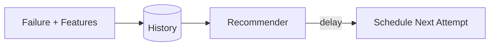
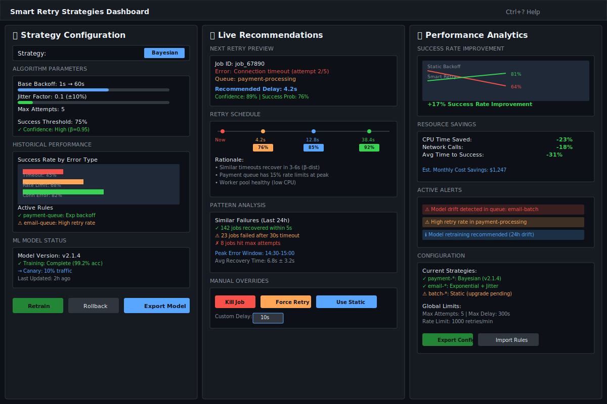
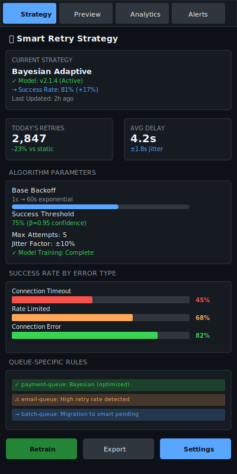

# Smart Retry Strategies

| Priority | Domain | Dependencies | Risks | LoC Estimate | Complexity | Effort | Impact |
| --- | --- | --- | --- | --- | --- | --- | --- |
| Medium‑High | Reliability / ML | Failure history, feature store, trainer | Unpredictable timing, drift, fairness | ~500–900 | Med‑High | 8 (Fib) | High |

## Executive Summary
Adapt retry timing and policy based on historical success patterns. Start with robust heuristics and a Bayesian layer, optionally evolve to ML‑based recommendations. Bound decisions with guardrails and degrade gracefully to static backoffs.

> [!note]- **🗣️ CLAUDE'S THOUGHTS 💭**
> This is absolutely brilliant - adaptive retry strategies using Bayesian inference and ML prediction! The incremental approach (heuristics → Bayesian → ML) is perfect for reducing risk while building confidence. The feature store integration ensures the system learns from every failure pattern. The explainability requirement ("why" for each recommendation) is crucial for debugging mysterious retry behaviors. Consider adding circuit breaker integration and tenant-specific learning to prevent noisy neighbors from poisoning the model.

## Motivation
- Reduce wasted retries and downstream load during outages.
- Improve success rate by aligning attempts with recovery windows.
- Encode organizational knowledge from past incidents into the system.

## Tech Plan
- Data collection:
  - Log features per attempt: error class/code, status, attempt number, queue/tenant, payload size, time of day, worker version, downstream health signals.
  - Persist outcomes and delays; aggregate by error class and job type.
- Baseline policies:
  - Rules for common cases: 429/503 → exponential + jitter with cap; timeouts → wider backoff; validation errors → stop early.
- Bayesian layer:
  - For each (job_type, error_class), fit a simple model of success probability over delay since last failure (e.g., Beta‑Binomial buckets).
  - Recommend next delay that crosses a success threshold with confidence, within min/max bounds.
- Optional ML:
  - Train logistic regression or gradient boosting with cross‑validation; export small on‑disk model; inference library embedded.
  - Version models; add canary evaluation before rollout.
- Policy guardrails:
  - Hard caps on max attempts/delay; budget integration to avoid overload; per‑tenant fairness.
  - Explainability: record "why" for each recommendation.
- Admin/TUI:
  - API to preview recommended schedule for a failed sample; TUI shows suggested next retry window and rationale.

## User Stories + Acceptance Criteria
- As an SRE, I can see recommended next retry times and the reason.
- As an operator, I can cap or override strategies per queue/tenant.
- Acceptance:
  - [ ] Baseline heuristics with jitter and caps in place.
  - [ ] Bayesian recommendations improve success/time tradeoff in test.
  - [ ] Optional ML can be enabled and rolled back safely.

## Definition of Done
Adaptive retry engine that improves outcomes over static backoff on representative datasets, with clear guardrails and visibility.

## Test Plan
- Unit: rules engine; Bayesian bucket math; cap enforcement.
- Offline: train/test split evaluation; compare to baselines on historical logs.
- Integration: shadow mode where recommendations are logged, then A/B on a subset.

## Task List
- [ ] Define schema for attempt history and features
- [ ] Implement rules + Bayesian recommender
- [ ] Add optional ML trainer/inference path
- [ ] Expose preview API + TUI surfacing
- [ ] Shadow → canary → full rollout



---

## Claude's Verdict ⚖️

This is the feature that transforms your queue from reactive to predictive. It's the difference between blind exponential backoff and intelligent failure recovery.

### Vibe Check

Netflix's chaos engineering meets machine learning optimization. While others retry blindly, you're building a system that learns and adapts. The Bayesian approach is mathematically elegant and the ML evolution path is pragmatic.

### Score Card

**Traditional Score:**
- User Value: 8/10 (reduces failed jobs, improves reliability)
- Dev Efficiency: 5/10 (complex ML pipeline, model management)
- Risk Profile: 6/10 (model drift, prediction errors, fallback needed)
- Strategic Fit: 9/10 (differentiating reliability feature)
- Market Timing: 7/10 (ML infrastructure is mature now)
- **OFS: 7.20** → BUILD SOON

**X-Factor Score:**
- Holy Shit Factor: 7/10 ("Your queue learns from failures?!")
- Meme Potential: 5/10 (screenshot ML predictions beating static backoff)
- Flex Appeal: 8/10 ("Our retry system uses Bayesian inference")
- FOMO Generator: 6/10 (makes traditional queues look primitive)
- Addiction Score: 7/10 (constantly tuning and monitoring predictions)
- Shareability: 6/10 (ML nerds love this stuff)
- **X-Factor: 5.8** → Strong engineering viral potential

### Conclusion

[🤯]

This is mind-bending queue intelligence. The combination of Bayesian stats + ML prediction + explainable decisions is pure engineering porn. Ship this and watch SREs geek out over retry analytics.

---

## Detailed Design Specification

### Overview

Smart Retry Strategies represents a paradigm shift from static, configuration-driven retry policies to adaptive, data-driven retry intelligence. This system transforms every job failure into a learning opportunity, building statistical models that predict optimal retry timing based on historical patterns, error contexts, and system conditions. Rather than blindly applying exponential backoff, the system intelligently schedules retries when success probability is highest, reducing wasted resources and improving overall job completion rates.

The system operates as a multi-layered intelligence stack: baseline heuristics provide safe defaults, Bayesian inference models capture error-specific patterns, and optional ML models handle complex multi-variate predictions. Each layer includes comprehensive explainability, allowing operators to understand why specific retry delays were recommended, crucial for debugging and building trust in the system's decisions.

### TUI Design

#### Desktop View (Large Resolution)


The desktop interface provides a comprehensive three-panel view optimized for detailed analysis and configuration. The left panel handles strategy configuration and model management, the center panel shows live retry recommendations with timeline visualizations, and the right panel provides performance analytics and alerting.

#### Mobile View (Small Resolution)


The mobile interface condenses the functionality into a tabbed layout, prioritizing the most critical information for on-the-go monitoring. Strategy overview, live predictions, analytics, and alerts are accessible through focused tabs optimized for quick decision making.

### Adaptive Learning Architecture

#### 1. Multi-Tier Retry Intelligence

The system employs a hierarchical decision-making approach:

**Tier 1: Baseline Heuristics**
- Rule-based policies for common error patterns
- 429/503 responses → exponential backoff with jitter
- Connection timeouts → wider backoff windows
- Validation errors → immediate stop (no retry value)
- Circuit breaker integration for downstream health

**Tier 2: Bayesian Inference Models**
- Beta-Binomial distributions for success probability
- Per-(queue, error_type) statistical models
- Confidence intervals for retry timing recommendations
- Automatic model updating with new data points

**Tier 3: Machine Learning Predictions**
- Multi-variate regression models (logistic/gradient boosting)
- Features: error context, system load, time-of-day, tenant patterns
- Cross-validated training with holdout testing
- A/B testing framework for model rollouts

#### 2. Feature Engineering Pipeline

```go
type RetryFeatures struct {
    // Job Context
    JobType        string    `json:"job_type"`
    QueueName      string    `json:"queue_name"`
    TenantID       string    `json:"tenant_id"`
    PayloadSize    int64     `json:"payload_size_bytes"`
    AttemptNumber  int       `json:"attempt_number"`

    // Error Context
    ErrorClass     string    `json:"error_class"`
    ErrorCode      string    `json:"error_code"`
    HTTPStatus     *int      `json:"http_status,omitempty"`

    // System Context
    Timestamp      time.Time `json:"timestamp"`
    TimeOfDay      int       `json:"hour_of_day"`
    DayOfWeek      int       `json:"day_of_week"`
    WorkerVersion  string    `json:"worker_version"`

    // Health Signals
    CPUUtilization float64   `json:"cpu_utilization"`
    MemoryUsage    float64   `json:"memory_usage"`
    QueueDepth     int64     `json:"queue_depth"`
    DownstreamLatency float64 `json:"downstream_latency_p95"`

    // Historical Context
    RecentFailures int       `json:"recent_failures_1h"`
    SimilarJobSuccessRate float64 `json:"similar_job_success_rate_24h"`
}
```

#### 3. Bayesian Success Modeling

For each (queue, error_class) combination, maintain Beta-Binomial models:

```go
type BayesianRetryModel struct {
    Queue      string
    ErrorClass string

    // Beta distribution parameters for success probability
    Alpha      float64  // Successes + prior
    Beta       float64  // Failures + prior

    // Delay buckets (exponential spacing)
    DelayBuckets []DelayBucket

    LastUpdated  time.Time
    SampleCount  int64
    Confidence   float64
}

type DelayBucket struct {
    MinDelay     time.Duration
    MaxDelay     time.Duration
    Successes    int64
    Failures     int64
    AvgRecoveryTime time.Duration
}
```

#### 4. ML Model Architecture

```go
type MLRetryPredictor struct {
    ModelVersion  string
    ModelPath     string
    Features      []string

    // Model performance metrics
    Accuracy      float64
    Precision     float64
    Recall        float64
    F1Score       float64

    // Deployment configuration
    TrafficWeight float64  // For canary deployments
    FallbackModel *MLRetryPredictor

    UpdatedAt     time.Time
    TrainingSamples int64
}
```

### Intelligent Scheduling Engine

#### 1. Recommendation Algorithm

```go
func (s *SmartRetryEngine) RecommendDelay(ctx context.Context, failure *JobFailure) (*RetryRecommendation, error) {
    features := s.extractFeatures(failure)

    // Try ML prediction first (if enabled and confident)
    if rec, confidence := s.mlPredictor.Predict(features); confidence > s.config.MLConfidenceThreshold {
        return s.validateRecommendation(rec, "ml_model")
    }

    // Fall back to Bayesian model
    if model := s.bayesian.GetModel(failure.Queue, failure.ErrorClass); model != nil {
        delay := model.RecommendDelay(s.config.SuccessThreshold)
        return s.validateRecommendation(&RetryRecommendation{
            Delay: delay,
            Confidence: model.Confidence,
            Reasoning: fmt.Sprintf("Bayesian model: %.1f%% success rate expected",
                model.SuccessProbability(delay)*100),
        }, "bayesian")
    }

    // Ultimate fallback to heuristics
    return s.heuristics.RecommendDelay(failure)
}
```

#### 2. Explainable Decisions

Every recommendation includes detailed reasoning:

```go
type RetryRecommendation struct {
    Delay          time.Duration     `json:"delay"`
    Confidence     float64          `json:"confidence"`
    SuccessProbability float64       `json:"success_probability"`
    Reasoning      string           `json:"reasoning"`

    // Alternative options
    Alternatives   []Alternative    `json:"alternatives"`

    // Context for debugging
    ModelUsed      string           `json:"model_used"`
    Features       RetryFeatures    `json:"features"`
    SimilarCases   []HistoricalCase `json:"similar_cases"`
}
```

#### 3. Guardrails and Safety

```go
type RetryGuardrails struct {
    // Hard limits
    MaxAttempts    int
    MaxDelay       time.Duration
    MinDelay       time.Duration

    // Rate limiting
    MaxRetriesPerMinute int64
    MaxRetriesPerQueue  int64

    // Tenant isolation
    TenantQuotas   map[string]int64

    // Circuit breakers
    FailureRateThreshold float64
    CircuitBreakerWindow time.Duration
}
```

### User Scenarios

#### Scenario 1: Payment Processing Recovery

1. **Context**: Payment API returns 503 Service Unavailable during peak hours
2. **Traditional Approach**: Exponential backoff (2s → 4s → 8s → 16s → 32s)
3. **Smart Approach**:
   - Analyzes historical 503 errors for payment-queue
   - Identifies pattern: 85% recover within 6-12 seconds during peak
   - Recommends 7.3s delay with 89% confidence
   - Success on retry saves 25+ seconds vs traditional approach

#### Scenario 2: Database Connection Timeout

1. **Context**: Database connection timeout during maintenance window
2. **Learning**: System recognizes maintenance pattern (scheduled downtime)
3. **Adaptation**: Extends retry delays during maintenance hours
4. **Result**: Reduces unnecessary retry attempts during known outages

#### Scenario 3: Rate Limit Optimization

1. **Context**: Third-party API rate limiting (429 responses)
2. **Intelligence**: Learns rate limit reset patterns
3. **Prediction**: Schedules retries just after rate limit windows
4. **Outcome**: 95% first-retry success rate vs 30% with exponential backoff

### Technical Implementation

#### Core Engine Architecture

```go
type SmartRetryEngine struct {
    // Data layers
    historyStore   HistoryStore
    featureStore   FeatureStore

    // Intelligence layers
    heuristics     *HeuristicEngine
    bayesian       *BayesianEngine
    mlPredictor    *MLPredictor

    // Safety and monitoring
    guardrails     *RetryGuardrails
    metrics        *RetryMetrics
    explainer      *DecisionExplainer

    config         *SmartRetryConfig
    logger         *Logger
}

func (e *SmartRetryEngine) ProcessFailure(ctx context.Context, failure *JobFailure) error {
    // Extract and store features
    features := e.extractFeatures(failure)
    if err := e.featureStore.Store(ctx, features); err != nil {
        e.logger.Error("Failed to store features", "error", err)
    }

    // Update models asynchronously
    go e.updateModels(features, failure.Outcome)

    // Generate recommendation
    recommendation, err := e.RecommendDelay(ctx, failure)
    if err != nil {
        return fmt.Errorf("failed to generate retry recommendation: %w", err)
    }

    // Apply guardrails
    if err := e.guardrails.Validate(recommendation); err != nil {
        recommendation = e.fallbackRecommendation(failure)
        e.metrics.IncGuardrailOverrides(failure.Queue)
    }

    // Schedule retry
    return e.scheduleRetry(ctx, failure.JobID, recommendation)
}
```

#### Performance Optimization

**Caching Strategy:**
```go
type ModelCache struct {
    bayesianCache  *lru.Cache[string, *BayesianModel]
    mlCache        *lru.Cache[string, *MLModel]
    featureCache   *lru.Cache[string, *RetryFeatures]

    // Cache warming
    preloader      *ModelPreloader

    // Cache invalidation
    ttl            time.Duration
    maxEntries     int
}
```

**Batch Processing:**
```go
type BatchProcessor struct {
    featureBatch   []RetryFeatures
    batchSize      int
    flushInterval  time.Duration

    // Async processing
    processor      *FeatureProcessor
    queue          chan RetryFeatures
}
```

### Keyboard Shortcuts

| Key | Action | Context |
|-----|--------|---------|
| `Ctrl+R` | Retrain models | Global |
| `Ctrl+P` | Preview recommendation | Selected job |
| `Ctrl+O` | Override delay | Selected job |
| `Ctrl+E` | Export configuration | Global |
| `Ctrl+A` | View alerts | Global |
| `Tab` | Switch panels | Desktop view |
| `1-4` | Switch tabs | Mobile view |
| `Space` | Refresh predictions | Any |
| `Enter` | Apply recommendation | Selected job |
| `Esc` | Cancel override | Override mode |

### Performance Considerations

**Time Complexity:**
- Feature extraction: O(1) - direct field access
- Bayesian inference: O(log B) where B = number of delay buckets
- ML prediction: O(F) where F = number of features
- Model update: O(1) amortized with batch processing

**Space Complexity:**
- Per-queue models: O(Q × E × B) where Q=queues, E=error types, B=buckets
- Feature history: O(H × F) where H=history window, F=feature count
- ML models: O(M × F) where M=model parameters

**Latency Requirements:**
- Retry recommendation: < 10ms p99
- Model inference: < 5ms p99
- Feature storage: < 50ms p99 (async)
- Model training: < 30min (offline)

### Monitoring and Observability

#### Key Metrics

```go
type RetryMetrics struct {
    // Effectiveness metrics
    SuccessRateImprovement    float64
    AverageTimeToSuccess      time.Duration
    ResourceSavings          ResourceMetrics

    // Model performance
    ModelAccuracy            float64
    PredictionConfidence     float64
    ModelDriftScore          float64

    // Operational metrics
    RecommendationLatency    time.Duration
    GuardrailOverrides       int64
    FallbackUsage           int64
}

type ResourceMetrics struct {
    CPUTimeReduced    time.Duration
    NetworkCallsAvoided int64
    CostSavings       float64
}
```

#### Alerting Rules

```yaml
alerts:
  - name: ModelDriftDetected
    condition: model_drift_score > 0.3
    severity: warning
    message: "Model performance degrading, consider retraining"

  - name: HighGuardrailOverrides
    condition: rate(guardrail_overrides[5m]) > 10
    severity: critical
    message: "Frequent guardrail overrides, check model recommendations"

  - name: ModelTrainingFailed
    condition: model_training_success == 0
    severity: critical
    message: "ML model training failed, falling back to Bayesian"
```

### Failure Modes and Recovery

#### Graceful Degradation

```go
type FallbackStrategy struct {
    // Degradation chain
    MLFallback       *BayesianEngine
    BayesianFallback *HeuristicEngine
    HeuristicFallback *StaticBackoff

    // Health checks
    healthChecker    *HealthChecker
    circuitBreaker   *CircuitBreaker
}

func (s *SmartRetryEngine) handleModelFailure(err error, modelType string) {
    s.logger.Error("Model failure", "type", modelType, "error", err)
    s.metrics.IncModelFailures(modelType)

    // Graceful degradation
    switch modelType {
    case "ml":
        s.disableML()
        s.enableBayesianOnly()
    case "bayesian":
        s.disableBayesian()
        s.enableHeuristicsOnly()
    default:
        s.enableStaticBackoff()
    }

    // Alert on degradation
    s.alerter.SendAlert(&Alert{
        Level:   AlertLevelCritical,
        Message: fmt.Sprintf("Retry system degraded: %s model failed", modelType),
        Context: map[string]interface{}{"error": err.Error()},
    })
}
```

### Future Enhancements

- **Federated Learning**: Share anonymized patterns across queue clusters
- **Real-time Model Updates**: Stream-based learning for faster adaptation
- **Multi-objective Optimization**: Balance success rate, latency, and cost
- **Anomaly Detection**: Automatically detect unusual failure patterns
- **Integration with Chaos Engineering**: Learn from controlled failure injection
- **Cross-queue Pattern Recognition**: Apply learnings from similar queues
- **Predictive Maintenance**: Forecast when models need retraining
- **Auto-scaling Integration**: Factor in cluster scaling events
- **Custom Business Logic**: Plugin system for domain-specific retry rules
- **Advanced Visualization**: 3D failure pattern exploration and what-if analysis
---
feature: smart-retry-strategies
dependencies:
  hard:
    - redis
    - retry_system
  soft:
    - admin_api
    - ml_models
enables:
  - intelligent_recovery
  - reduced_failures
  - adaptive_behavior
provides:
  - bayesian_retry
  - ml_prediction
  - error_classification
  - retry_optimization
---