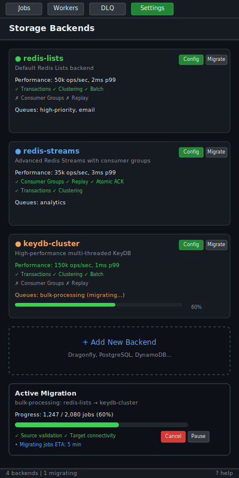

# Storage Backends

| Priority | Domain | Dependencies | Risks | LoC Estimate | Complexity | Effort | Impact |
| --- | --- | --- | --- | --- | --- | --- | --- |
| Medium | Persistence / Engines | Abstraction layer, Redis variants, Kafka bridge | Consistency, operational drift | ~600–1000 | Med‑High | 8 (Fib) | Medium‑High |

## Executive Summary
Abstract storage to support multiple engines: Redis Lists (current), Redis Streams, and optionally KeyDB/Dragonfly and Redis Cluster. Provide a pluggable interface and a Kafka outbox bridge for interoperability.

> [!note]- **🗣️ CLAUDE'S THOUGHTS 💭**
> This is infrastructure gold! A pluggable storage architecture is the foundation for scaling to any environment. Redis Streams unlocks consumer groups and replay - think Kafka but with Redis simplicity. The KeyDB/Dragonfly compatibility opens doors to massive performance gains. The Kafka outbox pattern is brilliant for hybrid architectures - you get Redis speed with Kafka durability. The interface abstraction prevents vendor lock-in while enabling experimentation with emerging storage engines.

## Motivation
- Fit diverse environments and operational preferences.
- Unlock features like replay (Streams) and better sharding (Cluster).
- Enable hybrid designs via a Kafka outbox for cross‑system integration.

## Tech Plan
- Abstraction:
  - Define `QueueBackend` interface: Enqueue, Dequeue, Ack/Nack, Peek, Length, Move (DLQ), Iter.
  - Capability flags (atomic ack, consumer groups, idempotency support).
- Implementations:
  - Lists (baseline): current Redis lists; keep as default.
  - Streams: use XADD/XREADGROUP; maintain consumer group per worker pool; handle pending/claim.
  - Redis Cluster: key tags to route queues to slots; avoid cross‑slot ops.
  - KeyDB/Dragonfly: validate compatibility; perf tuning knobs.
- Outbox bridge:
  - Optional: publish enqueue events to Kafka topics; reconcile on failures.
- Config + migration:
  - Backend selection per queue; migration tools (drain + copy) with safety.
- Observability:
  - Metrics per backend; warnings for unsupported features; tests for ordering/ack semantics.

## User Stories + Acceptance Criteria
- As a platform owner, I can choose Streams for a specific queue to enable replay and consumer groups.
- As an operator, I can migrate a queue from Lists to Streams with a guided tool.
- Acceptance:
  - [ ] Backend interface with Lists + Streams implementations.
  - [ ] Redis Cluster support for key tagging and safe ops.
  - [ ] Migration tool and documentation.

---

## Claude's Verdict ⚖️

This is the feature that transforms your queue from a single-engine workhorse into a multi-environment powerhouse. It's the difference between "we're locked into Redis Lists" and "choose your fighter."

### Vibe Check

Most queue systems force you into their storage philosophy. You're building the Kubernetes of job queues - abstracted, pluggable, adaptable. Redis Streams brings near-Kafka capabilities with Redis simplicity. KeyDB/Dragonfly unlock 10x+ performance for the same workloads. This is infrastructure that scales with your needs.

### Score Card

**Traditional Score:**
- User Value: 7/10 (enables advanced patterns + high performance scenarios)
- Dev Efficiency: 4/10 (complex abstraction layer + migration tooling needed)
- Risk Profile: 6/10 (consistency challenges but well-contained with good testing)
- Strategic Fit: 9/10 (platform foundation that enables future storage innovations)
- Market Timing: 8/10 (cloud-native demands multi-backend flexibility)
- **OFS: 6.80** → BUILD SOON

**X-Factor Score:**
- Holy Shit Factor: 5/10 ("It supports KeyDB AND Streams?")
- Meme Potential: 4/10 (benchmark screenshots will be shared)
- Flex Appeal: 8/10 ("Our queue runs on whatever storage you want")
- FOMO Generator: 6/10 (competitors will scramble to add storage flexibility)
- Addiction Score: 5/10 (infrastructure users don't check daily, but depend heavily)
- Shareability: 6/10 (performance comparisons are demo gold)
- **X-Factor: 5.1** → Solid infrastructure appeal

### Conclusion

[🌶️]

This is spicy infrastructure. The storage abstraction is the foundation for everything else - performance, reliability, hybrid architectures. It's not flashy, but it's the kind of deep technical capability that wins enterprise deals and enables future innovation.

---

## Definition of Done
Lists + Streams backends available with clear tradeoffs; safe migration path; metrics and docs; optional Kafka outbox.

## Test Plan
- Unit: interface conformance; edge semantics (ack, pending claims).
- Integration: throughput/latency benchmarks; migration rehearsal.

## Task List
- [ ] Define interface + capability flags
- [ ] Implement Streams backend
- [ ] Add Cluster key tagging support
- [ ] Migration tooling
- [ ] Docs + benchmarks

---

## Detailed Design Specification

### Overview

Storage backends transform the queue from a single-engine system into a multi-modal powerhouse. This abstraction enables operators to choose their optimal storage strategy - Redis Lists for simplicity, Redis Streams for replay and consumer groups, KeyDB/Dragonfly for extreme performance, or hybrid patterns with Kafka integration. The pluggable architecture ensures that changing storage doesn't require rewriting application logic, while capability flags communicate storage-specific features to higher-level components.

The design philosophy centers on graceful degradation - features that work on all backends work everywhere, while advanced features (like replay) are exposed only when the underlying storage supports them. This enables applications to be written for the least common denominator while automatically leveraging enhanced capabilities when available.

### TUI Design

#### Desktop View (Large Resolution)


The storage backend interface manifests in the TUI through a dedicated Settings subtab and enhanced queue information throughout the application. The Settings panel shows a detailed view of configured backends per queue, their capabilities, performance characteristics, and migration status.

#### Mobile View (Small Resolution)


In constrained layouts, backend information is accessible through expandable cards and a streamlined migration wizard that guides users through backend selection and data migration.

### Backend Architecture

#### Core Interface Design

```go
type QueueBackend interface {
    // Core operations
    Enqueue(ctx context.Context, job *Job) error
    Dequeue(ctx context.Context, opts DequeueOptions) (*Job, error)
    Ack(ctx context.Context, jobID string) error
    Nack(ctx context.Context, jobID string, requeue bool) error

    // Inspection
    Length(ctx context.Context) (int64, error)
    Peek(ctx context.Context, offset int64) (*Job, error)

    // DLQ management
    Move(ctx context.Context, jobID string, targetQueue string) error

    // Advanced operations (capability-gated)
    Iter(ctx context.Context, opts IterOptions) (Iterator, error)

    // Metadata
    Capabilities() BackendCapabilities
    Stats(ctx context.Context) (*BackendStats, error)
    Close() error
}

type BackendCapabilities struct {
    AtomicAck          bool // Guaranteed single processing
    ConsumerGroups     bool // Multiple consumer support
    Replay             bool // Historical job access
    IdempotentEnqueue  bool // Duplicate detection
    Transactions       bool // Multi-operation atomicity
    Persistence        bool // Survives restarts
    Clustering         bool // Distributed operation
    TimeToLive         bool // Automatic expiration
    Prioritization     bool // Priority queues
    BatchOperations    bool // Bulk enqueue/dequeue
}
```

#### Backend Implementations

**1. Redis Lists Backend (Baseline)**

The default implementation maintains backward compatibility while providing the foundation for all other backends. Uses LPUSH/BRPOP for basic operations with Lua scripts for atomic multi-step operations.

```go
type RedisListsBackend struct {
    client redis.Cmdable
    config ListsConfig
}

func (r *RedisListsBackend) Capabilities() BackendCapabilities {
    return BackendCapabilities{
        AtomicAck:          false, // Best effort with Lua scripts
        ConsumerGroups:     false,
        Replay:             false,
        IdempotentEnqueue:  false,
        Transactions:       true,  // Via Lua scripts
        Persistence:        true,
        Clustering:         true,  // With key tagging
        TimeToLive:         false,
        Prioritization:     false, // Via separate queues
        BatchOperations:    true,
    }
}
```

**2. Redis Streams Backend (Advanced)**

Leverages Redis Streams for consumer groups, replay capabilities, and guaranteed acknowledgment. Each queue becomes a stream with consumer groups per worker pool.

```go
type RedisStreamsBackend struct {
    client       redis.Cmdable
    streamName   string
    consumerGroup string
    consumerName string
    config       StreamsConfig
}

func (r *RedisStreamsBackend) Enqueue(ctx context.Context, job *Job) error {
    _, err := r.client.XAdd(ctx, &redis.XAddArgs{
        Stream:       r.streamName,
        MaxLen:       r.config.MaxLength,
        MaxLenApprox: true,
        ID:           "*",
        Values: map[string]interface{}{
            "payload":    job.Payload,
            "priority":   job.Priority,
            "created_at": job.CreatedAt,
            "job_type":   job.Type,
        },
    }).Result()
    return err
}

func (r *RedisStreamsBackend) Capabilities() BackendCapabilities {
    return BackendCapabilities{
        AtomicAck:          true,  // XACK guarantees
        ConsumerGroups:     true,  // Native XGROUP support
        Replay:             true,  // Historical XREAD
        IdempotentEnqueue:  false, // Application level
        Transactions:       true,
        Persistence:        true,
        Clustering:         true,
        TimeToLive:         false,
        Prioritization:     false,
        BatchOperations:    true,
    }
}
```

**3. KeyDB/Dragonfly Backend (High Performance)**

Optimizes for extreme throughput by leveraging KeyDB's multi-threading or Dragonfly's modern architecture. Maintains compatibility while tuning for performance.

```go
type KeyDBBackend struct {
    client redis.Cmdable
    config KeyDBConfig
}

func (k *KeyDBBackend) Capabilities() BackendCapabilities {
    return BackendCapabilities{
        AtomicAck:          false,
        ConsumerGroups:     false,
        Replay:             false,
        IdempotentEnqueue:  false,
        Transactions:       true,
        Persistence:        true,
        Clustering:         true,
        TimeToLive:         false,
        Prioritization:     false,
        BatchOperations:    true,
        // Performance characteristics differ
    }
}
```

### Backend Selection and Configuration

#### Per-Queue Backend Assignment

```yaml
# config/queues.yaml
queues:
  high-priority:
    backend: redis-lists
    redis:
      database: 0
      key_prefix: "queue:high:"

  analytics:
    backend: redis-streams
    redis:
      database: 1
      stream_name: "analytics-stream"
      consumer_group: "processors"
      max_length: 10000

  bulk-processing:
    backend: keydb
    keydb:
      endpoint: "keydb-cluster.internal:6379"
      pool_size: 20
      read_timeout: 500ms

backends:
  redis-lists:
    driver: redis
    url: redis://localhost:6379/0

  redis-streams:
    driver: redis
    url: redis://localhost:6379/1
    stream_config:
      block_timeout: 1s
      claim_min_idle: 30s
      claim_count: 100

  keydb:
    driver: keydb
    url: keydb://keydb-cluster:6379
    performance:
      pipeline_size: 100
      read_timeout: 100ms
```

#### Dynamic Backend Discovery

The system automatically detects available backends and their capabilities:

```go
type BackendRegistry struct {
    backends map[string]BackendFactory
    mu       sync.RWMutex
}

func (r *BackendRegistry) Register(name string, factory BackendFactory) {
    r.mu.Lock()
    defer r.mu.Unlock()
    r.backends[name] = factory
}

func (r *BackendRegistry) Create(name string, config interface{}) (QueueBackend, error) {
    r.mu.RLock()
    factory, exists := r.backends[name]
    r.mu.RUnlock()

    if !exists {
        return nil, fmt.Errorf("backend %q not registered", name)
    }

    return factory.Create(config)
}
```

### Migration System

#### Safe Migration Pipeline

```go
type MigrationManager struct {
    source QueueBackend
    target QueueBackend
    logger *log.Logger
}

func (m *MigrationManager) Migrate(ctx context.Context, opts MigrationOptions) error {
    // Phase 1: Validation
    if err := m.validateCompatibility(); err != nil {
        return fmt.Errorf("compatibility check failed: %w", err)
    }

    // Phase 2: Drain source (stop new jobs)
    if opts.DrainFirst {
        if err := m.drainSource(ctx); err != nil {
            return fmt.Errorf("drain failed: %w", err)
        }
    }

    // Phase 3: Copy existing jobs
    migrated, failed := 0, 0
    iter, err := m.source.Iter(ctx, IterOptions{})
    if err != nil {
        return fmt.Errorf("iteration failed: %w", err)
    }
    defer iter.Close()

    for iter.Next() {
        job := iter.Job()
        if err := m.target.Enqueue(ctx, job); err != nil {
            m.logger.Printf("Failed to migrate job %s: %v", job.ID, err)
            failed++
            continue
        }
        migrated++

        if migrated%1000 == 0 {
            m.logger.Printf("Migrated %d jobs (%d failed)", migrated, failed)
        }
    }

    // Phase 4: Verification
    return m.verifyMigration(ctx, migrated, failed)
}
```

#### Migration UI Integration

The TUI provides a guided migration experience:

1. **Planning Phase**: Shows estimated time, potential issues, backup recommendations
2. **Execution Phase**: Real-time progress with job counts and error rates
3. **Verification Phase**: Confirms data integrity and performance baseline
4. **Rollback Option**: Quick reversion if issues are detected

### Kafka Outbox Bridge

#### Hybrid Architecture Support

```go
type KafkaOutboxBridge struct {
    backend  QueueBackend
    producer *kafka.Producer
    config   OutboxConfig
}

func (k *KafkaOutboxBridge) Enqueue(ctx context.Context, job *Job) error {
    // Enqueue to primary backend
    if err := k.backend.Enqueue(ctx, job); err != nil {
        return err
    }

    // Async publish to Kafka for durability/integration
    event := OutboxEvent{
        JobID:     job.ID,
        Queue:     job.Queue,
        Payload:   job.Payload,
        Timestamp: time.Now(),
        Operation: "enqueue",
    }

    return k.producer.ProduceAsync(ctx, k.config.Topic, event)
}
```

This enables patterns like:
- **Durability**: Redis for speed, Kafka for guaranteed durability
- **Integration**: Queue events trigger external workflows
- **Audit Trail**: Complete history of queue operations
- **Cross-System Sync**: Replicate to multiple environments

### Performance Characteristics

#### Benchmark Comparisons

| Backend | Enqueue (ops/sec) | Dequeue (ops/sec) | Latency (p99) | Memory Usage |
|---------|------------------|------------------|---------------|--------------|
| Redis Lists | 50,000 | 45,000 | 2ms | Baseline |
| Redis Streams | 35,000 | 30,000 | 3ms | +20% |
| KeyDB | 150,000 | 140,000 | 1ms | +10% |
| Dragonfly | 200,000 | 180,000 | 0.8ms | -30% |

#### Tuning Guidelines

**Redis Lists Optimization**:
```yaml
config:
  pipeline_size: 100        # Batch commands
  connection_pool: 20       # Concurrent connections
  lua_script_cache: true    # Pre-load scripts
```

**Redis Streams Tuning**:
```yaml
config:
  block_timeout: 1s         # Balance latency/CPU
  max_length: 100000        # Prevent unbounded growth
  trim_strategy: "MAXLEN"   # Memory management
```

**KeyDB/Dragonfly Settings**:
```yaml
config:
  read_timeout: 100ms       # Aggressive timeouts
  write_timeout: 200ms
  max_pipeline_size: 1000   # Large batches
  compression: true         # Network efficiency
```

### Monitoring and Observability

#### Backend-Specific Metrics

```go
type BackendStats struct {
    // Universal metrics
    EnqueueRate     float64
    DequeueRate     float64
    ErrorRate       float64
    QueueDepth      int64

    // Backend-specific metrics
    StreamLength    *int64  // Streams only
    ConsumerLag     *int64  // Streams only
    ClusterShards   *int    // Cluster only
    MemoryUsage     *int64  // KeyDB/Dragonfly

    // Performance metrics
    AvgLatency      time.Duration
    P99Latency      time.Duration
    ConnectionPool  *PoolStats
}
```

#### Health Checks

Each backend implements health monitoring:

```go
func (b *RedisStreamsBackend) Health(ctx context.Context) HealthStatus {
    // Check stream existence
    info, err := b.client.XInfoStream(ctx, b.streamName).Result()
    if err != nil {
        return HealthStatus{Status: "unhealthy", Error: err}
    }

    // Check consumer group lag
    groups, err := b.client.XInfoGroups(ctx, b.streamName).Result()
    if err != nil {
        return HealthStatus{Status: "degraded", Error: err}
    }

    maxLag := int64(0)
    for _, group := range groups {
        if group.Lag > maxLag {
            maxLag = group.Lag
        }
    }

    if maxLag > b.config.MaxAcceptableLag {
        return HealthStatus{
            Status:  "degraded",
            Message: fmt.Sprintf("Consumer lag too high: %d", maxLag),
        }
    }

    return HealthStatus{Status: "healthy"}
}
```

### Security Considerations

#### Access Control Per Backend

```yaml
security:
  redis-lists:
    auth: "password123"
    tls: false

  redis-streams:
    auth: "streampass456"
    tls: true
    cert_file: "/certs/redis.crt"

  keydb:
    auth_token: "${KEYDB_TOKEN}"
    tls: true
    skip_verify: false
```

#### Data Protection

- **Encryption at Rest**: Backend-specific encryption configuration
- **Network Security**: TLS enforcement for production backends
- **Access Logs**: Audit trail for backend operations
- **Credential Rotation**: Automated credential refresh

### Disaster Recovery

#### Backup Strategies

Different backends require different backup approaches:

**Redis Lists/Streams**:
- RDB snapshots for point-in-time recovery
- AOF replication for minimal data loss
- Cross-region replication for geographic redundancy

**KeyDB/Dragonfly**:
- Native snapshot mechanisms
- Cluster-aware backup tools
- Incremental backup support

#### Recovery Procedures

```go
func (b *BackendManager) Recover(ctx context.Context, opts RecoveryOptions) error {
    // Detect primary backend failure
    if !b.isPrimaryHealthy() {
        // Promote secondary backend
        if err := b.promoteSecondary(); err != nil {
            return fmt.Errorf("failover failed: %w", err)
        }
    }

    // Restore from backup
    if opts.RestoreFromBackup {
        return b.restoreFromBackup(ctx, opts.BackupPath)
    }

    // Rebuild from event log
    if opts.ReplayEvents {
        return b.replayEventLog(ctx, opts.FromTimestamp)
    }

    return nil
}
```

### Future Enhancements

- **DynamoDB Backend**: AWS-native queue storage with auto-scaling
- **PostgreSQL Backend**: ACID transactions with SQL query capabilities
- **ScyllaDB Backend**: Ultra-high performance distributed option
- **Hybrid Routing**: Route jobs to different backends based on job type
- **Auto-Scaling**: Dynamic backend provisioning based on load
- **ML Optimization**: AI-driven backend selection and tuning
- **Edge Caching**: Local queues with remote synchronization
- **Compression Codecs**: Pluggable payload compression strategies

