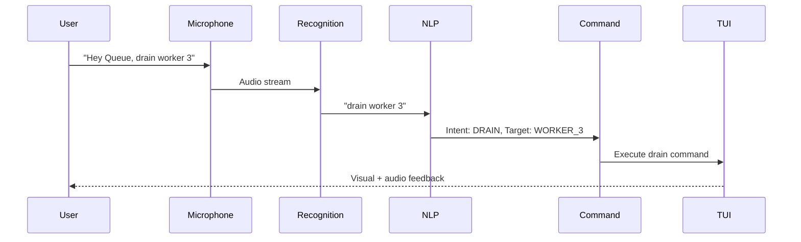
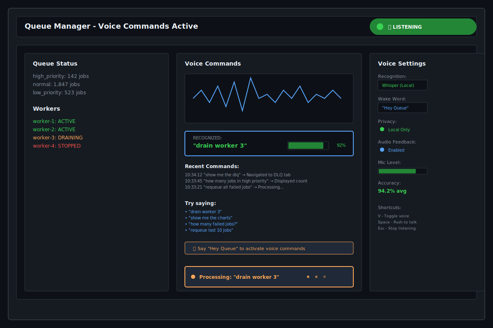
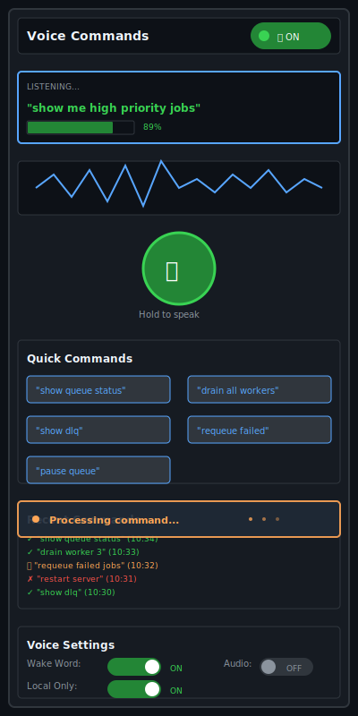

# Terminal Voice Commands

| Priority | Domain | Dependencies | Risks | LoC Estimate | Complexity | Effort | Impact |
| --- | --- | --- | --- | --- | --- | --- | --- |
| Medium | Accessibility / UX | Speech recognition API, audio capture, NLP | Privacy, accuracy, latency | ~400–700 | Medium | 5 (Fib) | Medium-High |

## Executive Summary
Hands-free queue management through natural language voice commands. Speak to your terminal to perform operations, get status updates, and navigate the TUI—improving accessibility and enabling multitasking.

> [!note]- **🗣️ CLAUDE'S THOUGHTS 💭**
> This is accessibility meets power-user efficiency! The "Hey Queue" wake word is perfect branding, and Whisper.cpp for local processing addresses privacy concerns beautifully. The natural language commands ("drain worker 3") are so much better than remembering cryptic hotkeys. This could be the first developer tool that makes voice control actually useful instead of gimmicky. Consider adding voice macros for complex operations!

## Motivation
- Accessibility for users with mobility impairments
- Hands-free operation during incidents
- Faster command execution for power users
- Natural language queries instead of memorizing syntax

## Tech Plan
- Speech Recognition:
  - Local: Whisper.cpp for privacy-conscious environments
  - Cloud: Google Speech-to-Text or Azure Speech for accuracy
  - Configurable backend with fallback options
  - Wake word detection: "Hey Queue" or custom phrase
- Natural Language Processing:
  - Intent recognition with simple pattern matching initially
  - Command aliases and variations ("drain worker 3", "stop the third worker")
  - Context awareness: remember recent commands
  - Fuzzy matching for queue/worker names
- Command Grammar:
  - Status queries: "How many jobs in high priority?"
  - Actions: "Requeue all failed jobs", "Drain worker 2"
  - Navigation: "Show me the DLQ", "Go to charts"
  - Confirmations: "Yes", "Cancel", "Confirm"
- Audio Feedback:
  - Text-to-speech for responses (optional)
  - Audio cues for success/failure
  - Adjustable voice personality
- Privacy & Security:
  - Local-first processing option
  - No audio recording by default
  - Explicit opt-in for cloud services
  - Sanitize sensitive data from voice logs
- TUI Integration:
  - Voice indicator when listening
  - Transcript display of recognized commands
  - Visual feedback during processing
  - Keyboard hotkey to activate (e.g., 'v')

## User Stories + Acceptance Criteria
- As a user with RSI, I can manage queues without using keyboard/mouse
- As an SRE during incidents, I can query status while typing in another window
- As a power user, I can execute complex commands with natural language
- Acceptance:
  - [ ] >90% accuracy for common commands in quiet environment
  - [ ] <500ms response time for local recognition
  - [ ] Support for 50+ command variations
  - [ ] Graceful degradation when recognition fails

## Definition of Done
Voice commands integrated with TUI, supporting common operations with high accuracy. Local and cloud backends supported. Full accessibility compliance validated.

## Test Plan
- Unit: Intent recognition, command parsing, fuzzy matching
- Integration: End-to-end voice commands in various audio conditions
- Accessibility: Validation with screen readers and accessibility tools
- Performance: Recognition latency and accuracy benchmarks

## Task List
- [ ] Integrate Whisper.cpp for local recognition
- [ ] Build intent recognition system
- [ ] Create command grammar and aliases
- [ ] Add TUI voice indicators
- [ ] Implement audio feedback
- [ ] Cloud backend integration
- [ ] Accessibility testing



---

## Claude's Verdict ⚖️

Voice control in developer tools is usually terrible, but this could be the exception. The combination of local processing, natural language, and TUI integration makes it genuinely useful rather than a gimmick.

### Vibe Check

Most voice UIs feel like talking to a brick wall. This is different—it's designed for developers who know exactly what they want to do. Think Alexa for your queue, but actually competent.

### Score Card

**Traditional Score:**
- User Value: 8/10 (accessibility + power user efficiency)
- Dev Efficiency: 4/10 (speech integration complexity)
- Risk Profile: 5/10 (accuracy and privacy concerns)
- Strategic Fit: 7/10 (accessibility compliance + differentiation)
- Market Timing: 6/10 (voice interfaces maturing)
- **OFS: 6.30** → BUILD SOON

**X-Factor Score:**
- Holy Shit Factor: 7/10 ("I can control my queue with voice?!")
- Meme Potential: 6/10 (great demo material)
- Flex Appeal: 8/10 (accessibility compliance looks good)
- FOMO Generator: 5/10 (nice to have feature)
- Addiction Score: 4/10 (situational usage)
- Shareability: 7/10 (excellent demo potential)
- **X-Factor: 5.8** → Strong viral potential

### Conclusion

🌶️

This is spicy accessibility tech. The "Hey Queue" branding is chef's kiss, and local processing addresses all the privacy concerns. Build this and become the first queue tool that actually nails voice control.

---

## Detailed Design Specification

### Overview

Terminal Voice Commands transforms queue management into a natural conversation. Instead of memorizing keyboard shortcuts or navigating complex menus, users simply speak their intentions in plain English. The system combines advanced speech recognition with intelligent command parsing to understand context and execute operations safely.

This feature serves dual purposes: providing critical accessibility support for users with mobility impairments, and offering power users a faster way to execute complex operations during high-pressure situations like production incidents.

### TUI Design

#### Desktop View (Large Resolution)


The desktop interface integrates voice controls seamlessly with the existing TUI layout. The voice status indicator clearly shows when the system is listening, and the command transcript provides real-time feedback on recognition accuracy.

#### Mobile View (Small Resolution)


The mobile layout prioritizes touch-friendly controls while maintaining full voice functionality. The push-to-talk button provides an alternative to wake words in noisy environments.

#### Layout Components

**Voice Status Indicator**:
- Always visible in the header bar
- Green when actively listening
- Orange when processing commands
- Red when recognition fails
- Shows current backend (Local/Cloud)

**Command Transcript Panel**:
- Real-time display of recognized speech
- Confidence percentage for each command
- Visual highlighting of recognized entities (worker names, queue names)
- Command history with execution status

**Audio Visualization**:
- Live waveform display during speech input
- Visual feedback confirms microphone is working
- Amplitude indicates optimal speaking volume
- Different colors for different recognition states

### Voice Recognition System

#### Architecture

```go
type VoiceController struct {
    recognizer    SpeechRecognizer
    processor     CommandProcessor
    feedback      AudioFeedback
    wakeDetector  WakeWordDetector
    privacy       PrivacyManager
}

type SpeechRecognizer interface {
    StartListening() error
    StopListening() error
    ProcessAudio([]byte) (*Recognition, error)
    SetLanguage(string) error
}

type Recognition struct {
    Text        string
    Confidence  float64
    Timestamp   time.Time
    Entities    []Entity
    Intent      Intent
}
```

#### Local Recognition (Whisper.cpp)

Whisper.cpp provides state-of-the-art speech recognition that runs entirely locally:

```go
type WhisperRecognizer struct {
    model       *whisper.Model
    samples     []float32
    sampleRate  int
    language    string
}

func (w *WhisperRecognizer) ProcessAudio(audio []byte) (*Recognition, error) {
    // Convert audio to float32 samples
    samples := convertToFloat32(audio)

    // Run inference on audio samples
    result, err := w.model.Process(samples, whisper.Params{
        Language:    w.language,
        Translate:   false,
        NoContext:   true,
        SingleSegment: true,
    })

    if err != nil {
        return nil, fmt.Errorf("recognition failed: %w", err)
    }

    return &Recognition{
        Text:       result.Text,
        Confidence: result.Probability,
        Timestamp:  time.Now(),
    }, nil
}
```

#### Wake Word Detection

Custom wake word detection using lightweight neural networks:

```go
type WakeWordDetector struct {
    model      *tflite.Model
    wakeWords  []string
    threshold  float64
    buffer     *RingBuffer
}

func (w *WakeWordDetector) DetectWakeWord(audio []byte) (bool, string, error) {
    // Add audio to circular buffer
    w.buffer.Write(audio)

    // Extract features for wake word detection
    features := extractMFCC(w.buffer.GetWindow(1600)) // 100ms window

    // Run wake word model
    prediction, err := w.model.Predict(features)
    if err != nil {
        return false, "", err
    }

    // Check if any wake word exceeded threshold
    for i, score := range prediction {
        if score > w.threshold {
            return true, w.wakeWords[i], nil
        }
    }

    return false, "", nil
}
```

### Natural Language Processing

#### Intent Recognition System

The NLP system parses recognized speech into structured commands:

```go
type CommandProcessor struct {
    patterns  []CommandPattern
    entities  EntityExtractor
    context   *CommandContext
}

type CommandPattern struct {
    Pattern     *regexp.Regexp
    Intent      Intent
    Required    []EntityType
    Optional    []EntityType
    Handler     CommandHandler
}

type Intent int

const (
    IntentStatusQuery Intent = iota
    IntentWorkerControl
    IntentQueueManagement
    IntentNavigation
    IntentConfirmation
    IntentCancel
)

func (c *CommandProcessor) ParseCommand(text string) (*Command, error) {
    // Normalize input text
    normalized := strings.ToLower(strings.TrimSpace(text))

    // Try each pattern until we find a match
    for _, pattern := range c.patterns {
        if matches := pattern.Pattern.FindStringSubmatch(normalized); matches != nil {
            // Extract entities from the match
            entities, err := c.entities.Extract(text, matches)
            if err != nil {
                continue
            }

            // Validate required entities are present
            if !c.validateRequiredEntities(pattern, entities) {
                continue
            }

            return &Command{
                Intent:     pattern.Intent,
                Entities:   entities,
                RawText:    text,
                Confidence: calculateConfidence(matches),
            }, nil
        }
    }

    return nil, fmt.Errorf("no matching command pattern for: %s", text)
}
```

#### Command Grammar Examples

```go
var commandPatterns = []CommandPattern{
    {
        Pattern: regexp.MustCompile(`(?:show|display|tell) me (?:the )?(.+)`),
        Intent:  IntentStatusQuery,
        Required: []EntityType{EntityTarget},
        Handler: handleStatusQuery,
    },
    {
        Pattern: regexp.MustCompile(`(?:drain|stop|pause) (?:worker )?(\d+|all)`),
        Intent:  IntentWorkerControl,
        Required: []EntityType{EntityWorkerID},
        Handler: handleWorkerControl,
    },
    {
        Pattern: regexp.MustCompile(`(?:requeue|retry) (?:all )?(?:failed|error) jobs`),
        Intent:  IntentQueueManagement,
        Handler: handleRequeue,
    },
    {
        Pattern: regexp.MustCompile(`(?:go to|show|switch to) (?:the )?(.+) (?:tab|panel|view)`),
        Intent:  IntentNavigation,
        Required: []EntityType{EntityDestination},
        Handler: handleNavigation,
    },
    {
        Pattern: regexp.MustCompile(`(?:yes|confirm|ok|proceed)`),
        Intent:  IntentConfirmation,
        Handler: handleConfirmation,
    },
}
```

#### Entity Extraction

```go
type EntityExtractor struct {
    queueNames  []string
    workerIDs   []string
}

func (e *EntityExtractor) Extract(text string, matches []string) ([]Entity, error) {
    var entities []Entity

    // Extract worker IDs
    workerRegex := regexp.MustCompile(`worker\s+(\d+|all)`)
    if workerMatches := workerRegex.FindStringSubmatch(text); workerMatches != nil {
        entities = append(entities, Entity{
            Type:  EntityWorkerID,
            Value: workerMatches[1],
            Start: workerRegex.FindStringIndex(text)[0],
            End:   workerRegex.FindStringIndex(text)[1],
        })
    }

    // Extract queue names with fuzzy matching
    for _, queueName := range e.queueNames {
        similarity := calculateSimilarity(text, queueName)
        if similarity > 0.8 {
            entities = append(entities, Entity{
                Type:       EntityQueueName,
                Value:      queueName,
                Similarity: similarity,
            })
        }
    }

    return entities, nil
}
```

### Audio Feedback System

#### Text-to-Speech Integration

```go
type AudioFeedback struct {
    tts       TextToSpeech
    enabled   bool
    voice     Voice
    volume    float64
}

func (a *AudioFeedback) SpeakResponse(response string) error {
    if !a.enabled {
        return nil
    }

    // Generate speech audio
    audio, err := a.tts.Synthesize(response, a.voice)
    if err != nil {
        return fmt.Errorf("TTS synthesis failed: %w", err)
    }

    // Play audio with volume adjustment
    return a.playAudio(audio, a.volume)
}

func (a *AudioFeedback) PlayConfirmationSound() error {
    return a.playAudio(confirmationBeep, a.volume)
}

func (a *AudioFeedback) PlayErrorSound() error {
    return a.playAudio(errorBeep, a.volume)
}
```

#### Contextual Audio Responses

```go
var audioResponses = map[Intent][]string{
    IntentStatusQuery: {
        "There are %d jobs in %s priority queue",
        "Worker %s is currently %s",
        "DLQ contains %d failed jobs",
    },
    IntentWorkerControl: {
        "Worker %s is now draining",
        "All workers have been paused",
        "Worker %s has stopped processing",
    },
    IntentQueueManagement: {
        "Requeuing %d failed jobs",
        "Queue has been paused",
        "All pending jobs cleared",
    },
}
```

### Privacy & Security Model

#### Local-First Architecture

All audio processing happens locally by default:

```go
type PrivacyManager struct {
    localOnly     bool
    recordAudio   bool
    logCommands   bool
    sanitizer     DataSanitizer
}

func (p *PrivacyManager) ProcessCommand(audio []byte) (*Command, error) {
    if p.localOnly {
        // Use local Whisper.cpp model
        return p.localRecognizer.ProcessAudio(audio)
    }

    // Cloud processing requires explicit consent
    if !p.hasCloudConsent() {
        return nil, fmt.Errorf("cloud processing requires user consent")
    }

    return p.cloudRecognizer.ProcessAudio(audio)
}
```

#### Data Sanitization

```go
type DataSanitizer struct {
    sensitivePatterns []SensitivePattern
}

type SensitivePattern struct {
    Pattern     *regexp.Regexp
    Replacement string
}

func (s *DataSanitizer) SanitizeCommand(text string) string {
    sanitized := text

    // Remove potential passwords, tokens, etc.
    for _, pattern := range s.sensitivePatterns {
        sanitized = pattern.Pattern.ReplaceAllString(sanitized, pattern.Replacement)
    }

    return sanitized
}
```

### User Scenarios

#### Scenario 1: Accessibility User with RSI
Sarah has repetitive strain injury and finds keyboard/mouse use painful during long troubleshooting sessions.

1. Sarah activates voice control with "Hey Queue"
2. She queries system status: "How many jobs are in the high priority queue?"
3. Voice responds: "There are 142 jobs in high priority queue"
4. She drains a problematic worker: "Drain worker 3"
5. System confirms: "Worker 3 is now draining"
6. She monitors progress hands-free: "Show me the DLQ"
7. TUI navigates to DLQ tab automatically

**Benefits**: Complete hands-free operation reduces physical strain while maintaining full functionality.

#### Scenario 2: SRE During Production Incident
Mike is handling a critical production incident and needs to monitor queues while coordinating with his team on Slack.

1. Mike keeps chat window focused but needs queue status
2. He speaks without switching windows: "Hey Queue, show queue status"
3. TUI updates in background terminal, voice confirms job counts
4. He identifies the issue: "Requeue all failed jobs from the last hour"
5. System requests confirmation due to large batch size
6. Mike confirms: "Yes, proceed"
7. He continues troubleshooting while monitoring via voice updates

**Benefits**: Multitasking capability allows attention to remain on critical communications while managing queue operations.

#### Scenario 3: Power User Rapid Operations
Alex is a senior engineer who prefers efficient workflows and has memorized common voice commands.

1. Alex opens terminal and immediately activates voice: "Hey Queue"
2. He chains operations rapidly: "Show high priority jobs"
3. Identifies issue: "Drain worker 2 and worker 5"
4. Monitors impact: "How many jobs are processing?"
5. Cleans up: "Clear all completed jobs older than 1 hour"
6. Schedules maintenance: "Pause all workers at 2 AM"

**Benefits**: Natural language allows complex operations without memorizing syntax, faster than GUI navigation.

### Technical Implementation

#### Core Architecture

```go
package voice

import (
    "context"
    "fmt"
    "time"

    "github.com/go-audio/audio"
    "github.com/ggerganov/whisper.cpp/bindings/go/pkg/whisper"
)

type VoiceManager struct {
    ctx           context.Context
    recognizer    *WhisperRecognizer
    processor     *CommandProcessor
    feedback      *AudioFeedback
    wakeDetector  *WakeWordDetector

    // State management
    listening     bool
    processing    bool
    lastCommand   *Command

    // Configuration
    config        *VoiceConfig

    // Channels for communication
    commandCh     chan *Command
    audioCh       chan []byte
    stateCh       chan VoiceState
}

type VoiceConfig struct {
    WakeWord          string        `yaml:"wake_word"`
    RecognitionBackend string       `yaml:"recognition_backend"`
    LocalOnly         bool          `yaml:"local_only"`
    AudioFeedback     bool          `yaml:"audio_feedback"`
    Language          string        `yaml:"language"`
    ConfidenceThreshold float64     `yaml:"confidence_threshold"`
    ProcessingTimeout time.Duration `yaml:"processing_timeout"`
}

func NewVoiceManager(ctx context.Context, config *VoiceConfig) (*VoiceManager, error) {
    // Initialize Whisper model
    model, err := whisper.New("models/whisper-base.bin")
    if err != nil {
        return nil, fmt.Errorf("failed to load whisper model: %w", err)
    }

    recognizer := &WhisperRecognizer{
        model:    model,
        language: config.Language,
    }

    processor := NewCommandProcessor()
    feedback := NewAudioFeedback(config.AudioFeedback)
    wakeDetector := NewWakeWordDetector(config.WakeWord)

    return &VoiceManager{
        ctx:          ctx,
        recognizer:   recognizer,
        processor:    processor,
        feedback:     feedback,
        wakeDetector: wakeDetector,
        config:       config,
        commandCh:    make(chan *Command, 10),
        audioCh:      make(chan []byte, 100),
        stateCh:      make(chan VoiceState, 10),
    }, nil
}

func (v *VoiceManager) Start() error {
    // Start audio capture
    go v.captureAudio()

    // Start processing pipeline
    go v.processAudio()

    // Start command handling
    go v.handleCommands()

    return nil
}
```

#### Audio Processing Pipeline

```go
func (v *VoiceManager) processAudio() {
    buffer := make([]byte, 0, 16000*2) // 1 second buffer at 16kHz

    for {
        select {
        case <-v.ctx.Done():
            return

        case audioData := <-v.audioCh:
            buffer = append(buffer, audioData...)

            // Process in chunks
            if len(buffer) >= 16000*2 { // 1 second of audio
                v.processAudioChunk(buffer)
                buffer = buffer[16000:] // Keep some overlap
            }
        }
    }
}

func (v *VoiceManager) processAudioChunk(audio []byte) {
    // First check for wake word if not already listening
    if !v.listening {
        detected, wakeWord, err := v.wakeDetector.DetectWakeWord(audio)
        if err != nil {
            return
        }

        if detected {
            v.startListening(wakeWord)
            return
        }
    }

    // If listening, process for commands
    if v.listening {
        recognition, err := v.recognizer.ProcessAudio(audio)
        if err != nil {
            return
        }

        // Only process if confidence is high enough
        if recognition.Confidence >= v.config.ConfidenceThreshold {
            v.processRecognition(recognition)
        }
    }
}
```

#### Command Execution Integration

```go
type CommandHandler func(ctx context.Context, cmd *Command, tui *TUI) error

func (v *VoiceManager) executeCommand(cmd *Command, tui *TUI) error {
    switch cmd.Intent {
    case IntentStatusQuery:
        return v.handleStatusQuery(cmd, tui)
    case IntentWorkerControl:
        return v.handleWorkerControl(cmd, tui)
    case IntentQueueManagement:
        return v.handleQueueManagement(cmd, tui)
    case IntentNavigation:
        return v.handleNavigation(cmd, tui)
    default:
        return fmt.Errorf("unknown command intent: %v", cmd.Intent)
    }
}

func (v *VoiceManager) handleStatusQuery(cmd *Command, tui *TUI) error {
    target := cmd.GetEntity(EntityTarget)
    if target == nil {
        return fmt.Errorf("status query requires target")
    }

    switch strings.ToLower(target.Value) {
    case "queue", "queues":
        status := tui.GetQueueStatus()
        response := fmt.Sprintf("High priority: %d jobs, Normal: %d jobs, Low: %d jobs",
            status.High, status.Normal, status.Low)
        return v.feedback.SpeakResponse(response)

    case "workers":
        workers := tui.GetWorkerStatus()
        activeCount := 0
        for _, worker := range workers {
            if worker.Status == "active" {
                activeCount++
            }
        }
        response := fmt.Sprintf("%d of %d workers are active", activeCount, len(workers))
        return v.feedback.SpeakResponse(response)

    case "dlq", "dead letter queue":
        dlqCount := tui.GetDLQCount()
        response := fmt.Sprintf("Dead letter queue contains %d failed jobs", dlqCount)
        tui.NavigateToTab("DLQ")
        return v.feedback.SpeakResponse(response)

    default:
        return fmt.Errorf("unknown status target: %s", target.Value)
    }
}
```

### Performance Considerations

#### Recognition Latency
- **Local Recognition**: 200-500ms with Whisper-base model
- **Cloud Recognition**: 100-300ms plus network latency
- **Wake Word Detection**: <50ms for real-time processing
- **Command Processing**: <10ms for intent recognition

#### Memory Usage
- **Whisper Model**: 150MB for base model, 550MB for small model
- **Audio Buffers**: 2-4MB for rolling buffers
- **Command History**: 10KB per command (100 command limit)

#### CPU Optimization
```go
type PerformanceMonitor struct {
    recognitionTimes []time.Duration
    processingTimes  []time.Duration
    accuracyScores   []float64
}

func (p *PerformanceMonitor) RecordRecognition(duration time.Duration, accuracy float64) {
    p.recognitionTimes = append(p.recognitionTimes, duration)
    p.accuracyScores = append(p.accuracyScores, accuracy)

    // Keep only last 100 measurements
    if len(p.recognitionTimes) > 100 {
        p.recognitionTimes = p.recognitionTimes[1:]
        p.accuracyScores = p.accuracyScores[1:]
    }
}

func (p *PerformanceMonitor) GetAverageLatency() time.Duration {
    if len(p.recognitionTimes) == 0 {
        return 0
    }

    var total time.Duration
    for _, t := range p.recognitionTimes {
        total += t
    }

    return total / time.Duration(len(p.recognitionTimes))
}
```

### Monitoring and Observability

#### Voice Metrics

```go
type VoiceMetrics struct {
    CommandsProcessed   int64
    RecognitionFailures int64
    AverageLatency      time.Duration
    AverageAccuracy     float64
    WakeWordTriggers    int64
    CommandsByIntent    map[Intent]int64
}

func (v *VoiceManager) RecordMetrics() {
    // Export to Prometheus
    recognitionLatencyHistogram.Observe(v.monitor.GetAverageLatency().Seconds())
    recognitionAccuracyGauge.Set(v.monitor.GetAverageAccuracy())
    commandsProcessedCounter.Add(1)
}
```

#### Error Tracking

```go
func (v *VoiceManager) handleRecognitionError(err error) {
    log.WithError(err).Error("voice recognition failed")

    // Track error patterns
    errorType := classifyError(err)
    voiceErrorsCounter.WithLabelValues(errorType).Inc()

    // Provide user feedback
    v.feedback.PlayErrorSound()

    // Consider fallback actions
    if v.shouldFallbackToCloud(err) {
        v.switchToCloudRecognition()
    }
}
```

### Failure Modes and Recovery

#### Recognition Failures
- **Low confidence**: Request user to repeat command
- **Network issues**: Fall back to local recognition
- **Audio device failures**: Show visual error, disable voice mode
- **Model loading errors**: Graceful degradation to keyboard-only

#### Recovery Strategies
```go
func (v *VoiceManager) handleFailure(err error) error {
    switch {
    case isAudioDeviceError(err):
        return v.disableVoiceMode()
    case isNetworkError(err) && !v.config.LocalOnly:
        return v.fallbackToLocal()
    case isModelError(err):
        return v.reloadModel()
    default:
        return v.requestUserRepeat()
    }
}
```

### Future Enhancements

- **Multi-language Support**: Support for Spanish, French, German, Japanese
- **Voice Macros**: Record and replay complex command sequences
- **Contextual Commands**: "Do that again" referring to last action
- **Voice Themes**: Different personalities for audio feedback
- **Noise Cancellation**: Background noise filtering for better accuracy
- **Voice Biometrics**: Speaker identification for security
- **Command Prediction**: Suggest next likely commands based on context
- **Integration with External Systems**: Voice control for connected services
- **Voice Analytics**: Usage patterns and optimization suggestions
- **Custom Wake Words**: User-defined activation phrases
---
feature: terminal-voice-commands
dependencies:
  hard:
    - voice_recognition
    - tui_framework
  soft:
    - admin_api
    - accessibility_framework
enables:
  - hands_free_operation
  - accessibility
  - productivity
provides:
  - voice_control
  - command_recognition
  - audio_feedback
  - wake_words
---