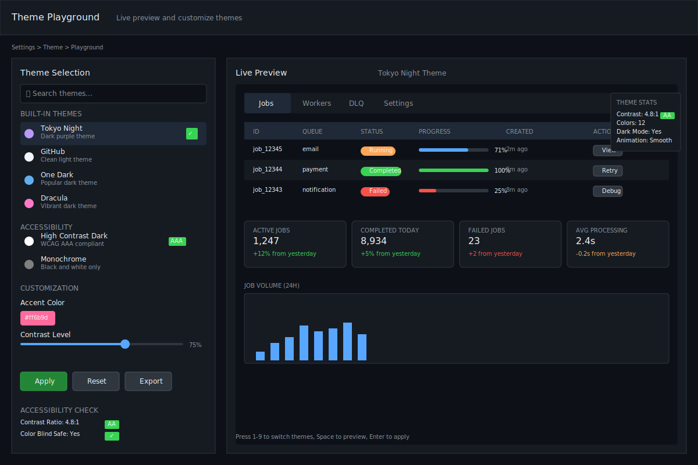
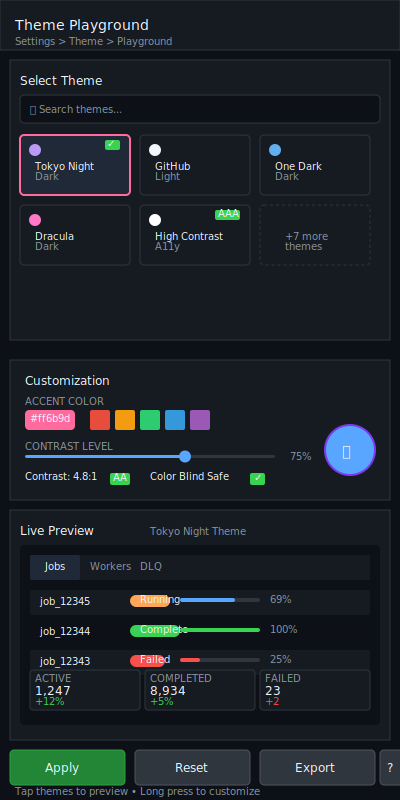

# Theme Playground

| Priority | Domain | Dependencies | Risks | LoC Estimate | Complexity | Effort | Impact |
| --- | --- | --- | --- | --- | --- | --- | --- |
| Medium | TUI / UX | Lip Gloss adaptive colors, theme system | Readability, accessibility, user confusion | ~200–400 | Medium | 3 (Fib) | Medium |

## Executive Summary
A centralized theme system with dark/light and high‑contrast palettes, plus a playground to preview and switch themes live. Persist preferences, expose a few tunables (accent, contrast), and ensure accessible defaults.

> [!note]- **🗣️ CLAUDE'S THOUGHTS 💭**
> This is accessibility done right! The combination of live preview + WCAG compliance checking + persistent preferences hits the sweet spot. The real genius is the playground concept - letting users see theme changes across ALL components instantly prevents the "looks good in isolation, terrible in context" problem. Consider adding a color blindness simulator mode and maybe export themes as shareable configs.

## Motivation
- Improve readability across terminals and environments.
- Provide accessible options (high‑contrast) without forking styles per component.
- Make demos and screenshots pop while staying consistent.

## Tech Plan
- Theme core:
  - Define a `Theme` struct (palettes, borders, emphasis, status colors) and a registry.
  - Replace ad‑hoc Lip Gloss colors with theme lookups.
  - Adaptive colors for dark/light terminals; high‑contrast variant.
- Playground:
  - Settings tab adds a Theme section with preview tiles and quick toggle keys.
  - Live apply to the whole app; animation optional to avoid flicker.
- Persistence:
  - Save to a small state file (e.g., `$XDG_CONFIG_HOME/go-redis-wq/theme.json`).
  - Respect `NO_COLOR` and minimal styles mode.
- Accessibility:
  - Contrast checks for text vs background (WCAG-ish heuristic); badges for risky pairs.
  - Provide a monochrome theme for limited terminals.

## User Stories + Acceptance Criteria
- As a user, I can switch themes quickly and persist my choice.
- As an accessibility‑minded user, I can choose a high‑contrast theme that remains readable everywhere.
- Acceptance:
  - [ ] Theme registry with dark/light/high‑contrast.
  - [ ] Settings UI to preview/apply themes and tweak accent.
  - [ ] Persisted across sessions and machines (path shown in UI).

## Definition of Done
Theme system replaces hardcoded colors; playground enables live preview/apply; preferences persist; docs updated with screenshots and guidance.

## Test Plan
- Unit: theme load/save; contrast heuristic; fallback paths.
- Manual: verify across common terminals and tiny widths.

## Task List
- [ ] Define Theme struct + registry
- [ ] Replace hardcoded colors with theme lookups
- [ ] Add Settings playground UI
- [ ] Persist preferences
- [ ] Docs + screenshots

---

## Claude's Verdict ⚖️

This feature transforms accessibility from afterthought to first-class citizen. The live preview playground makes theme adoption effortless.

### Vibe Check

Most terminal apps treat themes like a developer config file. This is more like Figma's theme switcher - visual, immediate, and delightful. The accessibility angle is particularly strong.

### Score Card

**Traditional Score:**
- User Value: 7/10 (accessibility is critical for some, nice-to-have for others)
- Dev Efficiency: 8/10 (centralized theme system simplifies maintenance)
- Risk Profile: 9/10 (low risk, easy to rollback, improves stability)
- Strategic Fit: 6/10 (good UX foundation but not core differentiator)
- Market Timing: 6/10 (accessibility awareness growing but not urgent)
- **OFS: 7.05** → BUILD SOON

**X-Factor Score:**
- Holy Shit Factor: 4/10 ("Oh that's thoughtful" rather than mind-blowing)
- Meme Potential: 6/10 (beautiful terminal screenshots are shareable)
- Flex Appeal: 5/10 (subtle professional flex)
- FOMO Generator: 3/10 (not urgent but nice to have)
- Addiction Score: 5/10 (you'll use it once then forget)
- Shareability: 7/10 (screenshots with perfect themes are demo gold)
- **X-Factor: 4.7** → Modest viral potential

### Conclusion

🌶️

Spicy foundation work that pays dividends. Not flashy, but the kind of polish that separates pro tools from hobby projects.

---

## Detailed Design Specification

### Overview

The Theme Playground transforms the mundane task of choosing colors into an interactive, accessible, and delightful experience. Rather than buried configuration files, users get a visual theme laboratory where they can experiment, preview, and perfect their terminal aesthetic in real-time. This isn't just about making things pretty - it's about ensuring every user, regardless of visual capabilities or terminal environment, gets an optimal experience.

The playground approach solves a critical UX problem: the disconnect between isolated color choices and their real-world application. By showing theme changes across all components simultaneously, users can make informed decisions and avoid the frustration of themes that work in theory but fail in practice.

### TUI Design

#### Desktop View (Large Resolution)


The desktop layout maximizes preview space with a side-by-side comparison approach. The left panel houses theme controls and customization options, while the right panel shows a comprehensive live preview of all UI components rendered in the selected theme.

#### Mobile View (Small Resolution)


The mobile layout stacks theme selection above the preview area, with collapsible sections for space efficiency. A floating action button provides quick access to theme switching without losing preview context.

### Theme Architecture

The theme system is built around a central `Theme` struct that defines every visual aspect of the application:

```go
type Theme struct {
    Name            string            `json:"name"`
    Description     string            `json:"description"`
    Category        ThemeCategory     `json:"category"`
    Accessibility   AccessibilityInfo `json:"accessibility"`
    Palette         ColorPalette      `json:"palette"`
    Components      ComponentStyles   `json:"components"`
    Typography      Typography        `json:"typography"`
    Animations      AnimationConfig   `json:"animations"`
}

type ColorPalette struct {
    // Base colors
    Background      Color `json:"background"`
    Surface         Color `json:"surface"`
    Primary         Color `json:"primary"`
    Secondary       Color `json:"secondary"`
    Accent          Color `json:"accent"`

    // Semantic colors
    Success         Color `json:"success"`
    Warning         Color `json:"warning"`
    Error           Color `json:"error"`
    Info            Color `json:"info"`

    // Text colors
    TextPrimary     Color `json:"text_primary"`
    TextSecondary   Color `json:"text_secondary"`
    TextDisabled    Color `json:"text_disabled"`

    // Border and divider colors
    Border          Color `json:"border"`
    Divider         Color `json:"divider"`
    Focus           Color `json:"focus"`
}

type AccessibilityInfo struct {
    ContrastRatio   float64           `json:"contrast_ratio"`
    WCAGLevel       string            `json:"wcag_level"` // AA, AAA
    ColorBlindSafe  bool              `json:"color_blind_safe"`
    MotionSafe      bool              `json:"motion_safe"`
    Warnings        []string          `json:"warnings"`
}
```

### Theme Categories

#### Built-in Theme Collections

**1. Standard Themes**
- **Tokyo Night**: Dark theme with purple accents and high contrast
- **GitHub**: Clean light theme matching GitHub's interface
- **One Dark**: Popular dark theme from Atom editor
- **Solarized**: Both light and dark variants of the classic theme
- **Dracula**: Vibrant dark theme with excellent readability

**2. Accessibility-First Themes**
- **High Contrast Dark**: Maximum contrast for low vision users
- **High Contrast Light**: Light variant with enhanced contrast
- **Monochrome**: Pure black and white for minimal terminals
- **Deuteranopia Safe**: Optimized for red-green color blindness
- **Protanopia Safe**: Optimized for red-green color blindness variant

**3. Specialty Themes**
- **Terminal Classic**: Retro green-on-black aesthetic
- **Paper**: Warm light theme inspired by physical documents
- **Midnight Blue**: Professional dark blue theme
- **Warm Light**: Cream-colored light theme easy on the eyes

### Interactive Theme Customization

#### Color Picker Interface

The playground includes an advanced color picker that goes beyond simple hex values:

- **HSL Sliders**: Intuitive hue, saturation, lightness controls
- **Accessibility Feedback**: Real-time contrast ratio calculations
- **Color Harmony**: Suggestions for complementary colors
- **Palette Generation**: Auto-generate harmonious color schemes
- **Import/Export**: Share color palettes as JSON or CSS

#### Live Preview Components

The preview area showcases every UI element to ensure comprehensive theme testing:

**Queue Dashboard Preview**:
- Job table with various states (pending, running, completed, failed)
- Status indicators and progress bars
- Queue metrics and statistics
- Search and filter interfaces

**Worker Status Preview**:
- Worker cards with health indicators
- Performance metrics and sparklines
- Connection status indicators
- Resource usage visualization

**Settings Interface Preview**:
- Form inputs and dropdowns
- Buttons in various states
- Modal dialogs and overlays
- Navigation elements

**DLQ Management Preview**:
- Failed job listings
- Error message formatting
- Action buttons and confirmations
- Bulk operation interfaces

### Keyboard Shortcuts and Navigation

| Key Combination | Action | Context |
|-----------------|--------|---------|
| `Ctrl+T` | Open theme playground | Global |
| `1-9` | Switch to numbered theme | Playground |
| `Tab/Shift+Tab` | Navigate theme options | Playground |
| `Space` | Preview theme without applying | Playground |
| `Enter` | Apply selected theme | Playground |
| `R` | Reset to default theme | Playground |
| `C` | Open color customization | Playground |
| `A` | Toggle accessibility mode | Playground |
| `S` | Save current theme as preset | Playground |
| `I` | Import theme from file | Playground |
| `E` | Export current theme | Playground |
| `H` | Show accessibility help | Playground |
| `Esc` | Exit playground | Playground |

### Accessibility Features

#### WCAG Compliance Checking

The theme system includes built-in accessibility validation:

```go
type AccessibilityChecker struct {
    wcag          *WCAGValidator
    colorBlind    *ColorBlindnessSimulator
    motionCheck   *MotionSafetyValidator
}

func (ac *AccessibilityChecker) ValidateTheme(theme *Theme) *AccessibilityReport {
    report := &AccessibilityReport{
        Theme: theme.Name,
        Tests: make([]AccessibilityTest, 0),
    }

    // Check contrast ratios
    for _, combo := range ac.getColorCombinations(theme) {
        ratio := ac.wcag.ContrastRatio(combo.Foreground, combo.Background)
        test := AccessibilityTest{
            Name:     fmt.Sprintf("Contrast: %s on %s", combo.FgName, combo.BgName),
            Ratio:    ratio,
            Level:    ac.wcag.ComplianceLevel(ratio),
            Passed:   ratio >= 4.5, // AA standard
            Critical: combo.Critical,
        }
        report.Tests = append(report.Tests, test)
    }

    // Check color blindness compatibility
    report.ColorBlindSafe = ac.colorBlind.ValidateTheme(theme)

    return report
}
```

#### Visual Accessibility Indicators

- **Contrast Badges**: Show AA/AAA compliance levels
- **Warning Icons**: Highlight potential accessibility issues
- **Color Blindness Preview**: Simulate common color vision deficiencies
- **Motion Sensitivity**: Options to reduce animations
- **Focus Indicators**: Enhanced keyboard navigation visibility

### Theme Persistence and Synchronization

#### Local Storage Format

Themes are stored in a structured JSON format that's both human-readable and machine-parseable:

```json
{
  "version": "1.0",
  "active_theme": "tokyo-night",
  "user_preferences": {
    "auto_detect_terminal": true,
    "respect_no_color": true,
    "sync_with_system": false,
    "accessibility_mode": false
  },
  "custom_themes": [
    {
      "name": "my-custom-theme",
      "created_at": "2024-01-15T10:30:00Z",
      "based_on": "tokyo-night",
      "modifications": {
        "palette.accent": "#ff6b9d",
        "palette.primary": "#4ecdc4"
      }
    }
  ],
  "theme_history": [
    {
      "theme": "github",
      "applied_at": "2024-01-15T09:15:00Z",
      "duration_used": "1h23m"
    }
  ]
}
```

#### Cross-Device Synchronization

For teams or users with multiple workstations:

- **Git-based sync**: Store theme configs in dotfiles repository
- **Cloud sync**: Optional sync through popular cloud services
- **Team themes**: Shared themes for consistent team branding
- **Environment-specific**: Different themes for dev/staging/production

### Performance Considerations

#### Efficient Theme Switching

- **Lazy Loading**: Only load theme data when playground is opened
- **Incremental Updates**: Update only changed style properties
- **Caching**: Cache compiled Lip Gloss styles for active theme
- **Background Processing**: Pre-compile popular themes in background
- **Memory Management**: Unload unused themes to conserve memory

#### Animation and Transitions

- **Respects Motion Preferences**: Honor `prefers-reduced-motion`
- **Smooth Transitions**: Subtle color transitions when switching themes
- **Performance Budget**: Keep animations under 16ms per frame
- **Fallback**: Instant switching if animations cause performance issues

### Integration with Existing Systems

#### Lip Gloss Integration

Replace direct Lip Gloss color usage with theme-aware helpers:

```go
// Before
style := lipgloss.NewStyle().
    Foreground(lipgloss.Color("#ff6b9d")).
    Background(lipgloss.Color("#1a1a1a"))

// After
style := theme.GetStyle("button.primary").
    Render("Click me")

// Or with builder pattern
style := theme.Style().
    Component("button").
    Variant("primary").
    Build()
```

#### Configuration System Integration

The theme system integrates seamlessly with the existing config:

```yaml
# config.yaml
theme:
  active: "tokyo-night"
  auto_detect: true
  accessibility_mode: false
  custom_themes_dir: "~/.go-redis-wq/themes"
```

### User Scenarios

#### Scenario 1: New User Onboarding

1. User launches application for first time
2. System detects terminal capabilities and suggests optimal theme
3. User opens theme playground with quick tour
4. Previews 3-4 recommended themes based on terminal type
5. Selects preferred theme and saves preference
6. Continues with application setup

#### Scenario 2: Accessibility User Configuration

1. User with visual impairment opens theme playground
2. Enables accessibility mode for enhanced options
3. Reviews high-contrast themes with WCAG compliance badges
4. Tests theme with actual queue data in preview
5. Adjusts accent colors for personal preference
6. Validates contrast ratios meet AA standards
7. Saves custom accessible theme

#### Scenario 3: Team Theme Standardization

1. Team lead creates custom company theme
2. Exports theme configuration as JSON file
3. Shares via team chat or documentation
4. Team members import shared theme
5. Theme becomes available in their playground
6. Consistent branding across all team terminals

### Technical Implementation

#### Core Architecture

```go
type ThemeManager struct {
    registry     *ThemeRegistry
    current      *Theme
    persistence  *ThemePersistence
    accessibility *AccessibilityChecker
    cache        *ThemeCache
}

func NewThemeManager(configDir string) *ThemeManager {
    return &ThemeManager{
        registry:     NewThemeRegistry(),
        persistence:  NewThemePersistence(configDir),
        accessibility: NewAccessibilityChecker(),
        cache:        NewThemeCache(),
    }
}

func (tm *ThemeManager) ApplyTheme(name string) error {
    theme, err := tm.registry.GetTheme(name)
    if err != nil {
        return fmt.Errorf("theme not found: %w", err)
    }

    // Validate accessibility if enabled
    if tm.accessibilityMode {
        report := tm.accessibility.ValidateTheme(theme)
        if !report.MeetsStandards() {
            return fmt.Errorf("theme fails accessibility standards")
        }
    }

    // Apply theme
    tm.current = theme
    tm.notifyStyleUpdate()

    // Persist choice
    return tm.persistence.SaveActiveTheme(name)
}
```

#### Theme Registry

The registry manages both built-in and user-defined themes:

```go
type ThemeRegistry struct {
    builtin     map[string]*Theme
    custom      map[string]*Theme
    collections map[string][]*Theme
}

func (tr *ThemeRegistry) LoadBuiltinThemes() {
    // Load embedded theme definitions
    tr.builtin["tokyo-night"] = loadTokyoNightTheme()
    tr.builtin["github"] = loadGitHubTheme()
    // ... more built-in themes
}

func (tr *ThemeRegistry) LoadCustomThemes(dir string) error {
    files, err := filepath.Glob(filepath.Join(dir, "*.json"))
    if err != nil {
        return err
    }

    for _, file := range files {
        theme, err := tr.loadThemeFromFile(file)
        if err != nil {
            log.Warnf("Failed to load theme %s: %v", file, err)
            continue
        }
        tr.custom[theme.Name] = theme
    }

    return nil
}
```

### Monitoring and Observability

Track theme usage and performance:

- **Usage Metrics**:
  - Most popular themes
  - Average time spent in playground
  - Theme switch frequency
  - Custom theme creation rate

- **Performance Metrics**:
  - Theme application latency
  - Memory usage per theme
  - Cache hit rates
  - Animation frame rates

- **Accessibility Metrics**:
  - Accessibility mode usage
  - High contrast theme adoption
  - WCAG compliance scores

### Failure Modes and Recovery

#### Graceful Degradation

- **Invalid Theme Data**: Fall back to default theme
- **Missing Color Definitions**: Use sensible defaults
- **Accessibility Failures**: Switch to high-contrast fallback
- **Performance Issues**: Disable animations, use minimal theme
- **File System Errors**: Use in-memory themes only

#### Error Handling

```go
func (tm *ThemeManager) SafeApplyTheme(name string) {
    defer func() {
        if r := recover(); r != nil {
            log.Errorf("Theme application panic: %v", r)
            tm.ApplyTheme("default")
        }
    }()

    if err := tm.ApplyTheme(name); err != nil {
        log.Errorf("Failed to apply theme %s: %v", name, err)
        tm.ApplyTheme("default")
    }
}
```

### Future Enhancements

- **AI Theme Generation**: Generate themes from user preferences
- **Dynamic Themes**: Themes that change based on time/context
- **Community Themes**: Shared theme marketplace
- **Advanced Animations**: Sophisticated transitions and effects
- **Theme Analytics**: Usage patterns and optimization suggestions
- **Integration Themes**: Auto-import from VS Code, terminal apps
- **Seasonal Themes**: Holiday and seasonal theme collections
- **Brand Integration**: Corporate theme templates
- **Theme Inheritance**: Base themes with variations
- **Real-time Collaboration**: Live theme editing with team members