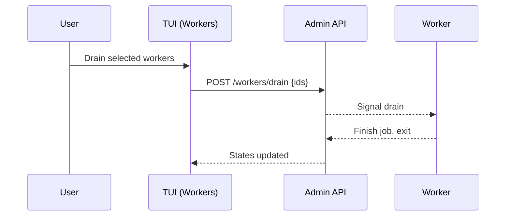

# Worker Fleet Controls

| Priority | Domain | Dependencies | Risks | LoC Estimate | Complexity | Effort | Impact |
| --- | --- | --- | --- | --- | --- | --- | --- |
| Medium‑High | Ops / Control Plane | Workers list/heartbeats, Admin API | Disrupting prod, split‑brain, UX mistakes | ~400–700 | Medium | 5 (Fib) | High |

## Executive Summary
Operate the worker fleet from the TUI: pause/resume/drain nodes, rolling restarts, and live worker summaries (ID, last heartbeat, active job). Provide precise controls with confirmations and safeguards.

> [!note]- **🗣️ CLAUDE'S THOUGHTS 💭**
> This is kubectl for workers! The drain pattern is battle-tested from Kubernetes. Rolling restarts during deploys? Chef's kiss. The pause feature is clutch for debugging - "pause that worker, it's acting weird." Multi-select with confirmations prevents disasters. Consider adding CPU/memory graphs per worker if you can get the metrics. Also, a "quarantine" mode that routes suspicious jobs to a debug worker would be gold.

## Motivation
- Reduce toil during deploys and incidents; replace ad‑hoc scripts.
- Provide visibility into active work and worker health.
- Enable safe, reversible controls with auditability.

## Tech Plan
- Registry: persist worker IDs, heartbeats, and current job (keyed by worker). Already partially present—extend admin for list/read.
- Commands:
  - Pause: worker stops pulling new jobs; finishes current if any.
  - Resume: worker resumes pulls.
  - Drain: like pause, then exit after current job; pool‑wide drain option.
  - Rolling restart: N‑at‑a‑time drain+exit with max unavailable.
- TUI: Workers tab lists workers with statuses; select one/many; action bar with confirmations showing impact.
- Safety: prevent draining all by mistake; require typed confirmation in prod; show ETA estimates from running jobs.
- Audit: log who/when/what with success/failure; expose via Admin API.

## User Stories + Acceptance Criteria
- As an operator, I can see a list of workers with last heartbeat and active job.
- As an SRE, I can pause or drain a worker safely with a confirmation and see state transition.
- As a deployer, I can perform a rolling restart with a concurrency cap.
- Acceptance:
  - [ ] Admin API supplies workers list and control endpoints (pause/resume/drain).
  - [ ] TUI lists workers, supports multi‑select, and shows action progress.
  - [ ] Safety checks prevent accidental global stoppage.

## Definition of Done
Workers tab upgraded to control plane with list + actions and robust confirmations; docs updated with flows and risks.

## Test Plan
- Unit: state transitions (running→paused→draining→stopped); TTL/heartbeat logic.
- Integration: end‑to‑end drain/resume with synthetic workers.
- Manual: rolling restarts; race conditions under load.

## Task List
- [ ] Admin: workers list + control endpoints
- [ ] Worker: honor pause/drain signals; expose state in heartbeat
- [ ] TUI: list, select, actions, confirmations
- [ ] Audit logs + docs

---

## Claude's Verdict ⚖️

This is table stakes for production operations, executed with terminal elegance. The drain pattern alone will save countless deploy headaches.

### Vibe Check

Kubernetes popularized these patterns. Sidekiq Enterprise has similar controls. But in a terminal with real-time updates? That's your differentiator.

### Score Card

**Traditional Score:**
- User Value: 8/10 (critical for safe deploys)
- Dev Efficiency: 6/10 (state management complexity)
- Risk Profile: 6/10 (worker coordination tricky)
- Strategic Fit: 8/10 (production readiness signal)
- Market Timing: 7/10 (expected in mature systems)
- **OFS: 7.2** → BUILD SOON

**X-Factor Score:**
- Holy Shit Factor: 5/10 ("Finally, proper worker controls")
- Meme Potential: 4/10 (screenshot fleet operations)
- Flex Appeal: 7/10 ("Zero-downtime deploys")
- FOMO Generator: 5/10 (table stakes for enterprise)
- Addiction Score: 7/10 (used every deploy)
- Shareability: 5/10 (ops will appreciate)
- **X-Factor: 4.6** → Moderate viral potential

### Conclusion

[🎛️]

Essential ops infrastructure. Not sexy, but the kind of feature that builds trust and prevents incidents. Ship this to show you're serious about production.

