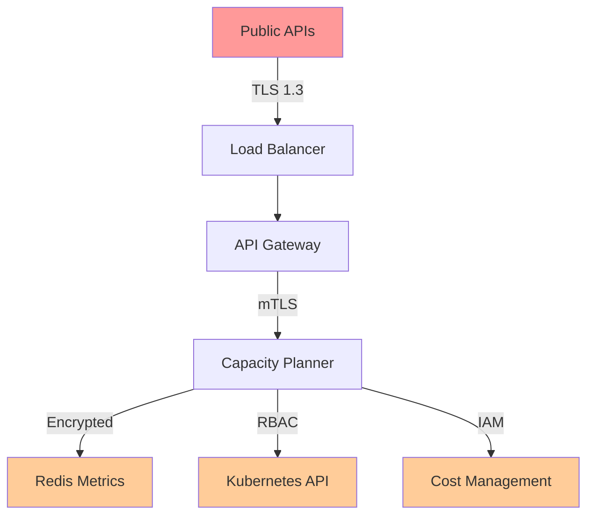

# Security Threat Model: Automatic Capacity Planning System

## Document Information

- **Feature ID**: F011
- **Document Type**: Security Threat Model
- **Version**: 1.0.0
- **Last Updated**: 2025-09-14
- **Reviewer Required**: Security Team
- **Classification**: Internal

## Executive Summary

This document presents a comprehensive security threat model for the Automatic Capacity Planning system, identifying potential security risks, attack vectors, and mitigation strategies. The analysis follows the STRIDE methodology (Spoofing, Tampering, Repudiation, Information Disclosure, Denial of Service, Elevation of Privilege) and provides actionable security controls.

## System Overview

The Automatic Capacity Planning system uses queueing theory and predictive analytics to automatically scale worker capacity. It processes sensitive operational data, makes scaling decisions that impact infrastructure costs, and has the capability to modify production systems.

### Key Security Concerns
- **High-privilege operations**: System can scale infrastructure autonomously
- **Cost impact**: Malicious scaling decisions could result in significant financial damage
- **Operational data**: Access to queue metrics, worker performance, and business patterns
- **Predictive models**: Forecasting algorithms that could be manipulated
- **Cross-system integration**: Interfaces with Kubernetes, Redis, and monitoring systems

## Assets and Data Classification

### Critical Assets

| Asset | Classification | Impact if Compromised |
|-------|---------------|----------------------|
| Scaling Policies | Confidential | Unauthorized scaling, cost impact |
| Capacity Plans | Internal | Operational disruption, resource waste |
| Worker Metrics | Internal | Performance degradation, insights leak |
| Cost Data | Confidential | Financial information disclosure |
| API Keys & Tokens | Secret | Full system compromise |
| Forecasting Models | Internal | Prediction manipulation, competitive advantage loss |
| Redis Connection Strings | Secret | Data access, queue manipulation |
| Kubernetes RBAC Tokens | Secret | Cluster-wide infrastructure control |

### Data Flow Classification



## Threat Analysis (STRIDE)

### S - Spoofing Identity

#### Threat: Impersonation of Legitimate Users
- **Description**: Attackers impersonate authorized users to access scaling controls
- **Attack Vectors**:
  - JWT token theft/replay
  - Session hijacking
  - Credential stuffing
  - Social engineering for API keys
- **Impact**: High - Unauthorized scaling decisions, cost impact
- **Likelihood**: Medium
- **Mitigation**:
  - Multi-factor authentication (MFA) mandatory
  - Short-lived JWT tokens (15 minutes)
  - Token rotation and revocation
  - Rate limiting per user/IP
  - Anomaly detection for unusual access patterns

#### Threat: Service Account Compromise
- **Description**: Kubernetes service accounts or API credentials are compromised
- **Attack Vectors**:
  - Container escape
  - Secret exposure in logs/configs
  - Privilege escalation
- **Impact**: Critical - Full system control
- **Likelihood**: Low
- **Mitigation**:
  - Least privilege RBAC
  - Secret rotation (daily)
  - Secrets stored in Vault/K8s secrets
  - Container security scanning
  - Runtime security monitoring

### T - Tampering with Data

#### Threat: Malicious Scaling Policy Modification
- **Description**: Attackers modify scaling policies to cause operational or financial damage
- **Attack Vectors**:
  - API manipulation
  - Database injection
  - Configuration file tampering
- **Impact**: Critical - Infrastructure disruption, cost explosion
- **Likelihood**: Medium
- **Mitigation**:
  - Input validation and sanitization
  - Policy change approval workflow
  - Digital signatures for policies
  - Audit logging of all changes
  - Rollback capabilities
  - Cost limit safeguards

#### Threat: Metrics Data Poisoning
- **Description**: Injection of false metrics to trigger inappropriate scaling
- **Attack Vectors**:
  - Redis injection
  - Metric collection endpoint manipulation
  - Time series data corruption
- **Impact**: High - Incorrect scaling decisions
- **Likelihood**: Medium
- **Mitigation**:
  - Metrics validation and bounds checking
  - Anomaly detection for metric patterns
  - Multiple data source correlation
  - Immutable time series storage
  - Write-only metrics endpoints

#### Threat: Forecast Model Manipulation
- **Description**: Tampering with forecasting algorithms to create biased predictions
- **Attack Vectors**:
  - Training data poisoning
  - Model parameter modification
  - Algorithm replacement
- **Impact**: High - Long-term scaling inefficiency
- **Likelihood**: Low
- **Mitigation**:
  - Model versioning and integrity checks
  - A/B testing for model changes
  - Statistical validation of forecasts
  - Isolated model training environment
  - Signed model artifacts

### R - Repudiation

#### Threat: Scaling Action Denial
- **Description**: Users deny performing scaling actions that caused issues
- **Attack Vectors**:
  - Shared account usage
  - Log tampering
  - Timestamp manipulation
- **Impact**: Medium - Incident response complications
- **Likelihood**: Low
- **Mitigation**:
  - Comprehensive audit logging
  - Immutable log storage
  - Digital signatures for actions
  - User attribution for all operations
  - Log integrity monitoring

#### Threat: Cost Responsibility Denial
- **Description**: Denial of responsibility for cost-impacting decisions
- **Attack Vectors**:
  - Anonymous API usage
  - Proxy user accounts
  - Attribution bypass
- **Impact**: Medium - Financial accountability issues
- **Likelihood**: Low
- **Mitigation**:
  - Mandatory user identification
  - Cost attribution tracking
  - Approval workflows for high-cost actions
  - Financial impact notifications
  - Chargeback mechanisms

### I - Information Disclosure

#### Threat: Sensitive Metrics Exposure
- **Description**: Unauthorized access to business-sensitive capacity and performance data
- **Attack Vectors**:
  - API enumeration
  - Log file access
  - Database queries
  - Memory dumps
- **Impact**: Medium - Competitive intelligence loss
- **Likelihood**: Medium
- **Mitigation**:
  - Role-based access control (RBAC)
  - Data encryption at rest and transit
  - Query result filtering
  - Log sanitization
  - Memory protection

#### Threat: Cost Data Leakage
- **Description**: Exposure of infrastructure costs and financial patterns
- **Attack Vectors**:
  - API response inspection
  - Report generation abuse
  - Dashboard screenshot/sharing
- **Impact**: High - Financial information disclosure
- **Likelihood**: Medium
- **Mitigation**:
  - Need-to-know access controls
  - Data loss prevention (DLP)
  - Watermarking of sensitive reports
  - Screen recording restrictions
  - Export controls

#### Threat: Forecasting Intelligence Exposure
- **Description**: Leakage of business patterns and predictive insights
- **Attack Vectors**:
  - Model inference attacks
  - Prediction pattern analysis
  - Forecast data correlation
- **Impact**: Medium - Business intelligence loss
- **Likelihood**: Low
- **Mitigation**:
  - Differential privacy techniques
  - Forecast result aggregation
  - Limited prediction granularity
  - Access pattern monitoring

### D - Denial of Service

#### Threat: API Resource Exhaustion
- **Description**: Overwhelming the capacity planning API to disrupt operations
- **Attack Vectors**:
  - Request flooding
  - Simulation abuse
  - Large payload attacks
- **Impact**: High - Service unavailability
- **Likelihood**: High
- **Mitigation**:
  - Rate limiting (100 req/min per user)
  - Request size limits (1MB max)
  - Resource quotas
  - Circuit breakers
  - Horizontal scaling

#### Threat: Computational DoS
- **Description**: Triggering expensive operations to exhaust system resources
- **Attack Vectors**:
  - Complex simulation requests
  - Large forecast horizons
  - Monte Carlo run manipulation
- **Impact**: High - Performance degradation
- **Likelihood**: Medium
- **Mitigation**:
  - Computational limits (max 1000 MC runs)
  - Request queuing with priority
  - Resource monitoring and alerting
  - Background processing
  - Graceful degradation

#### Threat: Storage Exhaustion
- **Description**: Filling storage with excessive data to cause system failure
- **Attack Vectors**:
  - Log flooding
  - Metrics bombing
  - Historical data accumulation
- **Impact**: Medium - System instability
- **Likelihood**: Medium
- **Mitigation**:
  - Storage quotas and monitoring
  - Data retention policies
  - Log rotation
  - Metrics aggregation
  - Automatic cleanup

### E - Elevation of Privilege

#### Threat: Horizontal Privilege Escalation
- **Description**: Users accessing resources outside their authorized scope
- **Attack Vectors**:
  - IDOR (Insecure Direct Object Reference)
  - Parameter tampering
  - Path traversal
- **Impact**: High - Unauthorized data access
- **Likelihood**: Medium
- **Mitigation**:
  - Authorization checks for all resources
  - Resource ownership validation
  - Input parameter validation
  - Least privilege principles

#### Threat: Vertical Privilege Escalation
- **Description**: Users gaining administrative privileges
- **Attack Vectors**:
  - Token manipulation
  - Role assignment bypass
  - Configuration exploitation
- **Impact**: Critical - Administrative access
- **Likelihood**: Low
- **Mitigation**:
  - Role-based access control (RBAC)
  - Privilege separation
  - Regular access reviews
  - Privileged access management (PAM)

#### Threat: Kubernetes Cluster Privilege Escalation
- **Description**: Escaping container boundaries to access cluster resources
- **Attack Vectors**:
  - Container escape
  - Service account abuse
  - Pod security context manipulation
- **Impact**: Critical - Cluster compromise
- **Likelihood**: Low
- **Mitigation**:
  - Pod Security Standards enforcement
  - Network policies
  - Runtime security monitoring
  - Regular vulnerability scanning
  - Minimal base images

## Risk Assessment Matrix

| Threat Category | Probability | Impact | Risk Level | Priority |
|----------------|-------------|---------|------------|----------|
| Policy Tampering | Medium | Critical | High | P1 |
| Service Account Compromise | Low | Critical | Medium | P2 |
| API DoS | High | High | High | P1 |
| Metrics Poisoning | Medium | High | Medium | P2 |
| Cost Data Leakage | Medium | High | Medium | P2 |
| Forecast Manipulation | Low | High | Low | P3 |
| Privilege Escalation | Medium | High | Medium | P2 |
| Identity Spoofing | Medium | High | Medium | P2 |

## Security Controls

### Authentication & Authorization

```yaml
authentication:
  method: "JWT + mTLS"
  jwt_expiry: "15m"
  refresh_token_expiry: "24h"
  mfa_required: true
  password_policy:
    min_length: 12
    complexity: high
    rotation: 90d

authorization:
  model: "RBAC"
  roles:
    - admin: ["*"]
    - operator: ["read", "plan", "simulate"]
    - viewer: ["read"]
  granularity: "resource-level"
  policy_format: "OPA/Rego"
```

### Data Protection

```yaml
encryption:
  at_rest:
    algorithm: "AES-256-GCM"
    key_management: "HashiCorp Vault"
    key_rotation: "monthly"
  in_transit:
    tls_version: "1.3"
    cipher_suites: ["TLS_AES_256_GCM_SHA384"]
    mtls_required: true

data_classification:
  secret: ["api_keys", "db_credentials"]
  confidential: ["cost_data", "policies"]
  internal: ["metrics", "forecasts"]
  public: ["api_documentation"]
```

### Network Security

```yaml
network_controls:
  ingress:
    - source: "load_balancer"
      port: 443
      protocol: "HTTPS"
  egress:
    - destination: "redis"
      port: 6379
      protocol: "TLS"
    - destination: "kubernetes_api"
      port: 443
      protocol: "HTTPS"

firewall_rules:
  - deny_all_by_default
  - allow_specific_services
  - log_all_connections

network_policies:
  - isolate_namespace
  - restrict_pod_communication
  - block_external_access
```

### Monitoring & Alerting

```yaml
security_monitoring:
  authentication_failures:
    threshold: 5
    window: "5m"
    action: "account_lock"

  api_abuse:
    rate_limit_exceeded:
      threshold: 10
      window: "1m"
      action: "ip_block"

  privilege_escalation:
    admin_access:
      monitor: true
      alert: "immediate"

  cost_anomalies:
    scaling_cost_spike:
      threshold: "200%"
      baseline: "7d_average"
      action: "auto_rollback"

audit_logging:
  events:
    - authentication
    - authorization
    - policy_changes
    - scaling_actions
  retention: "7_years"
  immutable: true
  integrity_checks: true
```

## Incident Response

### Security Event Classification

| Severity | Examples | Response Time | Actions |
|----------|----------|---------------|---------|
| P0 (Critical) | Service account compromise, unauthorized scaling | 15 minutes | Immediate containment, war room |
| P1 (High) | API DoS, policy tampering | 1 hour | Incident team activation |
| P2 (Medium) | Authentication failures, data leakage | 4 hours | Standard investigation |
| P3 (Low) | Policy violations, anomalies | 24 hours | Routine analysis |

### Response Procedures

1. **Detection & Alerting**
   - Automated detection via SIEM
   - 24/7 SOC monitoring
   - User reporting channels

2. **Containment**
   - Automatic system isolation
   - Token revocation
   - Traffic blocking
   - Scaling prevention

3. **Investigation**
   - Forensic data collection
   - Impact assessment
   - Root cause analysis
   - Timeline reconstruction

4. **Recovery**
   - System restoration
   - Policy rollback
   - Service resumption
   - Stakeholder communication

5. **Lessons Learned**
   - Post-incident review
   - Control improvements
   - Documentation updates
   - Training adjustments

## Compliance & Governance

### Regulatory Requirements

| Regulation | Requirement | Implementation |
|------------|-------------|----------------|
| SOX | Financial controls | Cost change approvals, audit trails |
| PCI DSS | Data protection | Encryption, access controls |
| GDPR | Privacy by design | Data minimization, consent |
| SOC 2 | Security controls | Continuous monitoring, assessments |

### Security Governance

```yaml
governance_framework:
  security_reviews:
    frequency: "quarterly"
    scope: "full_system"
    participants: ["security", "engineering", "operations"]

  access_reviews:
    frequency: "monthly"
    automated: true
    exceptions_require_approval: true

  vulnerability_management:
    scanning: "continuous"
    patching_sla: "critical:24h, high:7d, medium:30d"
    exceptions_tracked: true

  security_training:
    frequency: "annual"
    mandatory: true
    topics: ["secure_coding", "threat_modeling", "incident_response"]
```

## Implementation Roadmap

### Phase 1: Foundation (Weeks 1-2)
- [ ] Authentication & authorization framework
- [ ] Basic encryption implementation
- [ ] Core audit logging
- [ ] Network security controls

### Phase 2: Monitoring (Weeks 3-4)
- [ ] Security monitoring & alerting
- [ ] Anomaly detection
- [ ] Incident response procedures
- [ ] Vulnerability scanning

### Phase 3: Advanced Controls (Weeks 5-6)
- [ ] Advanced threat detection
- [ ] Behavioral analytics
- [ ] Automated response
- [ ] Compliance reporting

### Phase 4: Testing & Validation (Weeks 7-8)
- [ ] Penetration testing
- [ ] Red team exercises
- [ ] Security assessments
- [ ] Documentation finalization

## Testing Strategy

### Security Testing Approach

1. **Static Analysis**
   - Code security scanning (SonarQube, CodeQL)
   - Infrastructure as Code analysis
   - Dependency vulnerability scanning

2. **Dynamic Analysis**
   - API security testing (OWASP ZAP)
   - Authentication/authorization testing
   - Input validation testing

3. **Penetration Testing**
   - External attack simulation
   - Internal threat modeling
   - Social engineering assessment

4. **Compliance Testing**
   - Control effectiveness validation
   - Regulatory requirement verification
   - Audit trail completeness

### Test Cases

```yaml
authentication_tests:
  - invalid_credentials_rejection
  - mfa_bypass_prevention
  - session_timeout_enforcement
  - token_replay_prevention

authorization_tests:
  - role_based_access_enforcement
  - resource_isolation_validation
  - privilege_escalation_prevention
  - cross_tenant_access_blocking

data_protection_tests:
  - encryption_key_rotation
  - data_masking_effectiveness
  - secure_deletion_verification
  - backup_encryption_validation

api_security_tests:
  - input_validation_bypass
  - rate_limiting_effectiveness
  - cors_policy_enforcement
  - error_message_sanitization
```

## Conclusion

This threat model provides a comprehensive security framework for the Automatic Capacity Planning system. The identified threats and corresponding controls ensure that the system can operate securely while maintaining its core functionality of intelligent capacity management.

Key security principles implemented:
- **Defense in Depth**: Multiple layers of security controls
- **Least Privilege**: Minimal access rights for users and services
- **Zero Trust**: Continuous verification of all access requests
- **Continuous Monitoring**: Real-time threat detection and response

Regular updates to this threat model are essential as the system evolves and new threats emerge. The security team should review and update this document quarterly or after significant system changes.

---

**Document Control**
- Created: 2025-09-14
- Version: 1.0.0
- Next Review: 2025-12-14
- Owner: Security Architecture Team
- Approval: CISO Required