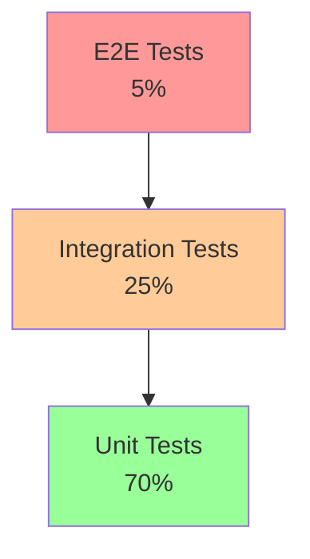

# Testing Strategy: Automatic Capacity Planning System

## Document Information

- **Feature ID**: F011
- **Document Type**: Testing Strategy
- **Version**: 1.0.0
- **Last Updated**: 2025-09-14
- **Review Required**: QA Engineering Team
- **Classification**: Internal

## Executive Summary

This document outlines a comprehensive testing strategy for the Automatic Capacity Planning system, covering all testing levels from unit tests to end-to-end validation. The strategy emphasizes mathematical correctness of queueing theory implementations, accuracy of forecasting models, and reliability of scaling decisions under various operational scenarios.

## Testing Philosophy

### Core Principles
- **Behavior-driven testing**: Focus on business outcomes, not implementation details
- **Mathematical validation**: Rigorous testing of queueing theory and forecasting algorithms
- **Real-world scenarios**: Test with production-like data patterns and workloads
- **Failure resilience**: Extensive chaos engineering and fault injection
- **Performance validation**: Continuous benchmarking and regression detection
- **Security assurance**: Comprehensive security testing at all levels

### Quality Gates
```yaml
quality_criteria:
  code_coverage: ">= 85%"
  mutation_coverage: ">= 70%"
  performance_regression: "< 5%"
  security_vulnerabilities: "0 critical, 0 high"
  api_contract_compliance: "100%"
  mathematical_accuracy: ">= 99.9%"
```

## Testing Pyramid

### Test Distribution Strategy


### Testing Levels

#### Unit Tests (70% of test suite)
- **Purpose**: Validate individual components and mathematical functions
- **Scope**: Functions, classes, algorithms
- **Tools**: Go testing, testify, GoConvey
- **Target Coverage**: 90%+

#### Integration Tests (25% of test suite)
- **Purpose**: Validate component interactions and data flows
- **Scope**: API endpoints, database operations, external service integration
- **Tools**: Testcontainers, WireMock, Docker Compose
- **Target Coverage**: 80%+

#### End-to-End Tests (5% of test suite)
- **Purpose**: Validate complete user workflows and system behavior
- **Scope**: Full application flows, cross-service communication
- **Tools**: Playwright, k6, Postman
- **Target Coverage**: Key user journeys

## Unit Testing Strategy

### Mathematical Functions
```go
// Example test structure for queueing theory calculations
func TestMMCQueueingModel(t *testing.T) {
    testCases := []struct {
        name           string
        arrivalRate    float64
        serviceRate    float64
        servers        int
        expectedWaitTime float64
        tolerance      float64
    }{
        {
            name:           "balanced_load",
            arrivalRate:    10.0,
            serviceRate:    2.0,
            servers:        6,
            expectedWaitTime: 0.0833, // Known analytical result
            tolerance:      0.001,
        },
        {
            name:           "high_utilization",
            arrivalRate:    9.5,
            serviceRate:    2.0,
            servers:        5,
            expectedWaitTime: 1.45,
            tolerance:      0.01,
        },
    }

    for _, tc := range testCases {
        t.Run(tc.name, func(t *testing.T) {
            model := NewMMCModel(tc.arrivalRate, tc.serviceRate, tc.servers)
            waitTime := model.CalculateWaitTime()

            assert.InDelta(t, tc.expectedWaitTime, waitTime, tc.tolerance,
                "Wait time calculation incorrect for scenario: %s", tc.name)
        })
    }
}
```

### Forecasting Algorithms
```go
func TestEWMAForecasting(t *testing.T) {
    // Test with known time series patterns
    testData := []struct {
        name     string
        series   []float64
        alpha    float64
        expected []float64
    }{
        {
            name:     "trending_up",
            series:   []float64{1, 2, 3, 4, 5},
            alpha:    0.3,
            expected: []float64{1, 1.3, 1.91, 2.737, 3.616},
        },
        {
            name:     "seasonal_pattern",
            series:   generateSeasonalData(24, 1.0, 0.5),
            alpha:    0.2,
            expected: calculateExpectedEWMA(series, 0.2),
        },
    }

    for _, td := range testData {
        t.Run(td.name, func(t *testing.T) {
            forecaster := NewEWMAForecaster(td.alpha)
            result := forecaster.Forecast(td.series, len(td.expected))

            for i, expected := range td.expected {
                assert.InDelta(t, expected, result[i], 0.01,
                    "EWMA forecast mismatch at index %d", i)
            }
        })
    }
}
```

### Capacity Planning Logic
```go
func TestCapacityPlanner(t *testing.T) {
    tests := []struct {
        name            string
        currentMetrics  Metrics
        sloTarget      SLOTarget
        expectedWorkers int
        expectedSteps   int
    }{
        {
            name: "scale_up_needed",
            currentMetrics: Metrics{
                ArrivalRate:    15.0,
                ServiceRate:    2.0,
                CurrentWorkers: 5,
                Utilization:    0.9,
            },
            sloTarget: SLOTarget{
                P95Latency: time.Second * 5,
                MaxBacklog: 100,
            },
            expectedWorkers: 8,
            expectedSteps:   2, // Gradual scaling
        },
        {
            name: "scale_down_opportunity",
            currentMetrics: Metrics{
                ArrivalRate:    5.0,
                ServiceRate:    2.0,
                CurrentWorkers: 10,
                Utilization:    0.25,
            },
            sloTarget: SLOTarget{
                P95Latency: time.Second * 5,
                MaxBacklog: 100,
            },
            expectedWorkers: 4,
            expectedSteps:   2, // Gradual scaling
        },
    }

    for _, tt := range tests {
        t.Run(tt.name, func(t *testing.T) {
            planner := NewCapacityPlanner()
            plan := planner.GeneratePlan(tt.currentMetrics, tt.sloTarget)

            assert.Equal(t, tt.expectedWorkers, plan.TargetWorkers)
            assert.Equal(t, tt.expectedSteps, len(plan.Steps))
            assert.True(t, plan.SLOAchievable)
            assert.GreaterOrEqual(t, plan.Confidence, 0.8)
        })
    }
}
```

### Property-Based Testing
```go
func TestCapacityPlannerProperties(t *testing.T) {
    if testing.Short() {
        t.Skip("Skipping property-based tests in short mode")
    }

    properties := gopter.NewProperties(nil)

    // Property: Recommended capacity should never be negative
    properties.Property("capacity_non_negative", prop.ForAll(
        func(arrivalRate, serviceRate float64, workers int) bool {
            if arrivalRate < 0 || serviceRate <= 0 || workers < 0 {
                return true // Skip invalid inputs
            }

            metrics := Metrics{
                ArrivalRate:    arrivalRate,
                ServiceRate:    serviceRate,
                CurrentWorkers: workers,
            }

            planner := NewCapacityPlanner()
            plan := planner.GeneratePlan(metrics, DefaultSLO())

            return plan.TargetWorkers >= 0
        },
        gen.Float64Range(0, 1000),
        gen.Float64Range(0.1, 100),
        gen.IntRange(0, 1000),
    ))

    // Property: Higher arrival rate should not decrease recommended capacity
    properties.Property("capacity_monotonic_arrival_rate", prop.ForAll(
        func(baseRate, serviceRate float64, workers int) bool {
            if baseRate < 0 || serviceRate <= 0 || workers < 0 {
                return true
            }

            metrics1 := Metrics{ArrivalRate: baseRate, ServiceRate: serviceRate, CurrentWorkers: workers}
            metrics2 := Metrics{ArrivalRate: baseRate * 2, ServiceRate: serviceRate, CurrentWorkers: workers}

            planner := NewCapacityPlanner()
            plan1 := planner.GeneratePlan(metrics1, DefaultSLO())
            plan2 := planner.GeneratePlan(metrics2, DefaultSLO())

            return plan2.TargetWorkers >= plan1.TargetWorkers
        },
        gen.Float64Range(1, 100),
        gen.Float64Range(0.1, 10),
        gen.IntRange(1, 100),
    ))

    properties.TestingRun(t)
}
```

## Integration Testing Strategy

### API Testing
```yaml
api_test_structure:
  authentication_tests:
    - valid_jwt_token_acceptance
    - expired_token_rejection
    - invalid_signature_rejection
    - rate_limiting_enforcement

  authorization_tests:
    - role_based_access_control
    - resource_ownership_validation
    - cross_tenant_isolation
    - admin_privilege_verification

  input_validation_tests:
    - request_schema_validation
    - parameter_boundary_testing
    - injection_attack_prevention
    - malformed_data_handling

  response_validation_tests:
    - response_schema_compliance
    - error_message_consistency
    - status_code_correctness
    - content_type_validation
```

### Database Integration Tests
```go
func TestCapacityPlanRepository(t *testing.T) {
    // Setup test database with Testcontainers
    ctx := context.Background()
    postgresContainer, err := postgres.RunContainer(ctx,
        testcontainers.WithImage("postgres:15"),
        postgres.WithDatabase("testdb"),
        postgres.WithUsername("test"),
        postgres.WithPassword("test"),
    )
    require.NoError(t, err)
    defer postgresContainer.Terminate(ctx)

    // Initialize repository with test database
    connStr, err := postgresContainer.ConnectionString(ctx)
    require.NoError(t, err)

    repo, err := NewCapacityPlanRepository(connStr)
    require.NoError(t, err)

    t.Run("create_and_retrieve_plan", func(t *testing.T) {
        plan := &CapacityPlan{
            ID:             uuid.New(),
            CurrentWorkers: 5,
            TargetWorkers:  8,
            Confidence:     0.85,
            SLOAchievable:  true,
        }

        err := repo.Save(ctx, plan)
        assert.NoError(t, err)

        retrieved, err := repo.Get(ctx, plan.ID)
        assert.NoError(t, err)
        assert.Equal(t, plan.TargetWorkers, retrieved.TargetWorkers)
        assert.Equal(t, plan.Confidence, retrieved.Confidence)
    })

    t.Run("concurrent_plan_modifications", func(t *testing.T) {
        plan := createTestPlan()
        err := repo.Save(ctx, plan)
        require.NoError(t, err)

        // Simulate concurrent updates
        var wg sync.WaitGroup
        errors := make(chan error, 10)

        for i := 0; i < 10; i++ {
            wg.Add(1)
            go func(workerID int) {
                defer wg.Done()

                updatedPlan := *plan
                updatedPlan.TargetWorkers = workerID + 10

                if err := repo.Update(ctx, &updatedPlan); err != nil {
                    errors <- err
                }
            }(i)
        }

        wg.Wait()
        close(errors)

        // Verify data consistency
        finalPlan, err := repo.Get(ctx, plan.ID)
        assert.NoError(t, err)
        assert.GreaterOrEqual(t, finalPlan.TargetWorkers, 10)
        assert.LessOrEqual(t, finalPlan.TargetWorkers, 19)
    })
}
```

### Redis Integration Tests
```go
func TestMetricsCollector(t *testing.T) {
    // Setup Redis test container
    ctx := context.Background()
    redisContainer, err := redis.RunContainer(ctx,
        testcontainers.WithImage("redis:7"),
    )
    require.NoError(t, err)
    defer redisContainer.Terminate(ctx)

    redisAddr, err := redisContainer.ConnectionString(ctx)
    require.NoError(t, err)

    collector := NewMetricsCollector(redisAddr)

    t.Run("metrics_ingestion_and_retrieval", func(t *testing.T) {
        // Simulate metrics ingestion
        metrics := []Metric{
            {
                Queue:       "test-queue",
                ArrivalRate: 10.0,
                Timestamp:   time.Now(),
            },
            {
                Queue:       "test-queue",
                ArrivalRate: 12.0,
                Timestamp:   time.Now().Add(time.Minute),
            },
        }

        for _, metric := range metrics {
            err := collector.Store(ctx, metric)
            assert.NoError(t, err)
        }

        // Retrieve and validate
        retrieved, err := collector.GetLatest(ctx, "test-queue", time.Hour)
        assert.NoError(t, err)
        assert.Len(t, retrieved, 2)
        assert.Equal(t, 12.0, retrieved[1].ArrivalRate)
    })

    t.Run("high_volume_metrics_ingestion", func(t *testing.T) {
        // Performance test with high-volume data
        var wg sync.WaitGroup
        metricsCount := 10000

        start := time.Now()

        for i := 0; i < metricsCount; i++ {
            wg.Add(1)
            go func(id int) {
                defer wg.Done()

                metric := Metric{
                    Queue:       fmt.Sprintf("queue-%d", id%100),
                    ArrivalRate: float64(id % 50),
                    Timestamp:   time.Now(),
                }

                err := collector.Store(ctx, metric)
                assert.NoError(t, err)
            }(i)
        }

        wg.Wait()
        duration := time.Since(start)

        // Verify performance requirements
        ratePerSecond := float64(metricsCount) / duration.Seconds()
        assert.GreaterOrEqual(t, ratePerSecond, 1000.0,
            "Metrics ingestion rate below requirement: %.2f/s", ratePerSecond)
    })
}
```

## End-to-End Testing Strategy

### Workflow Testing
```javascript
// Example E2E test using Playwright
import { test, expect } from '@playwright/test';

test.describe('Capacity Planning Workflow', () => {
  test('complete planning workflow', async ({ page }) => {
    // Navigate to capacity planning dashboard
    await page.goto('/capacity-planning');

    // Verify current metrics are displayed
    await expect(page.locator('[data-testid=current-metrics]')).toBeVisible();

    // Create new capacity plan
    await page.click('[data-testid=create-plan-button]');
    await page.fill('[data-testid=queue-name-input]', 'test-queue');
    await page.selectOption('[data-testid=slo-profile-select]', 'balanced');
    await page.click('[data-testid=generate-plan-button]');

    // Wait for plan generation
    await expect(page.locator('[data-testid=plan-results]')).toBeVisible({ timeout: 5000 });

    // Verify plan contains expected elements
    await expect(page.locator('[data-testid=target-workers]')).toContainText(/\d+/);
    await expect(page.locator('[data-testid=confidence-score]')).toContainText(/\d+%/);
    await expect(page.locator('[data-testid=slo-achievable]')).toContainText('Yes');

    // Run simulation
    await page.click('[data-testid=run-simulation-button]');
    await expect(page.locator('[data-testid=simulation-results]')).toBeVisible({ timeout: 10000 });

    // Apply plan
    await page.click('[data-testid=apply-plan-button]');
    await page.click('[data-testid=confirm-apply-button]');

    // Verify plan execution started
    await expect(page.locator('[data-testid=execution-status]')).toContainText('Executing');
  });

  test('policy management workflow', async ({ page }) => {
    await page.goto('/scaling-policies');

    // Create new policy
    await page.click('[data-testid=create-policy-button]');
    await page.fill('[data-testid=policy-name]', 'Test Auto-scaling Policy');
    await page.selectOption('[data-testid=scaling-mode]', 'auto');

    // Configure SLO targets
    await page.fill('[data-testid=p95-latency-target]', '5s');
    await page.fill('[data-testid=max-backlog-target]', '100');

    // Configure scaling constraints
    await page.fill('[data-testid=min-workers]', '2');
    await page.fill('[data-testid=max-workers]', '20');
    await page.fill('[data-testid=safety-margin]', '15');

    // Save policy
    await page.click('[data-testid=save-policy-button]');

    // Verify policy created
    await expect(page.locator('[data-testid=policy-list]')).toContainText('Test Auto-scaling Policy');

    // Enable policy
    await page.click('[data-testid=enable-policy-button]');
    await expect(page.locator('[data-testid=policy-status]')).toContainText('Enabled');
  });
});
```

### Load Testing Scenarios
```javascript
// k6 load test script
import http from 'k6/http';
import { check, sleep } from 'k6';
import { Rate } from 'k6/metrics';

const errorRate = new Rate('errors');

export let options = {
  stages: [
    { duration: '2m', target: 100 }, // Ramp up
    { duration: '5m', target: 100 }, // Sustained load
    { duration: '2m', target: 200 }, // Peak load
    { duration: '5m', target: 200 }, // Sustained peak
    { duration: '2m', target: 0 },   // Ramp down
  ],
  thresholds: {
    http_req_duration: ['p(95)<1000'], // 95% of requests under 1s
    http_req_failed: ['rate<0.01'],    // Error rate under 1%
    errors: ['rate<0.01'],
  },
};

export default function() {
  const baseUrl = 'https://api.capacity-planning.example.com';

  // Test metrics retrieval
  let metricsResponse = http.get(`${baseUrl}/capacity/metrics`);
  check(metricsResponse, {
    'metrics status is 200': (r) => r.status === 200,
    'metrics response time < 500ms': (r) => r.timings.duration < 500,
  }) || errorRate.add(1);

  // Test plan generation
  let planPayload = {
    queue: 'load-test-queue',
    horizon: 60,
    slo_profile: 'balanced'
  };

  let planResponse = http.post(`${baseUrl}/capacity/plan`, JSON.stringify(planPayload), {
    headers: { 'Content-Type': 'application/json' },
  });

  check(planResponse, {
    'plan status is 200': (r) => r.status === 200,
    'plan response time < 2s': (r) => r.timings.duration < 2000,
    'plan has target workers': (r) => JSON.parse(r.body).target_workers > 0,
  }) || errorRate.add(1);

  sleep(1);
}
```

## Specialized Testing Approaches

### Chaos Engineering
```yaml
chaos_experiments:
  redis_failure:
    description: "Test system behavior when Redis becomes unavailable"
    failure_injection: "network_partition"
    duration: "5_minutes"
    expected_behavior: "graceful_degradation"
    success_criteria:
      - api_remains_responsive
      - cached_data_used
      - no_data_loss

  kubernetes_api_slowdown:
    description: "Test scaling decisions when K8s API is slow"
    failure_injection: "latency_injection"
    target_latency: "5_seconds"
    duration: "10_minutes"
    expected_behavior: "timeout_handling"
    success_criteria:
      - no_infinite_retries
      - user_notification
      - fallback_to_manual_mode

  forecasting_service_crash:
    description: "Test plan generation without forecasting"
    failure_injection: "process_kill"
    duration: "15_minutes"
    expected_behavior: "fallback_to_simple_models"
    success_criteria:
      - plans_still_generated
      - reduced_confidence_scores
      - error_logging
```

### Security Testing
```yaml
security_test_categories:
  authentication_bypasses:
    - jwt_token_manipulation
    - session_fixation
    - privilege_escalation
    - brute_force_attacks

  input_validation:
    - sql_injection_attempts
    - nosql_injection_attempts
    - command_injection
    - xss_payloads
    - xxe_attacks

  authorization_checks:
    - horizontal_privilege_escalation
    - vertical_privilege_escalation
    - idor_vulnerabilities
    - mass_assignment

  data_protection:
    - sensitive_data_exposure
    - encryption_validation
    - key_management
    - data_masking

api_security_tests:
  tools:
    - "OWASP ZAP"
    - "Burp Suite"
    - "Postman Security Tests"

  automated_scanning:
    frequency: "every_build"
    scope: "all_endpoints"
    baseline: "security_baseline.json"
```

### Performance Testing
```yaml
performance_test_matrix:
  load_patterns:
    - name: "normal_load"
      concurrent_users: 100
      duration: "1h"
      ramp_up: "10m"

    - name: "peak_load"
      concurrent_users: 1000
      duration: "30m"
      ramp_up: "5m"

    - name: "stress_test"
      concurrent_users: 2000
      duration: "15m"
      ramp_up: "2m"

    - name: "spike_test"
      concurrent_users: [100, 500, 100]
      duration: "30m"
      pattern: "spike"

  resource_monitoring:
    metrics:
      - cpu_utilization
      - memory_usage
      - network_io
      - disk_io
      - database_connections

    thresholds:
      cpu_utilization: "< 80%"
      memory_usage: "< 2GB"
      response_time_p95: "< 1000ms"
      error_rate: "< 0.1%"
```

## Test Data Management

### Test Data Strategy
```yaml
test_data_categories:
  synthetic_data:
    description: "Generated data for consistent testing"
    use_cases: ["unit_tests", "integration_tests"]
    generation_tools: ["faker", "hypothesis"]

  anonymized_production_data:
    description: "Real data patterns with PII removed"
    use_cases: ["performance_testing", "ml_model_validation"]
    anonymization_tools: ["data_masking_suite"]

  reference_datasets:
    description: "Known datasets with expected outcomes"
    use_cases: ["algorithm_validation", "regression_testing"]
    maintenance: "version_controlled"

data_generation_patterns:
  queue_metrics:
    arrival_patterns: ["constant", "linear_growth", "seasonal", "spike"]
    service_time_distributions: ["exponential", "normal", "log_normal"]
    error_scenarios: ["high_error_rate", "intermittent_failures"]

  scaling_scenarios:
    traffic_patterns: ["daily_cycle", "weekly_cycle", "event_driven"]
    resource_constraints: ["cpu_bound", "memory_bound", "io_bound"]
    failure_modes: ["gradual_degradation", "sudden_failure", "cascading_failure"]
```

### Test Environment Management
```yaml
test_environments:
  unit_test_env:
    isolation: "in_memory"
    external_dependencies: "mocked"
    data_persistence: "none"

  integration_test_env:
    isolation: "containerized"
    external_dependencies: "test_containers"
    data_persistence: "temporary"

  staging_env:
    isolation: "dedicated_cluster"
    external_dependencies: "staging_services"
    data_persistence: "ephemeral"

  performance_test_env:
    isolation: "production_like"
    external_dependencies: "production_scale"
    data_persistence: "persistent"

environment_provisioning:
  automation: "terraform_ansible"
  setup_time: "< 10_minutes"
  teardown_time: "< 5_minutes"
  cost_optimization: "auto_shutdown"
```

## Test Automation & CI/CD Integration

### Pipeline Integration
```yaml
ci_cd_pipeline:
  commit_stage:
    - lint_checks
    - unit_tests
    - security_scanning
    - build_artifacts

  acceptance_stage:
    - integration_tests
    - api_contract_tests
    - smoke_tests
    - performance_regression

  production_stage:
    - deployment_tests
    - health_checks
    - end_to_end_tests
    - monitoring_validation

test_parallelization:
  unit_tests: "parallel_by_package"
  integration_tests: "parallel_by_service"
  e2e_tests: "sequential_critical_path"

  resource_allocation:
    unit_tests: "cpu_optimized"
    integration_tests: "memory_optimized"
    e2e_tests: "io_optimized"
```

### Quality Gates
```yaml
quality_gates:
  code_quality:
    - code_coverage: ">= 85%"
    - mutation_score: ">= 70%"
    - cyclomatic_complexity: "< 15"
    - duplication: "< 3%"

  security:
    - vulnerability_scan: "no_critical_high"
    - dependency_check: "no_known_vulnerabilities"
    - secrets_scan: "no_exposed_secrets"

  performance:
    - response_time_regression: "< 5%"
    - throughput_regression: "< 5%"
    - resource_usage_increase: "< 10%"

  functionality:
    - test_pass_rate: "100%"
    - api_contract_compliance: "100%"
    - critical_path_validation: "100%"
```

## Test Monitoring & Reporting

### Test Analytics
```yaml
test_metrics:
  execution_metrics:
    - test_pass_rate
    - test_execution_time
    - flaky_test_rate
    - test_coverage_trend

  quality_metrics:
    - defect_escape_rate
    - bug_discovery_rate
    - mean_time_to_detection
    - regression_rate

  efficiency_metrics:
    - automation_percentage
    - test_maintenance_effort
    - feedback_time
    - deployment_frequency

reporting_dashboard:
  real_time_metrics: "grafana"
  test_execution_reports: "allure"
  coverage_reports: "codecov"
  security_reports: "sonarqube"
```

### Continuous Improvement
```yaml
feedback_loops:
  production_monitoring:
    - error_rate_correlation
    - performance_deviation_analysis
    - user_experience_metrics

  test_effectiveness:
    - bug_prevention_analysis
    - test_redundancy_identification
    - coverage_gap_analysis

  process_optimization:
    - test_execution_time_optimization
    - flaky_test_elimination
    - test_data_management_improvement
```

## Conclusion

This comprehensive testing strategy ensures the Automatic Capacity Planning system meets its quality, performance, and reliability requirements. The multi-layered approach provides confidence in mathematical correctness, system reliability, and operational excellence.

Key testing commitments:
- **85% code coverage** minimum across all components
- **Mathematical validation** of all queueing theory implementations
- **Comprehensive security testing** at all levels
- **Performance regression detection** within 5% tolerance
- **Chaos engineering** for resilience validation

Regular review and adaptation of this testing strategy will ensure it evolves with the system and continues to provide effective quality assurance.

---

**Document Control**
- Created: 2025-09-14
- Version: 1.0.0
- Next Review: 2025-12-14
- Owner: QA Engineering Team
- Approval: Test Lead Required